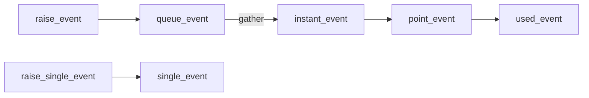

# The processor loop

Written from reading ocgcore before porting any of it, as the plan requires. This is the machine every other part of the engine is expressed in, so it is worth stating precisely.

## The shape

`field::process()` is a single step of a **cooperative step machine over a queue of units**. It is not a call stack and not a coroutine, though it does the work of both.

```
process():
    splice subunits to the FRONT of units
    if units is empty: return End
    take the front unit and dispatch on its type:
        if the handler returns TRUE:   pop it            -> Continue
        else:                          ++unit.step
                                       -> Awaiting if the unit needs an answer
                                          else Continue
```

Four things follow, and they are the whole design.

**A unit is a resumable procedure.** Each carries a `step`, and its handler is a `switch` on that step. Returning `FALSE` means "not finished" — the step advances and the unit stays at the front of the queue, so the next call re-enters the same handler at the next case. Returning `TRUE` retires it.

**Sub-work is queued, not called.** `emplace_process<T>()` pushes onto `core.subunits`, and the *next* `process()` call splices those to the front — ahead of the unit that emplaced them. So a unit that emplaces A and B, then returns `FALSE`, resumes only after A and B have run to completion. That is the mechanism behind every "do this, then continue" in the engine, and it is why control flow reads as a state machine rather than as nesting.

**Restart is an overflow trick.** `restart` is `0xFFFF`; assigning it to `step` and letting the loop's `++step` wrap sets the step to 0. So `arg.step = restart` means "run me again from the top" — a loop, expressed within a queue that has no loops.

**Waiting for a player is a status, not a block.** A unit whose type declares `needs_answer` returns `Awaiting` instead of `Continue`, and the host is expected to supply a response before calling `process()` again. The engine never blocks; it yields.

## Why this matters for the port

The step machine is not an implementation detail to be abstracted away — it *is* ocgcore's control flow, and every ordering subtlety in the rules is expressed as the relative position of units in this queue. A port that replaced it with ordinary function calls, or with async, would have to re-derive every one of those orderings by hand. Translating the machine keeps them for free.

## The translation to Rust

The `std::variant` of unit types becomes an enum; `std::visit` becomes a `match`.

The one place a literal translation fights the language is that ocgcore's handler takes `&mut field` *and* a reference to the unit living inside `field.core.units`. Rust will not permit both at once. The port therefore **pops the front unit, runs it, and pushes it back if it is not finished** — which is observationally identical: subunits emplaced during the handler are spliced ahead of it on the next call either way.

## Status

The loop, the queue, and the step/restart/awaiting semantics are implemented, with tests covering each: one step per call, emplaced work jumping the queue in order, entry at a given step, the restart wrap, and an empty queue ending the duel.

The unit types themselves are not. They arrive as the machinery they need is ported, replacing the placeholder kinds the tests use.

One deviation from a literal translation, recorded because it is the sort of thing that is invisible later: ocgcore's handlers do arithmetic on `step` freely, and a handler is never entered at `restart` because the loop's increment wraps it to zero first. Rust panics on overflow in debug builds, so the placeholder handler uses `saturating_add`. The wrap in the loop itself is deliberate and uses `wrapping_add` — it is the mechanism, not an accident.


# What the chain machinery needs first

Reading `AddChain` before porting it settled a sequencing question, so it is recorded here rather than rediscovered.

`AddChain` has eleven steps, and its **first substantive one** already reaches for the effect system:

```cpp
case 1: {
    auto& clit = core.new_chains.front();
    effect_set eset;
    filter_player_effect(clit.triggering_player, EFFECT_ACTIVATE_COST, &eset);
```

By step 2 it is creating relations between effects and handlers; by step 8 it is reading effect categories to decide targeting. `SolveChain` is the same. So the chain machinery cannot be translated before the layer beneath it exists: cards with a position and a location, players with zones, events, and the effect registry that `filter_player_effect` searches.

That is not a reason to build cards first — the ordering "machinery before cards" still holds. It means the machinery has a layer of its own underneath it:

1. the processor loop — **done**
2. the board: locations, positions, zones — **done**
3. cards and their state; events (`tevent`); the effect registry — **done**
4. the chain machinery: the chain record and the event pipeline — **done**;
   then `AddChain`, `SolveChain`, `PointEvent`, `QuickEffect`
5. the card pool

Attempting (4) before (3) would produce handlers whose every branch is a stub, which is worse than not having them: it looks like progress and cannot be tested against anything.

## The layer underneath: cards, events, effects

Step 3 is implemented, in `src/event.rs` and `src/effect.rs`. Two decisions
in it are systematic rather than local, and both are places where this port
stops being a literal translation. They are recorded here because a reader
comparing the two codebases will notice them immediately and should find the
reason next to the fact.

### Pointers become indices

ocgcore holds `card*` and `effect*` everywhere: `tevent` points at the card
it concerns, an effect points at its owner and its handler, a chain points at
both. A literal port would need lifetimes threaded through every rules query,
or `unsafe`.

The stronger reason is the solver. This engine exists to be *cloned* —
millions of times, in playouts — and a graph of raw pointers does not clone
by `memcpy`. `CardId` and `EffectId` are `usize` indices into the duel's own
arenas: they clone trivially and borrow nothing.

The cost is real and worth naming: an index can dangle in a way a reference
cannot, and nothing in the type system says which arena an index belongs to.
The mitigation is that arenas only grow within a duel — nothing is removed, a
card that leaves the field changes `Loc` rather than disappearing — which is
also how ocgcore's own pointers stay valid.

### The four behaviours become function pointers

An effect in ocgcore carries `condition`, `cost`, `target`, `operation` as
integers: references into the Lua registry. This port has no interpreter, so
those become Rust `fn` pointers. `None` means "always", which is how the
reference treats a null reference.

The *descriptor* half of `effect` — `type`, `code`, `range`, `s_range`,
`o_range`, the two flag words, owner, handler, count limits — is translated
field for field, because those are exactly what the chain machinery reads
when deciding whether an effect may be activated, by whom, and from where.
Only the route to the behaviour changes.

The consequence to hold on to: the machinery around the functions is a
structural port and can be checked as one; the functions themselves are
per-card translations of Lua, and that is where per-card defects will enter.

### What is deliberately not here yet

`Effects` is the effect *pool* — the arena `EffectId` indexes into — and not
the reference's `field::effects`. Those are different things: `field::effects`
is a set of eight registration indices, `std::multimap<uint32_t, effect*>`
one per effect type, keyed by event code, which the gather searches. They
arrive with the machinery that searches them, which is what says how they
must be shaped.

For the same reason the pool's search is called `with_code_owned_by` rather
than `filter_player_effect`. The reference's function of that name searches
the `aura_effect` index and filters on `is_target_player` and `is_available`,
neither of which has its substrate yet; borrowing the name would claim a
fidelity the function does not have.

Card statistics — attack, level, type, attribute — are likewise absent.
`Card` carries identity, `current`/`previous` location, and a status mask,
which is what the machinery needs; the statistics arrive with the card pool
that has values to put in them.

## A rule this layer cost three mistakes to learn

Transcribe constant tables from the reference. Never write one from memory.

Three sets of constants in this layer were written from memory first and were
wrong: the per-card `STATUS_*` bits (invented outright), the `REASON_*` values
(`REASON_RULE` given as `0x1000`, which is actually `REASON_DISSUMMON`; it is
`0x400`), and two event codes (`EVENT_CHAIN_END` as `0x1110` and
`EVENT_FREE_CHAIN` as `0x7fffffff`; they are 1026 and 1002).

They share a property that makes them worse than ordinary bugs in a port.
A wrong constant is not *visibly* wrong — a plausible hex value reads exactly
like the right one, and no test that does not pin the literal against the
reference will catch it, because the rest of the code is internally
consistent with whatever number it was given. The failure surfaces much
later, as an effect that never triggers or a query that never matches, and by
then it looks like a logic bug in the machinery rather than a typo in a
table.

So: transcribe the whole table, not the entries currently needed — a partial
table invites inventing the rest — and pin a few literals in a test whose
only job is to fail when a value drifts from the reference.

## The event pipeline, and why it is a pipeline

Reading `process_instant_event` before porting it settled the shape of step
4, so the reading is recorded here.

Nothing is gathered when an event is raised. `raise_event` appends a `tevent`
to `core.queue_event` and returns. The gather runs later, over the *whole
queue at once*, and only then are chains built. That is not an optimisation —
it is the mechanism by which simultaneous events are simultaneous, and a port
that gathered eagerly at each raise would get SEGOC wrong everywhere at once
while looking simpler.

The events move along a fixed path, and which list an event is on is a
statement about what has happened to it:



`check_event` searches `point_event` then `instant_event` — and deliberately
not `queue_event`. An event that has been raised but not yet gathered from
has not happened yet as far as that question is concerned.

`single_event` is a separate path rather than a stage of the same one. Its
events are gathered against *the trigger card's own* effects, not the
field's: a flip effect belongs to the card that flipped, and asking the field
about it would find every card's flip effect instead.

### The containers are part of the behaviour

`field::effects` is eight `std::multimap<uint32_t, effect*>`, one per effect
type, keyed by event code. Two properties of that container are observable
and so are preserved: it is ordered by key, and among equal keys it keeps
insertion order, which `equal_range` then walks. That walk order is the order
chains are built in. `BTreeMap<u32, Vec<EffectId>>` has both properties; a
`HashMap` would have neither, and the resulting divergence would be
non-deterministic and maddening.

The same reasoning picked the list types. `chain_list` is `std::list<chain>`
because the reference splices between the lists constantly; `current_chain`
is a `std::vector` because the machinery indexes it and walks it backwards.
They are `VecDeque` and `Vec` here for the same reasons.

### One rule found in the gather, worth naming early

The player who activates a triggered effect is the handler's controller —
*except* when the effect carries `EFFECT_FLAG_EVENT_PLAYER` and the event
names a real player, in which case the event's player activates it. Every
site in the gather that builds a chain repeats that test. It is factored into
`Field::build_chain` here, with the condition translated exactly, because
getting it wrong is invisible until a specific card reads backwards.

### A gap closed on the way

`Loc::is_location` took a `u8`, which cannot express the reference's
*symbolic* locations — `LOCATION_FZONE`, `PZONE`, `STZONE`, `MMZONE`,
`EMZONE`, all above `0xff`. It would have answered "no" to every one of them,
silently, forever. These are not values a card's `location` ever holds: a
card in the field zone has `location == SZONE` and `sequence == 5`, and
`FZONE` is a question you ask about that pair. The query now takes a `u16`
and derives them, as the reference does, and `Loc` carries the `pzone` flag
the reference carries for the one case a sequence cannot settle.

## Card data, duel options, and a question the options raise

The activation predicates (`is_activateable` and what it calls) are the next
thing the gather needs, and they read two things that did not exist: what a
card *is*, and whether a zone is free. Both are now here.

### Printed data is not current data

`CardData` is `card_data`: what the database says, before the duel touches
it. The distinction from a card's *current* properties is load-bearing and
easy to lose — `data.type` is what is printed, `card::get_type()` is what the
card counts as right now after every type-changing effect has had its say.

The reference reads one or the other deliberately at each site.
`is_activateable` asks `data.type` about quick-play and trap status, which is
the right call and not an oversight: a type-changing effect must not make a
trap activatable from the hand. A port that routed every type question
through the resolved accessor would be subtly more permissive in a way no
test of a single card would reveal.

### The zone bitfield is the authority, not the slot array

`used_location` and `disabled_location` are bitfields — monster seats in bits
0..=6, spell/trap seats from bit 8 — and they, not the slot arrays, are what
zone-counting reads. Two representations of one fact is normally a smell; the
reference keeps both deliberately, because a card can occupy a zone it is not
*in*.

`is_location_useable` rewrites the symbolic locations into a real location
and an adjusted sequence *before* consulting the mask, and the arithmetic is
the behaviour: `EMZONE` seat 0 is monster seat 5, a three-column field shifts
the main seats along by one, and an Extra Monster Zone is shared — seat `n`
is unusable when the opponent holds seat `11 - n`.

The reference's `field_used_count` is a 32-entry table built at compile time
whose every entry is `popcnt(i)`. It is translated as `count_ones`, because
the table is the optimisation and the popcount is the behaviour.

### A question worth raising: this is not the reference's Goat mode

ocgcore defines `DUEL_MODE_GOAT`. This project does **not** run under it —
the configuration of record is `(DUEL_MODE_MR5 & ~DUEL_EMZONE) |
DUEL_PSEUDO_SHUFFLE`, which is what both engines are compared under and
therefore what fidelity means here.

The difference is not small. `DUEL_MODE_GOAT` is `DUEL_MODE_MR1` plus a dozen
flags, each of which changes rulings:

| Flag | What it changes |
|---|---|
| `TCG_SEGOC_NONPUBLIC` | how simultaneous triggers order when some are hidden |
| `TCG_SEGOC_FIRSTTRIGGER` | which trigger anchors the SEGOC ordering |
| `SINGLE_CHAIN_IN_DAMAGE_SUBSTEP` | one chain per damage substep |
| `USE_TRAPS_IN_NEW_CHAIN` | whether traps may be used in a newly built chain |
| `SIX_STEP_BATTLE_STEP` | the shape of the Battle Phase |
| `TCG_FAST_EFFECT_IGNITION` | ignition timing under the TCG chart |
| `EQUIP_NOT_SENT_IF_MISSING_TARGET` | what happens to an equip that loses its target |
| `ZERO_ATK_DESTROYED` | whether a 0-ATK monster is destroyed by battle |
| `CAN_REPOS_IF_NON_SUMPLAYER` | repositioning rights |
| `STORE_ATTACK_REPLAYS` | attack replay bookkeeping |
| `OCG_OBSOLETE_IGNITION`, `1ST_TURN_DRAW`, `1_FACEUP_FIELD`, … | from MR1 |

That is a choice already made and not one this layer reopens — the
configuration is what both engines are measured against, and changing it
would invalidate every divergence count taken so far. It is recorded because
anyone comparing this port against a Goat-format ruling from a human source
needs to know the reference was not asked the Goat-format question, and both
modes are transcribed in `duel.rs` so the difference is visible rather than
remembered.

## The activation predicates

`effect.cpp`'s predicate half: what the gather calls to decide whether an
effect may be offered at all. Four things in it are easy to get wrong in a
way nothing would catch.

### `chk` is not decoration

The reference calls a card's `cost` and `target` with a trailing `0`. That
argument means "check, do not perform": `is_activate_ready` is asking whether
the effect *could* be activated, and passing `1` would pay the cost merely
for asking. The Rust signatures therefore carry `chk: bool` rather than
dropping an argument that has no obvious use.

A port that lost it would be wrong in a particularly unpleasant way — legal
actions would be enumerated correctly, and life points would quietly drain
while the engine thought about them.

### Two range predicates that look redundant and are not

`in_range` asks the broad question and `is_in_range_of_symbolic_mzone` the
narrow one, and they disagree on purpose. `in_range` collapses `MMZONE` and
`EMZONE` back to plain `MZONE` before testing, so an effect ranged to the
Main Monster Zones is in range of *a* monster zone; the narrow predicate then
rejects a card that is in an Extra one. Collapsing them into a single test
either way loses a case.

The narrow one is also vacuously true for an effect that names neither kind,
which is most of them — so it never rejects on its own.

### Once per turn and hard once per turn are different tallies

`check_count_limit` branches on `EFFECT_COUNT_CODE_SINGLE`. Without it the
tally is against `count_code`, which every copy of a card name shares — an
ordinary once per turn. With it the tally is against the *card's* `fieldid`,
so each copy keeps its own count. That is the whole difference between the
two rulings, and it is one bit.

The three tallies are three maps because they reset at different times: the
per-turn map at end of turn, the chain map at chain end, the duel map never.

One transcription note. The reference's `generate_count_map_key` is declared
`(code, flag, hopt_index, playerid)` and packs `code << 32 | hopt_index << 16
| flag << 8 | playerid`, but every call site passes `(code, hopt_index, flag,
playerid)`. The parameter names are crossed against the callers. All three
call sites agree, so the behaviour is self-consistent and only the naming is
wrong; the port matches the layout that actually results, and says so, rather
than "fixing" it into a different one.

### Two functions that are deliberately not translated

`save_lp_cost()` and `restore_lp_cost()` bracket almost every callback in the
reference. They are **empty inline no-ops** — `field.h:511-512` defines them
as `{}`, and the real bodies in `field.cpp` are inside a comment block. They
are not translated, because translating what the commented-out bodies say
would add behaviour this version of the reference does not have.

This is worth stating as a general hazard rather than a one-off: a faithful
port reads *what the code does*, and a function that is called everywhere and
does nothing looks exactly like a function that is called everywhere and
matters.

## Which effects apply to a card

`filter_effect` and `is_affected_by_effect` — the layer `is_activateable`
sits on. Five findings.

### The reference writes the traversal twice

`card::filter_effect` collects every applicable effect; `card::is_affected_by_effect`
is the *same* five-source traversal with `return` where the other has
`push_back`. Here it is written once and both are built on it. That is
observationally identical and removes a place for two copies to drift apart —
which, in a file where the two are 400 lines apart, is a real risk.

The five sources, in the order the reference visits them, because the order
is the order results come back in:

1. the card's own `single_effect`
2. `equip_effect` from cards equipped to it
3. `target_effect` from cards that aim an effect at it
4. `xmaterial_effect` from its Xyz materials — excluding field effects, which
   a material does not project
5. the field's `aura_effect`, excluding those aimed at players

### `target` is called with two different arities

The reference calls an effect's `target` Lua reference with **nine**
arguments when declaring what an activation will do, and with **two** when
asking "does this effect apply to that card?" (`is_fit_target_function`).
One Rust function signature cannot be both, so there are two slots: `target`
and `target_filter`. Collapsing them would silently pick one meaning for both
uses, and the wrong one would be called with arguments it does not expect —
in Lua that is a runtime surprise, in Rust it would be a quiet wrong answer.

### `peffect &&` is not defensive programming

`card::is_affect_by_effect` starts:

```cpp
if(is_status(STATUS_SUMMONING) && (peffect && peffect->code != EFFECT_CANNOT_DISABLE_SUMMON && ...))
```

A card mid-summon is untouchable by every effect except the two that exist to
interrupt a summon. But a **null** effect is a rule-driven action with no card
behind it, and the `peffect &&` lets those through. Reading that as a null
guard and dropping it would make a summoning card untouchable by the rules
themselves.

### The owner/handler gates repeat verbatim, and that is where a typo hides

`is_available` has three branches — single/xmaterial, equip, field/target —
and each ends with the same four forbidden/disabled tests. They are factored
into one helper here, because getting one of the four wrong *in one branch
only* is exactly the sort of defect that reads fine and survives review.

The pairing matters: an `OWNER_RELATE` effect is shut off by its **owner's**
state, and an effect whose owner *is* its handler by that card's own. Those
are different cards whenever an effect has been granted or equipped.

### A gap in what had already landed

`in_range` has an Xyz-material branch that was missed the first time:

```cpp
if(type & EFFECT_TYPE_XMATERIAL)
    return handler->overlay_target ? TRUE : FALSE;
```

An Xyz material's effect ignores `range` entirely — it is in range exactly
when its handler is under something. Without the branch it would have been
range-tested like an ordinary effect and silently answered wrong.

`effect_type::TARGET` (0x4000) was also missing from the type table, which
had been transcribed as far as `GRANT` and stopped. The same partial-table
failure the constants rule is about, in the table the rule was written next
to.

## Zone limits, uniqueness, and a predicate deliberately left out

### What `is_activateable` still needs

This layer was meant to end with `is_activateable`. It does not, and the
reason is worth recording rather than quietly deferring.

`is_activateable`'s activate branch contains two damage-phase tests:

```cpp
if((code < 1132 || code > 1149) && infos.phase == PHASE_DAMAGE
   && !is_flag(EFFECT_FLAG_DAMAGE_STEP) && !get_cteffect(this, playerid, FALSE))
    return FALSE;
```

and its non-activate branch a `get_type()` test that needs the *resolved*
card type, not the printed one. Neither `get_cteffect` nor `card::get_type`
is ported. A version of the predicate without them compiles, passes tests,
and is more permissive than the reference in exactly the phase where the
rules are most delicate.

So it is not here. The layer beneath it is, and is complete: uniqueness, the
zone limits, `is_action_check`, `check_value_condition`.

### `uplayer >= 2` is a question, not a sentinel

`get_mzone_limit(playerid, uplayer, reason)` consults the capping effects
only when `uplayer < 2`. That is not a null check: it is the difference
between "how many seats does the board have" and "how many may *this player*
use", and the engine asks both. Reading it as a guard and always consulting
the effects would answer the wrong question at every call site that passes
`PLAYER_NONE`.

The limits are also allowed to go **negative** — an effect capping a zone
below what is already occupied yields a negative count, and callers compare
against zero rather than assuming a floor.

### Uniqueness asks two different questions

`check_unique_onfield` has two halves that look like one loop and are not.
The first asks whether some *other* card already on the field imposes a limit
covering this one. The second asks whether *this* card's own limit would be
broken by its arrival — which is why that count is `>= 2` and includes the
card itself.

`unique_pos` is indexed by `controller ^ p`, so it names which *sides* the
limit looks at rather than which player: a limit may be "one on your field"
or "one anywhere", and the indexing is what distinguishes them.

### The constants rule now has an instrument

`rust/port/tools/check_constants.py` diffs every transcribed table against
ocgcore's headers and reports entries that are missing or whose value
differs. It exists because "I followed the rule" turned out not to be
evidence: `EFFECT_TYPE_` had been transcribed as far as `GRANT` and stopped,
in the same file as the rule.

It cannot run in CI — ocgcore's checkout is gitignored and the port crate has
no build-time dependency on it — so it is run by hand after `build.sh` and
whenever a table is touched. All twelve tables pass as of this commit.

## `is_activateable`, and what a careless version of it gets wrong

The predicate the whole predicate layer exists for. It is worth recording in
detail, because the first version written here was wrong in five separate
ways, all of which compiled and passed the existing tests.

### Printed type in one branch, resolved type in the other

The activate branch asks `handler->data.type` throughout — for Counter Trap,
for Field and Pendulum, for Trap and Spell and Quick-Play. The trigger branch
asks `phandler->get_type()`, the *resolved* type, for its continuous/equip
test and its monster test.

That is not an inconsistency to tidy up. A type-changing effect must not make
a trap activatable from the hand, so the activate branch reads what is
printed; but a card *made* continuous should stop being a trigger source, so
the trigger branch reads what it now counts as. Using one type throughout is
wrong in whichever branch it is wrong in, and silently.

### `neglect_loc` guards one case, not two

```cpp
if(handler->current.location == LOCATION_HAND && !neglect_loc) { ... }
else if(handler->current.location == LOCATION_SZONE)           { ... }
```

The flag is inside the hand condition. Hoisting it to cover the whole
"may it be activated from here" question — which is what its name suggests —
lets a card activate in the turn it was set without the permitting effect.

### The Damage Step has two ways through, and one is a whole function

A non-Counter card cannot activate during the Damage Step, unless its effect
carries `EFFECT_FLAG_DAMAGE_STEP`, or its code falls in one of two hardcoded
ranges, *or* `get_cteffect` says yes. That last is not a flag but a question
about the card: a continuous trap whose activate effect is a bare
`EVENT_FREE_CHAIN` with no cost, target or operation — an activation that
does nothing but put the card on the field — is let through if one of its
field effects could be activated right now.

`get_cteffect` and `is_activateable` are mutually recursive, and the
recursion is bounded rather than merely unlikely: the effects `get_cteffect`
examines are TRIGGER/QUICK ones, and only the ACTIVATE branch of
`is_activateable` calls back into it, so it cannot descend twice.

### `get_value(n)` means n arguments were pushed, and they matter

`get_mzone_limit` pushes `(playerid, uplayer, reason)` before asking a
capping effect for its value; an activation's zone mask pushes seven fields
of the event. With no Lua stack those become `Ctx::args`. Dropping them
compiles and runs — the value function simply receives fewer arguments — and
a card that reads one misbehaves with nothing to point at.

### The temp field is a recursion guard, not a cache

`card::get_type` may run an effect's value function, which may ask the card
for its type. `temp.type` holds the partial answer during the computation and
is cleared on the way out. Treat it as a cache and every later call returns a
stale value; omit it and a self-referential type effect recurses until the
stack goes. It is `Option<u32>` here, which says the same thing as the
reference's all-ones sentinel more plainly.

### `changed` is set in one branch only

```cpp
type |= alttype;
if (changed) type = alttype;
```

`changed` is set only by a `CHANGE_TYPE` in the *summon-context* branch. A
plain `CHANGE_TYPE` replaces the ordinary value without setting it. Setting
it in both — the natural reading of "a change type replaces" — makes a plain
`CHANGE_TYPE` discard the summon accumulator.

### The sort is load-bearing

`get_type` gathers ADD, REMOVE and CHANGE with three `filter_effect` calls.
The first two pass `sort = FALSE`; the third takes the default `TRUE`, which
sorts everything accumulated so far by effect id. So the effects apply in
*registration* order, not in code order. Gathering without the sort gives a
different answer whenever a REMOVE was registered before an ADD.

### A third callback slot

`card::get_type` runs an effect's `operation` reference through
`check_condition` — asking whether a type change applies to this summon,
rather than performing anything. `Operation` returns nothing and cannot
answer that, so `operation_filter` is a separate slot, for the same reason
`target_filter` is. That makes three places where the reference reuses one
Lua reference at two arities or in two roles.

## The gather

`process_instant_event` and `process_single_event`. The step the last several
layers existed to make possible, and a transcription rather than a research
problem by the time it was written — but four things in it are still easy to
lose.

### It runs over the whole queue, not over an event

Stated before and worth stating again next to the code: effects responding to
*different* events raised in one batch end up on the same lists, and that is
what makes them simultaneous. A version that gathered at each `raise_event`
is simpler, passes any test that raises a single event, and gets SEGOC wrong
everywhere.

The queue is taken out at the top with `mem::take` rather than iterated in
place. Rust would not allow iterating it while pushing chains — but the
reference's own last line splices it onto `instant_event` and leaves it
empty, so taking it is what the function does anyway, said earlier. This is
not a Rust concession.

### The optional trigger branch is not the mandatory one with a flag

They differ in three ways, each load-bearing:

- An optional trigger **ranged to the hand is gathered even when its
  condition fails**. The card may be revealed from the hand and the offer
  made anyway.
- It therefore decides *separately* whether to relate the handler: field-only
  effects and non-hand effects always relate, a hand effect only when it is
  actually in range and its condition held. A hand trigger gathered on a
  failed condition is deliberately left unrelated.
- A mandatory trigger has neither behaviour.

Writing one function with `if mandatory` is fine; writing one *behaviour* is
not.

### `flip_delayed` belongs to the single-event path only

`process_single_event` diverts into `new_fchain_b` / `new_ochain_b` while a
flip is still resolving. `process_instant_event` has no such test. Adding one
— which looks like an oversight in the reference — holds back field triggers
that it offers immediately.

### The two paths choose the triggering player differently

For a field event: the handler's controller, unless `EVENT_PLAYER` redirects
it. For a single event: the same, **except** that a card which left the field
only temporarily is asked of the controller it had *before* it left
(`REASON_TEMPORARY` → `previous.controler`). A card returning from a
temporary absence is asked by the player who owned it, not by whoever
controls it on the way back.

### Two pointer-ordered containers

`quick_f_chain` is `std::map<effect*, chain>` and `delayed_quick_tmp` is
`std::set<std::pair<effect*, tevent>>` — both ordered by **pointer address**,
and both iterated to build what a player is offered, so the order is
observable. They are keyed by `EffectId` here: creation order, which is what
pointer order amounts to in practice (effects come from a pool allocated in
order) and which is reproducible, as pointer order is not.

`delayed_quick_tmp` keys on the whole event rather than its id, because the
reference later erases `(effect, chain->evt)` by value — the event has to be
recoverable from the set, not merely identified.

### `single_event` is cleared, not spliced

The field path ends by splicing `queue_event` onto `instant_event`, so those
events remain answerable by `check_event`. The single path just clears. A
single event is not answerable afterwards, and that asymmetry is the
reference's, not an omission.

## `AddChain`

The first processor unit with a real handler. Its step order is the
deliverable, and the order is not linear.

### Step 9 does not exist

```text
0 ──(activate effect: step = 9)──> 10 ─> 11 ──(step = 0)──┐
│                                   │                     │
│                        (no permission code: step = 0)───┤
└─────────────────────────────────────────────────────────> 1 ─> 2 ─> … ─> 8
```

`arg.step = 9` is a **jump**, not a case: the loop's increment runs case 10
next. Steps 10 and 11 are a subroutine that decides which permission to spend
for a card activating from the hand or in the turn it was set, and then
*returns to step 1* by assigning `step = 0`. An activate effect visits
0, 10, [11], 1, 2, …; a triggered one visits 0, 1, 2, ….

The numbering is kept rather than tidied into a linear sequence, because the
jumps are how the reference reads and a renumbered version cannot be
diffed against it.

### The subroutine does not decide *whether*, only *which*

A card needing permission with none available still runs the subroutine to
completion — the reference's `if(!eset.empty())` skips the block and falls
through untouched, rather than refusing.

That reads like a missing check until you notice where the check already
happened: `is_activateable` refuses an activation with no permitting effect
long before `AddChain` sees it. By this point permission is known to exist.
Adding a refusal here would be redundant on the happy path and wrong on the
path where a free permission (one with no value and no count limit) is the
only one available.

### `EFFECT_DISABLE_EFFECT` is checked before the cost

Step 2 applies it; step 6 pays the cost. The comment in the reference says
why — *"DISABLE_CHAIN should be check before cost"* — and the reason is that
a card disabled now must not pay for an effect that will be negated anyway.
Reordering these two loses a player their cost.

### The mask `0x2a0`

Step 2 relates the handler to the chain only when
`!(peffect->type & 0x2a0) || (peffect->code & 0xfffff000u) == EVENT_PHASE`.

`0x2a0` is `TRIGGER_O | TRIGGER_F | QUICK_F` — the effects that were gathered
from a raised event, and which therefore *already* created their relation in
`process_instant_event`. The phase-code exception is for effects triggered by
a phase change, which are raised differently again. Written as a literal in
the reference; written as a literal here too, with the decomposition in a
comment, because rewriting it as the three named flags would hide that it is
one test rather than three.

### What is not ported, and why it panics

Four subsystems `AddChain` reaches are not here. Each is a named function
that **panics**: nothing can reach them (no duel starts, so no unit runs),
and a panic cannot be mistaken for correct behaviour the way a silent no-op
can.

| Function | Needs |
|---|---|
| `place_activating_card` | `change_position`, `move_to_field` |
| `check_chain_counter` | the chain-counter effects |
| `adjust_disable_check_list` | `refresh_disable_status`, effect resets |
| `adjust_self_destroy_set` | the `SelfDestroyUnique` unit |

`adjust_all` **is** ported — it is three lines — and so is `break_effect`,
though the latter cannot yet be run because it ends in `adjust_instant`.

### Where `event_id` is bumped is the simultaneity rule

`adjust_all` and `adjust_instant` both begin `++infos.event_id`. Everything
raised until the next bump shares an id and is therefore simultaneous, so
*where the bumps happen* is what defines a batch. Three lines that look like
bookkeeping are the mechanism.

### `break_effect` is where "you missed the timing" lives

An optional trigger without `EFFECT_FLAG_DELAY` is dropped from `new_ochain`
here, and the client told which. A `DELAY` effect survives. That difference
is precisely the difference between "when" and "if" wording on a card, and it
is one flag test in one function.

## `SolveChain`

The other half of the chain machinery, and the unit that *loops*.

```text
         ┌──────────────── more links ────────────────┐
         │                                            │
0 ─> 1 ─> 2 ─> 3 ─> 4 ─> 5 ──(step = 9)──> 10 ──(RESTART)
     │    │                                 │
     │    └──(disabled / gone: step = 3)──> 4
     └──(negated: step = 9)─────────────────┘
                                            │
                              (stack empty) └─> 11 ─> 12 ─> 13 (done)
```

Steps 6 through 9 are never case labels. Step 10 resolves a link, pops it,
and assigns `RESTART` to begin the next from step 0 — the first real use of
the wrap the processor loop was built around.

### Two jumps that skip work rather than reorder it

A negated **activation** jumps from step 1 to 10: no operation runs and no
`EVENT_CHAIN_SOLVING` is raised, because the activation never happened. A
negated **effect** jumps from step 2 to 4, skipping *only* step 3 — the
operation does not run, but everything after it still does. Collapsing the
two into one "negated" path loses the difference between an activation that
was stopped and an effect that was blanked.

### The tail runs once per chain, not once per link

Steps 11 to 13 send away the cards confirmed to be leaving, reset the chain,
and raise `EVENT_CHAIN_END`. That is why the loop at step 10 falls *out of
itself* when the stack empties rather than the unit simply retiring: there is
work owed at the end of a chain that is not owed at the end of a link.

### `chaincount == 0` means the innermost link

All three of `is_chain_negatable`, `is_chain_disablable` and
`is_chain_disabled` take a link number where **0 is a shorthand for "the
innermost"** — `if(chaincount == 0) back() else [chaincount - 1]`. It is
one-based with a special zero, not an index. Reading it as an index is off by
one for every caller that passes a real link number, and correct for the
caller that passes 0, which is the worst combination for noticing.

### A forbidden card loses its own protection

`is_chain_disablable` skips **both** of its protections when the handler is
forbidden — its own `EFFECT_FLAG_CANNOT_DISABLE` and the field-wide
`EFFECT_CANNOT_DISEFFECT`. A forbidden card cannot claim its effect is
un-negatable.

### Asking whether a chain is disabled changes it

`is_chain_disabled` stamps `RESET_CHAIN` on the negating effect it finds, so
the question has a side effect and the function takes `&mut self`. The
reference's is non-const for the same reason. A version that took `&self`
would compile after one small change and quietly stop cleaning up negations.

### `std::exchange` reads *and* clears

Step 5 opens `if(std::exchange(arg.backed_up_operation, 0) == 0)`. That both
tests whether a replacement operation was in force and clears it. The
special-summon bookkeeping inside therefore runs only when no replacement
ran — a replaced operation's summons are the replacer's business. Translating
it as a plain read leaves the backup in place for the next link.

### The closing window's condition has two traps

```cpp
if(!arg.skip_trigger || !arg.skip_new) {
    emplace_process<Processors::PointEvent>(arg.skip_trigger, arg.skip_freechain || arg.skip_new, arg.skip_new);
}
```

The guard is `||`, so wanting *either* triggers or new activations opens the
window. And the middle argument is `skip_freechain || skip_new`, not
`skip_freechain` — passing the flag through unchanged leaves free-chain
activations offered where the reference suppresses them. Both have tests.

### What is not ported

The same rule as `AddChain`: a named function that **panics**, never a silent
no-op.

| Function | Needs |
|---|---|
| `remove_oath_effect`, `release_oath_relation` | the oath-effect registry |
| `restore_chain_counter` | the chain-counter effects |
| `add_to_disable_check_list` | the disable-check set |
| `enable_field_effect` | continuous-effect application |
| `shuffle_hand`, `send_to_grave` | the card-movement subsystem |
| `reset_chain` | chain-scoped effect removal (its count-map half *is* done) |
| the special-summon counters | the summon machinery |

Under this project's duel options the special-summon counter blocks are dead
in any case — they are gated on `DUEL_CANNOT_SUMMON_OATH_OLD` and
`DUEL_SPSUMMON_ONCE_OLD_NEGATE`, neither of which is in
`REFERENCE_CONFIGURATION`. They are still structured rather than dropped, so
that a later configuration change does not silently lose them.

## `PointEvent`

The window in which a timing's triggers are offered — where SEGOC lives.

```text
0 ──(skip_trigger: step = 7)─────────────────────────────┐
│                                                        │
└> [1] ─> 2 ─> 3 ──(more, or the other player)──> 2       │
               │                                         │
               └> 4 ─> [5] ─> 6 ──(step = 3)──> 4         │
                               │                         │
                               └─────────────────────────┴> 7 ─> 8 ─> 9 ─> 10

30 <─> 31   32 <─> 33     (a separate entry, emplaced at step 30)
```

Steps 2-3 offer **mandatory** triggers and 4-6 offer **optional** ones, each
looping until the current player has none left and then switching players.
Steps 30-33 are a different entry point entirely, reached only by
`emplace_process<PointEvent>(Step{ 30 }, ...)`.

### Case 1 is unreachable

Every jump to "the mandatory loop" assigns `step = 1`, and the increment then
runs case **2**. Nothing ever dispatches case 1. It is kept because the
reference keeps it, and because removing it would make those assignments read
as jumps to the gather rather than to the step after it.

This matters for testing: counting `process` calls to reach a step is wrong
by one from step 0 onwards, which is how three tests here were written wrong
before being fixed.

### Case 5 runs on one path only, and that is what -1 and -2 mean

Both the "nothing offered" and the "chose from a list" paths assign
`arg.step = 5`, so the increment runs case **6** and case 5 is skipped. Only
the yes/no path falls through without assigning.

So case 5 runs only after `SelectEffectYesNo`, and all it does is subtract
one — turning yes/no (1/0) into index/decline (0/-1) so that case 6 can read
a list answer and a yes/no answer the same way.

That is why the two sentinels differ: **-1 is "declined"**, from either path,
and **-2 is "there was nothing to decline"**. Case 6 treats them the same
*unless* `DUEL_TCG_SEGOC_FIRSTTRIGGER` is set, where -1 gives up only the
group sharing the front event id and leaves the rest on offer.

### A mandatory offer is forced, an optional one is not

`SelectChain` is emplaced with `forced = true` for mandatory triggers. The
player is choosing the *order*, not whether — which is the rule that a player
may not decline a mandatory trigger, expressed as a flag on a prompt.

### The trigger lists are refreshed, not trusted

Both offer loops re-snapshot each chain's `triggering_state` before deciding,
because position and control may have changed since the gather. The reference
comments this as a work-around; it is load-bearing either way.

They also re-run `is_activateable` with **`neglect_cond = TRUE`**. The
condition was checked at gather time and must not be asked again: the board
has moved, and a "when this was destroyed" condition would now be false.
Passing `false` here would silently drop every trigger whose condition
described a moment that has passed — which is most of them.

### `is_chainable`'s hand exception

The familiar rule is that speed must not decrease up the chain. The exception
above it is not familiar: an optional trigger whose handler is **in the hand**
is compared against `> 2` rather than `<`, so it may answer a speed-2 effect
but not a Counter Trap. Collapsing the two comparisons gets hand triggers
wrong in both directions.

Also worth pinning: an *activated* monster effect is speed **0**, not 1 — a
monster card has no activation speed of its own — and `is_chainable` refuses
any activate effect at speed 1 or below. That is why a normal Spell cannot be
chained to anything.

### `check_nonpublic_trigger` does two things at once

It marks the chain as a hand trigger and files it in `new_ochain_h`, *and*
answers whether the trigger may be used. Under `DUEL_TCG_SEGOC_NONPUBLIC` the
answer is always yes and only the filing happens. A port that read it as a
pure predicate would lose the filing.

### The window's owner alternates with the chain

With nothing on the chain the quick-effect window is the turn player's,
unless `DUEL_INVERTED_QUICK_PRIORITY`. Mid-chain it belongs to the *other*
player from whoever built the last link — which is the alternation that makes
a chain a conversation.

## `QuickEffect`

The window in which a player may answer, and the other half of what makes a
chain a conversation.

```text
0 ─> 1 ──(took one, or the other player has one: RESTART)──> 0
     │
     └─> 2 ─> 3 ──(took one)──> AddChain + QuickEffect(other player)
              │
              └──(declined, other has not)──> QuickEffect(Step 1, other)
              └──(both declined)──> narrow the timings and stop
```

Steps 0-1 sweep **mandatory** quick effects, which are not declinable and so
are not really a window; 2-3 are the offer proper.

### Declining takes two, and activating resets the count

`infos.priorities` is a two-entry record of who has passed *since the last
activation*. Step 3 sets the declining player's entry and re-opens the window
for the other; only when **both** are set does it close. Any activation
clears both, because answering restarts the conversation — a player who
passed a moment ago is asked again now that something has changed.

The re-open enters the unit at **step 1**, not 0, so the mandatory sweep is
not repeated. It relies on `returns` still holding -1 from the decline, which
is why case 1 reads a value that the step entering it did not set. That is
fragile-looking and deliberate: entering at 0 would re-sweep effects that
were already taken.

### `is_opponent` is unit state, and only ever goes one way

The mandatory sweep asks the turn player until they have none left, then sets
`is_opponent` and asks the other. The flag never clears, which is what makes
the sweep terminate — if it could flip back, a map holding entries for both
players would loop forever.

### `spe_effect` separates "answers this" from "could do anyway"

The count is taken *after* the five event-driven sources and *before* the
free-chain ones, so the client can distinguish an effect that answers what
just happened from one the player could activate at any time. Two exceptions
collapse it again: with a chain running, or with an attack pending, every
offer counts as answering.

It is a hint rather than a rule, but the count is passed to `SelectChain` and
so is observable, and reconstructing it later is much harder than keeping it.

### The six sources, in order

Order matters because it is the order offers appear in:

1. activate effects answering an event of this window
2. quick effects answering the same, per event
3. hand and deck triggers `PointEvent` filed rather than offered
4. activate effects marked `DELAY`, against `full_event`
5. quick effects held back from an earlier window (`delayed_quick`)
6. free-chain activate then quick effects, unless `skip_freechain`

Source 3 is the mechanism behind a hand trap: a trigger from a hidden zone is
answered in the *quick* window rather than the trigger window, and is offered
only while its card is still hidden — face-down in the hand or in the deck.
One that has become visible was already offered in the trigger window.

### Every source sets the activation location before testing

`peffect->set_activate_location()` is called before the chainable/activatable
tests at every one of the six sites, not after. An effect that fails the test
still has its location updated. Moving it after the test — which reads like
an optimisation — leaves a stale location on every effect that was considered
and rejected.

### `check_hint_timing` crosses its indices

An effect's `hint_timing` is `[own, opponent's]` while the field's is by
absolute player, so for player 1 the two cross. Indexing both the same way
silently mislabels every hint for the second player — visible only as the
client highlighting the wrong cards, which is exactly the sort of thing
nobody reports as a rules bug.

## Moving cards

`add_card`, `remove_card`, `move_card`, `reset_sequence`, and the effect
registration they drive. The layer under every operation that puts a card
somewhere.

### Sequences are dense in piles and fixed in zones

A card in a zone keeps the sequence it was placed at — the sequence *is* the
seat. A card in a pile has its sequence recomputed from its position by
`reset_sequence` whenever the pile changes, which is why every erase from a
pile is followed by one. Miss it and every card after the removed one is
addressed by a stale index.

`reset_sequence` refuses to touch the field zones, which is the same rule
stated from the other side.

### In the deck, the sequence is an instruction

`add_card(playerid, card, LOCATION_DECK, sequence)` does not use `sequence`
as a position: **0** is the top, **1** the bottom, and anything else the top
with a shuffle owed. A caller passing a real index gets the top of the deck
and an unexplained shuffle.

### A card between `remove_card` and `add_card` is nowhere

`remove_card` leaves the card with controller `PLAYER_NONE` and location 0.
`move_card` calls the two in sequence, and nothing may run in between — a
card in that state is invisible to every rule.

This is why `move_card` handles moves *within* a location specially rather
than reusing remove-then-add: a card that left and re-entered would raise
leave-the-field triggers that a mere rearrangement must not.

### The presence of a message decides an identity change

In `move_card`'s on-field branch:

```cpp
if(message) { /* write the move to the client */ }
else        { pcard->fieldid = infos.field_id++; /* + uniqueness recheck */ }
```

A move within one player's side writes a client message and leaves `fieldid`
alone. A move that changes controller writes none and gives the card a **new
field id**. So a client-facing concern and a rules-visible identity change are
the same branch. Kept as the reference has it, because the coupling is the
behaviour — but it is exactly the sort of thing a tidying refactor would
separate and break.

### `apply_field_effect`'s range test has an exception that is a rule

An effect registers when the card is in its range — **or** when it is an
optional trigger ranged to the hand whose code is not a phase event, in
which case it registers regardless of where the card is.

That is how a hand trap is findable while sitting in a hand the effect is not
ranged to. Excluding phase events is what stops a card in the hand answering
every phase change.

`cancel_field_effect` applies the identical test. They must agree: an effect
registered under the exception and removed without it stays registered on a
card that has gone.

### `add_effect`'s dispatch is a chain, not a set of tests

Three things about it were wrong here for six PRs, and the corrected version
broke several tests — correctly, because those tests were modelling triggers
the wrong way:

- The **aura** case is "not an action effect", not "a field effect". A
  continuous field effect is an aura; a triggered one is not.
- `IGNITION` is tested **first** among the action types, before `ACTIVATE`.
- `TRIGGER_O` and `TRIGGER_F` additionally require `FIELD`. A trigger
  without it is a *single* effect, reached through `raise_single_event` and
  the card's own container — not through these indices at all.

That last one is the substantive rule: a monster's "when this is destroyed"
is a single effect, and only a field-wide trigger lives in the field index.

`remove_effect`'s own dispatch is laxer — it omits the `FIELD` requirement —
but the reference never notices, because it erases by the iterator it stored
when adding. An index-based port has to derive the container, and derives it
with **`add_effect`'s** dispatch, since that is the one that decided where
the effect went.

## The disable-check machinery

`STATUS_DISABLED` and `STATUS_FORBIDDEN` are read all over the engine — by
`is_available`, by `is_chain_disablable`, by the trigger gather — and nothing
in those places computes them. They are computed here, lazily, and only for
cards something has put up for re-checking.

That laziness is the design. A continuous effect that disables a monster does
not reach in and set a bit; it registers itself, and every card whose answer
might have changed goes on `disable_check_set`. `adjust_disable_check_list`
settles them.

### The loop guard is not an optimisation

A card whose disabled state changes gets `STATUS_TO_ENABLE` or
`STATUS_TO_DISABLE`, and a card carrying either is **skipped** by the
re-check. Two cards that disable each other would otherwise flip forever:
A's change puts B on the list, B's change puts A back on it.

The marks are cleared at the end of each card's turn through the loop, so the
guard lasts exactly one pass rather than sticking. Both halves need a test —
one that it skips, one that it does not stay skipped.

### A card cannot be immune to an effect printed on itself

The five-source walk gates a card's own single effect as
`is_available(e) && (!SINGLE_RANGE || is_affect_by_effect(e))`. Without
`EFFECT_FLAG_SINGLE_RANGE` the second half short-circuits and immunity is
never consulted.

So an immunity effect does not protect a card from a `DISABLE` printed on
that same card. It is easy to write a test asserting the opposite — I did —
and the test is what is wrong.

### `RESET_DISABLE` is in none of the location masks

`card::reset(RESET_DISABLE, RESET_EVENT)` looks like it runs a long function.
It does not. `RESET_DISABLE` is `0x10000`, and every intermediate block tests
masks like `RESET_TOGRAVE` (`0x40000`) or `RESET_TOHAND` (`0x200000`) — none
of which it is in. A disable reset therefore does exactly three things: drop
matching relations, clear the **temporary** half of the counters, and remove
the effects that say they reset on it.

Reading the arithmetic rather than the shape is what tells you that. A port
that transcribed the blocks without checking which the mask actually reaches
would clear a card's attack counts and battle history every time it was
disabled.

### A granted effect survives its host being disabled

`effect::reset` strips `RESET_DISABLE` from the level when `owner != handler`
— the reference's comment above the function says so, and it is the whole
reason the comment is there. Disabling the card an effect *sits on* does not
reset an effect that belongs to another card.

Counters keep two halves, `[permanent, temporary]`, and only the temporary
one is taken. A counter left with neither is dropped.

## `adjust_self_destroy_set`, and the first thing that runs

The other half of `adjust_instant`. With it, **`break_effect` runs end to
end** — the first of the ported step machines' callees to do so.

### Three passes, and the first is not like the other two

**Uniqueness** reads each limiting card's own count and *records* the answer
rather than acting on it: none found clears `unique_fieldid`, exactly one
records that card's id, and only two or more queue a destruction. The
recorded id is how a later check knows which copy is the survivor. It also
emplaces **one unit per card**, where self-destroy and self-to-grave emplace
one unit for the whole set.

**Self-destroy** and **self-to-grave** scan the same set of face-up cards. A
monster already destroyed by battle is excluded — it is leaving anyway.

### The suspension guard

The whole function returns early while any of its three sets is non-empty. A
pass already queued must finish before another is gathered, or a card is
queued for destruction twice. That is one `if` at the top doing the work that
would otherwise need de-duplication everywhere downstream.

### Ordering

`uniq_set` is sorted by `fieldid` — when the cards arrived, not where they
sit. The card sets are `card_set`, which orders by `cardid`, a creation
counter; `BTreeSet<CardId>` matches, because the arena index *is* creation
order. Worth having checked rather than assumed: a `HashSet` here would have
made the order of two simultaneous self-destructions non-deterministic.

### What `break_effect` running actually demonstrates

It is a small function, but exercising it end to end runs a fair amount:
`new_ochain` filtering by `EFFECT_FLAG_DELAY`, the missed-effect messages,
`instant_event` moving to `used_event`, the hint timings narrowing to the two
damage-step ones, and `adjust_instant` bumping `event_id` — which is what
closes a batch, and therefore what ends one group of simultaneous events.

The test asserts the `event_id` bump specifically. It is the least visible of
those effects and the most load-bearing.

## `enable_field_effect`, oaths, and one counter

### Enabling a card renumbers its effects, and that is the point

`STATUS_EFFECT_ENABLED` is set false before a card moves, is summoned or is
chained, and true once it has settled. The early return means the body runs
only on a real transition — which matters, because the body assigns **new
effect ids** from `infos.field_id`.

Effect id is what every effect sort keys on. So a card that settles later has
its effects apply **later among equals** from then on: two effects that would
otherwise tie are ordered by which card settled most recently. That is a
rules-visible consequence of what looks like bookkeeping.

The four containers are treated differently, and not by accident: single
effects only if range-limited *and* in range; field and target effects if in
range; equip effects only while the card is in a spell/trap zone, with **no
range test at all** — because an equip effect's range is its target rather
than its own location.

### One counter, three kinds of id

`infos.field_id` feeds a card's `fieldid`, an effect's `id`, and a chain's
`chain_id`. Not three counters — one, interleaved.

I had given effects a counter of their own, which is wrong in a way that no
single test would catch: each sequence is still monotonic, so everything
looks ordered. What is lost is that the three become comparable *across*
kinds, which is the whole reason the reference shares the counter.

A test that asserted a chain id's absolute value caught it, by failing once
the counters were merged. The test now asserts the relationship — consecutive
allocations are consecutive, and an effect created in between takes the id
that a chain would otherwise have had.

### An oath is released, not removed

`release_oath_relation` clears the *reason* and keeps the entry;
`remove_oath_effect` removes the effect entirely. The difference is the rule:
a cost paid as a promise ("you cannot do X this turn") is refunded if the
activation that paid it is negated, and stands otherwise. Releasing means the
activation resolved — the promise still expires at end of turn, it has merely
stopped being refundable.

Removing the entry on release instead would silently make every resolved
oath refundable by the *next* negation that came along.

### Setting a status bit by hand does not work

A test that set `STATUS_FORBIDDEN` directly and then called
`enable_field_effect` failed, because the first thing that function does is
`refresh_disable_status`, which recomputes the bit from the effects present.

That is the machinery working. `STATUS_DISABLED` and `STATUS_FORBIDDEN` are
outputs, and the only way to have one is to have an effect that produces it.

## The random source, and what pseudo-shuffle actually does

### `DUEL_PSEUDO_SHUFFLE` does not make a duel deterministic

It is natural to read the flag as "no randomness", and this project's
configuration sets it. What it does is narrower:

```cpp
if(location == LOCATION_HAND || !is_flag(DUEL_PSEUDO_SHUFFLE)) { ...shuffle... }
```

The **hand is shuffled whatever the flag says**. Only the deck and extra deck
are spared. Card sequence within a hand is observable — it is how cards are
addressed — so two engines that disagree about the generator disagree about
which card a selection refers to, even under pseudo-shuffle. The reference
also rolls for coin tosses, dice and excavation.

So the generator is part of the specification, not part of the harness, and
it is ported bit for bit: `RNG::Xoshiro256StarStar`, and
`duel::get_next_integer`'s rejection loop exactly as written.

The rejection loop matters more than it looks. *How many values it draws* is
observable: a port that used a different unbiasing scheme would consume a
different number and every later roll would diverge, even though both are
uniform. Note also that the comparison is `n <= lim`, not `n < lim` — that
asymmetry changes which draws are rejected and therefore the whole sequence.

An all-zero state is a fixed point of this generator: it emits zero forever.
The default state here is therefore not `[0; 4]`, and a test pins that.

### Three things `shuffle` does that are easy to assume away

- A **fully face-up hand is not shuffled**, and its pending check is
  *cleared* rather than left set. There is nothing hidden to protect, so a
  shuffle would only churn an order the client is already showing. One
  face-down card is enough to make the whole hand worth shuffling.
- The **extra deck shuffles all but its tail**: face-up Pendulum monsters
  live at the end and are public, so the upper bound excludes them.
- The **deck's announcement carries no card codes**, where the hand's and
  extra deck's do. The point of shuffling a deck is that nobody may see it.

The swap loop is the reference's own rather than a library shuffle, for the
same reason as the rejection loop: it draws `get_next_integer(i, upper - 1)`
per position, and the draw count is part of the behaviour.

## The stat accessors: two shapes, not one

`get_level`, `get_rank`, `get_attribute` and `get_race` are the resolved
counterparts of the printed values, as `get_type` is. They come in two
shapes, and reading them as one loses a rule.

`get_attribute` and `get_race` follow `get_type` exactly: ADD, REMOVE,
CHANGE, a separate accumulator for summon-context effects, and a `changed`
flag set **only** in that branch.

`get_level` and `get_rank` are different, and the difference is two
accumulators:

| effect | does |
|---|---|
| `UPDATE_*` | adds — into `up` if a plain single effect, `upc` otherwise |
| `CHANGE_*` | replaces the base and discards **`up`** |
| `CHANGE_*_FINAL` | replaces the base and discards **both** |

So a level modifier from *elsewhere* survives a level change that a modifier
printed on the card does not. Merging the two accumulators — which is what a
careless reading gives — makes a `CHANGE_LEVEL` wipe an opponent's effect it
should not touch.

### Level and rank can be the same quantity

`EFFECT_RANK_LEVEL_S` and `EFFECT_LEVEL_RANK_S` make them one, and when
either is present **both** accessors gather **both** sets of effects. That is
why `get_level` reads `EFFECT_UPDATE_RANK` and `get_rank` reads
`EFFECT_UPDATE_LEVEL` — it looks like copy-paste and is not.

The non-`_S` forms do something else again: `EFFECT_RANK_LEVEL` and
`EFFECT_LEVEL_RANK` decide whether a card *has* a rank or a level at all, in
the guards at the top.

### An Xyz monster off the field reports its printed level

`get_rank` returns `data.level` outright for a card not in a monster zone,
consulting no effect. And the base for a rank *is* `data.level` — the
reference stores one number for both, so there is no separate printed rank to
read.

### The monster test is three questions

Every stat accessor opens with "printed a monster, **or** counting as one
now, **or** affected by `EFFECT_PRE_MONSTER`". The third is what lets a Spell
or Trap about to become a monster report a level while it still is not one.

A monster's level then floors at 1 unless `EFFECT_ALLOW_NEGATIVE` says
otherwise — and the floor is applied only to something that counts as a
monster, which is how a card that has lost its monsterhood keeps a level of
zero rather than being floored up to one.

## Capability: can this card go there?

The `is_capable_send_to_*` family and `is_removeable`. `SendTo`'s first step
asks one per card and drops those that answer no, so these are the gate
between "the effect said to move these" and "these actually move".

### A prohibition with no target forbids everything

Every one ends in a `field::is_player_can_*`, and those share a shape:

```text
for each EFFECT_CANNOT_X the player has:
    if the effect has no target  -> forbidden, unconditionally
    else run the target; if it says so -> forbidden
```

A blanket "cards cannot be sent to the graveyard" is expressed as an effect
with **no target function at all**. Reading a missing target as "no
restriction" — which is the natural default, and what a null check usually
means — inverts the blanket case exactly.

### Three small rules that look like typos

- `is_capable_send_to_hand` asks whether an extra-deck monster could be sent
  to the **deck**. Not a copy-paste slip: such a card in the hand would be
  illegal, so the reference asks about where it would actually end up.
- `is_capable_send_to_extra` consults `EFFECT_CANNOT_TO_DECK`, not a
  prohibition of its own. The extra deck is a deck for this purpose.
- A **token** cannot be banished face-down. A token that leaves the field
  ceases to exist, so there would be nothing face-down to banish.

### `LEAVE_CONFIRMED` closes some destinations and not others

A card already confirmed to be leaving cannot be sent to the hand or the
deck — it is on its way somewhere else — but the graveyard stays open, which
is usually where it is going.

## Replacement effects

`operation_replace` and the `OperationReplace` unit — shared by `Destroy`,
`Release` and `SendTo`, each passing a different `EFFECT_*_REPLACE` code.

### The turn player is asked first, via two loops

`operation_replace` walks the registered effects once, emplacing the turn
player's immediately and collecting the opponent's into a second list
emplaced afterwards. Since emplaced units splice to the front of the queue in
order, that puts the turn player's replacements ahead. The priority rule is
expressed as two loops rather than a sort, and a port that used one loop
would reverse it.

### Five entry points, and two of them are a different rule

| entry | shape | operations run |
|---|---|---|
| 0 | one card | **immediately**, at step 2 |
| 5 | the whole group | **immediately**, at step 7 |
| 10 | one card | **deferred** to step 15 |
| 12 | the whole group | **deferred** to step 15 |
| 15 | drain the deferred operations, one per pass | |

The deferred pair is `Destroy`'s, and the deferral is the substance:
`Destroy` asks *every* replacement effect whether it applies **before**
running any of their operations, so one replacement cannot change what
another sees. `SendTo` and `Release` have no such need and use the immediate
forms.

Step 16 loops by assigning `step = 14`, so the increment runs 15 again.

### The self-destruction exemption is in two of the four

Steps 1 and 6 spare a card **unless** it is being destroyed by its own
effect — a card cannot replace its own self-destruction. Steps 11 and 13 have
no such test. That asymmetry is easy to miss when the four branches are
otherwise near-identical, and it is the kind of thing a shared helper would
quietly erase; here the exemption is a parameter with a name.

### The group forms need a *value*, the single forms need a *target*

A group form declines outright if the effect has no `value` — the value is
the per-card filter deciding which of the group the effect covers, and
without one it cannot answer "which". A single-card form declines if there is
no `target`. Two different requirements for what looks like the same check.

### A group is shared, mutable state

The reference passes a `group*` that the unit **erases from**, and the caller
reads afterwards to see what survived. That is a handle, not a value. It is a
`GroupId` into an arena here, for the same reason `CardId` is: a port that
passed a `Vec` by value would have each replacement effect cancel a move in
its own private copy, and every card would survive.

## Attack and defence

The reference singles these out — *"Atk and def are special cases since text
atk/def ? are involved"* — and they are the most intricate accessors in the
engine. Five things.

### Base-setting effects are extracted in a first pass

`SET_BASE_ATTACK` and `SET_BASE_DEFENSE` from anything other than a plain
single effect are applied *and removed from the list* before the main loop
runs, so they establish the base everything else then adjusts. A single pass
would apply them in sequence order and give a different number.

### `-1` means "unset", not a value

`atk` starts at -1 and the running total reads `(atk < 0) ? batk : atk`. A
`SET_BASE_ATTACK` in the main loop resets `atk` to **-1** — putting the card
back on its base — which is a different thing from setting it to zero.

### Three categories of effect, not two

This is the trap. Two different tests in the same loop ask two different
questions about the same effect:

| effect | an `UPDATE` goes to | does a `SET` clear `up`? |
|---|---|---|
| single, no range | `up` | no |
| single, **ranged** | `upc` | no |
| not single (a field effect) | `upc` | **yes** |

The accumulator split asks `SINGLE && !SINGLE_RANGE`; the discard test asks
only `!SINGLE`. So a *ranged single* effect accumulates like a foreign effect
and sets like the card's own. Treating "not a plain single" as one category
gets the middle row wrong in one direction or the other.

### `EFFECT_REVERSE_UPDATE` flips every adjustment

The same `UPDATE_ATTACK` that raises a normal monster lowers a reversed one.
It is read once, before the loop, and applied to the total rather than to
each effect.

### Attack and defence can each be defined in terms of the other

`SWAP_AD` and the `_FINAL` effects let each side consult the other. The
recursion is bounded by the temp guard, and the test is one `if`:

```cpp
if(!has_valid_property_val(temp.defense)) { ...swap, delayed finals... }
```

The tail that reads the other value runs **only when the other is not itself
mid-computation**. That single condition is the entire termination argument.
`EFFECT_FLAG_REPEAT` then asks a delayed final effect for its value *twice*,
because the first reading may have changed the state the second is computed
from.

### A test-helper failure worth recording

Two of these tests failed at first because the helper put every card in
monster seat 0, and `add_card` **refuses a taken seat silently**. Every card
after the first was left in nowhere — where the stat accessors return printed
values — so the tests passed or failed for reasons unrelated to what they
were testing.

Silent refusal is right for `add_card` (callers treat "could not place" as an
ordinary outcome), which makes it exactly the kind of thing a test helper
must not paper over. The helpers now allocate the next free seat and say why.

## Counters

`add_counter`, `remove_counter`, `get_counter`, `is_can_add_counter`. Small,
with three things that are easy to get backwards.

### Two halves, and removal spends one first

A counter type is stored as `[permanent, temporary]`. A counter needing no
permission goes in the first; one placed under a permitting effect goes in
the second and is lost when the card is disabled — `card::reset` with
`RESET_DISABLE` clears index 1 and leaves index 0.

`remove_counter` spends the **temporary** half first and only then eats into
the permanent one. So a card whose permitted counters were already spent
loses real ones next, and disabling a card and removing counters take from
the same place.

### Only one of the two flags is masked out of the key

The stored key is `countertype & ~COUNTER_NEED_ENABLE`. Note which flag that
is:

- `NEED_ENABLE` is **removed**, so the same counter placed with and without
  it shares a slot.
- `WITHOUT_PERMIT` is **kept**, so the same counter placed with and without
  *that* lives in two separate slots — separate limits, separate queries.

Masking both is the obvious tidy-up and merges two slots the reference keeps
apart. A caller must be consistent: `get_counter(SPELL_COUNTER)` does not see
counters placed as `SPELL_COUNTER | WITHOUT_PERMIT`, and the limit lookup
uses the same key, so each slot is limited independently.

Four of my tests failed on this, all because they mixed the two keys. The
port was right.

### `singly` means two different things in two functions

In `is_can_add_counter` it asks about placing exactly **one** counter. In
`add_counter` it caps the batch at whatever room is left under the limit —
so `add_counter(..., 5, singly = true)` with room for 3 places 3 rather than
refusing. Same name, same call, different meaning either side of the
permission check.

### `EFFECT_COUNTER_PERMIT` and `_LIMIT` are ranges

`0x10000` and `0x20000`, with the counter type **added** to make the code
looked up. That is why `is_can_be_forbidden` masks a code with `0xf0000`
before comparing: a permit effect's code is not one number but sixty-five
thousand of them. `EVENT_ADD_COUNTER` is the same shape, and the event it
raises carries the **unmasked** type, so a card watching for a particular
counter sees the flags the placer used even though the slot does not.

## A note on how three conflict markers reached this file

Two merges landed with `<<<<<<< HEAD`, `=======` and `>>>>>>> origin/main`
left in this document. No prose was lost — all three sat on paragraph
boundaries between complete sections — but the file was invalid Markdown for
two merges, and the branch that found it was the third to inherit it.

The cause was a helper script that resolved merge conflicts by concatenating
both sides with a regex. That is a sound policy for *this* file, which is
append-only: two branches each add a section and keeping both is always
right. It is unsound in two ways that both showed up at once.

**On this file**, a regex over multiple conflict hunks can pair the wrong
markers. `=======` is also a Markdown setext heading underline, so the
separator is not reliably distinguishable from content here of all places.

**On `.rs` files** it is worse than unreliable, it is silently destructive.
Two branches that each add an enum variant or a match arm at the same place
produce a conflict whose two sides **share a trailing delimiter** — the
`},` that closes the last variant belongs to whichever side wins. Concatenating
the sides drops one brace, and the result is a file that no longer parses:

```rust
    OperationReplace {
        replace_effect: usize,
        // ... the `},` that closed this is gone
    /// Draw cards.
    Draw {
```

That is the good case, because `cargo fmt` refuses it. The bad case is a
concatenation that still compiles.

The rule now is: **union-resolve nothing automatically except Markdown, and
resolve code by hand.** An automated merge of two code changes is a judgement
about their interaction, and there is no regex for that.

## Leaving where you were: redirects, and the ties that must be cut

Six `card` methods that `SendTo` calls — `leave_field_redirect`,
`destination_redirect`, `get_info_location`, `unequip`, `xyz_remove`,
`clear_card_target`. They answer the same question from different sides:
*what has to happen before this card can be somewhere else?* Two compute
where it actually ends up, four sever a relationship that would otherwise
outlive the move.

All six reach `pduel->game_field`, so here they are `Field` methods taking a
`CardId`, the shape `remove_card_effect` already had.

### `LOCATION_DECKBOT` and `LOCATION_DECKSHF` are not locations

```
LOCATION_DECK    0x01
LOCATION_DECKBOT 0x10001    Return to deck bottom
LOCATION_DECKSHF 0x20001    Return to deck and shuffle
```

Both **contain** `LOCATION_DECK` in their low bit. They are not zones; they
are "the deck, and here is how to put it back", with the extra bit as the
instruction. Two consequences:

- They do not fit in the `u8` a card's `location` field is. The redirects
  return `u32`, and these two constants live in their own `redirect` module
  rather than beside `location::DECK`, so nothing can pass one where a
  location is expected.
- `redirects & LOCATION_DECKBOT` is **true for an ordinary return to the
  deck**, because of the shared low bit. The reference therefore tests
  `(redirects & LOCATION_DECKBOT) == LOCATION_DECKBOT` — an equality, not a
  membership test. Written the usual `!= 0` way it reports "put it on the
  bottom" for every plain deck redirect, which is the kind of wrong that
  looks right: the card does go to the deck.

A test pins the trap directly, asserting both that a plain deck redirect
returns `DECK` and that `DECK & DECKBOT == DECK`.

### The two redirects resolve competition differently

`leave_field_redirect` **accumulates** every applicable effect's value into
one mask and then picks by a fixed precedence — banish, then deck, then hand.
`destination_redirect` **returns the first** effect that passes. So in the
first, two competing effects are resolved by rank; in the second, by the
order `filter_effect` returns them.

Inside the loop the asymmetry reverses. `leave_field_redirect` uses an
*else-if* chain, so one effect contributes at most one destination — the
first of hand/deck/banish it names that is permitted. `destination_redirect`
uses plain `if`s with a `return`, which reaches the same behaviour by a
different route, and additionally has a **graveyard arm** the other lacks: a
card leaving the field is already heading to the graveyard by default, so
there is nothing to redirect it *to*.

The reference's own comment above the precedence block says "the ruling for
the priority of the following redirects can't be confirmed for now" — it is a
guess upstream too, and worth knowing as a guess rather than a rule.

### `get_info_location` reuses four slots to mean two different things

| slot | ordinary card | Xyz material |
|---|---|---|
| controller | its own | the monster's |
| location | its own | the monster's, `+ LOCATION_OVERLAY` |
| sequence | its own | **the monster's** |
| position | its own | **the material's own sequence** |

A material has no position, so the slot is reused to say *which* of the
monster's materials this is. A port that filled the four slots from the
material's own `current` would be wrong in three of them and look right.

### `xyz_remove` leaves the card nowhere, on purpose

The material's `current` is copied into `previous` and then cleared to
`PLAYER_NONE` / location 0. It is not yet anywhere else — `SendTo` puts it
somewhere afterwards — and a great many rules read `previous` in exactly that
window. Two more details in the same function:

- The remaining materials are **resequenced**, because a material's sequence
  *is* its index in the stack and the erase left a hole.
- Only the material's **field**-type `xmaterial_effect`s come off the field.
  Single ones travel with the card.

That last one is worth stating precisely: `field::remove_effect`
**deregisters**, it does not destroy. The effect object survives in the
reference and here. A test of this has to assert on the field's index, not on
the arena — the first version of mine asserted the effect was gone and failed
against correct code.

### `unequip` remembers what it was equipped to

`pre_equip_target` is not bookkeeping. An equip card that leaves the field
still has effects that ask what it *had been* equipped to, and by the time
they run the live pointer is gone. `pre_overlay_target` is the same idea for
Xyz materials, and the reference sets it with `std::exchange` for the same
reason.

The disable check is queued against the **target**, not the card being
unequipped: the target is what the equip's effects were acting on, so the
target is what has to be re-evaluated.

### `clear_card_target` queues two different cards

Both ends of a targeting relationship are stored separately
(`effect_target_owner`, `effect_target_cards`) and both are walked. The
disable checks go to different cards in the two loops:

- effects on cards that target **this** one → queue **this** card
- effects **this** card has on others → queue **the other** card

In both cases it is the card on the receiving end. Getting it backwards
queues the wrong card and the symptom is a stale disable status somewhere
unrelated.

The second loop additionally removes, from each targeted card, any single
effect this card owns that carries `EFFECT_FLAG_OWNER_RELATE` — such an
effect exists only for as long as the relationship does. **Ownership alone is
not enough**; the flag is what ties it to the relationship, and a test pins
that an owned effect without the flag survives.

### A gap this makes reachable: `remove_card_effect` is a simplification

`clear_card_target` is the first caller that makes this matter, so it is
recorded rather than quietly fixed here. The port's `remove_card_effect`
removes the effect from the card's five containers and deregisters it. The
reference's `card::remove_effect` also:

- computes a **`check_target`** per effect type (single → the card itself;
  equip → its equip target; target → its targeted cards; xmaterial → its
  overlay target; field → none) and queues those for a disable check when the
  effect is disable-related;
- removes a **field**-type effect from the field only under a range
  condition, rather than unconditionally;
- calls `update_disable_check_list` for an available, disable-related field
  effect before erasing it;
- drops the effect from the `oath`, `pheff`, `cheff` and `rechargeable`
  registries, and from a counter's permit slot when its code is in the
  `EFFECT_COUNTER_PERMIT` range;
- re-runs `initial_effect` for an `EFFECT_FLAG_INITIAL` effect with a
  `copy_id` on a card marked `STATUS_EFFECT_REPLACED`.

That is its own piece of work with its own tests, and it belongs with the
reset machinery rather than bolted onto this change.

**Since closed.** The section "`card::remove_effect`: four directions of
cleanup" below ports every item on that list, and fixes two matching
omissions in `field::remove_effect` itself.

## Drawing

`Processors::Draw` and `is_player_can_draw`. Two steps, nearly all of it in
the first.

### The top of the deck is the *back* of the vector

`list_main.back()` is the card drawn. Taking the front would draw from the
bottom — and under `DUEL_PSEUDO_SHUFFLE`, where insertion order is draw
order, that is the difference between replaying a known game and replaying
its mirror image. It would also be invisible in any test that does not check
*which* card arrived.

### A draw does not go through `remove_card`

The card is taken off the deck by hand: `previous` snapshotted, `current`
blanked, `add_card` puts it in the hand. `remove_card` is never called.

Not an optimisation. `remove_card` cancels the field effects a second time,
and records the card in `just_sent_cards` through its own path — where `Draw`
records it explicitly and only while a chain is running. Routing a draw
through `remove_card` changes what the gather's simultaneity check sees.

### Running out of deck does not fail the draw

`core.overdraw[playerid]` is set and the loop stops. The cards drawn so far
still arrive, and the count returned is how many were *actually* drawn.
Losing for an empty deck happens later, in the win check — not here. So an
"draw 5 with 2 left" draws 2 and succeeds.

### `EFFECT_CANNOT_DRAW` does not stop the turn's draw

The guard is `!(reason & REASON_RULE) && !is_player_can_draw(...)`. A rule
draw ignores the prohibition entirely: the turn's draw is not something an
effect declines on the player's behalf.

### The answer is in `returns`, not in the count

`arg.count` is unit state that step 0 overwrites with the number drawn, and
step 1 copies into `returns`. But the two early-return paths set `returns`
directly and leave the count alone — so reading the count on a refused draw
gives the number *asked for*. A test helper of mine did exactly that and
reported a refused draw as a successful one.

### `RESET_EVENT + 0x1fe0000`

The reset mask on the borrowed-card hint. Written out as its eight named bits
here rather than as the literal, which is how a missing `RESET_TURN_SET` was
caught — the sum came to `0x1fc0000` and a `debug_assert` against the
reference's literal failed. A literal would have hidden it, and nothing else
would have noticed.

## `card::remove_effect`: four directions of cleanup

The port had a simplification here — it removed the effect from the card's
containers and deregistered it — and `clear_card_target` was the first caller
that made the rest reachable. This is the full translation.

### Which card needs re-checking is never "the one it was on"

Except for a single effect. The reference computes a `check_target` set per
effect type:

| type | whose status may have changed |
|---|---|
| `SINGLE` | the card itself |
| `EQUIP` | its equip target, if any |
| `TARGET` | the cards it targets, if any |
| `XMATERIAL` | the monster it is under, if any |
| `FIELD` | nobody — handled by range instead |

In every case it is the card on the *receiving* end of the effect. The "if
any" is load-bearing and is the easy thing to get wrong: where the
relationship is already gone the reference **clears** the set rather than
leaving it as the card itself, so nothing is queued at all. Reading it as a
fallback to the card queues the wrong card, and the symptom is a stale
disable status somewhere unrelated to the change.

Both halves are pinned: an equip effect queues its target, and an equip
effect with no target queues nobody.

### A field effect comes off the field conditionally

```
if(peffect->in_range(this)
   || (current.controler != PLAYER_NONE
       && (peffect->range & LOCATION_HAND)
       && (peffect->type & EFFECT_TYPE_TRIGGER_O)
       && !(peffect->code & EVENT_PHASE)))
    game_field->remove_effect(peffect);
```

The second clause is a hand trigger that is not a phase trigger: it stays
registered while the card has a controller even when out of range. Removing
unconditionally would take effects off the field that are still live.

### The registry cleanups are *not* gated on `FIELD_ONLY` here

`field::remove_effect` does its `oath` / `pheff` / `cheff` / `rechargeable`
cleanup only for a `FIELD_ONLY` effect. `card::remove_effect` does the same
cleanup **unconditionally**. That asymmetry is deliberate: the card's own
effect is going away for good, while the field-level function is also used
for effects that are merely leaving the field's index and may come back.

Closing this also surfaced two gaps in `field::remove_effect` itself, fixed
here since they are the same omission in the same family: it was not calling
`update_disable_check_list` for a disable-related effect, and not erasing
from the `oath` registry at all.

### A permit effect takes its counters with it

`EFFECT_COUNTER_PERMIT` is a range, so the test is `(code & 0xf0000) ==
EFFECT_COUNTER_PERMIT`, and it additionally requires `EFFECT_TYPE_SINGLE` —
the same code on a field effect leaves the counters alone. The **whole slot**
is erased, both the permanent and the temporary halves, rather than either
being decremented.

### One path is unreachable and says so

`EFFECT_FLAG_INITIAL` + a non-zero `copy_id` + `STATUS_EFFECT_REPLACED` means
a copied effect is going away and the card's printed effects have to be
registered again — the reference calls the card's Lua `initial_effect`
between two `STATUS_INITIALIZING` flips.

There is no Lua here and no card pool yet, and `copy_effect` is not ported,
so no effect can have a non-zero `copy_id` and nothing can reach it.
`reinitialize_card_effects` therefore **panics** rather than doing nothing
silently, following the convention the rest of the crate uses for subsystems
that are not ported. `copy_id` is added to `Effect` now rather than later, so
the condition is written against a real field instead of a placeholder.

### Not ported: the messages

`MSG_REMOVE_COUNTER` and `MSG_CARD_HINT` are raised here in the reference.
The port has no message layer yet, and the enum that will carry them is being
grown as each subsystem lands.

## What a card *was*: the statistics half of `card_state`

`SendTo` step 2 snapshots every leaving card's statistics into `previous`,
because a great many rules ask what a card had been — a destroyed monster's
level, a banished card's name, the type of something now in the graveyard.
This is that snapshot, and `card_operation_sort`, which decides which card in
a batch is handled first.

### The statistics belong to `previous` alone, and the reference hides it

ocgcore declares **one** `card_state` and gives each card two of them, so on
paper both `current` and `previous` carry the statistics. Grepping the whole
of ocgcore says otherwise:

| | `current.<stat>` | `previous.<stat>` |
|---|---|---|
| reads | **none** | 30+ |
| writes | **none** | the `SendTo` snapshot |

The statistics half of `current` is never read and never written. It is dead
weight in the declaration.

So this port puts them where they are used — `Card::previous_stats` — and
leaves `Loc` purely positional. Two reasons, and the second is the one that
would have bitten.

**Cost.** `Card` is cloned at the rate the solver searches. Fifteen dead
fields per card, one of them a `BTreeSet`, is a real per-clone price for data
nothing reads.

**Safety.** This port assigns `previous = current` **wholesale** in four
places, where the reference assigns the five positional fields one at a time.
Those are equivalent only while `Loc` is positional. Put the statistics
inside it and the wholesale copy silently overwrites the snapshot that was
just taken: `SendTo` records what the card was at step 2, then calls
`move_card` at step 6, which would wipe it. The card would report its printed
statistics instead of what it actually was, every test would still pass, and
nothing would fail visibly. Keeping the statistics out of `Loc` makes that
unrepresentable rather than merely avoided — and a test pins it.

This is a deliberate departure from a literal translation. It is safe
precisely *because* the reference never uses the fields it drops; if a future
ocgcore reads `current.code`, this note is where to start.

### Face-up and face-down are answered from different sources

A face-up card is snapshotted from its **resolved** values — what it counted
as with every continuous effect applied. A face-down one from its **printed**
data, because nothing on the board was modifying a card nobody could see. A
set monster destroyed while a pump was running records its printed attack.

Three narrower traps inside the face-down branch:

- **`alias` stands in for `code` only when no `EFFECT_ADD_CODE` applies.** An
  alias is a reprint pointing at the original; a card *granted* an extra name
  is not one, and the reference checks the effect set is empty first.
- **`rank` is set from `data.level`.** Printed data has no separate rank
  field and the reference assigns the level to both.
- **`code2` is the *last* `EFFECT_ADD_CODE`**, not the first and not a
  combination.

The six monster statistics are snapshotted only for a card in the Monster
Zone, even in the face-up branch: a Spell leaving the field records its name
and type and nothing else. `setcodes` is taken for both branches and
**cleared first**, so a card that had setcodes granted and then lost them
records none rather than keeping stale ones.

### `card_operation_sort`: the pile inversion

Four rules, and the fourth is the one to get right.

1. Different controllers sort by the **turn player** — ascending when the
   turn player is 0, descending when it is 1, with `PLAYER_NONE` compared
   raw. An Xyz material is judged by the controller of the monster it is
   *under*.
2. Then by location, ascending.
3. Within the overlay location, by the monster's sequence, then the
   material's own.
4. Otherwise by sequence — **descending** for the four pile locations (deck,
   extra, graveyard, banished), ascending for everything else.

A pile's top is its highest sequence, so taking several cards from a
graveyard processes the topmost first; the field's zones read the other way.
Writing rule 4 without the inversion reverses the order events are raised in
for every multi-card graveyard operation.

Both of these were mutation-checked: inverting rule 4 and making the snapshot
always read resolved values each fail exactly the tests that name them.

## `SendTo`: the machine everything funnels into

Twelve steps, and the largest in the port so far. `Destroy` and `Release`
both end by handing their survivors here, and a card reaching the hand, deck,
graveyard or banished pile goes through it whatever put it there.

| steps | |
|---|---|
| 0-1 | drop what cannot go, then offer replacement effects |
| 2-4 | pre-leave warning, snapshot, resolve redirects, order the batch |
| 5-8 | move the cards one at a time, looping back to 4 |
| 9-11 | reset, raise every event the move earned, report |

### An off-by-one that silently deletes a whole step

`set_step(n)` means **the next case to run is `n + 1`** — the processor's loop
increments after the handler returns. The reference exits its per-card loop
with `arg.step = 8` to reach *case 9*.

Writing the obvious `set_step(9)` runs case **10** instead, skipping case 9
entirely. That step is the one that resets each card for where it has
arrived and raises `EVENT_LEAVE_FIELD`, so the symptom is: every card still
arrives, the batch still reports the right count, every existing test still
passes — and no card ever raises a leave-field event again.

This port had that bug. It was not found by review and not by the tests as
first written; it was found by printing the raised event codes and noticing
`1015` was absent from a list that had `1019`, `1014` and `1030`. The lesson
is narrow and worth keeping: **a step machine's jumps need a test that
observes something only the jumped-to step produces.** Asserting the card
arrived does not do it, because the card arrives either way.

### `sendto_param` is per card, not per unit

The destination lives on each card, and the unit carries only the group.
Steps 3 and 5 *rewrite* a card's destination when a redirect applies, so one
batch can scatter to different places. Putting the destination on the unit
would send a redirected card along with everything else.

Two fields are packed:

- **`playerid`'s high bits are a flag.** `& 0x7` is the player; `>> 4` is "an
  `EFFECT_TO_GRAVE_REDIRECT_CB` applies". Step 3 sets it, step 5 reads it.
- **A redirect's value carries a sequence.** `>> 16` is the sequence,
  `& 0xffff` the location — which is exactly how `LOCATION_DECKBOT`
  (`0x10001`) says "the deck, at sequence 1" in one number, joining up with
  the redirect constants ported earlier.

### The queueing function decides four things before anything runs

- A destination **on the field is refused outright**: that is `move_to_field`.
- `temp` **saves the card's reason**, so a card dropped at step 0 or replaced
  at step 1 can have it put back. It was never sent, so it must not keep the
  reason that says it was.
- Deck to hand with no player named goes to the **reason player's** hand, not
  the owner's — which is what makes a search put the card in the searcher's
  hand.
- Returning from the banished pile to the graveyard sets **`REASON_RETURN`**,
  and that is the flag step 10 reads to suppress `EVENT_TO_GRAVE`. A card
  coming back is not arriving.

The position rule reads backwards: unless the destination is the banished
pile the card is turned **face-up** whatever was asked for, and `ignore` is
how a caller means the position it named.

### A rule send skips the entire step-0 filter

`REASON_RULE` bypasses the whole disjunction *and* returns before
`operation_replace`, so nothing may refuse the move and nothing may replace
it. Equip cards left with nothing to equip and materials left under nothing
go by the rules, and the rules do not ask.

Inside the filter, one carve-out: a move made as a **cost**, as part of a
**summon**, or as **material** does not consult `is_affect_by_effect` at all.
Those are prices already agreed, not effects being applied, so an immunity
does not excuse them.

### A token stops existing rather than arriving

Step 5 short-circuits the whole journey for a token: previous state recorded,
reset, removed from the board, counted as having left the field, next card.
Routing one through `move_card` would put a token in a graveyard. Step 9 also
excludes tokens from `enable_field_effect(true)` — there is nothing left to
enable — and judges a token's reset by where it was *being sent*, since it is
now nowhere.

### A negated summon is not a departure

`STATUS_SUMMON_DISABLED` / `STATUS_ACTIVATE_DISABLED` suppress
`EVENT_LEAVE_FIELD_P` at step 2, the leave-field redirect at step 3, and the
leave-field bookkeeping at steps 6 and 8 — and step 6 **erases
`previous.location`**. The card never legitimately occupied the zone, so
nothing may later ask where it came from. That branch is tested *before* the
ordinary left-the-field branch, which is what makes it win.

### `filter_single_continuous_effect` is not `filter_effect`

`SendToReplace` uses it, and the three differences all matter:

1. **No field aura.** It stops at the card. That is the point: the batch-wide
   `operation_replace` at step 0 already offered everyone else's replacements,
   and sweeping the aura here would offer every field replacement twice.
2. **No `is_available` and no `is_affect_by_effect`.** Every matching effect
   is taken as found. A replacement on a card that is *already leaving* would
   be filtered out by the availability test — exactly when it must run.
3. **Source 3 tests the wrong card, and that is the reference's.** For
   effects another card aims at this one, `filter_effect` asks
   `is_target(this)`; this one asks `is_target(pcard)` — does it target *its
   own owner*. Reproduced verbatim. It looks like an upstream slip, and a
   faithful port mirrors behaviour rather than intent: correcting it would
   diverge from every duel ocgcore plays. Flagged here as a candidate for the
   two-engine comparison.

### Step 10 raises seven events, and a card can earn several

Three are decided by the **reason** rather than the destination — `DISCARD`,
`RELEASE`, `DESTROYED` — and the destroy one **excludes battle**, because the
battle machinery raises that one itself. Every card in the batch raises
`EVENT_MOVE` unconditionally.

Two consequences are queued after the events, and they are the recursion this
machine exists for: equip cards left with nothing to equip are **destroyed by
the rules**, and Xyz materials left under nothing are **sent to the
graveyard** — back into `SendTo`.

### Not ported yet

`destroy` and the `SelectPlace` unit (the callback redirect's seat choice)
**panic** with named messages rather than doing nothing, per the convention
the rest of the crate uses. `Destroy` is the next machine and is mutually
recursive with this one, so one of the two had to be written first.

## The destruction and release predicates

What `Destroy` and `Release` gate on, ported ahead of the machines
themselves. Ten constants, four predicates, and one overload the port had
been missing.

### `is_affected_by_effect` has a second overload, and the target is the point

The reference declares `is_affected_by_effect(code)` and
`is_affected_by_effect(code, target)`. The second is the same traversal plus
one condition: the effect's **value is asked about `target`** and must come
back non-zero.

That is what turns a blanket "cannot be tributed" into "cannot be tributed
*for that monster*". A port with only the one-argument form makes every such
restriction unconditional, and a mutation confirms it: ignoring the target
makes a `TRIBUTE_LIMIT` whose value declines this pairing forbid the tribute
anyway.

### The two tribute prohibitions point in opposite directions

`is_releasable_by_summon` consults both, and they live on different cards:

| effect | printed on | asks |
|---|---|---|
| `EFFECT_UNRELEASABLE_SUM` | the **tribute** | may I be tributed for that monster? |
| `EFFECT_TRIBUTE_LIMIT` | the **summoning monster** | may I tribute that card? |

Checking only the first lets half the tribute restrictions through, and it is
the natural half to check — the restriction feels like it belongs to the card
being tributed.

### The rule that exists only in the non-summon form

`is_releasable_by_nonsummon` adds one condition its sibling does not have: a
**Spell or Trap in the hand cannot be released**. Monsters in the hand can —
that is how a hand tribute works — so the rule cannot be stated as "cards in
the hand", and it does not apply to the summon form at all.

### No effect behind a destruction means no protection to find

`check_indestructable_by_effect` returns early on a null effect rather than
running its filters against one. An "indestructible by effects" clause cannot
answer the *rules* destroying something, and a port that skipped the early
return would ask each protecting effect a question with a null argument.

It returns **the protecting effect**, not a yes/no, because the caller has to
charge that effect's count.

### `PLAYER_SELFDES` is not a player

`5`, where the real players are 0 and 1. `Destroy` reads it as "nobody chose
this": a card destroying itself skips both the saving of the reason effect
and the charging of an indestructible effect's count, because a self
destruction is not something anyone did to it.

### A test that passed for the wrong reason

`is_destructable` is two conditions — not an Xyz material, and not already in
the graveyard or banished. The obvious test for the first puts a material in
the graveyard, which is exactly wrong: the **location** test answers first
and the overlay test is never reached, so the test passes whether or not that
check exists. Deleting the overlay check went unnoticed until the material
was moved to the overlay location and an assertion added that the location
test is not what answers.

The general form is worth keeping: when a predicate is a disjunction, a test
for one arm has to be built so the other arms cannot answer.

## `Destroy` and `Release`

Both end by handing their survivors to `SendTo`, so most of what they do is
decide **who survives**. That is the whole substance of `Destroy`, and why
its first step is the longest in the port.

### `Destroy` has two entry points, and they are not variations

| steps | |
|---|---|
| 0-5 | the ordinary path: an effect or a rule destroys something |
| 10-12 | the battle path, entered directly by the battle machinery |

The ordinary path resolves protection, offers replacements, raises
`EVENT_DESTROY`, and sends the survivors onward. The battle path resolves
protection **and stops** — step 12 returns without sending anything, because
the battle machinery sends the cards itself once it knows what survived.

That is also why the battle path's replacements are emplaced at an explicit
step of 10: a replacement that declines has to come back into the battle
path, not the ordinary one. Three further differences, all following from
"the battle already happened":

- **No `check_indestructable_by_effect`.** Battle destruction is not an
  effect, so an "indestructible by effects" clause says nothing about it.
- **`EFFECT_INDESTRUCTABLE` is reported but not charged.** The ordinary path
  calls `dec_count` on it; this one does not.
- **Substitutes go to `battle_destroy_rep`** rather than joining the batch.

### Protection is four questions, and the fifth is not protection

Step 0 asks in order, and a card leaves at the first that answers:
`is_destructable`, then `check_indestructable_by_effect`, then
`EFFECT_INDESTRUCTABLE`, then `EFFECT_INDESTRUCTABLE_COUNT`. Then
`EFFECT_DESTROY_SUBSTITUTE`, which is not protection at all — something else
is destroyed *instead*, and joins the batch.

Two details decide whether a protecting effect is **charged**: a rule or cost
destruction skips question 2 entirely, and `PLAYER_SELFDES` suppresses the
charge without suppressing the protection.

Question 3 stops at the first effect that says so. Question 4 **does not** —
every applicable effect is consulted and several can be charged for one
destruction.

### The two ways a card leaves the batch differ by one flag

| | reason restored | `DESTROY_CONFIRMED` | goes to `destroy_canceled` |
|---|---|---|---|
| indestructible | yes | **cleared** | no |
| substituted | yes | **kept** | yes |

The kept flag is what stops a substituted card being queued for destruction
again while the first destruction is still resolving. `field::destroy` tests
the pair: a card that is confirmed **and not** in `destroy_canceled` is
dropped from a new batch outright. Steps 2 and 12 clear the flag afterwards.

### `EFFECT_INDESTRUCTABLE_COUNT` keeps its tally in two different places

Two shapes share one code:

- **With `EFFECT_FLAG_COUNT_LIMIT`** the effect counts itself down, and a
  spent one (`count_limit == 0`) is *skipped* rather than refusing.
- **Without it** the effect's **value** says how many times, and the tally
  lives on the **card** — `indestructable_effects`, keyed by effect id —
  because one such effect may protect several cards independently.

The same field read two ways is the trap: every other destruction predicate
reads `value` as a condition (`check_value_condition(3)`), this one reads it
as a number (`get_value(3)`).

### A destruction is not re-litigated as a movement

Step 4 emplaces `SendTo` at **step 1**, not 0. `SendTo`'s step 0 is its own
capability filter and batch-wide replacement offer, and `Destroy` has just
done both. The visible consequence: a card that "cannot be sent to the
graveyard" **is still destroyed to the graveyard**, because that filter never
runs. Starting at step 0 would let a send-prohibition undo a destruction, and
would offer every send-replacement twice.

The destination is also forced before the hand-off: the owner's graveyard or
banished pile whatever player the caller named, and a destination the card
cannot reach falls back to the graveyard rather than saving it.

Step 5 then excludes substitutes from what the operation reports — a stand-in
is not one of the cards the caller destroyed.

### `Release` charges its counts last, on purpose

`core.dec_count_reserve` holds effects that have been used but not charged,
and step 4 spends them. A release that turns out not to happen — everything
dropped at step 0 or replaced at step 1 — finishes at step 2 and never
reaches the charge. `Destroy` has no equivalent: it charges in step 0, before
anything can go wrong.

`ReleaseReplace` also has a `REASON_RULE` guard that `DestroyReplace` does
**not**: a rules release cannot be replaced, a rules destruction can.

### Two testing notes

**`emplace` is not visible through `queue()`.** It lands in `core.subunits`,
which are spliced into the real queue at the top of the next `process()`. A
test that inspects a just-queued unit through `queue()` sees nothing — and an
assertion that *nothing* was queued passes whether or not anything was. One
`SendTo` test was doing exactly that and has been corrected.

**Not every surviving mutation is a test gap.** Rewriting the counted tally's
`*used += 1; used <= limit` as `used < limit; *used += 1` survives every
test, and tracing it by hand shows why: the two agree at every call and
differ only in a stored counter that nothing else reads. That is an
*equivalent* mutation. A test written to kill it would be asserting on an
internal counter rather than on behaviour, which is worse than leaving it
alive.

## `returns` is a byte buffer, not an integer

`field::returns` is a `ProgressiveBuffer` in the reference — a byte vector
read and written through *typed* accessors. The port had modelled it as a
single `i32`, with a note saying only the leading `int32_t` was read by the
machinery ported so far. `SelectPlace` is where that stops being true, and it
had **already** stopped being true: `SendTo` step 8 reads
`returns.at<int8_t>(2)`.

### The indexing is by element, scaled by the type's width

`at<T>(pos)` reads from byte `pos * sizeof(T)`, not from byte `pos`. So `i32`
slot 1 is bytes 4-7, and the three `i8` slots `SelectPlace` answers in —
player, location, sequence — are bytes 0, 1 and 2.

### Two behaviours that look like accidents

- **Reading past the end yields a default-constructed value**, not garbage
  and not an error. A unit may read a slot nothing has written.
- **Writing past the end grows the buffer**, zero-filling the gap.

Together they produce a consequence sharper than "the views alias". Three
`i8` writes leave the buffer **one byte short** of an `i32`, so
`at<int32_t>(0)` hits the short-read rule and returns **zero** — not the
three bytes packed together. A `SelectPlace` answer reads as 0 to any unit
asking for the leading `i32`, and only aliases once a fourth byte exists.

That is the sort of thing a test gets wrong in the direction of the intuitive
answer; mine asserted the packed value and failed against correct code.

### The bug this was already causing

`SendTo` step 8 had `let seq = self.core.returns as u32` — the whole `i32`
where the reference reads `at<int8_t>(2)`. With a real `SelectPlace` answer
that is all three bytes packed together: a plausible sequence number, and
always the wrong one. It was unreachable only because `SelectPlace` still
panics.

Worth stating as a general shape: **a port that narrows a variant type to its
most common case does not fail where it narrows.** It fails later, at the
first call site that needed one of the other cases, and it fails by returning
a well-formed wrong answer.

## Asking a player something: the `Select*` units

The seam between the engine and whoever is playing it. Five of them are
ported here — `SelectYesNo`, `SelectEffectYesNo`, `SelectOption`,
`SelectPosition`, `SelectPlace` — and they share a shape that *is* the
interface:

| step | |
|---|---|
| 0 | either answer the question outright, or **yield** |
| 1 | validate the answer; retry if it is not legal |

The yield is the processor's: these units report `needs_answer`, so step 0
returning "not finished" makes `process` return `Awaiting`, and nothing
advances until the host writes into `core.returns` and calls `process` again.

### Step 0 answering outright is the important half

It is tempting to read these as "ask the player" and implement only the
yield. But every one short-circuits when there is no real choice:
`SelectPosition` with a single legal position, `SelectOption` with no
options, `SelectPlace` with a count of zero. The reference answers and
returns `TRUE` — the unit finishes **without ever yielding**.

That matters twice. It is the reference's behaviour, so always yielding
diverges. And it is exactly right for the solver this engine is for: a
decision point with one legal action is not a decision, and presenting it as
one inflates the game tree with nodes that have a single child.

### Retry is a loop, not an error

An illegal answer does not fail the unit. Step 1 emits `MSG_RETRY` and
returns "not finished" **without advancing the step**, so the same validation
runs again against the next answer. A host that sends nonsense is asked
again rather than corrupting the duel.

The `-1` sentinel written at step 0 is part of that: an unanswered unit fails
validation rather than reading as a legal "no".

### `SelectPlace`: the flag is a mask of what is *not* available

The polarity is the opposite of the intuitive one. A **set** bit means the
zone may not be chosen. The layout, for a zone belonging to the asking
player:

| bits | |
|---|---|
| 0-6 | their Monster Zones |
| 8-12 | their Spell & Trap Zones |
| +16 | the same, for the opponent |

which is why `SendTo` builds `((flag << 8) & 0xff00) | 0xffffe0ff` — every
bit set except the eight spell/trap seats it is offering.

Three narrower details:

- **Each accepted choice sets its own bit.** The mask doubles as the running
  record of what this answer has already taken, which is how a two-zone
  selection is stopped from naming the same zone twice.
- **The sequence bound differs by one between the rows.** `sequence > 7 -
  ismzone`: Monster Zones allow 0-6, Spell & Trap Zones 0-7. One bound for
  both admits a monster zone 7 that does not exist.
- **Answers are read unsigned.** The unit writes its sentinel with
  `set<int8_t>` and validates with `at<uint8_t>`. A player id of 255 must
  fail the `> 1` test; read signed it is `-1` and passes. This is the reason
  `Returns` needed both views.

`get_tofield_count` also gained the reference's `list` out-parameter, which
the count-only form was discarding. Note it sets bits 5 and 6 — the Extra
Monster Zones — **after** counting, marking them unavailable: they are never
a seat this path places into, and leaving them clear offers two zones that do
not exist for it.

### `DUEL_SIMPLE_AI` is dead in this configuration

Several of these units answer on player 1's behalf when `DUEL_SIMPLE_AI`
(`0x40`) is set. The configuration this port targets — `0x2C810` — does not
set it. Those branches are transcribed behind a named predicate that is
currently always false rather than omitted, so enabling the flag later is a
one-line change and the absence is not mistaken for an oversight.

Worth noting its zone preference is *not* the bit order — it inverts the flag
first (availability is the complement) and then prefers the middle seats
outward: 6, 5, 2, 1, 3, 0, 4.

### Where this leaves the panics

`SendTo` no longer has any: its `SelectPlace` call is real, and with it the
`MoveToField` path is unblocked. Ten `Kind` variants still panic, down from
twelve — `Adjust`, the four `SelfDestroy`/`SelfToGrave`/`ForcedBattle`
family, `SelectChain`, `SolveContinuous`, and the three `Execute*`.

## `MoveToField`: putting a card *onto* the field

The counterpart to `SendTo`, and the division is strict — `send_to` refuses a
field destination, this refuses everything else. Between them they are every
way a card changes place.

Six steps, three of which do anything: 0 chooses the seat, 1 chooses the
position, 2 performs the move. Steps 3 and 4 are the two exits, and **step 3
is the TRUE one**: a completed move reports 1. The `ret == 1` no-room path
jumps to 3, which the increment turns into 4 — reporting 0, because the card
went to the graveyard rather than to the field. A test of mine asserted the
opposite and failed against correct code.

### The symbolic destinations never reach the unit

`move_to_field` accepts five locations that are not places a card is stored,
and rewrites each into a real location **plus a seat mask**:

| asked for | becomes | with zone |
|---|---|---|
| `PZONE` | `SZONE` | the `pzone` flag |
| `FZONE` | `SZONE` | `1 << 5` |
| `MMZONE` | `MZONE` | seats 0-4 |
| `STZONE` | `SZONE` | seats 0-4 |
| `EMZONE` | `MZONE` | seats 5-6 |

So the unit only ever sees `MZONE` or `SZONE`. Keeping the symbolic values
would mean re-deriving the mask at every use.

### `to_field_param` packs four values, and two of them are both "a player"

`(move_player << 24) | (playerid << 16) | (location << 8) | positions`.

`playerid` is **whose side of the field** the card is going to; `move_player`
is **who is being asked** to choose the seat. They differ whenever an effect
places a card on the opponent's field, and swapping them is invisible in
every test where one player does both.

### `ret` is three-valued, and each value is a different operation

| `ret` | |
|---|---|
| 0 | an ordinary move to the field |
| 1 | a card **returning** from a temporary absence |
| 2 | a trap monster going back to its spell/trap seat |

`ret == 1` has the teeth. It aborts unless the card really did leave
temporarily *and by an effect with the same owner as the one bringing it
back* — a stale return is abandoned, not performed. And if there is no room
it does not merely fail: the card is **sent to the graveyard**, and the unit
reports failure from step 4.

### Step 0's three routes are different operations

- **A Field Spell** displaces the occupant of the field zone — *destroyed*
  under `DUEL_1_FACEUP_FIELD`, otherwise *sent to the graveyard*. Not
  interchangeable: a destruction is replaceable and raises destruction
  events.
- **A Pendulum card** builds a mask of the two pendulum seats. No usable seat
  means no move at all.
- **Everything else** counts free seats, and takes the only one without
  asking when the caller named exactly one and did not insist on confirming.
  Same principle as the host questions: where there is no choice, do not
  manufacture one.

The Extra Monster Zones need adding **back** in that third route:
`get_tofield_count_with_flag` marks them unavailable after counting, so a
caller that explicitly asked for one has to clear the bit and bump the count.

### Step 1's reset mask is assembled from both ends of the move

Arriving on the field adds `RESET_TOFIELD`; leaving it adds `RESET_LEAVE`;
moving *within* it adds `RESET_MSCHANGE` — **unless** the card is a trap
monster, or this is a trap monster returning to its seat. A trap monster
sliding between its two homes has not changed what it is.

The whole block is skipped when the location is unchanged, so a card moving
seat within one row resets nothing.

**The four "this turn" flags are cleared** on a genuine change of location or
on any return. A card that leaves and comes back may be summoned again;
leaving them set silently forbids it.

### Step 2 charges `EFFECT_MUST_USE_MZONE` rather than consulting it

By this point the seat is chosen. The loop's only job is to spend the count
of whichever effect forced it — the value is a seat mask, shifted down by 16
when the effect belongs to the other player, the same two-row packing the
seat masks use everywhere.

`EFFECT_PRE_MONSTER` is where a trap monster becomes a monster: the marker is
reset and replaced with a real `EFFECT_CHANGE_TYPE`, plus — in a
configuration where trap monsters occupy their spell/trap seat — an
`EFFECT_USE_EXTRA_SZONE` remembering which seat it came from.

## The card-selection answer, and why its three magic numbers are one

`SelectCard` plus `parse_response_cards`, the decoder every card-choosing
unit shares — `SelectSum`, `SelectTribute`, `SelectRelease`,
`SelectUnselectCard` and the rest all answer through it.

### The encoding

Slot 0 is a **type tag**, and it decides how the rest is read:

| type | |
|---|---|
| -1 | the player cancelled |
| 0 | `u32` indices |
| 1 | `u16` indices |
| 2 | `u8` indices |
| 3 | a bitset, one bit per offered card |

The reference rejects anything else with `(type + 1) > 4` **unsigned**, which
catches both ends in one test because a tag below -1 wraps to a huge number.
Writing it as `type > 3` lets a negative tag through — and a negative tag
does not fail harmlessly: the index decoding is an if-else chain whose final
arm is the `u8` one, so `-2` **decodes as bytes and names a real card**.

### All three index widths begin at byte 8

The reference writes them as slot `i+2` for `u32`, `i+4` for `u16`, `i+8` for
`u8`. Those look like three arbitrary constants and are one: the count sits
at `u32` slot 1 — bytes 4-7 — so scaling each by its own width gives the same
starting byte.

```
(i+2) * 4  ==  (i+4) * 2  ==  (i+8) * 1   for i = 0  ->  byte 8
```

The bitset starts at bit 32 for the same reason: after the four-byte tag.
A test answers the *same* selection in all four encodings and asserts they
name the same card, which is the only form that catches a wrong offset in
one width while the others are right.

### Duplicates are rejected, and the list is trimmed anyway

The reference sorts, uniques, **returns false if anything was removed**, and
resizes regardless. Two consequences: a duplicate answer is retried, and the
list a caller eventually receives is in `CardId` order rather than the order
the player named them.

### The bounds are narrowed and written back

Step 0 narrows `max` to the number of cards actually offered and `min` down
to `max`, then **stores both on the unit**. Asking for "two or three" when
one card exists is asking for one, not a failure.

The storing matters: step 1 validates against the stored bounds, not against
what the caller originally asked. I first re-derived them in step 1 instead,
which is equivalent only while nothing touches `select_cards` between the two
steps — a weaker guarantee than the reference's, for no benefit.

### Three of my tests passed for the wrong reason

All three had the same shape: a **count check masking the check under test**.

- The duplicate test used `min == max == 2`. Trimming `[1,1]` to one card
  fails the count check anyway, so it passed whether or not duplicates were
  detected. Fixed by using `1..=2`, where the trimmed answer would otherwise
  be legal.
- The out-of-range test used `min == 1`. Dropping the bad index leaves an
  empty list, refused by the count. Fixed with `min == 0`.
- The bad-type test asserted only that a retry happened — which it does
  either way, because the mis-decoded answer still failed the count.

The general shape is worth keeping alongside the disjunction rule recorded
earlier: **when a validator has several independent checks, a test for one of
them must be built so the others would accept the input.** Otherwise it
passes on the strength of a check it is not testing.

## `ChangePos`, and a machine whose steps run twice

Turning a card over, or sideways. Six steps — and **steps 0-3 run twice**.
Step 3 flips an `oppo_selection` flag and jumps back to the top, so the
filter and the trap-monster question are asked once for each player. That is
not a loop being unrolled: the two passes ask *different players* the same
question, and a batch can hold both players' cards.

One flag serves as both "which player is being asked" and "have I already
looped", which is why one is enough.

### `position_param` is a per-card transition table

`change_position` over a set takes **four** target positions — one for each
position a card might currently be in — and writes a different target onto
each card. "Change every monster's position" therefore means face-up attack
for the face-down ones and face-up defence for the attacking ones, in a
single call. The single-card arity takes the target directly.

The high half of the word is a flag the flip event carries.

### A zero value forbids everything

`EFFECT_CANNOT_CHANGE_POS_E`'s value names the positions it forbids, and

```
disallowpos |= val ? val : POS_FACEUP | POS_FACEDOWN;
```

**zero means both.** An effect that declines to be specific forbids
everything, which is the opposite of the natural reading — and the
prohibition is only consulted when an effect is behind the change at all,
since a rules change of position cannot be forbidden by a clause about
effects.

### A token turned face-down is turned face-up defence

There is no face-down token. Step 0 deliberately lets a token through the
`is_capable_turn_set` check — that check excludes tokens — so that step 4 can
*substitute* the position rather than refuse the change.

### Flipping face-up and turning face-down are not mirror images

Flipping face-up gives the card a **new `fieldid`** (it is newly visible, and
ordering questions treat it as having just arrived), raises `EVENT_FLIP`
**only in the Monster Zone** — a spell turned face-up is not flipped in the
rules' sense — and enables its field effects *unless* the change came from an
action effect on a Monster Zone card, in which case it is deferred to
`delayed_enable_set` so the monster cannot apply its own effects while the
effect that flipped it is still resolving.

Turning face-down resets `RESET_TURN_SET`, cuts the card's targets, marks it
set this turn, disables its field effects and **erases `previous.location`**.
The card is treated as though it had never been face-up.

`delayed_enable_set` was a `Vec` in this port and is a `card_set` in the
reference. `ChangePos` is its first writer, so it becomes a set here: a card
flipped face-up twice within one chain must be enabled once.

### `refresh_location_info_instant` rebuilds, and the Extra Zones cross

Both players' disabled masks are cleared and re-derived from every
`EFFECT_DISABLE_FIELD`, so an effect that stopped applying stops disabling
with no bookkeeping. Three sources, packed differently: `DISABLE_FIELD`
carries **both** players in one value (low half and high half, each masked
`0xff7f` — the gap at bit 7 is the seat that does not exist), while
`USE_EXTRA_MZONE` and `USE_EXTRA_SZONE` apply to the handler's player only.

Then the part worth reading twice:

```
player[0].disabled |= (((player[1].disabled >> 5) & 1) << 6) | (((player[1].disabled >> 6) & 1) << 5);
player[1].disabled |= (((player[0].disabled >> 5) & 1) << 6) | (((player[0].disabled >> 6) & 1) << 5);
```

The two Extra Monster Zones are **shared**, and **crossed**: one player's
seat 5 is the other's seat 6. It is two separate lines, so a test of one
direction passes while the other is wrong — this one checks both.

## The executors, and where "no Lua" becomes visible in the machinery

`ExecuteCost`, `ExecuteTarget` and `ExecuteOperation` — three near-identical
units, and the boundary between the engine and a card. Everything the chain
machinery does converges here: a link pays its cost through one, declares
targets through the second, resolves through the third. `SummonRule` and
`MonsterSet` both need all three, which is why they come first.

### The unit exists because Lua can yield, and Rust cannot

In ocgcore these call a Lua **coroutine**. The unit's `step` is the
coroutine's resume point, and `result != COROUTINE_YIELD` is how it learns
the function finished — because a cost can *pause mid-way* to ask the player
something and then continue.

This port has no coroutines: `Cost`, `Target` and `Operation` are plain `fn`s
that run to completion. The yield branch is unreachable and every executor
**finishes at step 0**.

That is not free, and the cost lands on the card layer rather than here. **A
card whose cost needs to ask a question part-way through cannot be a function
that pauses.** It has to emplace the question as a sub-unit and be re-entered
— which makes such a card a small step machine of its own rather than a `fn`.
Recorded here because this is where the constraint becomes visible, and a
card author meeting it will be reading exactly this code.

### `chk` is the leading `1`

`ExecuteCost` and `ExecuteTarget` push a literal `1` ahead of the event
arguments; `ExecuteOperation` does not. That `1` is `chk` — "actually pay"
rather than "could this be paid" — and it maps onto the `chk: bool` the
port's `Cost` and `Target` already take. It is always `true` here: the
legality checks that pass `false` call the function directly, not through a
unit.

### The event being solved is a stack

Each executor splices `sub_solving_event` onto the **front** of
`solving_event` and pops that front on the way out. So a card's code sees the
innermost event, and nesting restores the outer one automatically.

The splice and pop happen **even when the effect has no function of that
kind** — the early return still balances the stack. Skipping it leaves the
event for the next executor to find, which looks right because it is *an*
event, and is the wrong one.

### The shuffles are deferred to the outermost executor

Disturbing a hand or deck sets a flag rather than shuffling; `check_level`
counts the nesting and only the executor that brings it back to zero performs
the four shuffles. An effect whose cost disturbs a hand, called inside
another effect's operation, shuffles **once**, when the outer one finishes.

`shuffle_check_disabled` is saved and restored around each executor rather
than cleared, so a caller that had suppressed the checks gets its suppression
back.

### Two tests that could not observe what they named

Both were caught by mutation rather than by review, and both had the same
cause: **the test never reached the code it was about.**

- The shuffle test used an empty hand. `shuffle` returns early on an empty
  hand *and* on one that is entirely face-up, so nothing happened and the
  assertion held either way. The observable is that `shuffle` **clears the
  flag** as it runs — so the fixed test gives the hand something hidden and
  asserts the flag is cleared.
- The suppression test used an effect with no operation, so the executor took
  the early return before ever reaching the save/restore.

Worth adding to the two rules already recorded: **a test must be built so the
code it names actually runs.** An early return upstream of the behaviour is
as good as an untested branch, and looks identical in a passing suite.

## Tributes and forced zones

The primitives underneath `SummonRule` and `MonsterSet`: `get_forced_zones`,
`get_summon_release_list`, `check_tribute`, `filter_inrange_cards` and the
life-point cost stack. Not processor units — these are the questions those
machines ask before a summon is offered at all.

The dependency closure of the two summon machines turned out to be **bounded
at 16 functions and ~514 lines**, which is what made splitting it possible:
these are the half that nothing else depends on.

### `get_forced_zones` closes a stub the port had carried

`get_tofield_count` had been computing its seat mask against a constant
`NO_FORCED_ZONES = 0xff`, with a comment saying it must become a real call
when the forcing effects landed. It now is one — which required the counting
path to take `&mut self`, since an effect's value may run.

### The mask is a permission, and permissions intersect

`EFFECT_MUST_USE_MZONE` returns a mask of seats it **allows**, and two
effects **AND** together: two requirements leave only the seats both permit,
and two incompatible ones leave none. That is the opposite of how
`disabled_location` combines, and it follows from these being requirements
rather than prohibitions — an easy thing to write as an OR by analogy with
the masks next door.

### "Every seat" is `0x7f`, and the early return is `0xff`

The accumulator starts at `0xff7fff7f`, whose low byte already has **bit 7
clear** — the seat that does not exist, the same gap
`refresh_location_info_instant` masks out. So a Monster Zone with nothing
forcing returns `0x7f`, while a non-Monster-Zone location returns a plain
`0xff` from the early return. The two differ deliberately; only the low five
bits reach `get_tofield_count`, where they agree.

My test asserted `0xff` for both and failed against correct code.

### `release_param` lives on the card, not in the return

`get_summon_release_list` returns only a total, and writes how many tributes
each card counts as onto the card itself. That is deliberate: the caller that
later *spends* the tributes needs the per-card value, and it is not the same
caller.

### Three lists, because they are counted differently

| list | |
|---|---|
| `release` | ordinary tributes |
| `extra` | the opponent's, via `EFFECT_EXTRA_RELEASE` — **subtracted from the maximum** rather than counted toward it |
| `extra_one_of` | via `EFFECT_EXTRA_RELEASE_SUM` — **only the largest counts**, which is what "one of" means when they are worth different amounts |

And the opponent's seats are addressed by the `releasable` mask **shifted up
16**, the same two-row packing as everywhere else.

### `check_tribute`: the tributes make the room

The seat count is the subtle part. A tribute in a Monster Zone **frees the
seat it was in**, so each one on the destination side and in an allowed zone
adds to the available count. That is why a monster needing two tributes can
be summoned onto a full field.

The two `-fcount + 1` tests are the Monster Zone limit expressed as a
negative: `get_mzone_limit` returns a negative number when the player is
*over* the limit, and the summon then needs at least that many tributes
before it is possible at all.

### The life-point cost stack does not bound its counter

`save_lp_cost` stops *recording* past eight slots but keeps *counting*, and
`restore_lp_cost` decrements unconditionally. So nesting deeper than eight
restores a stale value rather than the wrong one. Bounding the counter
instead — the tidy-looking fix — would restore the wrong entry on the way
back out.

## The summon permissions, and a gap the port had been carrying silently

`is_player_can_summon`, `is_player_can_mset`, the tribute counts,
`get_summon_count_limit` and `is_summonable` — the questions `SummonRule` and
`MonsterSet` ask before offering a summon.

### `TargetFilter` was dropping the arguments a prohibition needs

`capability.rs` had a bare `let _ = args;` where the reference passes the
integers a prohibition's condition is asked about. That is not a stylistic
omission: `is_player_can_summon` pushes `(playerid, sumtype, position,
toplayer)`, and a prohibition asking about the **summon type** — "you may not
Tribute Summon" — cannot be answered without them.

The effect is that every such conditional prohibition was **silently
unconditional**: the condition saw no arguments, read zero for the summon
type, and answered as though every summon were the same. `TargetFilter` now
carries `args`, and the card is `Option` because the reference passes a null
for the player-wide questions.

This was found by mutation, not review — the mutation "don't OR
`SUMMON_TYPE_NORMAL` in" survived, and the reason it survived was that the
value it produces was never read by anything.

### `ADVANCE` is `NORMAL` plus a bit

`SUMMON_TYPE_NORMAL` is `0x10000000` and `ADVANCE` is `0x11000000` — a
tribute summon *is* a normal summon, so a prohibition on normal summoning
catches it. `GEMINI` (`0x12000000`) likewise.

Which means the `sumtype |= SUMMON_TYPE_NORMAL` at the top of
`is_player_can_summon` does nothing for any *named* type. Its one live caller
is the one that reads a **card's own** value — a `SUMMON_PROC` effect naming
its summon type — which may omit the bit. A test that asserts with `ADVANCE`
therefore passes whether or not the OR is there; the one here supplies a
foreign type directly.

### The two tribute reductions do not combine the same way

`EFFECT_DECREASE_TRIBUTE` comes in two kinds and they compose differently:

- **without** `COUNT_LIMIT` they are **not cumulative** — the largest wins,
  because two effects each saying "one fewer tribute" do not stack;
- **with** it, and only while unspent, they **subtract directly** and do.

Writing both as subtraction is the obvious simplification and makes two
independent "one fewer tribute" effects remove two.

The *set* form is simpler in a way worth noticing: it takes only the **last**
`EFFECT_DECREASE_TRIBUTE_SET` — not the largest, not a combination. Where the
summon form distinguishes carefully, this one takes whichever was registered
most recently.

### `is_summonable` must leave no trace

It runs a procedure's condition with the reason pointed at it and the
life-point cost stack saved, restoring both afterwards. Asking whether a
summon is *possible* must not charge for the question — a condition that pays
to find out would otherwise leave the payment behind.

### The constants checker could not read Rust's number separators

`0x1000_0000` was parsed as `0x1000`, because the tool's pattern stopped at
the underscore. It reported a wrong value for a constant that was right.

Only the two constants added here were affected — nothing had fallen into it
before — but the failure mode is worth naming: a prefix that happens to match
a reference value would have been reported as **correct**. Widened to accept
separators.

## The summon and set procedures

`filter_summon_procedure`, `check_summon_procedure`, and their set
counterparts — the last prerequisite before `SummonRule` and `MonsterSet`.

A note on how this arrived: the previous PR added a `Procedures` enum and
**never wrote the functions that produce it**. It compiled, clippy said
nothing because the type is `pub`, and the gap was invisible until the
machines needed it. A `pub` type with no producer is dead weight that looks
like progress.

### The answer is genuinely three-valued

`EFFECT_LIMIT_SUMMON_PROC` **replaces** the ordinary summon rather than
adding to it, and that makes an empty list mean two different things:

| | |
|---|---|
| `Limited(ps)` | a limit applies; only these procedures are available |
| `Forbidden` | a limit applies and **none** of its procedures is usable — the monster cannot be summoned at all |
| `Ordinary { procedures, ordinary }` | no limit; the ordinary summon may or may not be available alongside any `SUMMON_PROC`s |

The reference encodes these as `-1`, `-2` and a count. Flattening them into
"a list, possibly empty" makes `Forbidden` fall back to the ordinary summon —
exactly the case the limit exists to prevent.

### Forbidding the tribute summon caps rather than forbids

`is_player_can_summon(SUMMON_TYPE_ADVANCE, ...)` returning false sets
`max = 0`; it does **not** return. A monster needing no tributes is
unaffected, and one that needs them then fails the `max < min` test. Writing
it as an early return forbids summoning a level-4 monster because tribute
summoning is prohibited.

### The set form is not the summon form with a different code

Two substantive differences beyond the obvious swap:

- it asks `is_player_can_mset` rather than `is_player_can_summon`, and
- it **omits the uniqueness check entirely**. A set monster is face-down, and
  the uniqueness rule is about what is face-up on the field.

A test of that has to use a **different** card as the blocker:
`check_unique_onfield` skips the card being asked about, so registering the
card itself proves nothing and passes with the check present.

### The multi-value effect return, and why "absent" is not "zero"

`EFFECT_EXTRA_SUMMON_COUNT` returns a tuple — `(min_tribute, zone,
releasable)` — through the reference's `get_value(card, extraargs, vector&)`
overload. The port grows a `value_list_fn` slot, for the same reason
`value_fn` and `target_filter` are separate slots: one Lua reference read at
several arities, and Rust function pointers are not.

**A constant value yields a one-element list.** That is what lets the callers
tell "the card did not say" from "the card said zero" — `retval.size() > 1`
is a real test in the reference, and the defaults it falls back to are `0x1f`
or `0x1f001f`, never 0. Reading absent as zero offers no zone at all.

And the third member is **signed on purpose**: a negative `releasable` is
*subtracted from* the default `0xff00ff` rather than replacing it, which is
how an effect says "the usual, minus these".

## The tribute-selection questions

`SelectTributeP` and `SelectUnselectCard` — the two host questions the
tribute machinery drives. `SelectTribute`, the loop that drives them, and
`MonsterSet` follow.

### `SelectTributeP` counts two different things

This is why it exists apart from `SelectCard`. The **count** of chosen cards
is checked against `max`; their **total worth** is checked against `min`. So
one double-tribute monster satisfies a minimum of two, and three cards are
too many for a maximum of two even if they are worth only three between them.

A test written with cards worth one apiece cannot tell the two readings
apart, because then count and worth are the same number.

### `max` is capped at 5, and the 5 is a rule

Capped at **five** before anything else — the number of Monster Zones, and
therefore the most tributes that can ever be offered — then at what the
offered cards are worth, then `min` is brought down to `max`.

That last narrowing is where the worth cap becomes observable: with two
cards worth one each and a request for three, the cap brings `max` to 2 and
`min` follows, so taking both satisfies it. Without the cap `min` stays at 3
and the check refuses a selection that is all there is to take.

It is also why `min: 2, max: 1` is a request for **one**. A test that writes
those bounds to exercise the worth check never reaches it.

### `SelectUnselectCard`: two lists, one numbering

The building block of an incremental selection — it returns **one** card,
from what is on offer or from what is already chosen, and choosing from the
second list is how a selection is undone.

The answer is a single index into `select` followed by `unselect`, and the
unit resolves which side it lands on. Numbering them separately would undo a
selection when the player meant to add one. A test of that needs **two**
cards in the second list and must pick the second: with one, an
implementation that always reached for `unselect[0]` looks correct.

### The answer's first slot is a *kind*, not the index

Slot 0 must be exactly `1`; slot 1 is the index. The reference's test is
`returns.at<int32_t>(0) == 0 || returns.at<int32_t>(0) > 1`, and reading that
`> 1` as a bound on the index is the natural misreading — it is a bound on a
tag, and `0` is a retry rather than "the first card".

### `finishable` and `cancelable` are different permissions

Both let the player answer `-1`, and the unit treats that answer identically
— but they mean different things to the caller: *cancelable* is "abandon this
entirely", *finishable* is "I have chosen enough". The reference checks
`cancelable || finishable` here and distinguishes them outside.

### A test-helper note

The helper that places cards seats them by index, and there are only seven
Monster Zones — so the five-zone cap, which needs more cards than that,
placed them in the graveyard instead. The unit reads only `release_param` and
the sort order, so where they sit does not matter to it.

That move then exposed a second thing: the unit **sorts** what it offers, so
the answer's indices refer to that order and not to the order the caller
collected them in. A test that hard-codes index 0 is asserting about the sort
as much as about the unit. These read the offered list back, as a host would.

## `SelectTribute`: a loop around two questions

Not a question itself — steps 1-3 cycle, offering what may still be taken,
consuming one answer, and either finishing or going round again. Tributes are
not a fixed-size choice: a monster worth two changes how many more are needed
the moment it is picked, so the set of legal next choices depends on the ones
already made. A single `SelectCard` cannot express that.

### It is `Process<false>`, and that is not a detail

The reference declares `SelectTribute : public Process<false>` while the
questions it drives are `Process<true>`. Marking it as needing an answer — the
obvious thing to do for something with "Select" in the name — makes it **yield
before it has asked anything**: step 0 returns "not finished", the processor
sees `needs_answer`, and the duel stops waiting for an answer to a question
nobody posed.

That is exactly what happened here, and the symptom was a queue that looked
empty with an `Awaiting` status.

### The step numbering is not the execution order

```
0 → 1 → (sets 2, runs 3) → (sets 1, runs 2) → 3 → 2 → 3 → …
```

Case 1 offers and jumps to case **3**, which consumes the answer; case 3 loops
to case **2**, which re-offers. So the cycle is 2 ↔ 3 and case 1 runs once.
Reading the cases in numeric order suggests a different machine entirely.

### Two counters that mean different things

`rmin` is **how many cards** have been chosen; `rmax` is **what they are
worth**. The remaining maximum is reduced by the count and the remaining
minimum by the worth, because the maximum bounds cards and the minimum bounds
tributes. The *original* bounds are what the question is asked with; the
reduced ones drive the machine's own decisions.

### The shortcuts, and the guard on both

Step 0 delegates to the plain `SelectTributeP` when there is nothing to be
clever about: no extra-release cards at all, or enough of them to fill the
maximum alone. **Both are guarded by there being room on the field** — with
no room the tributes have to make it, so which ones are taken matters and the
loop has to run.

### `must_choose_one` and the narrowing offer

With no room, at least one tribute must come from a seat the summon could
use. Those are `must_choose_one`, and while none has been chosen the offer
narrows to them as the maximum runs down. `force` is recomputed each pass and
cleared once any of them is taken.

### Toggling, and the one-of that must be un-recorded

The answer **toggles**: a card not yet chosen is added, one already chosen is
removed — that is what `SelectUnselectCard`'s second list is for. Taking a
one-of card records the `EFFECT_EXTRA_RELEASE_SUM` it spends and withdraws the
other one-of cards; *un*-taking it clears the record. Without the clearing, a
player who tried one and changed their mind would still have its count
charged.

### An unsigned subtraction that must not be one

`max - core.release_cards_ex.size() == 1` relies on C++'s unsigned wraparound:
when the subtraction goes below zero the result is a huge number that is
simply not 1. In Rust it panics. Done in signed arithmetic here, which is what
the comparison means.

### A mutation I could not kill, and why

Reducing `min` by the **count** rather than the **worth** in case 3 survives
every test. Tracing it: case 2 re-reduces `min` from the *whole* chosen set
before every case-3 entry, so the two forms converge — case 3's reduction is
almost entirely redundant, feeding only its own `canceled && min == 0` test.
I could not construct a case where they differ.

Recorded rather than claimed equivalent: unlike the counted-tally mutation
earlier, I have not *proved* these agree, only failed to separate them.

## Control, materials and activity counters

The short functions a summon finishes with — `refresh_control_status`,
`set_control`, `set_material`, `check_card_counter`. None is big enough to
live alone and all four are about *recording what happened* rather than
deciding anything.

### Control defaults to the owner, and is an effect rather than a field

`refresh_control_status` starts from the **owner**, not the current
controller: control is something effects impose, and with none imposing it
the card reverts. And `set_control` **adds an effect** and updates
`current.controler` to match, rather than simply assigning the field. That is
what lets control lapse — the effect resets, and the card goes home without
anyone doing anything.

Only the **last** `EFFECT_SET_CONTROL` counts: later effects overwrite
earlier ones rather than combining.

The `peffect->id >= last_id` comparison is the brainwashing rule. While
`EFFECT_REMOVE_BRAINWASHING` applies, an effect older than the last control
change is ignored — which is how "return control of all monsters" undoes
earlier thefts without undoing later ones.

### A temporary grant gets both turn flags

When `reset_count` is given the effect also takes `RESET_PHASE` and — if the
caller named neither turn — **both** turn flags. So "until the end phase"
means the next end phase whoever's turn it is, rather than waiting for one
particular player's.

### `EFFECT_MATERIAL_CHECK` is run for its side effect

`set_material` computes each check's value and **discards it**. That is the
reference's shape: a card that needs to look at its own materials does it
here, and the return is not what the call is for. The materials are recorded
*before* the checks run, so a check that inspects them sees them.

### The activity tally counts refusals, not actions

This is the one to get backwards. Each watching effect has a check, and the
tally counts how many times that check has **refused** — incremented when the
check returns **false**. An effect saying "this card may not be summoned"
records a refusal; one that agrees records nothing and stays live.

And once an effect has refused even once, it is **never asked again** that
turn, so the tally does not climb past one. Removing that guard makes a
count of refusals into a count of attempts.

### A slip the constants checker caught

Three of the codes here — `EFFECT_SET_CONTROL`, `EFFECT_MSET_COST`,
`EFFECT_REMOVE_BRAINWASHING` — were written from memory rather than
transcribed, and all three were wrong (30/401/39 against the real 4/94/295).
`check_constants.py` reported all three on the next run.

Worth recording because it is the failure the rule about transcribing tables
exists to prevent, and because the wrong values were *plausible*: nothing
about the surrounding code would have looked odd, and the effects would
simply never have fired.

## `MonsterSet`: a fork that rejoins

Eleven steps, and the shape is not a sequence:

```
 0 → 1 → 2 →─┬─ 3 → 4 →─┬─ 5 ─────→ 8 → 9 → 10     (ordinary)
             └──────────┴─ 6 → 7 ──→ 8 → 9 → 10     (a procedure)
```

Steps 0-4 decide *how* the set happens and what it costs; then the two paths
run separately; then both arrive at 8 to pay and 9 to put the card down.
Reading the cases in numeric order describes one machine where there are two.

### `SelectOption` is asked twice, about different things

Step 0 asks **which procedure** — the ordinary set, or one of the card's own
`SET_PROC` effects. Step 1 asks **which extra-summon permission** to spend,
when the normal summon is gone. Both use `core.select_effects` as the answer
table, and both short-circuit at one option: a choice of one is not a choice.

The table holds a **`None` in the first slot** for "the ordinary one", which
is why the answer indexes a table of `Option<EffectId>`.

### Only from the hand

Four refusals open step 0, and this is the one easiest to leave out:
`current.location != LOCATION_HAND` ends the unit. A monster already on the
field is not set by this machine.

### A divergence: no options at all

With neither the ordinary set nor any procedure available, the reference
reaches `SelectOption` with an empty list. That answers `-1`, and case 1 then
indexes `select_effects` with it — reading out of bounds.

This port ends the unit instead. It is the only defensible reading — a set
with no way to perform it does not happen — and it is recorded here rather
than silently matched, because it is a place the two engines will differ if
the reference's behaviour is ever pinned.

### Two tribute questions, not one

Step 2 asks either *whether* to tribute (`SelectYesNo`, when none is required
but the field has room — tributing anyway is legal) or *which*
(`select_tribute_cards`). The `-fcount + 1` floor on the second is the same
over-the-limit arithmetic `check_tribute` uses: when the Monster Zone is
over-subscribed the set needs enough tributes to make room before it is
possible at all.

### `summon.type` accumulates

It starts `NORMAL` and **gains** `ADVANCE` when there are tributes. A tribute
set is a normal set, and every "was this normal summoned" rule must see both.

A mutation replacing `|=` with `=` survives — and that is not a test gap.
`ADVANCE` is `0x11000000` and `NORMAL` is `0x10000000`, so `ADVANCE` already
contains it and the OR is a no-op on a value that is already `NORMAL`. The
same fact recorded with `is_player_can_summon`, showing up as an equivalent
mutation here.

### Testing a machine whose tail is not ported

`MonsterSet`'s last step calls `adjust_all`, which emplaces `Adjust` — still
an `unimplemented!`. So a completed set ends at that boundary rather than at
an empty queue, and the test driver stops there deliberately. When `Adjust`
lands these become ordinary run-to-completion tests with no change to what
they assert.

Two test-shape notes from this machine, both the same mistake in different
clothes:

- **`add_card` refuses a placed card silently.** Moving a test card requires
  `remove_card` first; without it the card stays where it was and the test
  asserts nothing. (Recorded once before, and it bit twice more here.)
- **The driver stops at the seat question, which is *before* the card
  moves.** So "still in the hand" is true of a **successful** set at that
  moment too, and every refusal test asserting it passed either way. They
  assert on `summon_count` now — a refused set never reaches step 8 and so
  never spends anything.

## `SummonRule`: nineteen steps, and the first machine that can be interrupted

The normal summon. It is the longest unit in the port so far, and the first
whose outcome is not decided by the time it hands control back — a summon can
be negated, so the machine opens a window, yields, and then asks whether it is
still happening.

### A correction to the `MonsterSet` note above

The section on `MonsterSet` records the empty-options case as a divergence
this port chose. That is only half right, and the half that is wrong matters.

`SummonRule` **does** guard it: the reference's step 0 ends the unit when
`core.select_options` is empty, three lines after the place `MonsterSet` does
not. So the guard `MonsterSet` lacks is an *asymmetry between two sibling
functions upstream*, not a gap the reference has everywhere — and this port's
`MonsterSet` behaviour matches `SummonRule`'s reference rather than
`MonsterSet`'s. Worth knowing before the difference is pinned as a scenario:
the question to ask ocgcore is what its `MonsterSet` does with an empty list,
not what it does with one generally.

### The three paths, and where they actually fork

```
 0 → 1 ─┬─ (Gemini) ──────── 5 ─────────────→ 10 → 11 → …
        ├─ (a procedure) → 2 → 4 → 5 → 7 → 8 → 9 → 11 → …
        └─ (ordinary)    → 2 → 3 → 5 → 6 → 8 → 9 → 11 → …
```

The Gemini path is the surprise: a card **already face-up in a Monster Zone**
can be normal summoned again, which is how a Gemini monster gains its effect.
It is recognised by `current.location == LOCATION_MZONE` — and the reference
**re-reads the location** at both forks rather than remembering a decision
made at step 0. This port had a `gemini: bool` on the unit's state at first;
it was removed in favour of the re-read, because an effect that moved the card
between step 0 and step 5 would then be seen.

### The jump table is not `MonsterSet`'s, and the numbers are one apart

This is the defect this machine is most likely to be written with, because the
sibling function is right there and its numbers are *nearly* the same.

| after step 2 | `MonsterSet` | `SummonRule` |
|---|---|---|
| a named procedure | `step = 3` (→ case 4) | `step = 3` (→ case 4) |
| no tributes possible | `step = 3` (→ case 4) | **`step = 4`** (→ case 5) |
| tributes chosen | `step = 3` (→ case 4) | **`step = 4`** (→ case 5) |

`MonsterSet` lets its ordinary path fall *through* the step that runs a
procedure's `target`, which is harmless because that step returns immediately
when there is no procedure. `SummonRule` skips it outright. Copying
`MonsterSet`'s numbers produces a machine that passes every behavioural test —
the extra step writes `returns = 1`, which nothing on that path reads — so the
jump table is pinned by white-box tests that assert the resulting step number
directly. Two of those assertions have no observable consequence at all, and
exist only because the thing they pin is invisible.

The same trap, smaller: `get_summon_release_list` and `check_tribute` take a
**position** argument that `MonsterSet` passes as `POS_FACEDOWN_DEFENSE` and
`SummonRule` leaves at the default `POS_FACEUP_ATTACK`. A tribute pool opened
for a face-up summon is not the same pool.

### `summon_depth` decides who pays

A summon performed *inside* another summon's procedure must not spend a second
normal summon, nor open its own negation window. The counter is raised at step
0 and lowered at steps 5, 8 and 10, and **only the outermost** reaching zero
goes on. It also disables cancelling, because backing out of an inner summon
would leave the outer one half-done.

The failure paths at step 5 lower it before returning. Forgetting that leaves
the counter permanently raised, and every later summon in the duel then
believes it is nested and declines to pay — a bug that would look like "the
second summon of the duel is free".

### The tribute reductions, and a loop that overspends on purpose

Step 6 charges `EFFECT_DECREASE_TRIBUTE` against whatever shortfall the
tributes did not cover, in a fixed order:

1. the single **largest** uncounted reduction, which costs nothing;
2. count-limited reductions **with a target**;
3. count-limited reductions **without** one.

Three details, all of which a natural Rust translation gets wrong:

- **`minul < dec` is strict**, so two equal reductions keep the earlier one.
- **Neither count-limited loop is guarded on entry.** Each tests the shortfall
  only *after* charging. So a card whose uncounted reduction already covers
  the whole shortfall still spends one targeted reduction, and then one
  untargeted one. The `min > 0` that does guard is the outer one, tested once
  before any of this.
- The order is targeted-then-untargeted because the targeted one is the more
  specific permission; spending a general one while a specific one applies
  wastes it.

Making these observable took some care, and the technique is worth keeping: a
reduction of **zero** does not move the shortfall, so the loop keeps spending —
which turns "how much was left" into "how many count limits were charged".
Without that, every arrangement of reductions spends exactly one per loop and
the whole ordering is invisible.

### The negation window, and the polarity that reads backwards

Steps 13-15 are the interruptible part. The card is marked `STATUS_SUMMONING`,
`EVENT_SUMMON` is raised, a `PointEvent` is emplaced — and because it is
emplaced it runs *before* step 15, not after it.

Step 15 then reads the status as the verdict, and the sense is the opposite of
the intuitive one: **still set means the summon survived.** Nothing took it
away. A negating effect is what clears it, so falling past that test means the
summon was negated, and the card goes to the graveyard from a Monster Zone it
never legitimately occupied.

The reference writes `arg.step = 15` in the surviving branch, which reads like
a spin on its own step number and is not one: the processor increments after
the handler returns, so it means 16 like any other assignment, and the
`return FALSE` is what carries it there. (Same increment rule, third time it
has mattered.)

Two more things step 13 decides, both easy to drop: a summon **during a
chain's resolution** opens no window — the chain already has one — and
`EFFECT_CANNOT_DISABLE_SUMMON` skips it as well.

### The tallies, and what the old duel option actually changes

A normal summon bumps **two** activity counters — `ACTIVITY_SUMMON`, which
counts summons of every kind, and `ACTIVITY_NORMALSUMMON`, which counts only
the normal ones. A *set* bumps only the second. That is what made
`check_card_counter`'s counter-map argument load-bearing; until now it had one
map and ignored the parameter.

`DUEL_CANNOT_SUMMON_OATH_OLD` moves where they are bumped, from step 18 to
step 12 — from counting *successes* to counting *attempts*. It does not bump
them twice, and the reference configuration does not set it, so the path this
project runs counts successes.

### `SelectChain` had to come with it

`QuickEffect` emplaces `SelectChain` unconditionally, so **nothing that opens
a response window can run without it** — and `SummonRule` is the first machine
that opens one anywhere but its last step. Ported here for that reason.

It is the sixth host question and the only one whose unanswered state is a
legal answer: step 0 writes `-1` *before* asking and leaves it there, so a
host that answers nothing has declined. Every other question in this file uses
`-1` for "not answered yet" and fails validation on it. A **forced** offer —
mandatory effects, where the choice is of order rather than of whether —
rejects the same answer.

`EFFECT_TYPE_ACTIONS` is a bit in its own right, not the union of the action
types, and `get_client_mode` reads it directly. An effect that carries
`EFFECT_TYPE_QUICK_O` without it is presented as a reset rather than as
something the player may pick.

### `card_set` is a set, and here it started to matter

`card::material_cards` and the unit's own `tributes` are `card_set` in the
reference — ordered by creation. They were `Vec` in this port, which was
invisible until `SummonRule` became the first code to **iterate** the
materials: steps 12 and 17 raise `EVENT_BE_PRE_MATERIAL` and
`EVENT_BE_MATERIAL` over them one at a time, so the order is observable.
Both are `BTreeSet<CardId>` now, matching the convention already recorded for
the self-destroy sets. `MonsterSet`'s `tributes` was changed with them.

### Testing a machine whose middle is not ported

`MonsterSet`'s tests stop at the `Adjust` boundary. That does not work here:
step 6 calls `adjust_all` **before the tributes have been released**, so
stopping at the first `Adjust` cuts every tribute summon short and the tests
silently assert a half-finished state. The driver drops `Adjust` units and
keeps going instead — with no continuous effects on these boards it has
nothing to do, so dropping it is the same thing as running it.

The other shape this machine forced: several of its effects are **consumed by
the window that follows them**. `TIMING_SUMMON` is set at step 18 and spent by
the `PointEvent` emplaced three lines later; the card is disabled at step 9
and re-enabled at 16. A test that looks at the settled state sees neither, and
one that stops early cannot see the end. The driver takes a `watch` closure
called before each step, and those assertions are made from inside the run.

## `FlipSummon`: the same machine with everything optional removed

Five steps, and the interesting thing about it is what it is *missing*
relative to [`SummonRule`](#summonrule-nineteen-steps-and-the-first-machine-that-can-be-interrupted):
no procedures, no tributes, no extra-summon permission, no position choice,
and **no normal-summon count**. A flip summon spends the player's summon for
the turn at the command layer that offers it, not here — `core.summon_count`
is untouched by this machine.

What survives is the negation window, with the same polarity trap:
`STATUS_SUMMONING` still set at step 2 means **nothing negated it**.

### The one condition the two machines do not share

`SummonRule`'s step 13 opens its window only outside a chain — a summon during
a chain's resolution gets none, because the chain already has one.
`FlipSummon`'s step 1 has no such check. It asks only whether
`EFFECT_CANNOT_DISABLE_FLIP_SUMMON` applies, so **a flip summon mid-chain is
negatable where a normal summon is not**.

Two machines built to the same shape and differing in exactly one condition is
the kind of thing a port tidies away by symmetry, so it is pinned by a test.
The asymmetry goes the other way at step 4: `SummonRule` puts its `adjust_all`
*inside* the outside-a-chain branch and `FlipSummon` runs it unconditionally,
with only the timing and the `PointEvent` guarded.

### The card turns face-up before anyone may respond

Step 1 flips it and *then* opens the window, which is why a negated flip summon
goes to the graveyard rather than being turned back down: by the time anyone
could answer, the card has been seen. The order encodes the rule.

### The new `fieldid`

Step 1 takes a fresh one. It is a creation counter and every ordering of
simultaneous effects reads it, so a card that flips face-up sorts *after*
everything that was already face-up from then on. Easy to leave out, and
invisible until two effects tie.

`ChangePos` does the same on a face-down-to-face-up change and also repairs
`unique_fieldid`; `FlipSummon` does not, because it asked the uniqueness
question at step 0 instead — as a refusal rather than as a cleanup.

### One list, not six literals

Step 4 raises `EVENT_FLIP`, `EVENT_FLIP_SUMMON_SUCCESS` and
`EVENT_CHANGE_POS` — a flip summon is a flip, a summon and a position change
at once — **twice over**, once as single events and once as field ones. The
reference writes each code twice. This port names the list once and iterates
it twice, which is the same behaviour with the two loops made unable to drift
apart. Mutation testing is what argued for it: shortening one loop is a defect
the other loop's test cannot see.

### Testing the single-event half at all

That was the last surviving mutant, and it is worth recording why. A **field**
event stays on `instant_event`/`used_event` and a test can look for it
afterwards. A **single** event is drained by `process_single_event` and, with
nothing listening, leaves no trace at all — so shortening the single-event
loop is invisible to every observation of the settled state.

What makes it visible is giving the card something to listen with: a
`SINGLE | ACTIONS | TRIGGER_O` effect keyed to `EVENT_FLIP_SUMMON_SUCCESS`.
Only `process_single_event` can find it — the field gather scans the field's
trigger index, where a card-registered single effect is not — and the offer it
becomes surfaces as a host question. Note *which* question: one offer with
nothing yet on the chain is asked as `SelectEffectYesNo` about the card, not
as `SelectChain` over a list, which is a path `PointEvent` documents and a
test driver has to answer.

## The special-summon permissions, and a branch of `add_effect` that was missing

The layer under `SpSummonStep` and `SpSummonRule`, standing to them as
`is_player_can_summon` stands to `SummonRule`. Nothing in it moves a card.

### A gap found by looking one level down, not by a failing test

`field::add_effect` has an `if (!(peffect->type & EFFECT_TYPE_ACTIONS))`
branch that does four things beyond the index insert: it raises
`GLOBALFLAG_SELF_TOGRAVE`, `GLOBALFLAG_BRAINWASHING_CHECK` and
`GLOBALFLAG_DECK_REVERSE_CHECK`, and it keeps a side index of
`EFFECT_SPSUMMON_COUNT_LIMIT` effects. **This port did none of them.**

Only the last was needed for this PR. The three flags were already read: the
self-destroy pass tests `global_flag::SELF_TOGRAVE` before looking for
`EFFECT_SELF_TOGRAVE` cards, and nothing in the port had ever set it outside a
test — so in a real duel that pass could never fire. The flag was ported, the
reader was ported, and the line joining them was not.

That is the second time in this port that "the layer below is done" turned out
to mean "done as far as anything has asked it" — the first being
`check_card_counter` ignoring its counter-type argument. Both were found by
reading the reference function that the new code needed, rather than by any
test. Worth stating as a method: **when a new machine calls into a ported
function, re-read that function whole rather than only the path being used.**

The flags are **one-way**. `remove_effect` erases from the side index and
leaves all three set, which is correct rather than sloppy: a flag says "this
pass may have work", and the pass then finds nothing.

### Three different limits, easy to conflate

| | what it limits | keyed by |
|---|---|---|
| `EFFECT_CANNOT_SPECIAL_SUMMON` | whether at all | a prohibition |
| `EFFECT_SPSUMMON_COUNT_LIMIT` | how many, per limiting effect | the *handler card* |
| `spsummon_code` | once per turn, by name | a shared code |

`spsummon_code` is **not the card's code**: several cards can share one, which
is how "you can only Special Summon <name> once per turn" covers a family
rather than a printing. Zero means unlimited, and every check shortcuts on it.

The count-limit tally living on the handler card rather than on the effect is
the reference's arrangement, not a simplification: two limiting effects on one
card share its counter.

### The same effect read with opposite polarity, twice

`EFFECT_CANNOT_SPECIAL_SUMMON` is read in both forms of
`is_player_can_spsummon`, and a **missing target means the opposite thing** in
each:

- the bare form (no card in hand) refuses on a prohibition with no target and
  **passes over** one that has a target — without a card there is nothing for
  a conditional prohibition to test, so only unconditional ones can answer;
- the card-aware form refuses on a missing target *and* on a target that
  returns true — the filter says "this is forbidden", so agreeing is a refusal.

That second polarity is inverted from every other `target`-filter use in this
port, where the filter says "this applies". It is the reference's, and it is
the single most likely thing to get backwards here.

### `EFFECT_DEVINE_LIGHT` shifts, and the shift is load-bearing

```
sumpos = (sumpos & POS_FACEUP) | ((sumpos & POS_FACEDOWN) >> 1)
```

The four position bits are attack, attack, defence, defence — face-up attack
`0x1`, face-down attack `0x2`, face-up defence `0x4`, face-down defence `0x8`
— so `>> 1` turns each face-down position into *the same position, face-up*.
A mask to `POS_FACEUP` would have kept the card summonable but lost which of
the two positions it was asking for, and the difference only shows when a
`FORCE_SPSUMMON_POSITION` effect then narrows it.

### Two orderings that are not incidental

**A Link Monster is narrowed to face-up attack *before* the emptiness test**,
so a Link asked for in defence is refused rather than quietly summoned
sideways. Doing it after would have made the narrowing unobservable.

**Forcing a position tests for emptiness inside the loop**, after each effect,
rather than once at the end. With the loop as written the first effect to
empty the mask ends the question; the reference is explicit about it and the
natural Rust rewrite is not.

### `>` and not `>=`

`check_spsummon_counter` compares `counter + ct > allowed`. The value is the
number *allowed*, so reaching it exactly is still legal. It also takes the
whole batch at once — three summons against a ceiling of two is refused from
zero, rather than being discovered on the third.

Both functions test `is_available` for themselves; neither leans on the other
having done it.

### `check_cost_condition` asks the cost slot as a condition

The reference calls `check_condition(peffect->cost, 4)` — the same Lua ref, at
a shorter arity, purely as a predicate. This port has no arities, so it spells
it `chk = false`, which is already its name for "ask, do not pay", with the
extra parameters riding in `args`. An effect whose cost slot is empty refuses
nothing.

The call is wrapped in `save_lp_cost`/`restore_lp_cost`. Asking whether a cost
*could* be paid must not leave the duel believing it was.

### `restore_spsummon_counters` stops being a panic

`SolveChain`'s first step gives back what a chain's Special Summons cost, and
it was an `unimplemented!` because the counters did not exist. Both of its
branches are switched off by this project's duel options — and so is the flag
that reaches them, since `spsummon_rst` is only ever set under
`DUEL_CANNOT_SUMMON_OATH_OLD` — but the code is now the reference's rather
than a hole.

The `_rst` halves of both counters exist only for that path: a summon made
*during* a chain is recorded twice, once in the tally and once in the
give-back, so that negating the chain undoes exactly those. Under this
project's options every `_rst` value is permanently zero. They are ported
anyway, because the branch becomes reachable the moment the option changes and
a port that silently drops a duel option's behaviour is worse than one
carrying dead-but-correct code.

One detail that reads like a bug and is not: `spsummon_rst` is cleared
**inside** the old-oath branch rather than beside it. With that option off the
flag would stay set — which is consistent, because nothing sets it in that
configuration either.

## `get_tofield_count`: three arguments the port had been dropping

Found while porting `SpSummonStep`, which asks it about a specific card. The
reference's signature is

```cpp
int32_t get_tofield_count(card* pcard, uint8_t playerid, uint8_t location,
                          uint32_t uplayer, uint32_t reason, uint32_t zone, uint32_t* list)
```

and all three of `pcard`, `uplayer` and `reason` are handed straight to
`get_forced_zones`. This port took none of them. It passed `None`, `playerid`
and `LOCATION_REASON_TOFIELD` — correct only when the caller happens to be
asking about a card with no forcing effects of its own, on its own behalf, for
an arrival.

Each one changes the answer:

| dropped | what it changes |
|---|---|
| `pcard` | the card's own `EFFECT_MUST_USE_MZONE` effects are not read — only the player's |
| `uplayer` | picks **which half** of the two-row packing `get_forced_zones` returns |
| `reason` | reaches the forcing effect's value function, which is how it tells an arrival from a change of control |

`MoveToField` is the caller that had all three wrong at once: it computes a
`lreason` of `LOCATION_REASON_CONTROL` for a card leaving a Monster Zone,
passes a `move_player` that is not always the placing player, and is always
about one specific card — and none of the three survived the call.

**No test noticed.** All 659 passed before the repair and after it, because
nothing in the suite had a card-owned forced zone, an opponent-side placement,
or a control-reason placement. The four new tests are the first to ask.

### The Extra Deck fork, which only exists once there is a card

```cpp
if(location == LOCATION_MZONE && pcard && pcard->current.location == LOCATION_EXTRA)
    return get_useable_count_fromex(...);
```

A card **in the Extra Deck** is asked about by a different function, and the
fork is on the card — so a port without the card parameter cannot have it.
Without `DUEL_EMZONE` that branch reduces to the ordinary count with the
location and reason forced to `LOCATION_MZONE` and `LOCATION_REASON_TOFIELD`,
and the forcing is the observable part: asking with
`LOCATION_REASON_CONTROL` about an Extra-Deck card gets the **arrival** limit.

The reference substitutes a scratch card when asked with none; this port
passes `None` through, which is equivalent, because a scratch card carries no
effects and `get_forced_zones` finds the same nothing either way.

### The third of its kind

Three instances now of the same shape, all in this port, all found the same
way:

1. `check_card_counter` ignored its counter-type argument .
2. `add_effect` skipped the branch that raises three global flags and keeps
   the count-limit index .
3. `get_tofield_count` dropped three of its arguments (this one).

In each, the callee was ported, the parameter existed, and the caller passed a
constant. None was visible to a test, because nothing had yet asked for the
path that would distinguish them.

The method that found all three: **when a new machine calls into a ported
function, re-read that function whole against the reference — not only the
path being used.** A differential harness would not catch this class either:
neither engine exercises the path, so neither disagrees.

## `SpSummonStep` and `SpSummon`: the Special Summon a card effect performs

`Duel.SpecialSummon`, and nearly every Special Summon in a duel. A different
machine from `SpSummonRule`, which is the summon a monster performs on itself
by its own printed procedure.

### A batch, and a step that runs once per card

`SpSummonStep` handles **one** card. `SpSummon` wraps a group: it emplaces one
step per card, then does everything that happens once — the counters, the
`MSG_SPSUMMONED`, the success events — over whatever survived.

**A card dropping out is the normal case, not an error.** The revive limit, a
refusing `EFFECT_SPSUMMON_CONDITION`, no room on the field, a card already in
a Monster Zone: each takes the card out of the group at `SpSummonStep`'s
refusal exit. The group *is* the list of survivors, and `SpSummon` reads it
afterwards. The refusal exit also puts the card's `current.reason` back from
the copy `special_summon` took — which is why the copy is taken for every
card, not only the ones that will succeed.

### `nocheck` and `nolimit` are not the same waiver

The pair is easy to swap, and the revive limit is where the difference shows:

```cpp
if((!nolimit && (location & 0x38)) || (!nocheck && !nolimit && (location & 0x3)))
```

`0x38` is graveyard/banished and `0x3` is hand/deck. So **`nolimit` opens both
and `nocheck` opens only the second**: a card that never completed a proper
summon can be brought back from the hand by either waiver, and from the
graveyard only by `nolimit`. `nocheck` separately waives the summon
*conditions* — `EFFECT_SPSUMMON_CONDITION` and the monster-type test.

### `spsummon_param` is packed onto the card

`playerid << 24 | nocheck << 16 | nolimit << 8 | positions`. Four arguments
parked on the card rather than carried on the unit, because the unit is
entered once per card from a batch and cannot carry per-card arguments. The
entry functions pack; the step unpacks.

### Two asymmetries between the batch and single entry points

`field::special_summon` and `field::special_summon_step` are the same loop
body but for one line. The single form has

```cpp
if((positions & POS_FACEUP) && check_unique_onfield(target, playerid, LOCATION_MZONE))
    positions &= ~POS_FACEUP;
```

and the batch form does not. A card whose name is already face-up on the
field is therefore summoned face-down by the single form and refused
outright by the batch (whose `SpSummonStep` makes the same check as a
*refusal* rather than as a narrowing). Pinned by a test, because symmetry is
the obvious thing to impose.

The second: a card summoned by the single form **registers itself** on
`core.special_summoning`, which `special_summon_complete` later collects into
a group and hands to `SpSummon` **entered at step 1** — skipping the step that
emplaces the per-card work, because it has already been done. A batched card
does not register: its group already holds it.

### Counting: once per side, once per name

`SpSummon`'s step 2 bumps the per-player Special Summon counter **once for
each side that summoned anything**, however many cards that side put down, and
the once-per-turn ledger **once per `spsummon_code` present** — so two copies
of the same name summoned together spend the allowance once. Two different
groupings of the same loop, in the same loop.

### What a face-down summon does not do

Three places check it, and they are not the same check:

- `MSG_SPSUMMONING` writes a **code of zero** rather than the card's name.
- The card is **not** re-enabled at step 2.
- It raises **no `EVENT_SPSUMMON_SUCCESS` of its own** — the batch-wide one at
  step 4 still covers it.

The third is an **equivalent mutation** in this port and worth recording as
one: removing the guard changes nothing observable, because
`is_condition_check` refuses a face-down card on the field one level down, so
the event is raised and then finds nothing. The guard is kept because the
reference has it and because the two filters are not the same rule.

### Testing a machine that opens no window

`SpSummon` never emplaces a `PointEvent`. So a trigger the single-event gather
finds sits on `new_ochain` waiting for whatever window comes next, and in a
test no window ever comes. The technique from `FlipSummon` — give the card a
`SINGLE | ACTIONS | TRIGGER_O` effect to listen with — still works, but the
assertion has to be made on `new_ochain` rather than on a host question.

### `confirm` defaults to *true*, and four call sites said otherwise

`move_to_field`'s last parameter defaults to `true` in the reference, and
every summon takes the default. This port was passing `false` at all four of
`ChangePos`, `MonsterSet`, `SummonRule` and `SpSummonStep`.

`confirm = false` means "if the caller named exactly one zone, take it without
asking". So the defect only shows when the `zone` argument has a single bit
set — not when a single *seat* happens to be free, which is what the first
attempt at a test assumed. Both `MonsterSet` and `SpSummon` now have a test
that names one zone and asserts the seat is confirmed anyway.

That is a fourth instance of the same shape as the three recorded above, with
a twist: the argument was not dropped but **supplied wrongly**, as an explicit
`false` where the reference has an implicit `true`. Defaulted arguments are
the natural home for this: a port has to write them all out, and writing one
out is where a default gets lost.

## `SpSummonRule`: the summon a monster performs on itself

The third and last of the summon machines, and the one with the most holes in
its case numbering. `EFFECT_SPSUMMON_PROC` — banish two monsters to summon
Black Luster Soldier, and the like — as distinct from the Special Summon a
*card effect* performs, which is `SpSummon`.

### It does not go through `SpSummonStep`

The thing to notice first. A rule summon places the card **itself**, at step
4, with its own `move_to_field` and `rule = true`; it does not build a group
and hand it to the batch machine. So none of `SpSummonStep`'s refusals apply —
eligibility was settled by the procedure filter at step 0, before the machine
started. Two machines that both "Special Summon a card", sharing only the
counters and the message pair.

### The case numbers have holes, and the jumps aim into them

8, 9, 12, 13, 14, 18 and 19 do not exist. Every jump lands on the case *after*
the number written: `arg.step = 14` means case 15, `arg.step = 9` means case
10, `arg.step = 19` means case 20. Reading the numbers as destinations rather
than as `+1` sources is how this machine gets misported — and it is the third
time the increment rule has mattered in this port.

### Zero means "not forced", and changes the **arity**

`core.forced_summon_minc` is not a count of zero materials. It is a flag
meaning *the caller is not forcing a count*, and when it is zero the two extra
arguments are **not pushed at all** — so a procedure's condition sees two
arguments or four, and can tell which by looking. Here that is the difference
between a two-element and a four-element `args`.

The count is cleared **before** the procedure's operation runs, not after: the
arguments have already been built, and clearing it there is what stops a
nested summon inheriting a count meant for this one.

### `STATUS_PROC_COMPLETE` is set here and nowhere else

Step 15's mark, and the reason `SpSummonStep`'s revive limit has an exception
for it: a card summoned by its own printed procedure is "properly summoned",
and may later come back from the graveyard when one that was cheated onto the
field may not. The two machines meet at exactly this flag.

### A guard that is there for the single events and not for the group one

```cpp
if (target->material_cards.size()) {
    for (auto& mcard : target->material_cards)
        raise_single_event(mcard, ...);
}
raise_event(target->material_cards, EVENT_BE_PRE_MATERIAL, ...);
```

The loop is guarded and the group event is **not** — it is raised over an
empty group. `SummonRule` guards both. The port keeps each machine's own
shape; an empty group event is a real event and something may be listening for
it.

### `0xff` names no zone

A procedure's second value names a zone, and a named zone is checked for room
before the procedure is offered. `0xff` — every zone — is not a naming and is
not checked, so a procedure with the default value is still offered on a full
field. A third value waives the check outright.

The uniqueness check in the same filter is **skipped for a face-down
procedure**, because the limit is on face-up copies.

### Three equivalent mutations, and why each is one

Worth recording rather than chasing, in the manner of `summon.type |= ADVANCE`
above:

1. **The material parameters' save/restore around step 0's gather.** The
   reference needs it because a Lua condition can write to the field. In this
   port a condition is `fn(&Field, &Ctx) -> bool` and *cannot*, so nothing the
   gather runs can disturb them. The save is kept — the types may not always
   be that shape — but no test can make it matter. This is the no-Lua design
   removing a whole class of the reference's defensiveness.
2. **`positions == 0` defaulting to face-up attack at step 4.** Unreachable:
   `filter_spsummon_procedure` asks `is_player_can_spsummon` with the same
   mask at step 0, and that refuses an empty one outright, so a procedure that
   would arrive here with zero was never offered.
3. **`rule = true` on the `move_to_field` call.** `rule` is read only in the
   branch that adds back an explicitly-requested Extra Monster Zone, and this
   project masks `DUEL_EMZONE` off.

### The window rule follows `SummonRule`, not `FlipSummon`

Step 7 opens the negation window only **outside a chain**, and only when
`EFFECT_CANNOT_DISABLE_SPSUMMON` does not apply — the same pair of conditions
`SummonRule` uses. `FlipSummon` asks only the second. Three machines, two
rules, and the odd one out is not the one you would guess.

### The group path is not ported

`EFFECT_SPSUMMON_PROC_G` — one procedure summoning a *group* — is gathered by
step 0 alongside the ordinary procedures and forks at step 1. That fork
reaches a named `unimplemented!`.

Gathering them and then refusing is deliberate: leaving them out of the gather
would silently change which options a player is offered, which is a divergence
a test would not see. The refusal has to come from the machine.

## The three self-destroy passes, and the player id that is not a player

`SelfDestroyUnique`, `SelfDestroy` and `SelfToGrave` — the units
`adjust_self_destroy_set` queues. All three run **outside a chain**, as rules
rather than effects, and all three destroy or send with a `reason_player` of
`PLAYER_SELFDES` (5).

### `PLAYER_SELFDES` is load-bearing, not decorative

`destroy` has this at the top of its loop:

```cpp
if(reason_player != PLAYER_SELFDES) {
    pcard->temp.reason_effect = pcard->current.reason_effect;
    pcard->temp.reason_player = pcard->current.reason_player;
    ...
}
```

So a destruction attributed to `PLAYER_SELFDES` **leaves the reason fields
alone** — which is exactly why each of these three passes sets them *itself*,
just before calling. The pass says who is removing the card and the
destruction machinery then does not overwrite it. Read either half alone and
it looks redundant.

### Two of them are loops written as one step

`SelfDestroy` and `SelfToGrave` take **one card per pass** and then restart
from the top rather than iterating the set. Destroying a card can change which
other cards want to destroy themselves, so the set has to be re-read after
each one. The restart is `arg.step = Processors::restart`, whose wrap to zero
is what re-enters the unit at its first case.

They also set `returns` to zero and clear `operated_set` at the end. That tail
is shared with the machines that report a count; a rule pass has none to
report, and says so rather than leaving whatever was there.

### `SelfToGrave` is a send, not a destruction

The two passes look alike and are different rules: nothing can replace a
self-to-grave *as a destruction*, and no destruction event is raised. The only
difference in the code is which function is called at the bottom.

### The four-pass search for a copy to keep

`SelfDestroyUnique` decides which copy of an over-limit card survives, and its
search reads as four copies of the same loop:

1. this player's copies that are **not** already marked (`unique_fieldid != UINT_MAX`);
2. the opponent's, same condition;
3. this player's, marked or not;
4. the opponent's, marked or not.

Each pass flips `playerid`, so the third is this player's again only because
the second flipped away. The first two prefer a copy that can actually be
kept; the last two are the fallback for a board where every copy is already
doomed. The player the question is finally asked of is whichever pass
answered.

**A card is marked on arrival, not by this pass.** `move_to_field` sets
`unique_fieldid = UINT_MAX` when a card lands next to a face-up copy of
itself — which is why a test that puts two copies on the board and expects a
question gets no question: the second is already marked, the first two passes
skip it, and one candidate is taken without asking. That cost a debugging
round, and the test now clears the mark deliberately with a note saying why.

### A driver note: `Retry` is an answer, not a failure

A test driver that enters at an already-pending question runs the question's
*validation* step first, with nothing answered — which emits `MSG_RETRY`. The
right handling is to answer it exactly as the original question, not to treat
it as a yield. The self-destroy driver does, and any later driver that answers
card selections will need to.

## `RefreshLoc`, and an operation that answers

Which seats are unusable, recomputed from scratch after every board change.
`Adjust` runs it at its step 2. It throws both players' `disabled_location`
away and rebuilds them, then tells the host **only if the answer changed**.

### An operation's return value, which this port had been discarding

The interesting find, and it is about the port's function-pointer seam rather
than about this machine.

ocgcore's `operation` is a Lua function, and its **return value lands in
`returns`**. `RefreshLoc` is the first machine here to read one: it asks an
`EFFECT_DISABLE_FIELD` effect which seats it blocks and takes the answer from
there. This port's `Operation` was `fn(&mut Field, &Ctx)` — returning nothing
— and the executor wrote a literal `0` into `returns` after every operation.

So every operation's answer was being thrown away, and nothing had noticed
because nothing had asked. `Operation` now returns `i32`; existing operations
return zero, which is what the interpreter leaves behind for a Lua function
with no return.

Note what this *is not*: the `OperationFilter` slot, added earlier for
`card::get_type`'s use of the same reference, stays. That one is read at a
different arity with different arguments; this one is the ordinary call whose
result was simply being dropped.

### Three drain loops, each a pair of cases

One gather followed by three loops — disable-field, extra Monster Zone, extra
Spell Zone — each a case that takes the next effect and asks something and a
case that folds the answer in and jumps back. They chain:

```
  0 → 1 ⇄ 2 → 3 ⇄ 4 → 5 ⇄ 6 → 7
      └ disable ┘   └ mzone ┘   (then szone, then the message)
```

Every jump is written one below its destination. `arg.step = 2` is how case 1
reaches case 3.

### An effect with no operation is *given* a value

`EFFECT_DISABLE_FIELD` without an operation gets `value = 0x80` written **onto
the effect** — the machine mutating an effect it is reading. That is how the
answer is cached for the queries that read the value later, and it is why the
gather's first branch exists: an effect with a non-zero value and no
`EFFECT_FLAG_REPEAT` is folded straight in rather than asked again.

The consequence to hold on to: an effect that **does** repeat and has no
operation contributes nothing at all. Its `0x80` is written for a next gather
that will discard it. That is the rule, not an oversight, and the test says
so.

### The masks, which are all slightly different

- The answer is masked `0xff7fff7f` — striking the **field zone's own bit**
  out of each half, so an effect cannot claim the field zone by answering with
  it. A zero answer then becomes `0x80`, which is the only way that bit is set.
- A cached value folds in as `& 0xff7f` low and `>> 16 & 0xff7f` high.
- `EFFECT_USE_EXTRA_MZONE` lands `>> 16 & 0x1f`; `EFFECT_USE_EXTRA_SZONE`
  lands `>> 8 & 0x1f00`. Same value layout, different row — and the two are
  easy to write with one shift.
- An effect owned by **player 1** has its two halves exchanged before being
  stored, because the value is always written from its owner's point of view.

### Seat 5 of one player is seat 6 of the other

Case 7's four lines of bit-shuffling say one thing: the two Extra Monster
Zones are the same two physical zones seen from opposite sides, so disabling
either disables its mirror. Each direction is its own line and fails
independently, so the test crosses both ways.

### A `SelectPlace` for zero seats answers itself

The extra-zone loops end on a full row rather than asking. Asserting that
needs care: a `SelectPlace` with a count of zero does not yield — it emits a
bare prompt and returns — so "no question was asked" shows up in the messages
and not in the machine settling. A test that only checked the machine reached
its end passed with the guard removed.

## `TrapMonsterAdjust`: two players, one loop, run twice

A Trap Monster holds a Monster Zone while it counts as a monster. When
`EFFECT_DISABLE_TRAPMONSTER` takes that away it has to go back to a
Spell/Trap Zone — and if there is no room, to the graveyard. `Adjust` gathers
them at its step 3; this unit finds them room.

### The shape

There is no pair of loops for the two players. The machine runs cases 1-3 for
the turn player, sets `oppo_selection`, and jumps back to run them again for
the opponent. Case 3 is the whole of the "or the other one" logic and it is
two lines.

Three outcomes at case 1, and the middle one has the surprise:

| room | what happens |
|---|---|
| none | every one of this player's goes to the graveyard, no question |
| some, not enough | the player is asked **which to give up** |
| enough | nothing |

The question asks for the **surplus**, and the cards chosen are the ones that
*go* — the opposite of what a selection usually means here. `waiting > room`
and not `>=`: as many trap monsters as there are free seats all fit.

### The only `[[fallthrough]]` in the reference so far, and it is equivalent

Case 2 falls through into case 3 — its body runs in the same dispatch. Worth
knowing before someone removes it: case 2 *returning* instead would advance
the step to 3 and run case 3 on the next dispatch, reaching the same state one
call later. It is kept because the reference has it, and recorded here as one
of the machine's two equivalent mutations.

The other is `to_grave.clear()` at case 0, which is only ever reached once —
case 3 jumps back to case 1, not to 0 — so it clears a list that is already
empty.

### `RESET_TURN_SET` takes effects, not a status

The move is preceded by `pcard->reset(RESET_TURN_SET, RESET_EVENT)`, and it is
easy to read that as clearing `STATUS_SET_TURN`. It does not: `card::reset`
with `RESET_EVENT` walks the card's *effects* and drops the ones whose
`reset_flag` matches. What goes is whatever the card gained by being set this
turn — which is right, because it is not arriving as a newly set card, it is
returning to what it was. A test asserting on the status passed for the wrong
reason; the one that survives asserts on the effect.

### Without the duel option, the whole first half is skipped

`DUEL_TRAP_MONSTERS_NOT_USE_ZONE` — which this project's configuration
**does** set — is what makes a trap monster occupy only a Monster Zone. Without
it the card already holds its Spell/Trap Zone, so there is nothing to find
room for and case 0 jumps straight to the move. The extra
`refresh_location_info_instant` inside the move loop is for that configuration
only: the seat being returned to has to be counted as free first.

### A driver that answers two kinds of question needs to remember which

`Retry` does not say what it is retrying, and the message before it is the
rejected answer's, not the question's. A driver that reads only
`messages.last()` will answer a placement with a card selection and spin
forever. The one here tracks the outstanding question kind, and seeds it when
the caller enters at a question already asked — which is what happens whenever
a test inspects a question before answering it.

## `GetControl`, and a processor unit ocgcore never queues

Moving a monster to the other player's side. `Adjust` calls it twice at each
of its two control passes — once per direction — and it is the last of that
subsystem's leaves.

### `ControlAdjust` is dead code in the reference

Worth recording before someone else goes looking for it. `Processors::
ControlAdjust` is declared in `processor_unit.h`, implemented in
`operations.cpp`, listed in the variant and dispatched by the visitor — and
**never constructed anywhere**. `Adjust`'s control passes call `get_control`
instead, and the unit it would have replaced does the same work in a different
shape.

It is not ported. A faithful translation of a unit nothing can reach would be
untestable by construction, and the port already has a convention for
unreachable reference code: name it and say why.

### Control is a *move*

Case 3 calls `move_to_field`. A monster changing hands physically leaves one
row and arrives in the other, which is why it needs a seat, why it can be
refused for want of one, and why the whole machine is built around counting
seats. `set_control` then **establishes** the change as an effect — a board
that agreed without it would leave `refresh_control_status` with nothing to
read.

Six reasons a target is dropped at case 0, and the last is the one to notice:
in a configuration where a trap monster also occupies a Spell/Trap Zone, it
needs room in *that* row too — so a full spell/trap row can stop a monster
changing hands.

### The uniqueness dance

A card with an "only one face-up" limit is taken **out** of the registry
before it moves and put **back** after, because the registry is keyed by
controller. `add_unique_card` also resets `unique_fieldid` to zero: the card
has just arrived, so whichever copy the limit used to point at is no longer
the answer.

Skipping either half leaves the registry pointing at the wrong side, and
nothing notices until the next uniqueness check runs and finds nothing.

### Counting is the assertion, not presence

The tail raises `EVENT_CONTROL_CHANGED` and `EVENT_MOVE`, each as a single
event and again as a field one. Testing the *single* half has the usual
problem — nothing listening, no trace — and here it has a second one:
`move_to_field` raises `EVENT_MOVE` on its own, so a listener keyed to it
fires whether or not this machine raises its own.

What distinguishes them is the **count**: the listener sees `EVENT_MOVE`
twice, once for the placement and once for the control change. A test
asserting presence passes with the second raise deleted. That generalises —
wherever a machine re-raises an event something underneath it already raised,
presence is not an assertion.

## `Adjust`: the pass that runs after everything

The keystone. `adjust_all` emplaces it, and every machine's tests since
`SummonRule` had to **drop the unit** rather than run it. They no longer do:
`drop_adjust` is gone from the whole suite, and 798 tests pass with the real
pass running.

Thirteen passes over the board in a fixed order, and the order is the rule. A
win is checked first, because a duel that is over does not adjust; positions
are forced after control changes, because whose monster it is decides what
forces it.

### It runs again if anything changed

`core.re_adjust` is set by any pass that *did* something, and case 16 restarts
the whole unit. It terminates because each pass that sets the flag has also
consumed something finite — a card destroyed, a position forced, a control
change made.

### The win check reads as six independent tests and is one ordered list

Six conditions, none of them returning: a later one **overwrites** an earlier
one, and the two "both players at once" cases are last for exactly that
reason. Written as early returns it would report a single loser where the
rules say a draw.

`winp == 5` is "nobody" and is a sentinel rather than a player. A win already
recorded by an effect is announced only when the board produced none of its
own, and is cleared as it is announced so it is announced once.

`DUEL_RELAY` rewrites the answer when a partner is still standing, and is not
in this project's configuration; it is a named panic inside its own flag test.

### The skip at case 9 takes the equip check with it

```cpp
case 9: { if(core.selfdes_disabled) { arg.step = 10; return FALSE; } ... }
case 10: { //equip check
```

`arg.step = 10` means *case 11*, so `selfdes_disabled` skips the equip check
as well as the self-destruction. It reads like an off-by-one and is not — if
it meant case 10 the branch would be a no-op, since the step advances there
anyway. Whether ocgcore intends both suppressions or only one is a question
for a lockstep scenario; the port does what the code does.

### Two places where the last effect wins

`EFFECT_SET_POSITION` takes `eset.back()` and `refresh_control_status` takes
the last `EFFECT_SET_CONTROL`. Neither is the strongest or the first. The
second of those is also why the `readjust_map` loop-breaker is hard to reach
(below).

### `readjust_map`'s fourth attempt is unreachable here

A card whose effect keeps demanding a control change it cannot complete is
counted, and destroyed on the fourth attempt. With what is ported, the count
never gets there: a demand that *can* be satisfied settles in one round,
because `set_control` registers a **later** `EFFECT_SET_CONTROL` and
`refresh_control_status` prefers the last one; and a demand that cannot is
answered by `GetControl` destroying the card for want of a seat.

What is left is `set_control` declining because `EFFECT_REMOVE_BRAINWASHING`
applies, which needs the brainwashing pass and the `last_control_changed_id`
interaction together. Recorded rather than tested with a scenario the port
cannot yet claim is faithful.

### A `1 - player` that must wrap

`Adjust` emplaces `ChangePos` with `PLAYER_NONE` (2) as the reason player, and
`ChangePos`'s second pass computes `1 - reason_player`. On a `uint8_t` that is
**255**, and it matches no controller — which is how a rule-driven position
change says "there is no player whose trap monsters need seats". In Rust it
panicked on overflow the first time `Adjust` ran, which is how it was found:
the port had been correct for every caller that passed a real player, and
`Adjust` is the first that does not.

`1u8.wrapping_sub` now, with the reason written at the line. Note that the
mutation replacing it with `reason_player` survives — for `PLAYER_NONE` both
match nobody — so this is a case where the *panic* was the test.

### Test-shape notes, two of them

- **Putting cards into a hand marks it for shuffling**, so a test about
  whether the *pass* marks it has to clear the flag first. The first version
  asserted against a flag its own setup had set.
- **A hand that is entirely face-up returns early from `shuffle`**, so "it
  shuffled" and "it did not" look identical unless the hand also holds a
  private card. Asserting on the `MSG_SHUFFLE_HAND` message with a mixed hand
  is what separates them.

### What is still missing, and why each is unreachable

- **The attack check** needs the battle system. Its own first line is "no
  attacker", and nothing sets one.
- **Granted effects** need the `EFFECT_TYPE_GRANT` registry, which
  `add_effect` does not build. Nothing can be registered, so the pass has
  nothing to walk — and it is a named function rather than an inline `false`
  precisely because that gap is the same shape as the four already recorded.

## `PhaseEvent` and `SolveContinuous`: the window a phase opens

`Turn` emplaces a `PhaseEvent` at every phase boundary. It gathers what may be
activated *because the phase changed*, offers it, resolves what was taken, and
comes back until both players decline — and at the End Phase enforces the hand
limit.

### The counts choose the shape of the question

Case 0's gather is five sweeps over five indices, each keeping its own count.
The counts are not arithmetic; they pick how the player is asked:

| found | asked |
|---|---|
| nothing | not asked — `-1` |
| exactly one continuous effect | not asked — taken |
| exactly one optional trigger | `SelectEffectYesNo` about the card |
| anything else | `SelectChain` over the list |

That third row is why case 1 exists. A yes/no answers 1 or 0 and a list
answers an index or −1, so case 1 subtracts one and the two become the same
shape. The paths that did **not** ask jump straight past it, because they
already wrote their answer in the list's shape. (`PointEvent` does the same
trick with its case 5; this is the second instance, and the two are worth
reading together.)

### The skip codes are not contiguous

180, 181, 183, 189 — draw, standby, battle, end. A port that counts upward
from the first gets three of the four wrong, and the wrong one is silently
inert rather than wrong-looking. `force_turn_end` closes every phase's window
on its own.

### Renumbering is how the offer order is decided

Every effect that reaches the offer gets a fresh `id` from `infos.field_id`.
Effect id is what every sort keys on, so a phase's effects are offered in the
order they were **found** — index by index, in the order the gather sweeps
them — rather than in the order they were created.

### A control change that lapses at the End Phase is offered before it goes

Five conditions guard it, and the last is what makes it an offer rather than
bookkeeping: the effect's value must still name the card's *current*
controller. One that has already stopped applying is not something to
announce.

### `SolveContinuous`, and a queue that alternates

A continuous effect that triggers does not go onto the chain and cannot be
responded to. Ported here because `PhaseEvent` is the first machine that can
reach it.

`dec_count` sits **inside** the operation branch, so an effect with a target
and no operation is never charged — the count is for doing the thing, not for
being asked. And a *phase-driven* resolution (delayed, or with a phase event
for a code) falls through to the delayed queue rather than ending: case 4
takes **one** delayed effect at a time, re-emplacing the unit, and switches
sides only when the current player's queue empties.

The test for "its code is a phase event" is
`!(code & 0xfffff000) && (code & (EVENT_PHASE | EVENT_PHASE_START))`. The
first half excludes the ordinary event codes, which are all above 0x1000, so
what survives is exactly a phase bit.

### An infinite window is a real possibility

A continuous phase effect with no count limit that stays activatable is
offered again the moment the window comes round — forever. That is the window
doing its job, not a bug, and real cards stop it with a condition that stops
holding. It matters for tests: every continuous effect in this file's tests
carries a count limit, and the one that did not hung the suite.

### What is not tested, and why

`priority_passed` is cleared when something is taken, so both players get
another window. Reaching that needs something taken *after* a decline, and the
only thing this port can take here without touching unported machinery is a
continuous effect — which is taken with no question, so the decline has to
come from a second effect, and the two together loop the window unless both
carry count limits. A scenario contrived enough to satisfy all of that is not
evidence about the rule. The mutation survives, and is recorded rather than
chased.

## The command predicates: "may this card do that?"

The five questions `IdleCommand` asks of every card in the hand and on the
field before offering it — summon, set as a monster, set in the spell row,
flip summon, Special Summon. Ported ahead of `IdleCommand` because that
machine is mostly five loops over these.

Nothing here changes the board, and each is asked with the LP cost saved
around it so that *asking* never pays.

### Except that three of them do change something

`is_can_be_summoned`, `is_setable_mzone` and `is_can_be_special_summoned`
mark the effect currently being resolved with `EFFECT_STATUS_SUMMON_SELF`,
when that effect belongs to the card being asked about. It is how an effect
that summons its **own** card is later told apart from one that summons
another's — and it is set by the *question*, not by the summon. A port drops
that because it looks like it belongs somewhere else.

### `is_can_be_summoned` allows anything that is neither in the hand nor on
### the field

The function forks on location — Monster Zone means a Gemini summon, hand
means the ordinary one — and a card **anywhere else falls through both
branches and is allowed**. That reads as a gap and is the reference's: the
question is asked by `IdleCommand` only of the hand and the Monster Zones, so
the third case never arises from the caller that matters. Ported as it stands
rather than tightened.

### Which count permission each one reads

`is_can_be_summoned` reads `EFFECT_EXTRA_SUMMON_COUNT` and `is_setable_mzone`
reads `EFFECT_EXTRA_SET_COUNT`, against the **same** `core.summon_count` and
the same limit. Testing which is read takes two cards: one carrying both
permissions is allowed whichever the check reads, and the point is which.

The outer check is also partly masked by `filter_set_procedure`, which makes
its own count test — so the isolating case is a card with the *set*
permission and not the summon one.

### `is_setable_szone`: a Field Spell needs no seat

The seat check is skipped outright for `TYPE_FIELD`, because a Field Spell
replaces whatever is in the field zone rather than joining a row. And a
**monster** needs `EFFECT_MONSTER_SSET` to go there at all — which is what a
Trap Monster's own set is.

### `is_can_be_flip_summoned`: the duel option is about *who*, not *when*

A card summoned this turn may not be flipped. `DUEL_CAN_REPOS_IF_NON_SUMPLAYER`
relaxes that, and what it relaxes is the *player*: a card whose summoning
player is not its current controller may be flipped. So a monster taken from
the opponent the turn it was summoned can be flipped by its new controller
under that option, and not otherwise.

`announce_count` is read here — the battle system's field, added with this
change because `Turn` resets it and this reads it, and nothing yet writes it.

### `is_can_be_special_summoned`: the revive limit comes first

Before anything about the destination, because a card that was never properly
summoned cannot come back however much room there is. `nolimit` waives it from
everywhere; `nocheck` waives it only from the hand and the deck, and
separately waives the summon conditions and the monster-type test — the same
pair `SpSummonStep` reads, asked one step earlier.

**A face-up summon of a name already face-up loses `POS_FACEUP` rather than
being refused**, and is refused only when nothing is left of the mask. So such
a card can still be Special Summoned face-down.

## The Main Phase menu's floor: `SpellSet`, `SelectIdleCmd`, three more predicates

`IdleCommand` builds five lists and a menu; this is everything it needs
before it can be written. Findings in the order they were met.

### `ATTACK_DISABLED` is the reference's one name under both prefixes

`EFFECT_ATTACK_DISABLED` is 197 and `EVENT_ATTACK_DISABLED` is `0x476`. No
other name in ocgcore's headers exists under both `EFFECT_` and `EVENT_`.
The port's `code` module flattens the two prefixes into one namespace, so
the flattened name is ambiguous exactly once — and `check_constants.py`,
which resolves a flattened name by trying `EVENT_` then `EFFECT_`, silently
compared the effect against the event's value and called it wrong.

The tool now carries the pair by name. That is the second time the constants
checker has earned itself: the first was four values written from memory,
this one is a value written correctly that the *checker* got wrong. Both
failure modes are invisible in the code around them.

### `is_capable_change_position` and `is_can_be_flip_summoned` share a prologue and nothing else

Both open with the same two tests — `STATUS_FORM_CHANGED`, then summoned
this turn with the `DUEL_CAN_REPOS_IF_NON_SUMPLAYER` relaxation — and then
diverge completely. The flip-summon question goes on to ask about location,
position, uniqueness, the player's permission and a cost; the position
change asks none of those, because it is not a summon and pays for nothing.

Which one `IdleCommand` asks is decided by the card's **position**: a
face-up monster is asked about repositioning, a face-down one about flip
summoning, and a face-down **attack**-position monster is asked both — it
is the only case where a card can appear in the reposition list for two
different reasons, and `IdleCommand` resolves it by asking the player which.

### `is_capable_attack`: two of three prohibitions are waivable

`EFFECT_CANNOT_ATTACK` and `EFFECT_ATTACK_DISABLED` both yield to
`EFFECT_UNSTOPPABLE_ATTACK`; `EFFECT_FORBIDDEN` does not. And the final
test reads `EFFECT_SKIP_BP` for the **turn player**, not for the card's
controller — so a player whose Battle Phase is skipped also stops their
opponent's monsters being "capable of attacking", which is only ever asked
during that player's own turn and so is right, but does not read that way.

Note it reads the *effect* `EFFECT_FORBIDDEN`, where every predicate around
it reads `STATUS_FORBIDDEN`. Two different things with the same name.

### `is_special_summonable` returns a count

`static_cast<uint32_t>(eset.size())` — the number of procedures, not a
boolean. Every caller tests it against zero, so the port returns `bool`.
That is the only departure, and it is recorded because a later caller
wanting the number would have to change the signature rather than discover
the information was thrown away.

The LP save wraps **both** the cost check and the procedure filter: the
filter runs conditions of its own which may pay, so restoring only around
the cost would leave the stack unbalanced on the yes path.

### `SpellSet` writes an effect onto the card it sets

Case 2 reads `EFFECT_MONSTER_SSET` a second time — case 0 already refused a
monster without one — and applies the permission's **value** as an
`EFFECT_CHANGE_TYPE` on the card. That is the Trap Monster mechanism running
backwards: the card takes on the type it will have while it sits in the
Spell/Trap Zone, reset by `RESET_EVENT + 0x1fe0000`, which is every way a
card can leave.

So "set a spell" is not a pure movement: it can add an effect. A port that
treats `SpellSet` as `MonsterSet` with a different destination loses that.

### `current.location == LOCATION_SZONE` is not implied by the seat count

Case 0 refuses a card that is *already* in a Spell/Trap Zone, and that is
not redundant with the count check above it: the seat the card occupies is
one of the free ones as far as `get_useable_count` is concerned, since the
card would be leaving it. Without the explicit test a card could be set onto
itself.

### The Field Spell is named its zone; everything else is asked

`move_to_field` gets `0x1 << 5` for a Field Spell and `0xff` otherwise, and
case 0 skips the seat count for a Field Spell entirely. Both follow from the
same fact — a Field Spell displaces what is there rather than needing a free
seat — and both have to be transcribed, because either alone produces a card
that asks a question it should not or fails a check it should not face.

### `SelectIdleCmd` never short-circuits

It is the only `Select*` unit with no "answer it outright" branch, not even
for an empty menu. The reference has decided the case cannot arise: `to_ep`
is false only when a battle is available, so there is always at least one
way out of the phase. Adding a short-circuit would be inventing behaviour
for a state the reference does not believe in.

### The activate list is sorted **inside the question**

`chain_operation_sort` runs in `SelectIdleCmd`, not in `IdleCommand` where
the list was built. The index the host replies with therefore means the
sorted order, and `IdleCommand`'s case 1 reads back from the same, now
sorted, `core.select_chains`. Sorting in the builder instead would be
equivalent only by accident, and sorting in neither place would silently
reorder a menu between two players' clients.

### `MSG_SELECT_IDLECMD` writes one sequence as a `uint8_t`

Every list writes the sequence as `uint32_t` except the reposition list,
which writes `uint8_t`. It is a reference bug and invisible in play, since
every repositionable card is in a Monster Zone and its sequence is 0-6. The
port uses one type and records the discrepancy rather than reproducing it —
the wire format is the host protocol's business and no rule depends on it.

### The hand shuffle is a permission *and* a capability

Offered only while `infos.can_shuffle` holds and the hand has more than one
card, and **both halves are re-tested in the validation**. That is not
belt-and-braces: `IdleCommand` clears `can_shuffle` when the option is
taken, so a host replaying an answer against a changed state is exactly the
case the re-test catches.

### `STATUS_FORBIDDEN` early checks cannot be tested at all

A third equivalent mutant, found the same way and worth separating from
the two below because it generalises. `is_special_summonable` refuses a
forbidden card before asking its cost — and removing that check changes
nothing observable, because a forbidden card's **own effects are already
filtered out** by the effect machinery (`passes_owner_gates`). Its cost is
unreachable whether the early test is there or not, and the downstream
`is_player_can_spsummon` refuses it again anyway.

So every `if(is_status(STATUS_FORBIDDEN)) return FALSE;` in this predicate
family is belt-and-braces relative to effect availability. They are
transcribed because they are the reference's, and their tests are kept as
documentation with that noted — not as checks that can fail.

The neighbouring `EFFECT_CANNOT_SPECIAL_SUMMON` check *is* testable, and
only in one way: it is asked again downstream too, so what the early check
buys is **ordering** — it sits above `save_lp_cost`, so the summon cost is
never run. A counting cost is the only instrument that sees it.

### Two equivalent mutants in `SpellSet`, both worth naming

Mutation testing found two changes to `SpellSet` that no test can catch,
because they change nothing:

**`move_to_field`'s `confirm` argument.** Flipping it to `false` is
undetectable from this call site. `confirm` only matters at the
single-zone shortcut, and `SpellSet` never reaches that shortcut: the Field
Spell path returns earlier, and every other set passes `zone = 0xff`, which
is not a single bit. Written `true` for fidelity to the reference's default,
not for behaviour — the same situation as `ChangePos`'s
`1 - reason_player`, where the correct form and the wrong one both match
nobody.

**Running an `EFFECT_SSET_COST` that has no operation.** `execute_step`
splices the pending event, finds no function, pops it and returns — a clean
no-op. So dropping the reference's `if(peff->operation)` guard is invisible
from the board. It is pinned anyway, by a white-box test on what gets
emplaced rather than on what happens, because the guard is the reference's
and a later change to `execute_step` could make it matter.

### The mutation that found the test defect, not the code defect

Three `is_special_summonable` refusal tests — non-monster, prohibition,
forbidden — were built on cards with **no procedure**. Such a card is
refused anyway, so each test passed whether or not the condition it named
was read at all, and all three mutations survived. The fix is a helper that
builds a card which *would* be summonable, so the test's own condition is
the only thing left that can refuse.

This is the recurring shape: a predicate whose default answer is "no" makes
every refusal test vacuous unless the fixture is built to answer "yes"
first.

## `IdleCommand`: the Main Phase

Not a sequence of steps. Every case but three ends by restarting the unit,
so this is a **dispatcher with a loop around it**, and reading the cases in
order suggests a progression that does not exist.

### There is no case 4

The switch goes 0, 1, 2, 3, 5, 6, … The gap is the increment rule showing
through: the processor increments `step` after a handler returns false, so
`arg.step = 4` means "case 5 next". Every jump in case 1 is written one
lower than the case it reaches, and 4 is simply the number nobody lands on.
A port that renumbers to close the gap has to renumber the jumps too, and
the two are easy to get out of step.

### `IdleCommand`'s gather is bare where `PhaseEvent`'s is not

Both build `core.select_chains`. `PhaseEvent` stamps each chain with
`peffect->id = infos.field_id++` and a triggering player *as it gathers*.
`IdleCommand` sets nothing but `triggering_effect`, and case 1 fills in the
id, the event, the triggering state and the player **on the one chain the
player picked**.

So a chain offered here and declined was never a chain in any meaningful
sense. The asymmetry reads as an omission in `IdleCommand` until you notice
that a Main Phase menu offers many more effects than a phase window does,
and only one of them is ever used.

### The four registries, and the two that are special

`activate`, `quick_o` and `continuous` are looked up under
`EVENT_FREE_CHAIN`; `ignition` is walked **whole**, because an ignition
effect is keyed by its own code and there is nothing to look it up by.

The continuous one is the odd one out twice: it is the only registry
filtered to the turn player's *own* effects, and the only one whose
candidates do not get `set_activate_location` called on them first.

### `EFFECT_MUST_ATTACK` closes the End Phase, but only sometimes

A monster obliged to attack means the player may not end the turn, so
`to_ep` goes down. Three conditions guard it and each matters on its own:

- the monster must also pass `is_capable_attack` — one that could not
  attack anyway traps nobody;
- the phase must be Main Phase 1, because there is no Battle Phase after
  Main Phase 2 to be obliged into;
- `to_bp` must still be true, because a player with no Battle Phase
  available may always end the turn regardless of what their monsters want.

### `core.skip_m2` and `EFFECT_SKIP_M2` are different things

The effect is a standing condition, re-read on every pass. `core.skip_m2`
is a **one-shot**, consumed as it is read: case 0 clears it and writes `7`
into `returns`, letting case 1 dispatch on it as though the player had
chosen to end the turn. They reach the same destination by different
routes, and only one of them leaves a trace.

### Leaving the phase is announced, then possibly undone

Commands 6 and 7 do not leave. They emit a hint, set the Main-End timing,
and open a `QuickEffect` window for the **opponent**. Case 10 then checks
whether that window produced a chain: if it did, the chain is resolved and
the unit **restarts** — the menu comes back and the phase continues. The
announcement is undone by the response to it.

Only case 11 actually exits, and it writes the destination into `returns`
as the raw `ctype` — 6 or 7 — not as a `PHASE_*` constant. The caller reads
those numbers as commands, which is why `phase_to_change_to` is a `u8`
holding a menu index rather than a phase code.

### A face-down attack-position monster is asked which was meant

Case 7 forks four ways on position. Face-up either way is a plain change;
face-down **defence** is a flip summon with nothing asked; face-down
**attack** could be either, so `SelectPosition` is emplaced with only the
legal answers in the mask.

`STATUS_FORM_CHANGED` is set on **every** path, including the one that
yields to the question — so a card that is merely *asked about* has already
spent its position change for the turn. That is set in case 7 before the
jump, and again in case 13 after the answer.

### Two equivalent mutants in `IdleCommand`, and what each one tells you

Mutation testing over the unit ran 54 changes. Two survive every test, and
neither is a gap:

**`phase == PHASE_MAIN1` around the must-attack loop.** Removing it changes
nothing, because the block it guards is itself guarded by `core.to_bp`, and
`to_bp` is *unconditionally* false in Main Phase 2 — the big disjunction
above sets it. So in the only phase the outer guard excludes, the inner one
has already made the block inert. The phase test is a short-circuit, not a
behaviour.

**`case 4` dispatching to anything at all.** Nothing lands on step 4, so
what the arm contains cannot matter. This is the load-bearing one: it is
the *only* evidence available that the numbering gap is real, because an
unreachability claim cannot be proved by a test. What the mutation shows is
that no test in the suite reaches it — which is evidence, not proof, and is
recorded as such.

The third survivor of the first run was **not** equivalent and is now
caught: the special-summon gather's `check_count_limit`. Its answer is
re-derived downstream by `filter_spsummon_procedure`, which checks the same
count again — so the card comes off the list either way. What the outer
check buys is ordering: it sits above `is_special_summonable`, so a spent
count never runs the card's summon cost. A counting cost is the only
instrument that sees it.

That is the third time in this port the same shape has appeared — a check
whose *answer* is redundant but whose *position* is not. `is_special_
summonable`'s `EFFECT_CANNOT_SPECIAL_SUMMON` was the first. Worth expecting
rather than rediscovering: when a predicate re-asks something its caller
already asked, test the ordering, not the answer.

## `Startup` and `Turn`: the outermost loop

`Startup` runs once; `Turn` runs forever, handing off to itself with the
players swapped. Every other unit in the engine is reached from inside it.

### I got the increment rule backwards, in prose and in three tests

This is the finding, and it is about the reader rather than the reference.
`arg.step = n` means **case n+1 next**. `IdleCommand`'s notes in this very
document say so. Writing `Turn` one PR later, I read the assignments as
destinations anyway, and documented and tested four behaviours that are the
opposite of what the code does:

- a skipped Draw Phase **still draws** — it does not; the jump clears case
  3, which *is* the draw;
- a skipped Standby Phase **still fires its phase event** — it does not;
- a skipped End Phase **still enforces the hand limit** — it does not, and
  neither does `EFFECT_SKIP_TURN`, which takes the same exit past case 18;
- a second Battle Phase **rewinds to Main Phase 1's menu** — it reaches
  case 10, the Battle Phase's start, so the player gets another battle and
  not another Main Phase.

The code was right throughout, because the numbers were transcribed
literally. Only the reading was wrong — but the tests were written from the
reading, so had the code matched them the error would have been locked in
and looked verified.

The module doc now carries the jump table explicitly — assignment, case
reached, what is skipped — rather than leaving it to be re-derived. Knowing
the rule turns out not to be the same as applying it.

### One more consequence worth stating on its own

`EFFECT_SKIP_BP` costs the player **Main Phase 2 as well as the battle**.
`arg.step = 15` reaches case 16, the End Phase, and case 15 is Main Phase
2's menu. The same is true of answering `7` from Main Phase 1's menu, which
is the intended meaning there, and less obviously true of the skip.

### The Standby Phase opens a window on a condition no other phase has

Case 6's test is `core.new_fchain.size() || core.new_ochain.size() ||
core.instant_event.back().event_code != EVENT_PHASE_START + PHASE_STANDBY`.
The third clause has no counterpart in any other phase. The reference's
comment names the card it exists for (`c89642993`), and what it does is
grant a response window when *something else* raised an event during the
standby announcement, even with no chains pending.

### `Turn` clears the battle system, which is not ported

Case 0 clears six per-card battle tallies, three per-player counts and two
action counters that nothing currently writes, because `BattleCommand` is a
named panic. They are cleared anyway. A reset and its writer are separate
pieces of work, and "add the reset when the writer lands" is how a reset
gets forgotten — the symptom being an effect that silently stops working on
turn two.

### `tag_swap` is called every turn and does nothing

`Turn` calls it on every turn after the first. Its own first line returns
when `extra_lists_main` is empty, which it always is in a two-player duel.
Transcribed as the guard rather than removed from the call site, so the
call stays where the reference has it.

### `RefreshRelay`'s two steps are the two players

`case 0:` and `case 1:` fall through to one body that indexes
`player[step]`. The step number is a player id, not a stage. With
`DUEL_RELAY` off, `player[p].recharge` is never set and both steps do
nothing — but a test that only exercises player 0 cannot tell the indexing
from a constant.

## The battle floor: attack legality, `SelectBattleCmd`, `AttackDisable`, `ForcedBattle`

Everything `BattleCommand` reads before it can be written, plus the two
small units either side of it.

### `announced_cards` is a count keyed by field id, not a set of cards

`card::attacker_map` is `unordered_map<uint32_t, pair<card*, uint32_t>>`
keyed on `fieldid_r`, and two things follow that neither the name nor the
type suggests:

- **A card that leaves the field and comes back is a different target.**
  Its field id is reassigned, so an "attack each monster once" effect will
  let the attacker hit the same physical card twice if it left in between.
- **Key 0 is the direct attack.** `addcard(nullptr)` files under 0, so
  attacking the player is tallied in the same map as attacking monsters,
  under a key no real card can hold.

Modelling it as a set of card ids — the obvious first guess — is wrong on
both counts.

### `get_attack_target` is a question that changes the card it is asked about

It reads as a filter and it is one, but it **writes
`pcard->direct_attackable`**: clearing it on entry and setting it at the
very end if a direct attack is legal. So that field is not a property to be
read; it is the second half of this function's return value. Reading it
without having just called this reads whatever the previous call left.

### An empty target list does not mean "no legal targets"

Attack types 1, 2 and 3 **return early without filling the list** when the
compelled set is not exactly one card (or, for type 3, is empty). The
caller gets a type and an empty vector, and what that means is "ask again
differently". A port that reads empty as no-targets breaks every card in
that family.

### `IGNORE_BATTLE_TARGET` is read for every type except 1

The guard is `atype >= 2`, and the *ordinary* case is 4 — above it. So the
only family exempt is the compelled target: a monster that demands to be
attacked cannot then ignore the attack. Reading `>= 2` as "the restricted
cases" and exempting the ordinary one is the natural misreading, and it was
made here before a mutation caught it.

### The selection prohibitions sit on opposite cards

`EFFECT_CANNOT_BE_BATTLE_TARGET` is on the **target** and refuses being
picked; `EFFECT_CANNOT_SELECT_BATTLE_TARGET` is on the **attacker** and
names a target it may not pick. Both are read in the same test and a test
of one says nothing about the other. Both are skipped entirely when
`select_target` is false, which is how `confirm_attack_target` asks — the
prohibitions gate the declaration, not whether a declared attack stands.

### `EFFECT_ATTACK_ALL`'s condition check is dead code

The reference asks the effect twice about the same target: once as
`check_value_condition(1)` and once as `get_value(atarget)`. Same function,
same argument, so the condition is true exactly when the value is non-zero
— and the line below compares `announced_cards.findcard(atarget) >= value`,
which for a zero value is always true. **Every target the condition
refuses is refused by the allowance comparison anyway.**

Found by a mutation that deleted the condition check and could not be
killed. It is transcribed rather than dropped, because it is the
reference's and because a later change to either call would separate them.

### Two more equivalent mutants, both about unreachable state

- **The attacker is filtered out of the opponent's row.** The reference
  writes `atarget != core.attacker` when gathering the *opposing* monsters,
  and the attacker is on its own side, so the filter never fires. It would
  matter only if control changed mid-attack.
- **`must_attack.empty()`'s early return.** Removing it changes nothing:
  the pool is empty either way, the loop adds nothing, and the `atype <= 3`
  guard returns before the direct-attack block. The early return is an
  optimisation, not a behaviour.

### `EFFECT_SKIP_BP` in `ForcedBattle` is observable only through its messages

The attacker would be refused either way — `is_capable_attack` reads
`SKIP_BP` too, so the announce check below declines it. What the skip
branch adds is the **announcement**: `MSG_NEW_PHASE` for the Battle
Phase's start and another for the phase it returns to, so the players see
the Battle Phase entered and skipped rather than nothing happening. A test
that only checks whether the attack was set up cannot see the difference.

### `tag_swap`, `next_player` and `RefreshRelay` revisited

`AttackDisable`'s `fieldid_r != core.pre_field[0]` is the same idea as the
attacker map's key: **the attacker must be the same instance that
declared**. A card that left and returned has a new field id and is not it.
Note that `add_card` assigns a fresh field id, which is enough to make a
test of the *location* check pass for the wrong reason.

## Life points: `Damage`, `Recover`, `PayLPCost`

Three units and one shape — **the amount is negotiated before anything is
paid**. Each asks a series of effects what the number should be, or whether
it should happen at all, and only then touches `player[].lp`.

### The reflection flips a *local*, and case 1 re-derives it

`Damage`'s case 0 takes `auto playerid = arg.playerid;` at the top and
`EFFECT_REFLECT_DAMAGE` flips **that local**, leaving `arg.playerid`
untouched. Case 1 takes a fresh copy of the original and flips it again
from `arg.is_reflected`.

Writing the flip back into the argument *and* flipping again in case 1 —
which is the obvious translation, and what this port did first — cancels
out, and the damage lands on the player it was reflected away from. The
C++ local-copy idiom is what hides it: on the page, `playerid = 1 -
playerid;` looks like it changes the unit's state.

What the local *does* affect is which player's `EFFECT_CHANGE_DAMAGE`
effects are asked, since those are filtered with it. So the `break` after
the reflection is not about who takes the damage — `is_reflected` is a
bool, and two flips set it exactly as one does — it is about not moving
the amount negotiation back to the original player.

### A negative `EFFECT_CHANGE_DAMAGE` heals, by wrapping twice

`val = static_cast<uint32_t>(peff->get_value(5));` turns −500 into
4294966796. Then `int32_t lp -= uint32_t amount` promotes, wraps, and
comes back as +500. The player **gains** life from a damage-reduction
effect.

Three different behaviours hang on that one cast:

| | |
|---|---|
| the reference | wraps twice, player gains 500 |
| clamping the cast to 0 | zero *ends the unit*, nothing happens |
| clamping only the subtraction | player loses everything |

This port reproduces the first. It was written as the second, which looked
like tidying up and is a different engine.

### The reversal guard costs a round trip, not a step

`EFFECT_REVERSE_DAMAGE` and `EFFECT_REVERSE_RECOVER` each add **their own
bit** to the reason (`REASON_RDAMAGE`, `REASON_RRECOVER`) and each unit
skips its own reversal when its bit is set. With both effects in play the
round trip is therefore *two* reversals: damage becomes recovery, which
becomes damage, which is left alone because by then both bits are set.

So the outcome is the thing it started as, not the thing it passed through
— and the natural guess, "it reverses once", is wrong in the direction
that matters. Starting from a recovery settles on recovery, symmetrically.

### `Recover` is not a mirror of `Damage`

It has the reversal and nothing else: no `REFLECT_DAMAGE`, no
`CHANGE_DAMAGE`. A recovery cannot be redirected and its amount cannot be
edited. Only damage has those two families, which is easy to miss because
the two units otherwise look like copies.

### `PayLPCost` is a menu, not a subtraction

Paying is option `11`; every applicable `EFFECT_LPCOST_REPLACE` is another
option. So "pay 1000 life points" can be answered with "no, I do this
instead". Three shapes follow from how many options there are:

- **none** — not even paying, because the player cannot afford it and no
  replacement applies. The unit finishes having done nothing, which is how
  an unaffordable cost is refused.
- **one** — taken without asking.
- **two, where one is a replacement** — asked as a *yes/no*, not a list.

`EFFECT_LPCOST_CHANGE` composes like `CHANGE_DAMAGE`, but a result of zero
**or below** means "no cost at all" and finishes — where `Damage` would
report the zero and stop. Same shape, different meaning for the same value.

### One equivalent mutant

`Damage` and `Recover` both have a `case 3` that answers zero, and nothing
sets `arg.step` to 2 — so it is unreachable. Transcribed because it is the
reference's; recorded here because no test can distinguish what it
contains.

## The damage step: `DamageStep` and `calculate_battle_damage`

Four short cases of bookkeeping, and one long function that is the
arithmetic of a battle.

### `core.attacker` is *swapped*, not assigned

`std::swap(core.attacker, arg.attacker)` on the way in and again on the way
out. The unit therefore holds whatever was there before and gives it back —
which is what lets a damage step run *inside* another one, when an effect
causes a battle during a battle. Assigning instead works until exactly that
happens.

### Case 3 marks the attack it **restored**, not the one it just ran

```cpp
std::swap(core.attacker, arg.attacker);
if(core.attacker) core.attacker->set_status(STATUS_ATTACK_CANCELED, TRUE);
```

The swap is first, so the card marked is whatever the unit was carrying —
the *outer* attack. In the ordinary unnested case the unit carries
`nullptr`, so **nothing is marked at all**.

That reads like a bug. Marking the attack that just finished is the natural
translation, is what this port's first test asserted, and is a different
engine.

This is the third instance in the port of one shape: **C++ mutating through
a swap or a local, where the obvious translation inverts the meaning.** The
others are `Damage`'s reflection (which flips a local and leaves the
argument alone) and `Turn`'s jump numbers.

### The battle table, and the one asymmetry in it

| | |
|---|---|
| vs ATTACK, `a > d` | target's controller takes `a-d`; target destroyed |
| vs ATTACK, `a < d` | attacker's controller takes `d-a`; attacker destroyed |
| vs ATTACK, `a = d` | both destroyed — **unless `a` is 0** and the duel option is off |
| vs DEFENCE, `a > d` | no damage unless `EFFECT_PIERCE`; target destroyed |
| vs DEFENCE, `a < d` | attacker's controller takes `d-a`, and **nothing is destroyed** |
| direct | the other player takes the attacker's value |

The last-but-one is the asymmetry: `bd[0]` is conspicuously *not* set, so
the attacker survives a defence it could not break through even though its
controller takes the difference.

### The redirection block is written twice

Reflect, also, change, avoid — the four families that move or resize the
damage — appear **twice** in the reference: once inside the pierce branch
and once in the general block below. The copies are identical bar which
cards they read from.

They are one function here. That is a deliberate departure: two copies of
thirty lines is two places for a fix to be applied to one of.

**The refactor has a cost, and it is recorded rather than discovered
later.** The reference's pierce branch assigns the *outer* `damp`, because
everything is inline; the factored version has a local and drops the
write-back. That is safe only because the outer `damp` is dead afterwards —
the general block is guarded by `!pierce`, and the final "no damage at all"
test reads both sides symmetrically. A third reader of `damp` would break
it silently.

### `EFFECT_PIERCE` names its victim by its owner

`dp[1 - peff->get_handler_player()]`. A piercing effect its controller owns
damages the *opponent*; one the opponent owns damages its controller. So
several piercing effects can open both sides at once, and "who pierces" is
a property of each effect rather than of the attack.

### `DOUBLE_DAMAGE` and `HALF_DAMAGE` are sentinel values

`0x80000000` and `0x80000001`. An effect returning one is asking for a
multiplier, not for four billion damage. Three more rules in the same walk:

- an effect asking for **both** cancels itself out;
- a **zero stops the walk** — a later effect does not get to put the damage
  back;
- a plain value applies **only where there is already damage**
  (`dam_value >= 0 && battle_damage[p] > 0`), so an effect cannot create
  damage on a side the battle left at zero.

### The `reserved` slot

`DamageStep`'s case 1 does not stay on the queue: it moves itself into
`core.reserved` and reports *finished*, and `SolveChain` puts it back on
the subunit queue when the chain ends. Two units interleave without either
being on the queue at once.

The reference restores it from two places, gated on
`summoning_card || summoning_proc_group_type || effect_damage_step == 1`.
Only the last is ported — no summon-in-progress marker exists yet — so
`SolveChain`'s case 12 is the live restore point and case 10 carries a note
for when the marker lands.

### Three equivalent mutants

- **The `DOUBLE`/`HALF` cancel.** Removing it leaves `*2` then `/2`, which
  recovers the original for every integer. The cancel is clarity.
- **The `a != 0` guard on a direct attack.** Writing zero damage and then
  falling through to "no damage means no reason card" reaches the same
  state as skipping the branch.
- **The `!pierce` guard.** Running the general block after pierce changes
  nothing, because pierce has already moved the damage and the second pass
  finds nothing left to move.

## The floor under `BattleCommand`: `SortCard`, `SortChain`, and the battle fields

`BattleCommand` is 44 cases and reads a great deal that was not ported.
This is the layer beneath it: ten battle event constants, six `core` and
`card` fields, and the two host questions its case 1 needs when more than
one attack cost has to be paid in an order.

### `SortCard` validates a **shape**, not a value

Every other `Select*` checks one answer against one list. This one takes
**one slot per card** — slot `i` says where card `i` goes — and checks that
the whole array is a permutation: every value in range, none repeated. It
is the only unit in the engine whose validation is structural.

`-1` in slot 0 means "don't sort", and is accepted **before** the
permutation check, so the rest of the array is never looked at. A test that
puts `-1` in slot 0 and leaves the rest at zero therefore proves nothing
about declining: sorting by `(-1, 0, 0)` is stable and produces the
original order, so "declined" and "sorted" are indistinguishable. The
remaining slots have to hold a real reordering for the two outcomes to
differ.

### `v < 0` is load-bearing in the reference and redundant here

The reference's range test is `v < 0 || v >= m` with `int8_t v` and
`uint8_t m`. Both promote to `int`, so `-2 >= 3` is **false** — the
negative would slip past without the explicit `v < 0`.

In Rust, `v as usize` on a negative sign-extends to an enormous number, so
the range test catches it anyway. The guard is kept regardless, because the
redundancy is a property of *the cast*, not of the rule: a later change to
either would make it matter again, with nothing to notice.

That is a third category alongside the equivalent mutants recorded
elsewhere. Not "this code does nothing" but **"this code does nothing
*here*, for a reason that could quietly stop being true."**

### `SortChain` decides which list it sorts by comparing players

It is passed a player, not a list. The turn player sorts `core.tpchain`;
anyone else sorts `core.ntpchain`. Two fields, one unit, and the
discriminator is `infos.turn_player` — so a test that only exercises the
turn player cannot tell the comparison from a constant.

### `get_speed` already existed, and writing it again nearly lost a lookup

The Quick-Play arm reads `EFFECT_BECOME_QUICK` **on the handler**, which
needs the effect pool — so the function cannot live on `Effect` with only
the card array to hand. Writing it there and dropping the lookup is the
tempting shortcut, and would silently demote every Spell an effect had made
quick.

It turned out to be in `point_event.rs` already, complete. The lesson is
the search, not the code: a 44-case unit's dependency list is long enough
that "does this exist" is worth asking before "how do I write this".

## `BattleCommand`: the Battle Phase

Forty-four cases, the largest unit in the engine, and **three loops living
in one switch**. Reading it as a sequence is hopeless; reading it as three
machines that hand off to each other is tractable:

| cases | |
|---|---|
| 0-2, 40-43 | the battle-step loop: offer the menu, solve chains, end the phase |
| 3-13 | one attack: cost, target, announcement, replay |
| 19-39 | the damage step: calculate, deal, destroy |

### Case 0 filters activate effects on **speed**

`get_speed() > 1`, and it is the only gather in the engine that does. That
is what keeps a monster's `EFFECT_TYPE_ACTIVATE` — speed 0 — off the Battle
Phase menu.

The filter is applied to the `activate` registry **only**. Adding it to
`quick_o` is an equivalent mutant: quick effects are speed 2 by
construction, so `> 1` always passes there. And the `continuous` registry
has a different filter entirely — the turn player's own effects only.

### Three different things end an attack, and they are not interchangeable

| | |
|---|---|
| `STATUS_ATTACK_CANCELED` | the attack is negated; no replay |
| `core.attack_rollback` | the board changed under it; **a replay is offered** |
| `return_cards.canceled` | the player backed out at the target prompt |

A replay re-enters at case 3 with `is_replaying_attack` set, which is what
stops case 7 counting the announcement twice. And a *cancelled replay* does
not restart the loop — it goes to case 13, which winds the attack up
properly.

### `announce_count` is incremented in four places

Cases 7, 11, 13, and `DamageStep`'s case 0, under four conditions that do
not overlap. Case 13's is the subtle one:

```cpp
if(attacker->fieldid_r == core.pre_field[0]
   && (!(is_flag(DUEL_STORE_ATTACK_REPLAYS) && !core.chain_attack)
       || attacker->is_status(STATUS_ATTACK_CANCELED)))
```

It counts the attack **only if the attacker is still the same instance**.
A monster that left the field and came back does not spend an attack.

### Case 31 falls through to 32 — conditionally

The only `[[fallthrough]]` in the unit. With `core.effect_damage_step` set
the case returns *finished* instead, handing `cards_destroyed_by_battle` to
the `DamageStep` parked in `core.reserved`. **The same case either ends the
unit or runs the next one, depending on who called it.**

### `EFFECT_BP_TWICE`: optional only if *every* effect says so

One effect whose value is not 1 makes the second Battle Phase compulsory
for all of them. The loop breaks on the first such effect, so it is not
"the last one wins" — it is "any dissent settles it".

### The increment rule caught me twice more

`arg.step = 6` reaches **case 7**, which is where `attack_announce_failed`
is read. I wrote a test asserting case 6 and had to fix it — the same
mistake as the `Turn` PR, made with this document's own warning three
screens above the code.

Recording it a second time because the lesson has clearly not taken: when
transcribing a jump, write down the case it *reaches*, not the number in
the assignment, and put that number in the test.

### What the mutation run said about test coverage

Sixty mutations, and the first pass caught only **39**. That is the worst
ratio in the port, and the cause was not misunderstanding — it was surface
area. Forty-four cases against thirty-four tests leaves gaps, and they
clustered predictably:

- **state that is *cleared*** — the attacker list, the rollback flag, the
  battle statuses. A test that sets up a clean field cannot see a clear.
- **conditions with an untested second branch** — a cost with no operation,
  a cancelable attack surviving an unpaid cost, a same-side battle.
- **values that are *pinned*** — `pre_field`, `attack_controler`,
  `opp_mzone`. They only matter when something later compares against them,
  so a test that stops at the pin proves nothing.

Seventeen tests later it is 56 of 60, with the two survivors documented as
equivalent. The general lesson: for a unit this size, enumerate the *writes*
and check each has a test that would notice its absence — reading the cases
and testing what they appear to do is not enough.

## The rule that found the most: never assert a field's default

Across this port, mutation testing has found roughly fifteen tests that
passed against code that could not have worked. The majority were one
shape, and it is worth stating as a rule rather than as a list of
incidents:

**When a test asserts a field equals X, check whether X is what that field
would hold if the code under test never ran.**

Three instances, all found the same way:

- `AttackDisable` answers `0` for "nothing to negate" — and `0` is also
  `returns`' default, so three tests could not tell "refused" from "never
  answered".
- `attack_controler` is pinned to the current controller, which in a
  fixture is `0` — and `0` is the field's default, so "pinned" and "never
  written" were the same observation.
- `SortCard`'s decline puts `-1` in slot 0 and leaves the rest at `0` —
  and sorting by `(-1, 0, 0)` is stable, reproducing the original order, so
  "declined" and "sorted" were indistinguishable.

The fix is the same every time: **poison the value first**. Write something
the code must overwrite, then assert the overwrite. A test that starts from
a clean fixture cannot observe a write whose result matches the clean
state, and cannot observe a *clear* at all.

The same reasoning generalises past defaults. For any unit, enumerate what
it **writes** and ask of each whether a test would notice its absence.
Reading the cases and testing what they appear to do is what produced
`BattleCommand`'s first-pass 39 of 60.

## The driver, and what running a duel found immediately

Everything before this is a processor unit answering questions a test put
in `core.returns`. The driver is the first thing that builds a duel, starts
it, and keeps it moving — and it found a bug in under ten minutes that
1136 unit tests had not.

### `#[derive(Default)]` is wrong for `Core`

The reference declares `uint8_t win_player{ 5 }`. Five is the "nobody"
sentinel; **zero is a real player**. A derived `Default` therefore made the
very first `Adjust` pass of every duel announce `Win { player: 0 }`, and it
had been doing so silently since the adjust PR.

No unit test could see it. Catching it needs an `Adjust` on a fresh field
*and* a look at the message log, and no test had reason to do both.

`Core::new()` now carries the declaration initialisers, and anything added
to it should be checked against `field.h`'s declaration rather than against
what looks sensible. The general shape is worth naming: **a field whose
zero value is legal but means something else.** `#[derive(Default)]` is
right for most of a struct translated from C++ and silently wrong for the
members the reference initialises in the declaration.

### The engine does not end a duel

`adjust_win_check` emits `MSG_WIN` and returns. Processing continues; the
*host* is what notices and stops calling. A driver that does not watch for
the message runs a decided duel forever — which is what the first run did,
for 1701 turns.

So `Stop::Win` is a driver concept and not an engine one, and that is
faithful rather than a gap.

### `SelectCard`'s answer is a tagged encoding, not a list

Slot 0 is a **type** — 0 for `u32` indices, 1 for `u16`, 2 for `u8`, 3 for
a bitmask starting at bit 32, or `-1` to cancel. For type 0, slot 1 is the
count and slots 2.. are **indices into the offered list**, not card ids.

Writing card ids produces something the engine rejects forever, and the
symptom is a *retry loop* rather than an error — which brings up the other
thing a driver has to know:

### `Retry` does not repeat the question

An illegal answer makes the unit emit `MSG_RETRY` and ask again, but the
question message is not re-sent. A driver that reads only the last message
sees `Retry`, has nothing to answer, and hangs. The outstanding question
has to be remembered across retries — and a retry counter is what turns a
policy bug into a diagnosis rather than a hang.

Relatedly: **not every message is a question**, and several announcements
(`Hint`, `CardSelected`) arrive *after* the question they belong to.
Scanning backwards for the most recent *question* is the only reading that
works.

## The differential harness

`tools/differential.py` runs one duel on both engines and diffs the
traces. Each side renders to the same line-based form — `src/trace.rs`
holds the format and, more importantly, the list of what is deliberately
left out and why.

It found three defects in its first two runs, none of which 1153 unit
tests had caught. They are worth writing down as a group, because they are
three different ways of being wrong about the *same* thing: a number the
reference never spells out.

### A default argument is a constant the port has to write down

`field.h` declares

```cpp
void summon(uint8_t sumplayer, card* target, effect* proc, bool ignore_count,
            uint8_t min_tribute, uint32_t zone = 0x1f);
void mset (uint8_t setplayer, card* target, effect* proc, bool ignore_count,
            uint8_t min_tribute, uint32_t zone = 0x1f);
```

and `IdleCommand` calls both without the last argument. Rust has no
default arguments, so the port had to supply one — and supplied `0`.

Zero is not "unspecified", it is the **empty zone mask**: every summon
procedure was filtered out for want of a legal seat, `SummonRule` popped
having done nothing, and the Main Phase menu came back unchanged. No
error, no message, no failing test. A duel driven by a policy that summons
simply never summoned.

The transcription rule for constant *tables* covers the constants that are
written down. A default argument is a constant that is **not** written
down at the call site, which makes it the easier one to get wrong and the
harder one to audit — `tools/check_constants.py` cannot see it, because
there is nothing in the port to compare against. The defence is to name
the value (`DEFAULT_SUMMON_ZONE`) rather than inline it, and to pin the
*consequence* — the card arriving in the Monster Zone — rather than the
number.

### A fallthrough inverts the step rule

Everywhere else, `set_step(n)` means **case `n + 1` runs next**: the
processor increments after a handler returns false. So the port's habit is
to write one less than the case wanted.

`BattleCommand`'s case 31 ends

```cpp
arg.step = 32;
[[fallthrough]];
case 32: { ... }
```

The fallthrough already runs case 32's body, so the number written is the
case **just executed**, and the increment carries the machine to 33. The
ordinary habit produces `set_step(31)`, the increment lands on 32, and
case 32 runs a *second* time.

The symptom was one extra response window inside the damage step — an
`ask chain` pair with nothing to chain, which changes nothing in a vanilla
duel and would change a ruling in a real one. No unit test distinguished
it. The module note and the pinning test now state the inversion
explicitly, because this is the third time the increment rule has been got
wrong in this port and the first time it was got wrong *backwards*.

### `SelectPlace`'s mask is relative to the asked player

The answer names a player, and naming the **other** one is legal: the
reference checks a seat's bit 16 places up the mask rather than refusing
outright (`playerop.cpp`, `isplayerid = (select_player == playerid)`). So
a driver default that hardcodes player 0 is not read as nonsense — it is
read as "put it in player 0's field", which is forbidden for player 1's
summon, and refused forever.

Two further details of the same mask: the monster row has **seven** seats
and the Spell/Trap row eight (`sequence > 7 - ismzone`), and a **set** bit
means forbidden.

`tools/oracle/protocol.py`'s `lowest_allowed_place` shifts on the absolute
player id instead, which is why the harness transcribes the layout itself
rather than calling it.

### What the harness cannot see

Every exemption in `trace.rs` is a place where the two engines could
differ without this reporting it: hint text, retries, pile contents,
`CardSelected`, and the messages only untranslated cards reach. The list
lives next to the code that applies it so that it stays honest as the
trace grows.

## `DiscardHand` and `DiscardDeck`

Two units that share a name and almost nothing else.

`DiscardHand` is a prompt and a delegation: a hint, a `SelectCard`, then
`send_to`. Every rule about how a card reaches the graveyard lives in
`SendTo`, and this unit knows none of them.

`DiscardDeck` asks nothing and moves the cards **itself**, with its own
copy of the move loop rather than a call to `send_to`. The duplication is
the reference's and it is not gratuitous — see below.

### The destination is decided a whole step before the move

Case 0 walks the doomed cards and writes each one's
`sendto_param.location`, applying `destination_redirect`; case 1 reads it
back. So one mill can scatter its cards to four different places, and
`send_to` — which takes a single destination for the batch — cannot
express that. That is why the loop is copied out.

Only the **low half** of `destination_redirect`'s result is the
destination; the high half carries the redirecting player. A port that
took the whole word would write a nonsense location and the card would
land nowhere, because `add_card` silently refuses an unusable one.

### Single events read the card's reason; group events read `core`'s

Inside the move loop the reference raises per-card events with
`pcard->current.reason_effect / reason / reason_player`, then raises the
batch events with `core.reason_effect / reason / core.reason_player`. The
two sources agree in the ordinary case, which is what makes collapsing
them to one look safe. They are separate in the reference, so they are
separate here.

### `STATUS_PROC_COMPLETE` is cleared only toward a private zone

A card milled to the hand or shuffled back into the deck forgets it was
ever properly summoned; one that reaches the graveyard or is banished
keeps the status. The asymmetry is the reference's and reads like an
oversight until you notice that the graveyard is public and the hand is
not.

### Running out of deck is not an error

The loop breaks on an empty deck and the return is how many **actually**
moved. Same rule as `Draw`, for the same reason, and a caller that assumed
its count was honoured is wrong on the last few cards of a duel.

### Two test-helper bugs worth recording, because both looked like engine bugs

Neither was in the unit; both cost a debugging pass, and both would have
been invisible in a test that merely passed.

**The deck was built upside down.** `add_card(player, id, DECK, i, ...)`
with an increasing sequence puts the *first* card at the back — and the
back is the top. Every assertion about "the top card" then named the
wrong one. `Draw`'s own helper adds everything at sequence 0 and is the
one to copy.

**`EFFECT_FLAG_ABSOLUTE_TARGET` makes the ranges absolute.** `s_range`
names player 0 and `o_range` names player 1, regardless of who owns the
effect — so aiming an aura at player 1 by setting `s_range` and
registering it under player 1 actually aims it at player 0. The symptom
was a prohibition that appeared to apply to everyone.

### The mutation pass, and three mutants that are genuinely equivalent

25 mutations; 18 caught on the first pass. Four of the seven survivors were
real gaps and the tests were strengthened until they failed:

- **`min` and `max` swapped.** The test asked for exactly two cards, so a
  swapped pair is indistinguishable from a correct one. Now one-to-three.
- **An empty answer sent anyway.** Running to a stop let the wrongly-queued
  `SendTo` settle and write its own zero into `returns`, hiding the
  difference. The test now steps case 1 alone and asserts no `SendTo` is
  queued.
- **The discard addressed to the discarding player's graveyard** rather
  than `PLAYER_NONE`. Identical for every ordinary card; it takes a card
  *owned by the opponent* sitting in this player's hand to see it.
- **A temporary banish taking the full `RESET_REMOVE`.** Observable only
  through an effect flagged to reset on `REMOVE`, which survives the
  temporary form and not the permanent one.

The remaining three survive because they are **equivalent**, and each is
worth recording so nobody strengthens a test against an unreachable case:

- **Dropping `& 0xffff` from the redirect.** The result is immediately
  `as u8`, which truncates the high half anyway. It would differ only for
  a redirect whose low 16 bits are zero and whose high bits are not, and
  neither `LOCATION_DECKBOT` (`0x10001`) nor `LOCATION_DECKSHF`
  (`0x20001`) is that. The mask stays because the reference has it.
- **`break` to `continue` on an empty deck.** The loop is bounded by
  `count`, so continuing merely wastes the remaining iterations.
- **Single events reading `core`'s reason instead of the card's.** Case 0
  copies `core`'s values onto each card and nothing between the two cases
  changes `core`, so within this unit they cannot disagree. The faithful
  form is kept — the reference sources them differently, and a later
  change to what runs between the cases would make it matter.

## `TossCoin` and `AnnounceRace`

### The jump table, because reading it off the code is a trap

`TossCoin`'s cases are numbered **0, 1 and 3**. There is no case 2.

| from | `arg.step` | runs next | when |
|---|---|---|---|
| 0 | — (returns true) | nothing | a `TOSS_COIN_REPLACE` effect took over |
| 0 | `2` | **case 3** | a `TOSS_COIN_CHOOSE` effect set the results |
| 0 | — (returns false) | case 1 | nothing intervened: the coins were rolled |
| 3 | `0` | **case 1** | always |

Both jumps are the increment rule, and both look wrong at a glance: the
number written is never the case that runs. This is the fourth place in
the port where that rule has had to be spelled out, and the first where a
*forward* jump and a *backward* one appear in the same unit.

### Three ways to get a result, and only one of them rolls

`EFFECT_TOSS_COIN_REPLACE` ends the unit outright — the effect owns the
whole toss, message included. `EFFECT_TOSS_COIN_CHOOSE` lets an effect
write the results and rejoins at case 3, which announces them as if they
had been rolled. Only with neither does the unit touch the RNG. Both paths
resize `coin_results` to `count` *before* solving, so the effect has
somewhere to write.

### `EVENT_TOSS_COIN_NEGATE` fires before the result is known

The negate window opens in case 0 (and again in case 3) — after the coins
are shown, before case 1 tallies them and raises `EVENT_TOSS_COIN`.
Something that replaces the result does so in between, so collapsing the
two cases into one would close the window.

### The seed: a harness bug this unit made real

The two engines are seeded **differently** — this crate's
`[0x2545_F491_4F6C_DD1D, 1, 2, 3]` against `OcgDuel`'s `[1, 2, 3, 4]`, the
latter carrying a comment that it is "unused under pseudo shuffle".

That comment is wrong, and `TossCoin` is what makes it wrong.
`DUEL_PSEUDO_SHUFFLE` settles the *piles*; anything ocgcore rolls itself —
a coin, a die, a random discard, an excavation — still draws from the
generator. Until now nothing in a comparable duel drew, so the mismatch
was invisible; the first coin would have made every subsequent roll
disagree, and the harness would have reported it as an engine defect.

The fix is not to make the defaults agree — that would leave the next
person relying on a coincidence. `OcgDuel` takes a `seed` argument
(defaulting to what it used to hardcode), `Driver::with_deck_and_seed`
names it on the port side, and `tools/differential.py` sets both from one
constant. `Field::default_seed()` documents that it is *not* the harness's.

### `AnnounceRace`: sixty-four bits, and two validations

The race table outgrew 32 bits, so the answer is read with
`at<uint64_t>`. Reading it as a `u32` silently drops every race above the
thirty-second — and the failure then surfaces as a popcount mismatch,
which points at the wrong thing entirely.

The answer is validated twice and **both** are retries rather than
corrections: a mask with bits outside `available`, and a mask with the
wrong number of bits. Checking only the count accepts a legal-sized answer
naming races the prompt never offered.

A `count` of zero is not a question at all: it emits a `HINT_SELECTMSG` of
0 and finishes. That reads like a stray message and is the reference
clearing a select prompt put up for a question that turned out not to be
asked.

### The coin sequence is pinned against an independent derivation

`a_known_seed_rolls_a_known_sequence` asserts the exact eight coins seed
`[1, 2, 3, 4]` produces. The expected values were worked out separately —
xoshiro256** plus the reference's rejection loop, implemented from
`duel.cpp` in Python — rather than read back out of this crate, and the
two agreed first time.

That distinction is the whole value of the test. The mutation pass caught
neither a wrong `next_integer` range, nor swapped `COIN_HEADS`/
`COIN_TAILS`, until this pin existed: every *self-consistency* test
(same seed twice, different seeds differ) passes happily on a mutated
generator, because both sides of the comparison move together. Only a
literal derived elsewhere fails.

This is the general shape of the working rule about transcribed constants
— pin a few literals whose only job is to fail when a value drifts — and
the RNG is the place it bites hardest, because a wrong generator is
invisible until two engines are asked to agree.

## `RemoveCounter`, `SelectCounter`, `get_field_counter`

### The counter codes are bases, not keys

`EFFECT_RCOUNTER_REPLACE` is `0x30000` and `EVENT_REMOVE_COUNTER` is
`0x20000`, and both take the **counter type added to them**: the
registered effect code is `0x30000 + countertype` and the raised event is
`0x20000 + countertype`. Looking either up by the bare constant finds
counter type zero's effects and nothing else — and quietly, since a lookup
that matches nothing is indistinguishable from one where nothing applies.
Their neighbours `EFFECT_COUNTER_PERMIT` and `EFFECT_COUNTER_LIMIT` work
the same way and the port already had those; this adds the third.

### Two jumps that skip the event

`RemoveCounter`'s cases run 0-4, and case 1 has three exits:

| from | `arg.step` | runs next |
|---|---|---|
| 1, a replacing effect | `3` | **case 4** |
| 1, a named card | `3` | **case 4** |
| 1, no named card | — (returns false) | case 2 |

Both `arg.step = 3` land on case **4** by the increment rule, so they skip
case 3 — the only place `EVENT_REMOVE_COUNTER` is raised.

The consequence is worth stating plainly: **removing counters from a
named card raises no event.** Only the "choose across the field" path
does. That reads like a slip, and it may well be one, but it is the
reference's behaviour and a port that wrote `set_step(2)` here to "reach
case 3" would raise an event ocgcore does not. Nothing in a unit test
would say which of the two was right, which is exactly why it is pinned.

Testing it needed care: `process_instant_event` drains the event in the
same case that raises it, so a check after the unit finishes proves
nothing either way. The test steps the machine and looks at *every* step.

### `SelectCounter` clamps a local, and the clamp does not survive

Case 0 takes `auto count = arg.count`, clamps that copy to the total
actually on the field, and writes the clamped value into the message. The
validation branch re-reads `arg.count`, which was never touched.

With one card offered this is harmless — case 0 answers for the player
with the clamped figure and returns. With two or more, and a `count` above
the field's total, the player is shown the clamped number, answers exactly
that, and is refused forever: the check compares against the unclamped
one.

That is a live infinite-retry in the reference. It is reproduced here, and
pinned by a test that asserts the rejection, because the port's job is to
be the same engine rather than a better one. If it ever needs to change,
it should change in both.

### A test-only note on composed counter types

`get_counter(SPELL_COUNTER)` does not see counters placed as
`SPELL_COUNTER | WITHOUT_PERMIT` — the composed value is the key. The
tests here use one constant for both the placement and the read, which is
the only way to keep them consistent.

### The mutation pass, and the shape of what it found

21 mutations; **12 caught on the first pass** — the worst first pass in the
port so far, and the gaps were all of one kind: whole *paths* that no test
entered.

- **Case 2 was never run.** Nothing exercised the split being applied, so
  indexing the answer but not the card list (every share taken off the
  first card) and letting a zero share through both survived. A one-card
  or an evenly-split test could not have caught the first of those either
  — the shares have to differ *and* go to different cards.
- **The replacement was offered but never taken.** The offer list was
  asserted; choosing it was not, so the effect path's skip of case 3 was
  unverified.
- **The event was asserted absent but never present.** With only
  `the_named_card_path_skips_the_event`, dropping the counter type from
  the raised code changes nothing any test can see. The positive case had
  to exist for the negative one to mean anything.
- **`self`/`oppo` were always both true**, so a mutation reading one twice
  behaved identically.
- **Every offered card had counters**, so offering a card with none
  survived.

The general lesson, and it is not the same as "poison the value first":
**a test that asserts a thing does not happen needs a sibling that makes
it happen.** Otherwise the assertion passes for the wrong reason, and
passes just as happily when the mechanism it is guarding has been removed
entirely.

One survivor was an equivalent mutant by construction: `at_i16` is defined
as `at_u16(pos) as i16`, so substituting one for the other is a no-op. A
badly chosen mutation rather than a finding.

## `Equip` and `SelectRelease`

### The reset mask I got backwards

The type an equipping card borrows is granted with `RESET_EVENT +
0x17e0000`. The number *looks* like the leaving-the-field block, and I
wrote it out as that block "minus `RESET_TOFIELD`". Decoded rather than
recognised:

```
0x17e0000 = TURN_SET | TOGRAVE | REMOVE | TEMP_REMOVE | TOHAND | TODECK | TOFIELD
```

It **includes** `TOFIELD` and **excludes** `LEAVE` — the exact opposite of
what I had written, in both directions. So the borrowed type survives
leaving the field and not arriving on it.

Nothing would have caught this. It compiles, every other test passes, and
a wrong reset mask makes an effect expire at slightly the wrong moments —
invisible until some specific card cares. It is the transcription trap in
its most deniable form, because the literal resembles a block you already
know. The mask is now pinned as a literal with the inclusion *and* the
exclusion asserted separately.

Contrast `0x1fe0000` — the same block plus `LEAVE` — used by `SendTo`'s
hand hints. Two masks one bit apart, in adjacent parts of the reference.

### `Equip`'s failure case is reached by a number that looks wrong twice

`arg.step = 2` reaches case **3**, and case 3 is the *failure* case;
case 2 is the success case, reached only by falling out of case 1.

There is a wrinkle worth recording: writing `set_step(3)` instead would
reach case 4, fall off the end of the switch, and return with `returns`
still false from case 0's first line — **the same observable result**. So
that particular slip is an equivalent mutation *here*, and stays
equivalent only while nothing is added past case 3. The mutation that does
bite is `set_step(1)`, which lands on the success case.

### `SelectRelease`'s loop path queues nothing

Case 0's loop path only advances the step; the question arrives in case 2.
So "no question was queued" is the loop's signature, not a sign that
nothing happened — a test helper looking for a queued `SelectUnselectCard`
in case 0 finds none and concludes the wrong thing.

### Three shortcuts, and the two that need care to test

The plain question is taken when the choice cannot go wrong — `allminimum`,
`allmust`, `onlyself` — and `must_choose_one` overrides all three.

Two of those conditions are easy to test vacuously:

- **`allminimum` requires `oneof <= 1`.** A test with one "one of these"
  card satisfies that clause either way, so dropping it changes nothing.
  It takes **two** such cards to show the clause doing work.
- **`allmust` compares against `max`, not `min`.** A test where `min` and
  `max` are both satisfied by the must-include pool cannot tell them
  apart. It needs `ex >= min` but `ex < max`.

### Two test bugs of the same shape as the counter module's

`a_card_cannot_equip_to_itself` first used a spell sitting in the hand.
That is refused anyway for not being a legal target, so it reported the
same failure with the self-check deleted. The card has to be one that
would *otherwise* be a valid target of itself — a face-up monster in the
Monster Zone.

And the mutation script skipped three mutations because their anchors
matched **twice**: the pinning test spells out the same mask as the
source. A skipped mutation reports as neither caught nor missed, which is
easy to read past. Anchors for a value that a test also names need
source-only context around them.

## `SpellSetGroup`

The batch form of `SpellSet`, and not a loop around it.

### Two backwards loops

| from | `arg.step` | runs next | what it repeats |
|---|---|---|---|
| 2, more to place | `0` | **case 1** | choosing a seat per card |
| 4, more to move | `2` | **case 3** | moving one card per pass |

Both write a number *two* below the case they reach, because they are
jumping backwards through the increment. Reading either as "go to case 0"
or "go to case 2" lands on the wrong case, and in the first loop re-runs
the filtering that built the batch.

### Choosing the seats and filling them are separate passes

Cases 1-2 ask for **every** card's seat before any card moves, recording
them in `set_group_seq` and marking `set_group_used_zones`; cases 3-4 then
move them. The separation is what makes case 6's shuffle possible — the
seats are known as a set before anything occupies them, so they can be
permuted afterwards and the opponent cannot tell which set card is which.

Case 3 does not move the cards in the order their seats were chosen: it
walks `set_group_used_zones` from the bottom and consumes the lowest bit.
That is precisely why case 6 has to put them right afterwards.

### The placement mask is built from the far end

```text
setplayer == toplayer:  ((flag & 0xff) << 8)  | 0xffff00ff
otherwise:              ((flag & 0xff) << 24) | 0xffffff
then:                   | 0xe080e080
```

A set bit is forbidden, so the `0xffff00ff` and `0xffffff` halves read as
"everything except the row we mean", and `0xe080e080` forbids every zone
that is not a Spell & Trap seat on either side.

The last of those is easy to leave out and hard to notice: a host that
picks the lowest legal seat never visits the bits it would have forbidden.
It takes a test that asserts on the **mask** rather than on where the card
ended up.

### The shuffle skips Field Spells but still consumes their index

Case 6 walks `operated_set` with a counter into `set_group_seq` and
`continue`s past a Field Spell **after** incrementing it. So a Field Spell
in the batch shifts every later card's seat by one. That reads like a slip
and is reproduced. The announced count is separately reduced by one, since
the Field Spell is not among the seats being shuffled.

### One deliberate departure: the borrowed type is shared

The reference writes the `EFFECT_MONSTER_SSET` → `EFFECT_CHANGE_TYPE`
grant out in full in **both** `SpellSet` and `SpellSetGroup`, reset
literal included. This port has it once, as
`Field::grant_set_monster_type`, called from both.

That is a departure from literal translation and is made on purpose: after
transcribing the *equip* borrow's mask backwards (see `Equip`, above), two
independent transcriptions of a constant-laden block looked like two
chances to be wrong rather than one. The shared version keeps
`SpellSet`'s existing `debug_assert_eq!` pinning the literal.

Worth holding the two masks side by side, because they are one bit apart
and neither is guessable:

| borrow | literal | `LEAVE`? |
|---|---|---|
| set (a monster into the Spell row) | `0x1fe0000` | yes |
| equip (a card onto a monster) | `0x17e0000` | no |

### A test that measured the window after it had closed

`setting_opens_the_window` first asserted `hint_timing & TIMING_SSET`
*after* the unit finished. The window consumes `hint_timing` on its way
through, so that finds zero whether the timing was ever set or not. It now
reads the value off the chain question the window actually opens.

The same shape as the counter module's lesson — an assertion that passes
for the wrong reason — but from the other direction: not a missing
positive case, a measurement taken at the wrong time.

### A stale unreachability claim, corrected

`field.rs`'s block of unported `AddChain` subsystems carried the note
*"Nothing can reach them — no duel starts, so no unit runs"*. That was
true when it was written and is not now: duels start, and `AddChain` runs.

What actually keeps them quiet is narrower — the only decks they are
exercised with are vanilla, so nothing is ever *activated*. The first
translated card changes that, and `place_activating_card` is the first one
it will hit. Its own stated blocker (`change_position` and
`move_to_field`) has since been lifted, so it is ready to port and only
scope is holding it.

This is the asymmetry from the project's model-choice rule showing up in
miniature: a **reachability** claim can be checked by building and running,
while an **unreachability** claim quietly rots as the code around it
changes. Any comment asserting that something cannot happen needs re-reading
whenever the reason it could not happen stops being true.


## `is_status` is all-bit; `get_status` is any-bit

The reference has two status readers (`card.h:245`, `:249`): `get_status`
answers whether **any** bit of a mask is set, `is_status` whether
**every** bit is. Until 2026-09-14 this port had one function, named
`is_status`, with the any-bit meaning.

Of its seventeen composed-mask call sites, sixteen mirrored reference
sites that use `get_status` or OR together single-bit `is_status` calls,
and were correct by accident of the name. One did not:
`adjust_disable_check_list`'s loop guard mirrors `field.cpp:2101`'s
all-bit `is_status(STATUS_TO_ENABLE | STATUS_TO_DISABLE)`. The port skipped
a card's disable re-check when *either* mark was set; the reference skips
only when both are — so a card that had just been marked `TO_DISABLE` in
one pass was, in this port, exempt from refresh in the next, where the
reference refreshes it.

Now both readers exist under the reference's names, every composed call
names the one the reference uses at that site, and the one all-bit site
is pinned by a test that sets a single mark and asserts the refresh still
happens. An existing test had asserted the any-bit reading; it was the
bug written down as a specification.

How it was found is the part worth keeping: not by any instrument, but by
reading the 2026-09-08 script-library note, which recorded the same trap
one layer up (Lua's `Card.IsStatus` is any-bit, the C++ `is_status`
all-bit) — and checking whether the port had inherited it.

## The seam a translated card is written against

The first card through the port — Pot of Greed — and the four pieces of
machinery it needed, none of which a vanilla duel had ever exercised.

### `card::add_effect` had never been ported

The port had the field-side half of registration (`field::add_effect`)
and a faithful `card::remove_effect`, but no `card::add_effect`: every
test registered a card effect by hand, inserting into `single_effect` and
`indexer` directly. That skips the dozen things the reference does at
registration — the stat-setter eviction, the id from the shared counter,
`INITIAL` while the card is initialising, copy bookkeeping, **field
registration when the effect is already in range**, disable-check
targets, the oath/phase/chain/count side sets, the client hint, the
level-up event. `card_effects.rs` is the port of it, and the one that
matters for a card in hand is field registration: an activate effect's
range includes the hand, so registering it puts it in the field's index
at once, which is how the Main Phase menu finds it.

### The activation placement block

`AddChain` case 1's tail — stamp `STATUS_ACT_FROM_HAND` from where the
card is *now*, turn a Set card face-up in place, otherwise compute the
destination (`FORCE_ACTIVATE_LOCATION`'s value, or the Pendulum / Field
Zone by type from the hand, else the Spell row) and the zone mask
(`LIMIT_ZONE`'s value function, called with the triggering player and the
six event fields), and `move_to_field`. It returns *abandon* in two
cases, which the case turns into `return TRUE`.

The block's own comment said "nothing can reach them — no duel starts";
that was corrected earlier and this is the first thing that reached it.

### `script_api`: a split, not a wrapper

`docs/script-library.md` §7 decided how the library's replaced functions
are represented: as the card-facing semantics written directly, in one
module, that a card calls instead of the core's methods. `script_api.rs`
is that module. Each function names the C++ export it stands for and the
library site that replaced it; where the library's change is unreachable
for this pool it is written down rather than reproduced, so the next pool
inherits the knowledge.

`cards/mod.rs` carries a test that greps every card module for a reach
past the API — the same mechanical enforcement `cargo tree` gives the
no-engine rule.

`Card.IsRelateToEffect` is implemented as the library has it: while a
chain resolves and the effect is an activated one, the question is asked
of the **(effect, chain id)** relation — the current link's when the
effect is the reason effect, else the link whose triggering effect it is
— and only then falls back to the effect-only scan the C++ export uses.
`Effect.IsActivated` turned out to be a *type* test (`type & 0x7f0`), not a
status bit: `EFFECT_STATUS_ACTIVATED` is commented out in the header, and
a constant for it was added and then removed here on that reading.

### Two more stubs the first activation walked into

`check_chain_counter` / `restore_chain_counter` — the per-chain activity
counters a card may register. The pool registers none, so the map is
empty; ported as the loop rather than stubbed. The reference returns the
applied list and the *caller* stores it on the link; here the function
stores it itself.

`count_special_summons` — `SolveChain` case 5's bookkeeping from the
link's declared `CATEGORY_SPECIAL_SUMMON` operation info. Every branch is
gated on `DUEL_CANNOT_SUMMON_OATH_OLD` and `DUEL_SPSUMMON_ONCE_OLD_NEGATE`,
neither set here, so under MR5 it reads the info and does nothing. Ported
in full because the primitives exist; a configuration that turns the
flags on should find the behaviour rather than a panic.

### Operation info exists now

`Duel.SetOperationInfo` writes `Chain.opinfos[category]`; the core reads
only the special-summon entry, and only under the two flags above. For
this pool it is storage the library layer and the client read — and the
thing Pot of Greed's `target` writes and its `operation` reads back via
`Duel.GetChainInfo(TARGET_PLAYER, TARGET_PARAM)`.

### The driver assumed every placement was a monster

Activating a Spell asks where to put it, and the mask forbids every
monster seat. Both the port's `Driver` and the harness's mirror answered
with monster seat 0 regardless — the port retried to `Stuck`, the mirror
raised `StopIteration`. Both now read the row off the mask. A vanilla
duel never asks for a Spell seat, which is how the assumption survived
six PRs.

### The deck is built in decklist order, at sequence 0

`OCG_DuelNewCard` adds every card at sequence 0 — the top — so the last
card listed is on top. The port's `Driver` added at sequence `i`, which
for `i ≥ 2` is "top, and owe a shuffle": identical outcome with forty
copies of one card, a different duel with a mixed deck.
`Driver::with_decks_and_seed` adds at 0.

### Proof

`tools/differential.py --policy play --pots N` puts N Pot of Greed on top
of each deck on both engines. Identical for N in {1, 3, 5, 6, 40} and deck
sizes {12, 20, 40}: the card is offered, placed in the Spell row,
resolved, draws two, and goes to the graveyard, line for line against
ocgcore running the real script.

### The mutation pass over the seam: 8 of 30, then 30 of 30

The end-to-end Pot of Greed tests — offered, placed, resolved, drew two —
were the proof that the seam worked, and they were nearly useless as unit
coverage of it: twenty-two of thirty mutations survived them, because one
card walks one path through a module of twenty functions. Every survivor
was a function or branch the card never reached.

Twenty-four direct tests closed it, each built around the single case
that separates the function from its mutant. The lesson is the one the
counter module recorded, at module scale: **an end-to-end pass is not
unit coverage**, and the mutation run is the instrument that tells the
two apart.

## Dark Hole, and the matching filter

The second card through the seam, and the first that looks at the field.
Its script is three calls the API did not have: `IsExistingMatchingCard`
(the `chk == 0` question — is there any monster on either side),
`GetMatchingGroup` (the set to record as the operation, and again at
resolution the set to destroy), and `Duel.Destroy`. All three are
`field::filter_matching_card` plus what was already there.

### `filter_matching_card` (`src/matching.rs`)

The reference's scan takes a filter, an owner, **two** location masks —
the owner's side and the opponent's, applied in that order — an optional
group to fill, an exception (one card *or* a group: the export reads a
card first and falls back to a group), an optional out-parameter for the
first match, a match count to stop at, and the `is_target` flag. The Lua
varargs forwarded to the filter are the one thing not carried across; a
Rust filter captures what it needs.

Three things are easy to get wrong, and each has a test built around it:

- **Each zone list has its own extra test, and they use different status
  readers.** The Monster Zone excludes a card with *any* of
  `SUMMONING | SUMMON_DISABLED | SPSUMMON_STEP` — `get_status`, the
  any-bit reader — while the Spell row and the pendulum seats exclude
  `ACTIVATE_DISABLED` with `is_status`. After the `is_status` defect
  (above), this is exactly the distinction the port now keeps. The
  pendulum test also wants `current.pzone`: a plain Spell sitting in a
  pendulum seat is not a pendulum. The piles get no extra test at all — a
  `SUMMONING` mark on a card in the graveyard is not looked at.
- **The sub-masks are scanned one after another.** `LOCATION_MZONE` is
  the whole row; without it, `MMZONE` scans seats 0–4 and `EMZONE` seats
  5–6, and a card can match twice when a caller passes overlapping masks
  (`STZONE | PZONE` finds a pendulum card in seat 0 under both). Under
  `DUEL_3_COLUMNS_FIELD` the reference's iterator arithmetic shrinks the
  extra-monster range from `[5, 7)` to `[6, 6)` — **empty** — and the
  Spell row from `[0, 5)` to `[1, 4)`. Transcribed as-is, empty range and
  all.
- **The stop is reported, and the stopping match is not pushed.** With
  `fcount`, the scan returns `true` at the `fcount`-th match before the
  group insert; with `first`, at the first match, filling no group. A
  caller collecting a whole group therefore passes `fcount == 0` and reads
  the group, not the return.

The piles are scanned deck, extra, hand, grave, banished, after the
zones, so the group's order is the scan's — and `GetMatchingGroup` then
**sorts by card id**, because the reference's group is a `std::set`
ordered by the cards' creation ids and a card id here *is* the creation
index (both engines create cards in decklist order). The order reaches
the destroy batch, so it matters.

`get_pzone_index` came with it: scales 0 and 1 sit in seats 0 and 4,
seats 1 and 3 on a three-column field, seats 6 and 7 with separate
pendulum zones — separate zones checked first — and any other scale is
seat 0. `has_separate_pzone(p)` ignores its player in the reference too.

### `is_capable_be_effect_target`

The `is_target` mode needs it, so it is here although Dark Hole does not
target: not while summoning or after battle destroyed it, never in the
deck, extra or hand, a token only on the field, then
`CANNOT_BE_EFFECT_TARGET` on the card (value asked with the player as the
pushed argument, `Ctx::args`) and `CANNOT_SELECT_EFFECT_TARGET` on the
reason effect's handler (asked with the card, `Ctx::card`). The reference
dereferences `core.reason_effect` for that handler, so a target scan with
no reason effect cannot happen in a sane duel; here it finds nothing.

### The card

`target(chk = 0)` is `IsExistingMatchingCard(aux.TRUE, tp, MZONE, MZONE,
1, nil)`; `target(chk = 1)` records `GetMatchingGroup(...)` as a `DESTROY`
operation with its size; `activate` reads the field **again** and destroys
what is there now — not the recorded set. A monster that left between
activation and resolution is not destroyed and one that arrived is; the
re-read is the script's, and the translation keeps it. `Duel.Destroy` was
already `script_api::destroy` from the seam PR: reason effect and player
from `core`, destination the graveyard, no named player.

### The harness: `--top`

`--pots N` was one card's mechanism. `--top CODE:N,CODE:N` replaces it
(kept as sugar): groups of translated cards laid on top of each deck,
bottom-to-top, so the last group is drawn first, built the same way on
both sides (`build_deck` in the harness, `parse_top` in the example).
The port side reads each code's printed data from `cards::card_data`,
transcribed from the oracle's table (`tools/oracle/carddata.py`), so an
untranslated code is refused rather than played as a vanilla.

### Proof

Twenty-four shapes identical: policies `play` and `pass`, decks of 12, 20
and 40, tops `53129443:1`, `53129443:3`, `55144522:2,53129443:2` and
`53129443:2,55144522:1`. Under `play` the trace shows the activation on
turn 2 — the opponent summons, then `ans idle 5 0` places Dark Hole in
the Spell row and the chain windows follow — and the battle-phase asks
after it agree, which is where a field left in a different state would
show. The unit test pins the rest: every monster on both sides in the
graveyard by `DESTROY | EFFECT`, the Spell row untouched, the operation
info listing the set in creation order.

### The mutation pass: 36 of 36

Thirty-six mutants over the scan, the target predicate, the API
functions and the card, every one caught — the first pass this time,
because the tests were written from the mutant list rather than the
other way round: one test per distinction (the any-bit reader, the
un-shrunk range, the pushed stopping match, the unsorted group, the
own-side-only scan). The recurring lesson from the seam PR, applied.

## Torrential Tribute: the first Trap

Zero new API. The script is three Dark Hole-shaped effects, one each on
`EVENT_SUMMON_SUCCESS`, `EVENT_FLIP_SUMMON_SUCCESS` and
`EVENT_SPSUMMON_SUCCESS`, sharing `target` and an `operation` that
differs from Dark Hole's in one line — the script guards the destroy with
`#g > 0`, so an empty field at resolution queues nothing. What the card
buys is not surface but **reach**: it is the first card that is Set
face-down and activated from the row, in the response window a summon
opens, under the set-turn rule. All of that was ported long before there
was a card to walk it.

### The play policy learned two things

The harness's `play` policy never Set anything and declined every
response window, which is fine for Spells activated from the hand and
useless for a Trap. Both policies — `PlayPolicy` in `driver.rs` and its
mirror in `tools/differential.py` — now go **activate, Set, summon,
leave** in the Main Phase, and **activate the first offer** in every
response window (the pass policy still declines). Two consequences worth
knowing:

- A Spell that is not activatable when drawn (Dark Hole on an empty
  field) is now Set, and later activated **from the row** — the
  set-then-activate path of the placement block, "a Set spell in the row
  is turned, not moved", is walked on every run.
- With two Torrentials Set, the second is offered in the window the first
  opens, and the policy takes it: a two-link chain of the same card, both
  resolving on an already-empty field — which is where the `#g > 0` guard
  is reached.

The order is pinned by a policy test, so a mutant that summons before
Setting (the Trap would then be Set the same turn as the monster and never
fire) fails in the unit suite, not only on the harness.

### Proof

Forty-eight shapes identical: both policies, decks of 12, 20 and 40, the
four earlier tops re-run under the new policy and four with the Trap —
`53582587:1`, `53582587:3`, `53582587:2,53129443:1`,
`55144522:1,53582587:2`. In the `play` trace of the third of those there
are six Sets and four accepted windows, including the two-link chain.
The unit tests drive player 1's summon against a Set Torrential of player
0's through the seam: the window offers it, activating it destroys the
summoned monster and player 0's own by effect and sends the Trap to the
graveyard; Set the same turn, the window offers nothing and the summon
stands.

### The mutation pass: 8 of 11, then 11 of 11

Eleven mutants over the card, the policy and the data table. Three got
through the first pass, and each is a lesson already on this page's list:

- **"It checks its own side only."** The end-to-end test gave player 0 a
  monster of its own, so a `target` that scanned only the controller's
  side still found one. *A positive test needs the sibling where the
  only match is on the other side.*
- **"The empty-field guard is dropped."** No test resolved the card on
  an empty field. `Field::destroy` queues a `Destroy` unit even for an
  empty set, as the reference does, so the guard is observable: a direct
  call to `activate` with nothing on the field now asserts the queue
  stays empty, and with a monster there that one unit is queued.
- **"The printed data is a Spell."** The harness would have caught it
  (ocgcore Sets a Trap where the port would try to activate a Spell), but
  the unit suite had nothing pinning `card_data` to the oracle's table.
  *Pin a few literals in a test whose only job is to fail when a value
  drifts.*

Three tests, and the second pass catches all three.

## Heavy Storm: the filter takes the field mutably

Dark Hole for the rows, and the first card whose filter is a real
predicate. `s.filter` is `Card.IsSpellTrap`, which `utility.lua:132`
defines as `aux.FilterBoolFunction(Card.IsType, TYPE_SPELL|TYPE_TRAP)` —
so it is `Card.IsType`, the **effective** type: `card::get_type` with the
`ADD_TYPE`/`REMOVE_TYPE`/`CHANGE_TYPE` effects applied, not the printed
one. A monster treated as a Spell is in the group; the test pins that
through `assume`.

### Why the signature changed

`get_type` writes the card's `temp.type` while it evaluates — the
reference's scratch, so a value function running mid-evaluation sees the
accumulated type — which makes it `&mut self` in the port as it is
non-const in the reference. A filter that calls it therefore needs the
field mutably, and so does the scan that calls the filter. That is the
faithful shape anyway: the reference's filter is a Lua function that may
call anything. So `Filter` is now `&dyn Fn(&mut Field, CardId) -> bool`
and `filter_matching_card` takes `&mut self`. The consequence inside the
scan is that no borrow of a zone row may be held across the filter call,
so the rows and piles are read **by index** each iteration (`Row::seat`,
`Pile::at`) rather than iterated — the same order, the same bounds, and a
filter that moved a card mid-scan (undefined in the reference, where it
would invalidate the iterator) here simply sees the list as it is.

### Three API functions

- `Card.IsType(ttype)` in its plain form: `get_type(nullptr, 0,
  PLAYER_NONE) & ttype` — the export defaults the summon context away,
  and picks the reason player only for a Fusion summon type, which the
  plain form never passes. Any bit suffices.
- `Card.IsSpellTrap`, as above.
- `Effect.GetHandler`: `effect::get_handler`, the real handler when the
  effect is carried by an overlay, else the handler.

### The exception

`e:GetHandler()` is passed as the exception in both `target` and
`activate`: at resolution the card sits in the row it is clearing, and
without the exception it would destroy itself — the count recorded in the
operation info would be one too many, and the card would reach the
graveyard as destroyed rather than as a resolved Normal Spell. The test
asserts both.

### Proof

Forty-eight shapes identical: both policies, decks of 12, 20 and 40,
eight tops — `19613556:1`, `53129443:1,19613556:1`,
`53582587:1,19613556:1`, `53582587:2,53129443:1,19613556:1`,
`19613556:2,55144522:1` and three earlier ones re-run. With the Trap and
Dark Hole in the same deck the play trace has six Sets, three
activations and two accepted windows: a Set Dark Hole and a Set
Torrential are what Heavy Storm clears.

### The mutation pass: 19 of 23, then 23 of 23

Twenty-three mutants over the refactored scan, the three API functions
and the card. Four got through the first pass:

- **"A pile scan stops after its first card."** No test had two cards in
  one pile — every pile test was one card per pile, which the index loop
  passes with a `break` in place of `i += 1`. Five cards across two piles
  now.
- **"`GetHandler` returns the owner."** The two differ only for an effect
  registered on a card other than the one whose script created it, which
  no test did. Create on A, register on B, read B.
- **"It clears its own side only in `target`."** Torrential's lesson,
  repeated: the offered-test gave the activating player a row card of its
  own. The sibling with only the opponent's row card.
- **"It has the draw category."** The other three cards had a
  registration test pinning the category; Heavy Storm did not.

Four tests, and the second pass catches all four.

## A stale selection buffer in `ChangePos` — the increment rule again

The first engine bug the card work has found, and it was found the way
the plan said it would be: by a card reaching a path nothing had reached
before.

### The symptom

Mirror Force, written and apparently correct, destroyed the attacking
monsters — and also sent the **defending** monster to the graveyard, by
`REASON_RULE`, before the chain had even formed. The differential harness
confirmed it was the port that was wrong: ocgcore keeps the defender, and
the traces parted at an idle menu two turns later (`n8` against `n9`)
because the port's board was a card short.

### The cause

`ChangePos` case 1 looks for **trap monsters** among the cards being
turned face-down, since those need a Spell/Trap seat to return to. Case 2
then drains `return_cards` — the answer to the "which ones do you keep"
question — into the to-graveyard set. Case 2 is therefore only meaningful
when case 1 actually asked something.

The reference is careful about it (`operations.cpp`, `process(ChangePos&)`):

| case 1 branch | reference | next case |
|---|---|---|
| some trap monsters, more than there are seats | asks, step unchanged | 2 |
| no seats at all | `arg.step = 2` | 3 |
| **no trap monsters** | `arg.step = 2` | 3 |

The port had `set_step(1)` in both of the skipping branches, which by the
increment rule (`++arg.step` after a false return, so `set_step(n)` means
case `n+1` runs next) means **case 2 runs**. With no question asked,
`return_cards` still holds the answer to whatever was asked last — and
`ChangePos` runs on every activation of a Set Spell or Trap, because
turning it face-up *is* a position change. Mirror Force activates in the
window opened by an attack declaration, and the last question asked was
**which monster to attack**. So the attack target was in the buffer, and
case 2 dutifully sent it to the graveyard.

Two conditions had to meet for this to be visible, which is why four
cards and sixty harness shapes had not seen it: a Set card activating
(so `ChangePos` runs) in a window opened by a question that selects cards
(so the buffer is dirty). Torrential Tribute activates from the row too,
but a summon is announced with no card selection before it.

### The fix, and what is provable about it

Both branches become `set_step(2)`. Only the first is **observable**:
`return_cards.clear()` sits between the two, so at the no-room branch the
buffer is empty and draining it is a no-op. The test for the first branch
is written to fail without the fix (it does); the test for the second
documents the branch's behaviour and says plainly that it cannot
discriminate the step number. The mutation pass agrees, and that mutant
is recorded as an equivalent rather than quietly counted as caught.

### What is still uncovered

The mutation pass over this fix reports one honest gap: **nothing
exercises case 2 doing its job.** Gutting the drain step — making it
consume the selection and insert nothing — passes the whole suite. The
path that reaches it needs more trap monsters turning face-down than the
Spell/Trap row has seats, so that case 1 asks which surplus to give up;
an attempt to build that state got as far as one usable seat and two trap
monsters without the question being asked, so the set case 1 assembles is
narrower than that setup assumed. No pool card is a trap monster, so
nothing in the Goat work reaches it either.

It is recorded rather than closed, and recorded as what it is: a
pre-existing hole this change did not make and does not widen. The two
branches the change *does* touch are covered — one by a test that fails
without the fix, one demonstrably unobservable.

### The lesson

**A step that consumes a buffer must only be reached from the step that
fills it.** The reference encodes that as an arithmetic skip, which is
exactly the kind of detail the increment rule turns into an off-by-one —
and an off-by-one here is invisible until some *other* unit happens to
leave the buffer dirty. Every `set_step` that skips a question is worth
re-reading against the reference with this in mind.

## Mirror Force: a condition, and a one-sided scan

The fifth card, and the one that found the `ChangePos` bug above. Two
things in it are new.

### The condition

`Effect.SetCondition` existed in the API but no card had used it.
Mirror Force's is the whole of "when an opponent's monster declares an
attack" that the event does not already carry: the event
(`EVENT_ATTACK_ANNOUNCE`) says an attack was declared, and
`Duel.IsTurnPlayer(1-tp)` says whose. Note that the export compares
against a **player id**, so "the opponent's turn" is spelled by passing
`1 - tp` rather than by negating the result.

The condition is also the only thing that can refuse. There is no board
state during an attack in which the target scan comes up empty, because
**the attacker is always in attack position** — a monster in defence
cannot declare one. So the negative test drives the card on its own
controller's turn, through the seam, rather than trying to build a board
the `chk == 0` scan rejects.

### The one-sided scan

`Duel.GetMatchingGroup(s.filter, tp, 0, LOCATION_MZONE, nil)` passes
**zero** as the controller's own mask. Mirror Force clears the attacker's
board and never its own, and that asymmetry lives entirely in the masks —
there is no filter clause for it, and no exception. It is the first card
to use a zero mask, and worth remembering as the idiom: the two masks are
not "mine and theirs" to be filled in symmetrically, they are two
independent location sets.

`Card.IsAttackPos` is `is_position(POS_ATTACK)`, and `POS_ATTACK` is
`POS_FACEUP_ATTACK | POS_FACEDOWN_ATTACK`: a test of **orientation**, not
of being face-up. An ordinarily Set monster is face-down *defence* and
fails it; a card put face-down in attack position passes. The test pins
all four positions so the distinction cannot quietly rot.

### Proof

Thirty shapes identical: both policies, decks of 12, 20 and 40, five tops
(`44095762:1`, `:3`, with Dark Hole, with Torrential Tribute, with Heavy
Storm). In one `play` trace: eleven attacks, four accepted windows, and
an `ask chain p0 n2` immediately after an attack declaration — the point
where the port used to lose the defender.

### The mutation pass: 10 of 15, then 15 of 15

Five got through the first pass, and three of the five are the *same*
gap wearing different clothes — **nothing distinguished the two location
masks**, because every test put attack-position monsters on both sides.
Swapping them, in either the `chk == 0` scan or the recorded group, left
every assertion true.

The test that closes it is a **direct attack against an empty board**:
with nothing of the trap controller's on the field, the only thing a
correct scan can find is the attacker, and a swapped one finds nothing.
That single shape kills three mutants. The other two are by now familiar:
an operation-info assertion (the recorded set and its count, which
Dark Hole had and this card did not), and the `#g > 0` guard, unreachable
through an attack — the attacker is always in attack position — so the
operation is called directly, exactly as Torrential Tribute's is.

The lesson generalises past this card: **when a function takes two
symmetric-looking arguments, the test that proves they are not swapped is
the one where only one of them can match.**

## Threatening Roar: an effect made at resolution

The sixth card, and the first whose operation **builds an effect**.
Everything before it registered its effects once in `initial_effect` and
then acted on the board — destroyed something, drew something. This one
creates a fresh `EFFECT_TYPE_FIELD` effect while resolving and hands it
to the duel with `Duel.RegisterEffect`, where it sits until the End Phase
forbidding the opponent from declaring an attack.

Nothing new was needed to make that work: `create_effect`, `set_type`,
`set_property`, `set_reset`, `set_target_range` and
`duel_register_effect` were all in the API already, and
`EFFECT_CANNOT_ATTACK_ANNOUNCE` was ported long ago — with its
distinction from `EFFECT_CANNOT_ATTACK` (one stops the declaration, the
other the attack) already recorded in `battle.rs`. The card is the first
thing to register either.

### Two asymmetries worth keeping straight

**`SetTargetRange(0, 1)` is not symmetric.** Zero for the effect owner's
own side, one for the opponent's, and with `EFFECT_FLAG_PLAYER_TARGET`
the range is about *players* rather than cards. The effect is registered
to `tp` and forbids `tp`'s opponent; registering it to the wrong player,
or swapping the ranges, silences the wrong side. Both are pinned by the
test that reads the prohibition back off `field_effects.aura` and asserts
which player it catches.

**`SetHintTiming` is a hint, not a legality.** It tells a client when to
*offer* the card — here `TIMING_BATTLE_START`, and only to the opponent —
while what may actually be activated is decided by the condition and the
open window. A wrong value shows up as a prompt in the wrong place, not
as an illegal play, which is why the value is asserted directly rather
than inferred from a trace.

### What the condition is doing

`Duel.IsTurnPlayer(1-tp)` and the phase not being Main 2 or the End
Phase. Read literally that is *any* earlier phase of the opponent's turn,
not just the Battle Phase — and the harness shows exactly that: with two
copies on top of the deck the play policy activates both in the
opponent's **Draw Phase** window, because the policy takes the first
offer in every window and the condition permits it. ocgcore does the
same, which is the point. The hint timing would have kept a human client
from being asked there; it does not keep the play legal.

### Proof

Thirty shapes identical: both policies, decks of 12, 20 and 40, five tops
(alone, three of them, with Mirror Force, with Torrential Tribute, with
Heavy Storm). The unit tests cover the condition across six
turn-player/phase combinations, the shape of the effect it builds, and
the end it exists for — a battle menu that offered an attack before it
resolved and offers none after.

### The mutation pass: 17 of 17

First pass, no misses — the tests were written from the mutant list, the
habit the seam PR arrived at. The list is worth naming because it is the
shape a "registers an effect" card wants: both halves of the condition
and both ways round, each of the built effect's five properties, the
player it is registered to, the reset, and the two API functions
underneath. Every one of those is a single wrong token that a trace would
not show.

## Airknight Parshath: the first monster, and a tribute answer in the wrong shape

The seventh card, the first **monster**, and the second time a card has
turned up a defect in something already written.

### The card

Three firsts, and **no new API at all**. A trigger effect
(`EFFECT_TYPE_SINGLE + EFFECT_TYPE_TRIGGER_F`, the *forced* kind — it
goes on the chain by itself and is never offered as a choice); an effect
that reads the **event** rather than the board (`ep ~= tp`, the event's
player against the effect's, which is the whole of "damage **to the
opponent**" since one event code serves damage in either direction); and
a card carrying two effects of different kinds, the second being a bare
`EFFECT_PIERCE` with no condition, target or operation — a property the
battle code reads, not something that ever resolves.

It is also the first entry in `cards::card_data` that needs a whole
printed line rather than a type. Level, attack, defence, attribute and
race are all load-bearing, and the test pins all five: the level decides
that summoning it costs a tribute, which is what found the next bug.

### `SelectTribute` was being answered in the wrong shape

Summoning a level 5 asks `SelectTribute`, and both sides answered it with
the **two-slot** form that `SelectUnselectCard` uses — slot 0 a kind of
`1`, slot 1 an index. The reference decodes `SelectTribute` with
`parse_response_cards` (`playerop.cpp`), the *tagged* decoder
`SelectCard` uses: slot 0 a width tag, slot 1 a **count**, then indices.

Read that way, the old answer says "width tag 1, count 0" — an **empty**
selection. Both engines then refuse it, because the chosen release value
is below `min`, and both refuse it forever: the port stopped at its
retry cap and reported `stuck`, ocgcore looped to the step cap. The
harness called that a divergence, which it was, but of the scaffolding
rather than the engine.

The port's driver even carried a comment asserting the wrong thing —
that `SelectTribute` is a loop around `SelectUnselectCard` and takes its
encoding. The first half is true of how the *selection* is built; the
second half was never true of the *answer*.

Two more details the fix has to respect, both now pinned by tests in
`driver.rs`:

- **`min` counts release value, not cards.** A monster may be worth more
  than one tribute, so the answer takes offers in order until their
  release values reach `min`, never more than `max` cards.
- **A zero release value still counts as one.** Otherwise the loop takes
  every offer and still never reaches `min`.

The neighbouring `SelectUnselectCard` answer was wrong in its own way and
is fixed with it: an index there **toggles**, because a card already
chosen is offered back in the `unselect` list, so answering `0` forever
picks and un-picks the same card. The policy now finishes as soon as
finishing is legal.

`trace.rs` also had no `Ask` line for either question, so the port
rendered an answer with no question above it. Both are rendered now, and
`SelectTribute`'s answer is rendered the way `SelectCard`'s is, because
that is the decoder it shares.

### What is proved, and what is not

Ninety shapes identical: both policies, decks of 12, 20 and 40, fifteen
tops covering every card merged so far as well as this one. The tribute
summon is visible in the trace (`ask card p0 n1` / `ans card 0` between
the idle answer and the placement).

**The draw trigger is not reached by the harness.** The play policy
attacks with the first monster it can, and with both players summoning,
battle damage to the opponent does not come up in these shapes — the only
draw outside a Draw Phase in any of them is the opening hand. The trigger
is covered end to end by unit tests instead: a direct attack connects,
the damage raises the event, the forced trigger chains itself and one
card is drawn; and attacking into a bigger monster, which damages its own
controller, draws nothing. Said plainly because a harness run that never
fires the effect proves the card is *harmless*, not that it is *right*.

### The mutation pass: 18 of 18

First pass, no misses, over both halves: the card (both directions of the
condition, the forced-versus-optional trigger, the event code, the
pierce's registration and its type, the player target, the category, the
draw's player and count, the description) and the answer encodings (the
width tag, the release-value arithmetic, the `max` bound, and the
finish-when-you-may rule). Each of the printed line's fields is mutated
too — a wrong level, attack or race compiles and stays internally
consistent, which is exactly the failure mode the transcription rule
warns about.

## D.D. Warrior Lady: an optional trigger, and an identity test

The eighth card, and the first **optional** trigger.

### Optional triggers are offered, not chained

`EFFECT_TYPE_TRIGGER_O` against Airknight Parshath's `TRIGGER_F`: a
forced trigger puts itself on the chain, an optional one **asks**, and it
asks through `MSG_SELECT_EFFECTYN` — a yes/no that names the card doing
the asking. Two things had to change for that to be exercised at all:

- **The policies now answer it yes.** `Policy` gained `effect_yes_no`,
  kept apart from the plain `yes_no` because the two have opposite safe
  answers. A bare yes/no is safest declined — an optional thing refused
  is always legal, where accepting may not be — but an optional
  *trigger* declined is simply never exercised, and a policy whose whole
  job is coverage should take it. `PassPolicy` still declines both.
- **The two sides disagreed on what to call it.** The port rendered
  `ask effectyesno` while the harness rendered `ask yesno`, because
  ocgcore's `MSG_SELECT_EFFECTYN` parses into the same Python type as a
  plain yes/no. They are told apart by the card code the effect variant
  carries, which is **zero** for a plain one — not absent, which is the
  easy mistake and was made once here before the tests caught it.

### `IsRelateToBattle` is an identity test

`fieldid_r == core.pre_field[0] || fieldid_r == core.pre_field[1]`. Not
"took part in this battle" but "**is still the same card** that did":
`pre_field` holds the two combatants' reset ids as they were when the
battle began, and a card's `fieldid_r` changes whenever it leaves the
field and comes back. A monster bounced and re-summoned mid-battle fails
it, which is what stops the effect reaching a card that is no longer the
one it fought. The test pins that directly by changing a reset id and
watching the answer flip.

`target` records only the combatants that pass it, and `operation`
filters **again** at resolution — the same re-read discipline Dark Hole
has, and for the same reason.

### Either seat, and no seat

The card is written to work whether it attacked or was attacked, which is
why `target(chk = 0)` asks the question twice, once each way round. And
`Duel.GetAttackTarget()` is `nil` on a direct attack: an `Option` here,
where dropping the check would mean banishing nothing rather than
panicking — a silent wrong answer, so the direct-attack case gets its own
test.

### Proof

A hundred and two shapes identical: both policies, decks of 12, 20 and
40, seventeen tops covering every card merged so far as well as this one.
The card fires in the harness — three `ask effectyesno` prompts, all
taken, in one `play` trace — which is the first time an optional trigger
has been reachable at all.

### The mutation pass: 12 of 19, then 19 of 19 — and one of them wanted a change, not a test

Seven got through the first pass, and they cluster into three untested
shapes plus a routing gap:

- **The card being attacked rather than attacking.** Every test had it
  declaring the attack, so dropping the other half of `target(chk = 0)`
  changed nothing. Two mutants died to one new test from the other seat.
- **An opponent that cannot be banished.** The `chk == 0` question asks
  whether the *other* combatant can actually go, not merely whether
  there is one, and nothing had ever said no. A `CANNOT_REMOVE` effect on
  the attacker says it.
- **The operation info.** Neither the recorded set nor its count was
  asserted — the omission that keeps recurring, and the reason a
  registration-and-opinfo assertion is now part of the recipe.
- **The new policy hook.** Nothing checked that `PlayPolicy` answers an
  optional effect yes, nor that `MSG_SELECT_EFFECTYN` routes to
  `effect_yes_no` rather than the plain `yes_no` — a mutant that sends it
  to the wrong hook declines every optional trigger while looking
  perfectly correct.

The seventh could not be closed by a test at all, and that is the
interesting one. The script asks the identity question **twice**, once
building the group to record and once building the group to banish, and
the port had it written out twice to match. The operation's copy was
reachable from a direct call; the target's copy was not, because
`SetOperationInfo` has nowhere to land without a live chain link. Rather
than build a chain to observe it, the two copies became one documented
helper called at both moments — so the re-read that matters still
happens, and the shared logic can be asserted directly from both
directions. **A mutant that survives is sometimes telling you the code is
shaped wrong, not that the test is missing.**

## The next gate is not a card: operations cannot yield

Eight cards in, the seam has a shape problem that no ninth card will fix,
and it is worth stating before someone spends a night discovering it
again.

A card's operation here is a **plain synchronous function**:

```rust
pub type Operation = fn(&mut Field, &Ctx) -> i32;
pub type Target = fn(&mut Field, &Ctx, chk: bool) -> bool;
```

No continuation, no step index, no resume. A card fires actions into the
processor queue and returns. In the reference an operation is a **Lua
coroutine**, and `Duel.Draw`, `Duel.SelectTarget`, `Duel.DiscardHand`,
`Group.Select` and the rest call `yieldk()`: they suspend the script, let
the processor run, and hand the script back a **result**.

Graceful Charity is the plainest case:

```lua
if Duel.Draw(p,d,REASON_EFFECT)==3 then
    Duel.ShuffleHand(p)
    Duel.BreakEffect()
    Duel.DiscardHand(p,nil,2,2,REASON_EFFECT|REASON_DISCARD)
end
```

Three suspensions, and a branch on the result of the first. The port
cannot express it today.

### How much of the pool this is

The first eight cards were all fire-and-forget — destroy, draw, register
an effect, banish — so nothing had asked. Scanning the rest of the pool
(setting aside the procedure-driven cards, which have their own gate):

| | count |
|---|---|
| need a yield | 32 of 37 |
| need only the `chkc` target-check parameter | 2 — Trap Hole, Sakuretsu Armor |
| need neither | 3 — Scapegoat, Jinzo, Dekoichi |

So it is not a per-card problem to be worked around; it is the gate the
rest of the pool sits behind.

A caution on measuring it: a yield is **not** only `Duel.Select*`.
`Group.Select` (`tg:Select(tp,1,1,nil)`), a `Duel.Hint` that precedes a
choice, and any `if Duel.Draw(...) == n` result read all suspend the
script too. A first pass that matched only `Duel.Select*` put Widespread
Ruin in the clean column, and it is not — it selects among the
highest-attack monsters when there is a tie.

### The shape of the decision

Not made here, and deliberately not invented inside a card PR. The
options, roughly in the order they seem worth considering:

1. **A per-card step machine.** Operations become `fn(&mut Field, &Ctx,
   step: u16) -> bool`, the same shape as every processor unit in this
   port, with the card's locals in a small boxed state. Most faithful to
   how the port already works; most verbose per card.
2. **A continuation unit.** The operation returns a "resume with this"
   value that the chain solver emplaces. Less boilerplate per card, but
   the port has no such unit and it would have to earn its own
   differential coverage.
3. **A generator.** Closest to the reference, and needs either nightly
   features or a hand-rolled state machine — likely out for a crate that
   must build on stable.

### The smaller gate alongside it

`chkc`, the target-check parameter. Every targeting card passes it and
`Target` has no equivalent. That one is an ordinary mechanical change —
widen the signature, wire it where the port validates a chain target —
and wants care rather than a decision. It is listed separately here
because the two are easy to conflate, and only one of them is a design
question.

## The target's third question: `chkc`

A target function in the reference takes **ten** arguments, and the port
had been passing nine. The tenth is `chkc`, and it turns the target into
a third question.

The two the port already asked:

| call | means |
|---|---|
| `chk == 0` | may this be activated at all? |
| `chk == 1` | record what you are going to do |

The third is `chk == 0` **with a card**: *would this one be a legal
choice?* Scripts test it first and return early — `if chkc then return
chkc==tc end` — before either of the other two branches is reached.

### One call site

`field::check_chain_target(chaincount, pcard)` (`field.cpp`), and nothing
else. Two gates come before the call, both transcribed: the effect must
carry `EFFECT_FLAG_CARD_TARGET`, and it must have a target function. A
count past the end of the chain is refused, and zero means the last link
as it does in every other chain accessor. The context is built from the
**link's** event, field by field, not from whatever is happening now.

### Ported although the pool cannot reach it

The only caller is the Lua export `Duel.CheckChainTarget`, which
`chain.lua` aliases as `Chain.CanTarget` — and **no pool card calls
either**. So in a Goat duel the third question is never asked.

It is ported anyway, because this crate's job is to be faithful to
ocgcore rather than to the pool, and because the cards that carry a
`chkc` branch are written against it. Being unreachable through a card
does not mean untestable: `check_chain_target` is tested directly, both
gates and both counts, which is the coverage a card could not have given
it.

### The widening

`Target` becomes `fn(&mut Field, &Ctx, chk: bool, chkc: Option<CardId>)
-> bool`. Both existing call sites pass `None`. Every card's target
function grew the parameter, and two test helpers that had been serving
as *both* a cost and a target had to split, since only the target
signature changed — a small reminder that the two are different types
that happened to look alike.

## Trap Hole: targeting without a choice

The ninth card, the first to **target**, and the first written once and
cloned.

### Targeting without a selection

`EFFECT_FLAG_CARD_TARGET` is set, and yet nobody is ever asked to pick:
the target is the monster that was just summoned, read straight off the
event with `eg:GetFirst()`. That is what lets this card be written while
the seam still has no way for an operation to wait for an answer — see
"The next gate is not a card". Every *other* targeting card in the pool
goes through `Duel.SelectTarget` and is still behind that gate.

`Duel.SetTargetCard` does three things, and the third only sometimes: the
cards go into the last chain link's `target_cards`, each gains a **chain
relation** to the link, and if the effect carries
`EFFECT_FLAG_CARD_TARGET` a `MSG_BECOME_TARGET` announces them. A
**continuous** effect takes neither the relation nor the message and
replaces the set instead of adding to it — an asymmetry that is easy to
miss because the two branches look alike.

### Cloned, not written twice

`local e2 = e1:Clone()` then `e2:SetCode(EVENT_FLIP_SUMMON_SUCCESS)`.
`effect::clone` copies everything **except the handler**, which it
clears, so the copy belongs to nobody until it is registered — and the
test asserts the clone's handler is set, because forgetting the second
`RegisterEffect` would leave an effect that exists and never fires.

### Asked twice, and the second time is not a repeat

`chk == 0` wants the summon to have been the **opponent's**, the monster
face-up with 1000 attack or more, on the field, and targetable.
`activate` re-checks face-up and the attack, and adds `IsRelateToEffect`
— a monster that left and came back, or was turned face-down, between
activation and resolution is no longer the one that was targeted. What is
deliberately *not* re-checked is `ep ~= tp` and `IsOnField`; the
reference leaves both out and so does this.

### Proof

Twenty-four shapes identical: both policies, decks of 12, 20 and 40, four
tops. In one `play` trace the card is Set six times and activated six
times, against eleven summons — the windows where the summon was too
small or its own are visibly declined.

The `chkc` branch is the one thing no play can reach, so it is asked
directly, including the case that separates it from the others: a
face-down monster the `chk == 0` question refuses is still the card the
third question names.

## Sakuretsu Armor: one target, three tests

Mirror Force's opposite number — the same trigger, the same condition,
and a target of exactly one. Where Mirror Force sweeps a side with a
mask, this names the single monster that declared the attack, so the two
make a good pair to read together: the difference between them is
entirely in what `target` records.

It is the second card to **target without a choice**.
`Duel.GetAttacker()` stands in for the selection the seam cannot run
yet, the same trick Trap Hole plays with the summoned monster.

### Three tests at resolution

`activate` asks three questions where most cards ask one:

| test | what it catches |
|---|---|
| `IsRelateToEffect` | it is still the card that was targeted |
| `CanAttack` | it could still attack at all |
| `not IsStatus(STATUS_ATTACK_CANCELED)` | its attack was not already called off |

The third is the one worth knowing. An attack that something else has
already cancelled leaves the monster on the field, and Sakuretsu Armor is
not allowed to destroy it regardless — so the test is about the
*attack's* fate, not the card's. Nothing in a normal duel reaches it
through this card, so the test sets the status directly and checks the
destroy is not queued.

### `Card.IsStatus` is the any-bit reader

The script-facing `Card.IsStatus` is `card::get_status`, not the core's
all-bit `is_status` (§8 of `script-library.md`). With the single-bit mask
used here the two agree exactly, which is precisely why picking the wrong
one would never show up — the sort of thing that only stays right because
it was written down.

### Proof

Thirty shapes identical: both policies, decks of 12, 20 and 40, five
tops including decks that mix it with Trap Hole and Airknight Parshath.
In one `play` trace it takes six windows across eleven attacks.

### The mutation pass over all three: 24 of 36, then 35 of 36 and one bad mutant

Twelve survived the first pass, and they had **one** cause between them:
the new API functions had no tests of their own. Everything was tested
through the two cards, and each card exercises exactly one shape — one
target, the card-target flag always set, a non-continuous effect, a
single-bit status mask, an attack of 1800 or 900 but never 1000. Every
survivor lived in a shape no card happens to take:

| survivor | the shape no card takes |
|---|---|
| announces without the flag | both cards set `CARD_TARGET` |
| a continuous effect relates anyway | neither card is continuous |
| `GetFirstTarget` reads the last | both target exactly one card |
| `IsStatus` is the all-bit reader | a single-bit mask, where the two readers agree |
| the threshold is off by one | no monster sat on 1000 |
| resolution skips a re-check | nothing changed between activation and resolution |

The fix was one test module, not twelve patches: `target_card_tests` in
`script_api.rs`, exercising each function in the shape the cards do not,
plus a boundary case and two changed-in-between cases for the cards. The
re-run caught eleven of the twelve.

The twelfth was **a badly written mutant**, not a surviving one: it
inserted `&& !false` into the `IsOnField` condition, which is
semantically identical to the original, so no test could ever have
failed. Rewritten to actually drop the status check, it is caught. Worth
recording because a mutation score is only as honest as its mutants —
"survived" and "cannot possibly fail" look the same in the log.

## Operations can suspend now

The gate recorded above — "The next gate is not a card" — is open. A card
operation can stop in the middle, let the work it queued run, and
continue with the **result**.

### What the reference actually does

Worth reading before designing anything, because it settles the shape.
`ExecuteOperation` in `processor.cpp` calls
`call_coroutine(operation, count, &yield_value, step)` on **every** step,
does its setup only at step 0, and then:

```cpp
if (result != COROUTINE_YIELD) { /* teardown */ return TRUE; }
return FALSE;
```

Returning `FALSE` leaves the unit in place, so the loop increments its
step and calls again — and anything the yielding export queued is spliced
in front and runs first. The unit's step is the resume counter; the
coroutine itself lives in the Lua registry.

### The port's version

`Operation` returns `Yield`, which is `Done(i32)` or `Suspended`. The
executor runs exactly the protocol above. The parked continuation lives
in `core.suspensions`, addressed by a token the unit carries, because a
unit's `Kind` is cloned every step and must stay `Clone + Debug + Eq`,
which a boxed closure is not — the same split ocgcore makes, for the same
reason.

A card writes:

```rust
api::draw(f, player, 3, reason::EFFECT);
api::suspend(move |f, _| {
    if api::resumed_value(f) == 3 { /* ... */ }
    api::done()
})
```

which is `yieldk` with the block spelled as a closure.

### Why a closure and not a step number

The alternative was to make every suspending operation a small step
machine, matching the port's processor units. It was rejected, and the
reason is the `ChangePos` bug recorded above: **a step number is
positional**, a wrong one still compiles, and nothing catches it — all
1353 tests passed while that unit was drained into the wrong case.
Adopting that encoding would have written the same hazard into forty more
cards, in the one layer where nobody can lay the port beside a reference
`switch` and compare.

A closure captures the card's locals **by type**. A value the
continuation needs and the card forgot to carry does not compile. What it
must not capture is the field, which arrives as an argument, so no borrow
is held across the suspension.

### What is still not possible

**A cost or a target cannot suspend.** The reference drives all three
through `call_coroutine`, so this is a real departure rather than an
omission nobody noticed. No pool card has a suspending cost or target,
and widening them means threading a step and a token through the legality
checks that call the same functions directly with `chk = false`, where
suspending has no meaning. Recorded here so that the card that first
needs it finds the answer rather than the surprise.

### Proof

Three tests drive an `ExecuteOperation` unit directly: an operation that
does not suspend still finishes at step 0, which is every card written so
far; one that suspends runs its rest exactly once with the queued draw
happening in between, keeps `check_level` raised across the suspension —
which is what stops the deferred shuffles firing halfway through a card —
and releases its parking slot; and one that suspends **twice** reads back
the result of each piece of queued work, which is the property the whole
mechanism exists for. Eighteen harness shapes across every card are
identical, since the signature change touches all of them.

## Graceful Charity: the first card that waits

The eleventh card, and the first to use the suspension the layer below
added. Pot of Greed draws and is finished; this one draws, **looks at how
many it got**, and only then shuffles, breaks the timing window and
discards two.

```lua
if Duel.Draw(p,d,REASON_EFFECT)==3 then
    Duel.ShuffleHand(p)
    Duel.BreakEffect()
    Duel.DiscardHand(p,nil,2,2,REASON_EFFECT|REASON_DISCARD)
end
```

Only two of those four calls are things to wait for. `Duel.Draw` queues a
processor and its result is the number actually drawn, which is what
`== 3` tests. `ShuffleHand` and `BreakEffect` are synchronous — the
exports `yield()` afterwards but queue nothing, so there is nothing for
the card to wait on. `DiscardHand` queues a selection, and the card has
nothing left to do after it.

`Duel.DiscardHand` does its own filtering, which is easy to miss: it
collects the matching hand cards into `core.select_cards` and, **if none
match, returns 0 without queuing anything at all**. The port's
`discard_hand` reports whether it queued, so a card that must wait knows
whether there is anything to wait for.

### The test that earns the mechanism

`target(chk = 0)` refuses unless the player can draw three, so the card
cannot legally be activated with a shorter deck — which means **the
harness cannot reach the interesting branch**. The draw happens at
resolution, though, and a deck can be emptier by then, which is exactly
why the script asks again rather than trusting the target check.

So the discriminating test resolves the operation directly with two cards
in the deck: two are drawn, and nothing is discarded. An implementation
that resumed but read a stale or zero value would either discard here or
fail to discard in the ordinary case, and no differential run would say
so. That test is the reason to have built the suspension rather than
worked around it.

### Proof

Twelve shapes identical: both policies, decks of 12, 20 and 40, one and
three copies. In one `play` trace the card is activated four times, and
the pattern `evt draw p0 n3` followed by `ask card p0 n7` / `ans card
0,1` is the draw and the discard of two from the seven cards it left in
hand. The short-deck runs end in a deck-out win that both engines agree
on.

### The mutation pass: 15 of 20, then 20 of 20 — and a lesson about where to assert

Five survived, and three of them taught the same thing twice.

**Two were my tests aimed at the wrong place.** The mutants deleted the
card's calls to `ShuffleHand` and `BreakEffect`; my new tests asserted
that *those functions work when called*, which a mutant deleting the call
sails straight past. The assertion has to live where the **card** makes
the call — so the resolution test now opens a timing window before
resolving and finds it shut afterwards, and looks for the shuffle's own
message in what the card emitted.

That has a corollary worth keeping: testing an API function proves the
function; only testing through the card proves the card uses it.

**One needed a harder setup than it looked.** "A resume does not restore
the reason effect" survived even a test that asserted the continuation
sees it, because after a plain draw the value is merely *still set* —
nothing had cleared it, so restoring it changed nothing. It becomes
observable only when something in between clears it, which a **nested
executor** does on teardown. The test now queues one.

**One was caught by the harness but not by the tests.** The wrong
recorded draw count would show as two cards drawn instead of three in
every differential run — but the mutation loop runs `cargo test` alone,
so it counted as a survivor. That is the loop being stricter than the
whole apparatus, which is the right direction for it to err, and the
reason the fix was a unit assertion on what `target` records rather than
a shrug at the harness.

And one is a timing window the port opens for the test to close, which is
worth noting as the general shape: to prove something was *cleared*, set
it to a value nothing else would set.

## Targets suspend too

`Duel.SelectTarget` yields, so a target that asks a player to choose
cannot answer until they have. The reference drives all three executors
through `call_coroutine` for exactly this reason, and the port now drives
two of them that way: `Target` returns `Yield` like `Operation`, and
`ExecuteTarget` carries the same resume token.

What had to survive the widening is the **answer**. A target reports yes
or no through `returns[0]` — a Lua `return true` — so a suspension must
not lose it, and the test drives an `ExecuteTarget` whose target queues a
draw, suspends, reads the draw's result, and only then answers. Both the
queued work and the answer come out the other side.

### The legality call is not a coroutine call

`chk = false` is asked in two places that are **not** the executor:
`is_activate_ready`, deciding whether a card may be activated at all, and
`check_chain_target`, answering the `chkc` question. The reference asks
both with `check_condition` rather than `call_coroutine`, so a target
that suspended there would have nothing to resume it.

Both callers therefore read a suspension as a **refusal** rather than
ignoring it or unwrapping blindly. No script selects on `chk == 0` — the
selection belongs to the recording call — so this costs nothing real, and
it is the reference's own distinction rather than a convenience.

`Cost` is still the one that cannot yield. No pool card needs it.

### Proof

Twenty harness shapes across every merged card, identical — the signature
touches all of them. The card test modules grew a small `asks` helper
rather than reading the `Yield` inline, because a target's answer now
arrives the way every other card function's does.

## Mystical Space Typhoon: asking a player

The twelfth card, and the first that asks a **person** to choose. Trap
Hole and Sakuretsu Armor target without a selection, reading their victim
off the event; this one hands the decision over, which is the thing the
seam could not do at all until targets learned to suspend.

### `SelectTarget` is two halves

The export queues the selection and yields; the block after the yield
folds the answer into the chain link. So `target(chk = 1)` reads

```text
hint · select_target · suspend · selected_targets · record
```

and the port splits it the same way: `select_target` queues,
`selected_targets` is the `yieldk` block. The second half does the three
things `SetTargetCard` does — add to the link's `target_cards`, create
the **chain relation**, announce with `MSG_BECOME_TARGET` — and makes the
same exception for a continuous effect, which relates nothing and says
nothing.

### Three different filters

Worth separating, because they look alike and are not:

| call | asks |
|---|---|
| `chk == 0` | `IsExistingTarget` — is there a match that may also be *targeted*? |
| `chk == 1` | select from the same filter |
| `chkc` | about one named card, with a hand-written test rather than the filter |

`IsExistingTarget` is `IsExistingMatchingCard` with the targeting test
switched on, so a card that matches but may not be targeted does not
count. And the `chkc` branch spells out its own three clauses — on the
field, a Spell or Trap, and **not itself** — where the other two carry
that last clause in the exception argument instead.

### It is a Quick-Play

`carddata.py` gives it `TYPE_SPELL | TYPE_QUICKPLAY`, and the subtype is
load-bearing: it decides when the card may be activated. The trace shows
it — the activation is `ans chain 0` from a response window rather than
`ans idle 5` from the Main Phase menu, which is a Quick-Play doing
exactly what a Quick-Play does. A card registered as a plain Spell would
still pass most of its own tests and quietly never appear in a window.

### Proof

Eighteen shapes identical: both policies, decks of 12, 20 and 40, three
tops. The unit tests drive the selection through an `ExecuteTarget`,
choose the **second** of two offers — so that picking the first by
accident would fail — and check the chosen card is the one recorded,
related and announced.

### The mutation pass: 12 of 18, then 18 of 18

Six survivors, and by now the diagnosis writes itself: **a new API
function tested only through the card that uses it is tested in one
shape.** Mystical Space Typhoon never meets an untargetable card, never
runs without a chain link, never has its selection cancelled, is not
continuous, and only ever sends one kind of hint. Every survivor lived in
one of those.

The fix was the same as last time — a test module for the selection half,
`select_target_tests`, covering the shapes no card takes. That is now
worth stating as a rule rather than rediscovering:

> Every function added to `script_api` gets its own test module. Testing
> it through a card proves the card; it does not prove the function.

The two that are most worth having are the ones a reader would not think
to write. **`IsExistingTarget` against a board where everything matches
and nothing may be targeted** is the whole reason it is not
`IsExistingMatchingCard`. And **`Duel.Hint` with `HINT_OPSELECTED`**,
which is addressed to the *other* player — one line of asymmetry, silent
in every other kind of hint, and exactly the sort of thing that is copied
wrong once and never noticed.

## The play policy Sets monsters now

A gap that blocked four cards, and it was not in the engine.

The play policy summoned every monster face-up, so **no face-down monster
ever existed** in any harness run, so nothing was ever flipped, so no
flip effect in the pool could be reached at all — Man-Eater Bug, Dekoichi,
Magician of Faith, Morphing Jar. The engine had the whole flip path
ported and tested from the unit side; nothing had ever driven it end to
end.

### Alternating, and why

A normal summon and a monster Set are the **same once-a-turn move**, so a
policy that prefers either one always never does the other. Preferring
the summon is what the policy did; preferring the Set would lose the
face-up path instead. So it alternates on the turn number: odd turns Set,
even turns summon, and whichever is on offer alone is taken regardless.

It is an arbitrary rule, and that is the point. This policy exists for
coverage rather than for play, and the only property it must have is
being **deterministic and identical on both sides** — a differential
comparison needs the two engines to make the same choice for the same
reason, not a good choice.

### Counting the turn on the host side

The Rust policy reads `infos.turn_id`. The harness has no such field, so
it counts `MSG_NEW_TURN` messages — which works exactly because the
engine does `turn_id += 1` **immediately before** writing that message
(`turn.rs`). After the Nth new-turn message both sides hold N. A host
that counted the message *after* acting on the turn, or an engine that
bumped the counter later, would put the two policies out of phase every
other turn, and the divergence would look like a rules bug rather than an
off-by-one in a test harness.

### Proof

Twenty-four shapes identical across every merged card — a policy change
touches all of them. In a plain duel the policy now Sets four monsters
and summons four, against nine attacks, so face-downs are made and
attacked. What that unlocks is the next layer.

## Man-Eater Bug: the first flip

The thirteenth card, and the first **flip** effect —
`EFFECT_TYPE_SINGLE + EFFECT_TYPE_FLIP`, which fires when the monster is
turned face-up rather than when it is summoned or activated.

It needs **no new API** worth the name. `Duel.SelectTarget`, `Duel.Hint`,
`Duel.GetFirstTarget` and `Card.IsRelateToEffect` all arrived with
Mystical Space Typhoon, and the only addition is `Card.IsLocation` for
its `chkc` branch. What it exercises that nothing else did is the flip
trigger itself, which the layer below made reachable.

### Its `chk == 0` is unconditional

`return true`, with no check at all, where Mystical Space Typhoon asks
`IsExistingTarget` first. That is the script's and it is not an
oversight: a flip effect has **already happened** by the time it is
asked, so there is nothing to refuse. If the field is empty the selection
simply finds nobody. A card author copying the targeting Spell's shape
here would add a check the reference does not have, and the difference
would only show on an empty board.

### What the trace shows

With three copies on top of the deck, against a plain duel's nine
attacks and four selections, the run has twenty-four attacks and twenty
selections — and the telling line is

```text
evt battle 450/0 450/0
evt damage p1 150
ask card p0 n2
```

A battle at 450 attack is Man-Eater Bug, and the selection immediately
after it is asked of **player 0** — the defender — which is the flip
effect firing and asking its controller to choose. Attack-target
selections are asked of the attacker, so the player the question is
addressed to is what distinguishes them.

### Proof

Twelve shapes identical: both policies, decks of 12, 20 and 40, two
tops. The unit test drives the whole thing — a face-down Man-Eater Bug is
attacked, turned face-up, its effect asks, and a monster of the
attacker's is destroyed.

### The mutation pass: 13 of 14, then 14 of 14

One survivor, and it is the omission that keeps recurring across cards
rather than across functions: **the operation info was not asserted.**
Mystical Space Typhoon's tests check what its target records; this card's
did not, so deleting the `SetOperationInfo` call changed nothing any test
could see.

That is now four cards in a row where the same assertion was the gap, so
it belongs in the recipe rather than in a list of lessons: a card whose
`target` records an operation gets a test that reads it back off the
chain link, naming both the set and the count.

## Dekoichi: a count nothing can observe

The fourteenth card, a second flip effect, and the first whose **draw
count is computed**: one, plus one for each face-up copy of card
`8715625` its controller has on the field.

That card is not in the Goat pool. So `ct` is zero in every duel this
port will ever play, the card always draws exactly one, and **no harness
run can distinguish `ct + 1` from `1`**. A card written as "draw one"
would produce an identical trace in every shape, for as long as the pool
stays as it is, and would be wrong the moment it grew.

Which is the argument for testing the arithmetic directly rather than
trusting the differential run: zero, one and three copies, each giving
one, two and four draws. The same test pins the two clauses of the filter
that the count depends on — a **face-down** copy does not count, and
neither does the **opponent's**, because the scan passes zero as the
opponent's mask.

This is worth naming as a category, because it will recur: **a card whose
behaviour depends on something the pool cannot produce is invisible to
the harness and has to be held by unit tests alone.** Airknight
Parshath's draw trigger was the first (nothing in the harness inflicts
battle damage on the right player), Graceful Charity's short-deck branch
the second, and this is the third. In each case the differential run
proves the card *harmless*, and only a test proves it *right*.

### Two small API functions

`Card.IsCode` compares **two** codes, not one — `get_code` and
`get_another_code` — because a card may be treated as a second name at
once. The export takes a list and matches any; every pool caller passes a
single code, so the port's does too.

`Duel.GetMatchingGroupCount` is the plain scan, **not** the targeting
one, which is the distinction `IsExistingTarget` exists to make on the
other side.

### The mutation pass: 10 of 13, then 13 of 13

Three survivors, one of each kind the passes keep producing.

- **A filter clause with nothing to exclude.** Dropping the code check
  from the filter changed nothing, because the only other monster in the
  test was Dekoichi itself and it is face-down. A face-up card that is
  *not* the listed one is what makes the clause visible. The general
  shape: **a filter is only tested by something it rejects.**
- **A branch no test called.** `chk == 0` had no test at all here, though
  the card beside it has one. Copied test suites drift like copied code.
- **A function tested in one shape.** `Card.IsCode` compares two names,
  and no pool card grants a second, so reading only the first was
  invisible — until a direct test gave a card an `EFFECT_ADD_CODE` and
  asked about both. That is the `script_api` rule again, and this is a
  good example of why it is worth the trouble: the second-name comparison
  is in the reference for a reason, and nothing in this pool will ever
  exercise it.

## Book of Moon: asked one question, answering another

The fifteenth card, and the first to change a **position** rather than
destroy, draw or banish.

### `IsCanTurnSet` is asked for the reason player

`card::is_capable_turn_set(playerid)` takes the player *doing* it, and
the export passes `core.reason_player` — not the card's controller. So
whether a monster can be turned face-down depends on **who is turning
it**. Reading the controller there is a plausible translation and a wrong
one, and no pool card would reveal the difference, since nothing in Goat
distinguishes the two players for this.

### The re-check is a different question from the check

This is the detail worth carrying away. `chk == 0` and `chkc` ask
`IsCanTurnSet`; `activate` asks **`IsMonster`**. Not the same question
asked again, a different one:

| moment | asks | because |
|---|---|---|
| choosing | can this be turned face-down? | it must be a legal choice |
| resolving | is this still a monster? | the card may not turn a Spell or Trap face-down |

Between activation and resolution a monster can stop being one. Whether
it could still be *set* has stopped being the question once the target is
fixed. A translation that re-used the activation filter at resolution —
the obvious tidy-up — would be wrong in a way nothing in the pool could
show.

### Two hint timings

It is a Quick-Play, and the script gives its **own** side
`TIMING_END_PHASE` and the opponent a much longer list. Every earlier
card passed zero for its own side, so this is the first where the two
arguments differ and the first where transposing them would matter.

### Proof

Twelve shapes identical: both policies, decks of 12, 20 and 40, two tops.
In one `play` trace it is activated six times. The unit tests drive the
selection through an `ExecuteTarget`, check the recorded position is
face-down defence, resolve, and confirm the monster ends face-down.

### The mutation pass: 10 of 14, then 14 of 14

Four survivors, and two of them are the ones this card's own notes
predicted would be invisible — which is a good sign the notes were right
and a bad sign that writing them down is not the same as testing them.

- **`IsCanTurnSet` asked about the controller.** The doc above says the
  difference cannot show in Goat, because nothing there gives the two
  players different permissions. Making it show took a player-scoped
  `CANNOT_TURN_SET` registered against one player only; then the
  controller's answer and the reason player's disagree.
- **`IsMonster` reading the printed type.** Same shape as
  `IsSpellTrap`'s, and closed the same way — assume a type and ask again.
- **The relation re-check.** The resolution test inserted a relation and
  never removed it, so half the `&&` was never false. The pair of tests
  now covers both halves.
- **`ChangePosition` not defaulting.** Every target in the tests started
  in face-up *attack*, so only the first of the four position arguments
  was ever read. A target in face-up defence is what shows the other
  three are copies of it.

The last one generalises: **an argument with a default is only tested by
a case that needs the default.**

## Morphing Jar: the other scan

The sixteenth card. It empties **both** hands and refills them, so it is
the first to act on both players in one resolution and the first to
suspend **three** times — the discard, then one draw, then the other.

The `#g > 0` guard is doing real work rather than tidiness: with both
hands already empty there is nothing to send, so the card never suspends
there, and the draws must still follow. The test drives that case
separately for exactly that reason.

### `filter_field_card` is not `filter_matching_card` with no filter

This is the part worth care. The reference has **two** field scans, and
they differ in four ways that look like oversights and are not:

| | `filter_matching_card` | `filter_field_card` |
|---|---|---|
| the whole Monster Zone | skips `SUMMONING`, `SUMMON_DISABLED`, `SPSUMMON_STEP` | skips `SUMMONING`, `SPSUMMON_STEP` — **not** `SUMMON_DISABLED` |
| the Monster Zone *sub*-masks | the same skip | **no skip at all** |
| the Spell row | skips `ACTIVATE_DISABLED` | no skip |
| `EMZONE` on three columns | shrinks to an **empty** range | does not shrink |

Any one of those would be silently "fixed" by writing the second scan in
terms of the first, which is the obvious economy and the wrong move. So
it is transcribed separately, and each difference has a test that fails
if the two are made to agree — including one that asserts the *matching*
scan still drops what this one keeps, so the pair cannot drift together.

The reference inserts some piles back to front. That is invisible: the
group is a `std::set` ordered by creation id, so the result is sorted
either way, and it is sorted here for the same reason.

### Proof

Twelve shapes identical. In one `play` trace, `evt draw p0 n5` followed
immediately by `evt draw p1 n5` in the middle of a duel is the card
resolving — both suspensions and both draws. Seven tests cover the scan's
asymmetries and five the card, including the empty-hand path and a check
that the opponent's hand goes too.

### The mutation pass: 12 of 15, then 14 of 15 and one true equivalent

Three survivors, and the third is the first **genuine equivalent** a pass
has produced rather than a badly written mutant.

- **The `#g > 0` guard.** Sending an empty group still emplaces a unit,
  so dropping the guard leaves the observable outcome identical — but the
  reference queues *nothing* there. The assertion is therefore about the
  queue rather than the outcome: with an empty hand, no `SendTo` is
  emplaced. That is a fidelity claim, and it is the only place it shows.
- **The timing window.** Graceful Charity's lesson, not carried across to
  this card: open a timing nothing re-raises before resolving, and find
  it gone after.
- **`SendtoGrave`'s position.** Cannot be tested, because it is not used.
  `send_to` forces `POS_FACEUP` for every destination except
  `LOCATION_REMOVED` — in the reference (`operations.cpp:327`) and in the
  port alike — so the argument is discarded for the graveyard. Passing
  face-down is indistinguishable from passing face-up.

The last one is recorded as an equivalent rather than chased, and the
reason is written at the function so the next reader does not go looking
for the missing test. Worth distinguishing from the `ChangePos`
equivalent earlier, which was unobservable because of a nearby `clear()`;
this one is unobservable because the reference itself throws the value
away.

## Widespread Ruin: the maximum is a group

`c77754944.lua` is the seventeenth card, and the first whose answer to
"which one?" is decided by a **value** rather than by a scan. It destroys
the attacking player's monster with the highest attack, and when several
are tied at that attack it asks the activating player which of them goes.

Three things in it are worth writing down, because each has a plausible
translation that is wrong.

### The condition reads the attacker's controller

```lua
function s.condition(e,tp,eg,ep,ev,re,r,rp)
	return Duel.GetAttacker():IsControler(1-tp)
end
```

Mirror Force expresses the same English — "when an opponent's monster
declares an attack" — as `Duel.IsTurnPlayer(1-tp)`. The two are not the
same question. `IsControler` reads the attacking **card**, so a monster
attacking under someone else's control is judged by who controls it at
that moment; `IsTurnPlayer` reads whose turn it is and would answer for
the board rather than for the attacker. Both happen to agree in every
ordinary duel, which is exactly why one can be substituted for the other
without anything going red. The port asks the card:

```rust
fn condition(f: &Field, ctx: &Ctx) -> bool {
    match api::get_attacker(f) {
        Some(a) => api::is_controler(f, a, 1 - ctx.player),
        None => false,
    }
}
```

The `None` arm has no counterpart in the reference. `Duel.GetAttacker()`
returns `nil` outside a battle and the Lua would error on the method
call; the condition is only ever reached from `EVENT_ATTACK_ANNOUNCE`, so
the arm is unreachable in the duel and merely has to be *something*. `false`
is the honest choice: a card with no attacker to point at has no reason to
fire. A test pins both arms, because "there is no attacker" is a state a
unit test can build even when the processor cannot.

### `GetMaxGroup` keeps the ties

```cpp
max = pduel->lua->get_operation_value(*cit, findex, extraargs);
newgroup->container.insert(*cit);
++cit;
for(; cit != self->container.end(); ++cit) {
    op = pduel->lua->get_operation_value(*cit, findex, extraargs);
    if(op == max)
        newgroup->container.insert(*cit);
    else if(op > max) {
        newgroup->container.clear();
        newgroup->container.insert(*cit);
        max = op;
    }
}
```

Three details, all load-bearing:

1. The accumulator is seeded from the **first member**, not from zero. A
   board of zero-attack monsters is an ordinary board, and a zero seed with
   the reference's strict `>` would answer with nothing on it.
2. Equality **adds**; only a strictly greater value clears. Accumulating on
   `>=` instead would empty the group down to the last maximum found, and
   taking only the first maximum would drop the rest.
3. An empty group gives back an empty group — the reference pushes nothing
   at all and every caller guards first, so the port's choice of an empty
   `Vec` changes nothing but keeps the guard the caller's.

Every one of those is invisible on a board where the maximum is unique,
which is to say on nearly every board the differential harness deals. They
are pinned by unit tests instead, one per detail.

### `Group.Select` is the two-half split again

```cpp
LUA_FUNCTION(Select) {
	card_set cset(self->container);
	...
	pduel->game_field->core.select_cards.assign(cset.begin(), cset.end());
	pduel->game_field->emplace_process<Processors::SelectCard>(playerid, cancelable, min, max);
	return push_return_cards(L, cancelable);
}
```

Same shape as `Duel.SelectTarget` (see "Targets suspend too"): queue the
question, suspend, read the answer back. The difference is what it asks
**over** — a group the card is already holding, not a fresh scan of the
field — and that it folds nothing into the chain. Nothing is targeted
here; Widespread Ruin has no `CARD_TARGET` property, and the operation its
`target` records is information for the opponent rather than a promise.

`push_return_cards` is where the cancel rule lives: a cancelled selection
gives back a **fresh empty group**, not nil, unless the call was
cancelable. Widespread Ruin's is not, so `group_selected` answering with an
empty `Vec` is the faithful reading.

So the operation splits at the question:

```rust
if tg.len() > 1 {
    api::hint(f, hint::SELECTMSG, tp, hintmsg::DESTROY);
    api::group_select(f, &tg, tp, 1, 1, api::Except::None);
    return api::suspend(move |f, _ctx| {
        let sg = api::group_selected(f);
        api::destroy(f, sg, reason::EFFECT);
        api::done()
    });
}
api::destroy(f, tg, reason::EFFECT);
```

The `> 1` guard is the script's, and it is not an optimisation: with a
unique maximum no question is asked at all, and a port that asked anyway
would put a one-card choice in front of a player that ocgcore never does.

### Reaching the tie branch on the harness

The first sweep — six `--top` shapes across three deck sizes and both
policies, thirty-six runs, all identical — proved nothing about the branch
this card exists for. Counting the port trace showed why: with up to four
copies the chain fires on turn 4, when the attacking player has exactly
one face-up attack-position monster, so the maximum is always unique and
the selection never runs.

The fix was more copies, not a new policy. The play policy Sets one
Spell/Trap per turn, so a deeper stack of Widespread Ruins survives into
the turns where the attacker has three monsters standing:

| copies | selections the port asked |
| --- | --- |
| 8 | 0 |
| 12 | 1 |
| 16 | 5 |

Those runs are identical to ocgcore too, which is what puts the tie
branch — the hint, the cards offered, and which one dies — under the
harness rather than under the unit tests alone. **The general rule: an
identical trace is evidence only about the branches the trace took.**
Count them before believing a sweep.

### Mutation pass

Thirty mutants, all caught — but only after six survived the first run,
and the six are the interesting part.

Four were real gaps, and every one of them was a test that watched the
**outcome** where it should have watched the **question**:

| mutant | why the tests let it through |
| --- | --- |
| the scan is two-sided | no test gave the activating player a monster of its own, let alone a bigger one |
| the tie selection takes two | the harness answered with `min` cards, so a `max` of 2 changed nothing it looked at |
| the tie selection is asked of the opponent | the harness answered whoever was asked, and the same card died either way |
| the resolution re-uses the activation's group | every monster in the tie test was face-up attack position, so the filter was a no-op |

The fix in each case was to record the shape of the card question —
`(player, min, max)` — alongside its contents, and to build one board
where the filter and the masks actually exclude something: a 2500 of
mine, and a 2500 of theirs lying in defence. **A card that asks a
question needs a test that reads the question, not only the answer.**

The other two were badly written mutants rather than misses, which is a
failure of the mutation script and worth naming as one:

- `v > m` → `v >= m` is **unreachable**. The equality arm is matched
  first, so the `>` arm never sees an equal value at all. The mutant that
  actually says "ties clear" has to replace *both* arms with a single
  `>=` one — and that is caught.
- Seeding `best` at `Some(0)` is equivalent **for attack**, which the
  reference clamps at zero. It is not equivalent for the operation in
  general: `get_operation_value` returns an `int64`, and a value function
  computing a difference goes negative happily. The test that kills it
  passes such a function, which is also the honest test of a generic
  helper.

A mutation score is only as good as its mutants. Both of these looked
like coverage holes and were nothing of the kind, and finding that out
cost a re-run each.

## The play policy says yes now

The `Policy` trait has two yes/no hooks with deliberately opposite
defaults: `effect_yes_no` for an optional effect that offers itself
(`MSG_SELECT_EFFECTYN`, which names the card asking) and `yes_no` for a
bare one asked mid-resolution. The safe answer to the bare one is **no** —
declining an optional thing is always legal, where accepting may not be —
and that is why the trait default stands.

`PlayPolicy` had taken the default. That is the wrong answer for a policy
whose entire job is coverage, and the cost is a whole *class* of card
rather than a branch: almost every "you may also do X" clause in the pool
is asked as a bare yes/no, and it is usually the half that distinguishes
the card from a plainer one. Dust Tornado destroys a Spell or Trap and
then offers to Set one from the hand; with a declining policy that offer
is refused in every duel ever traced, and the Set path is compared
against ocgcore exactly never.

So `PlayPolicy` now overrides both, and `PassPolicy` keeps both defaults.
`tools/differential.py` mirrors it, as it must.

**The change is a no-op on today's traces**, which is worth stating
rather than assuming: no card in the pool yet asks a bare yes/no, so
counting `ask yesno` across the vanilla duel and every `--top` shape gives
zero, and all 36 sweep runs are unchanged and identical. Its value is
entirely forward-looking — it is the gate Dust Tornado's second half sits
behind, and every later card with an optional clause.

This is the same lesson as Widespread Ruin's tie branch, one level up.
There, a branch went untraced because of the *boards* the harness dealt;
here, because of the *answers* it gave. Both are ways for a sweep of
`identical` runs to mean much less than it appears to, and both are found
the same way — by counting what the trace actually did, not by reading
that it matched.

## Dust Tornado: three results read back, and a branch the policy cannot reach

`c60082869.lua` is the eighteenth card and the first whose second half is
conditional on the **result** of its first:

```lua
if tc and tc:IsRelateToEffect(e) and Duel.Destroy(tc,REASON_EFFECT)~=0 then
	local g=Duel.GetMatchingGroup(Card.IsSSetable,tp,LOCATION_HAND,0,nil)
	if #g>0 and Duel.SelectYesNo(tp,aux.Stringid(id,0)) then
		Duel.BreakEffect()
		Duel.Hint(HINT_SELECTMSG,tp,HINTMSG_SET)
		local sg=g:Select(tp,1,1,nil)
		Duel.SSet(tp,sg:GetFirst(),tp,false)
	end
end
```

Three exports there yield and hand a value back — `Duel.Destroy` a count,
`Duel.SelectYesNo` a boolean, `Group.Select` a group — so the operation
suspends three times. `execute_resume` already re-parks a suspension that
suspends again in the same token, so nesting the continuations costs
nothing structural; this is the first card that needed the depth.

`Duel.SSet` yields too, but its result is discarded and nothing follows
it, so the port queues it and returns. Same processor order, one less
continuation.

**The `~= 0` is load-bearing.** A destruction can be replaced or
prevented, and then the card gets no Set. Queueing the destroy and moving
straight on would hand the Set over for free, and would look right on
every board where nothing interferes with it.

### An exception that cannot exclude anything

Both scans pass `e:GetHandler()` as the exception while scanning
`s = 0, o = LOCATION_ONFIELD` — the opponent's field only. Dust Tornado is
on its controller's field when it resolves, so the exception never
matches. It is transcribed anyway. The reference's argument list is the
specification, and a scan that is one-sided *today* because of its masks
should not silently come to depend on that.

### The Set branch is not reachable on the harness, and the reason is the policy

The destroy half is compared against ocgcore over 36 runs. The Set half is
not, and it is worth recording exactly why rather than leaving it as an
absence.

Probing the live duel at the point of resolution, across four deck shapes
and forty resolutions, gives the same answer every time: the hand holds
Traps, and **not one of them is Settable**, because
`get_useable_count(SZONE) == 0` — the Spell/Trap row is full.

That is not a coincidence of the deck. It is the policy's own shape. The
play policy Sets one Spell/Trap per turn, in the order *activate, then
Set*. So:

- whenever the hand still holds a Settable card, the previous turns have
  already filled the row; and
- whenever the row has a free seat, it is because the hand ran dry and
  nothing was Set.

The two conditions the branch needs are, under this policy, mutually
exclusive. More copies do not help, nor do Pot of Greed to refill the
hand, nor Mystical Space Typhoon or Heavy Storm to clear seats — all
tried, all zero.

The fix is a policy one, in the same family as the monster-Set
alternation that exists so flip effects can be reached (`the play policy
Sets monsters now`): Setting a Spell/Trap on alternate turns would leave
both a free seat and a card in hand. That is its own change, with its own
blast radius over every existing Trap trace, so it is not bundled here —
it is a tracked follow-up, which also has to re-count the branches the Traps
already in the pool reach, so that fixing this one does not quietly
unreach another.

Meanwhile the branch is covered by three tests that drive the **real**
processor — destroy, offer, Set; declining the offer; an empty hand never
asked — rather than by inspection. That is honest coverage, and it is not
the same thing as agreeing with ocgcore.

### A scaffolding note, twice earned

Driving an executor directly in a test needs one `sub_solving_event` per
executor: `execute_step_resumable` *drains* the pending events onto the
solving stack and pops one when it finishes, and an operation that finds
an empty stack **returns without running its function at all** — silently,
looking exactly like a card that decided to do nothing. Driving target and
operation from one pushed event gave a card that targeted correctly and
then destroyed nothing.

The matching trap on the way out: the last thing this operation does is
emplace the Set, which is still sitting in `core.subunits` at the moment
the executor finishes. A loop that stops when `core.units` is empty stops
one splice too early. Both queues have to be empty.

### Mutation pass

Twenty-eight mutants: **26 caught, 2 equivalent**. The first run caught
only 11, which is the worst first pass any card in the pool has had, and
the cause is procedural rather than technical: the tests were written
*before* the mutant list instead of after it. Dark Hole scored 36/36 first
time by writing the list first, and the recipe in `port-card-pool-handover`
says to. Reverting to writing tests from the card's own shape produced
tests that read outcomes — was the card destroyed, did the hand shrink —
and almost none that read the *questions asked*, which is where most of
this card's behaviour lives.

The seventeen survivors fell into four groups:

| group | examples | what the tests were missing |
| --- | --- | --- |
| the question's shape | who is asked, for how many, with which hint, whether the card is revealed | the run recorded the cards offered but not `(player, min, max)`, nor the `Hint` and `ConfirmCards` messages |
| the guards | the `~= 0` on the destroy, the relation re-check, `IsSSetable` vs the whole hand, `ignore_field` | no test built a board where the guard was the only thing stopping the card |
| the new API's own arguments | `SelectYesNo`'s player range, `SSet`'s empty group and destination fallback, the reason effect, `IsSSetable`'s default player | the card's tests exercised the happy path of each; nothing tested the exports directly |
| a coincidence | the recorded operation's player slot | the script's literal is `0` and every test ran as player 0, so `0` and `tp` were the same number |

That last one is worth its own note, because it is a trap with nothing to
do with this card. `Duel.SetOperationInfo(0,CATEGORY_DESTROY,tg,1,0,0)` —
Mystical Space Typhoon passes `tp` in that slot and this card passes a
literal `0`. A test suite that only ever activates as player 0 cannot
distinguish them, and would pass on either. The fix is a test that
activates as **player 1**; the helpers now take the activating player for
exactly that reason.

The two equivalent mutants, neither a coverage hole:

- **Dropping the `e:GetHandler()` exception** changes nothing, because the
  scan passes `s = 0` and the handler is on the other side. This is the
  inertness documented above, now confirmed mechanically.
- **Setting the whole selected group instead of `sg:GetFirst()`** changes
  nothing, because the selection is `1, 1` and the group can never hold
  more than one card.

## Magician of Faith, and a stale position that shuffled a hand twice

`c31560081.lua` is the nineteenth card and the first to put something
**back into a hand**. Everything before it destroyed, drew, banished,
moved or Set. That one new direction turned up an engine bug that had
been sitting in the move path since it was written, invisible because
nothing had ever exercised it.

### The card

A flip effect that targets a Spell in its controller's own graveyard and
returns it, then shows it to the opponent. Three things in it are the
script's rather than obvious:

- **`Duel.SelectTarget(tp, s.filter, tp, LOCATION_GRAVE, 0, 1, 1, nil)`** —
  the graveyard is a targeting location like any other, with `0` in the
  `o` slot. One-sided; only its own graveyard.
- **`IsAbleToHand` is inside the filter**, not a separate check. A Spell
  that cannot come back is not a legal target at all, rather than one
  chosen and then quietly failing.
- **`chk == 0` returns `true` unconditionally**, as Man-Eater Bug's does
  and for the same reason: a flip effect has already happened by the time
  it is asked.

And the ordering in the operation is load-bearing:

```lua
Duel.SendtoHand(tc,nil,REASON_EFFECT)
Duel.ConfirmCards(1-tp,tc)
```

`Duel.SendtoHand` yields, so the card is **in the hand** by the time
`ConfirmCards` runs — and `ConfirmCards` raises `EVENT_TOHAND_CONFIRM`
only for a card whose location is the hand. Queue the send and reveal
immediately and you reveal a card still in the graveyard, raising the
wrong event. Hence the suspension between them.

### The bug: a snapshot taken before the step that rewrites it

The reference's move reads the position back from the card *after* the
move:

```cpp
move_card(playerid, pcard, dest, seq);
pcard->current.position = pcard->sendto_param.position;
```

That re-read is not redundant. `move_card` calls `add_card`, and several
destinations **overwrite** `sendto_param.position` on the way in — the
hand forces face-down unless the card is public, the deck forces
face-down, the extra deck forces face-up defence. The port had:

```rust
let param = self.cards[card].sendto_param;   // taken before the move
...
self.move_card(playerid, card, dest, param.sequence, false);
self.cards[card].current.position = param.position;   // the stale copy
```

`Duel.SendtoHand` always asks for `POS_FACEUP`, so a card returned to a
hand sat there **face-up**.

### Why that mattered far more than it looks

A face-up card in a hand is exactly what the Adjust step shuffles a hand
*for* (`processor.cpp` case 12): it sets `shuffle_hand_check`, turns the
card face-down, and shuffles. So the port shuffled the hand a **second**
time, where the reference shuffled once.

And a hand shuffle is not free. `DUEL_PSEUDO_SHUFFLE` skips the shuffle
only for the deck — `if(location == LOCATION_HAND || !is_flag(DUEL_PSEUDO_SHUFFLE))`
— so the hand shuffle really rolls the duel's generator. An extra shuffle
therefore (a) reorders the hand and (b) advances the RNG, so every later
roll diverges too. It surfaced as `ans idle 3 0` Setting a different card
on each engine, several hundred lines after the actual divergence.

`rng.rs`'s module note had already written down the general danger. What
was missing was any card that reached it.

### The trace could not see it, which is the reusable lesson

The first symptom was a diff that said `port='ask battle p0 n0'
oracle='ask battle p0 n0'` — two identical-looking lines. The trace
rendered neither the hand order nor the shuffle, so the whole divergence
was invisible until it perturbed something the trace *did* render, by
which point the cause was hundreds of lines upstream.

`MSG_SHUFFLE_HAND` is now a traced event on both sides, card for card:

```text
evt shufflehand p0 [5053103,5053103,5053103,5053103,5053103,55144522,31560081]
```

With that one line the cause was immediate — both engines shuffled once
and agreed, then the port shuffled again. **Rendering the count and not
the contents would have compared nothing**, since two engines that
disagree about hand order agree about hand size. That is the same rule as
Widespread Ruin's: a trace is only evidence about what it renders.

### Also new here

`Duel.SelectYesNo`-style guards aside, `Duel.ConfirmCards` is more than a
message and is ported as such: the reason it carries depends on whether a
chain is solving (`REASON_EFFECT`) or not (`REASON_COST`), the revealing
player is `1 - playerid` (the argument names who *sees*), and
`EVENT_TOHAND_CONFIRM` needs the card in the hand **and** a `TO_HAND`
event in the current window — either alone raises only `EVENT_CONFIRM`.
`EVENT_CONFIRM` (1211) and `EVENT_TOHAND_CONFIRM` (1212) join the code
table; nothing in the Goat pool listens for either.

### A second fidelity gap, found by trying to test the first

The ordering above — send, *then* reveal — turned out to be untestable at
the card level, and the reason was another omission: the port was not
emitting `MSG_MOVE` on the main send path, where the reference writes one
for every card that changes controller or location:

```cpp
if(pcard->current.controler != playerid || pcard->current.location != dest) {
    auto message = pduel->new_message(MSG_MOVE);
    ...
}
```

The port had the message type and emitted it from the deck-rearrangement
and discard paths, but not from `SendTo`'s move. So a card returning to a
hand announced nothing, and the message stream had no way to say whether
the reveal came before or after the return — the two orderings produced
byte-identical output.

It is emitted now, in the port's simplified shape (code and reason, where
the reference also writes the location before and after — the same
simplification the other two call sites already use). The card's ordering
test is an assertion about message order, which is what a host would see.

**The pattern is worth naming**: *a behaviour that cannot be observed
cannot be tested, and an unemitted message is an unobservable behaviour.*
Both gaps in this card — the stale position and the missing move message —
were found by asking "how would a test see this?" and discovering the
answer was "it could not".

### Mutation pass

Thirty-eight mutants: **37 caught, 1 equivalent.** Four survived the first
run of 37.

| survivor | why it lived | how it was closed |
| --- | --- | --- |
| it goes to the controller's hand | every test board had the Spell owned by its controller, so "owner's hand" and "controller's hand" were the same place | a Spell owned by player 1 sitting in player 0's graveyard |
| the reveal does not wait for the return | both orderings produced identical messages and identical boards | emitting `MSG_MOVE`, then asserting message order |
| the field-wide `EVENT_CONFIRM` is never raised | the test asserted only that the event queues were *drained*, which is true whether or not anything was ever put on them | a **field** continuous listener, which is a different listener from the single-card one |
| `SendtoHand` sends face-down | — | **equivalent**, see below |

The third is the same mistake as Dust Tornado's, one round later: an
assertion about an outcome where the question was what mattered. Draining
an empty queue and draining a full one look alike from the far side.

The equivalent one is worth recording rather than deleting, because it
looks like a hole. `field::send_to` forces `POS_FACEUP` for **any**
destination that is not `LOCATION_REMOVED` (unless `ignore`), so the
position a caller passes never reaches `sendto_param` for a hand send —
and `add_card` then turns it face-down again anyway. `Duel.SendtoHand`'s
`POS_FACEUP` is dead in both engines. It is kept because it is the
reference's literal, and pinned by a test whose only job is to stop a
later reader "fixing" it into something load-bearing.

## Reinforcement of the Army: the first search, and what `nil` means

`c32807846.lua` is the twentieth card and the first to reach into a
**deck**. Everything before it worked on cards both players could already
see.

### `SelectMatchingCard`, not `SelectTarget`

```lua
local g=Duel.SelectMatchingCard(tp,s.filter,tp,LOCATION_DECK,0,1,1,nil)
```

A card in a deck **cannot be targeted** — the targeting scan asks
`is_capable_be_effect_target`, which a card nobody can see does not pass.
So a search uses the non-targeting scan (`filter_matching_card`, the one
`GetMatchingGroup` uses) and a plain selection, and the effect carries no
`EFFECT_FLAG_CARD_TARGET` at all. Mystical Space Typhoon's shape would
find nothing here.

### The operation info names a place, not a card

```lua
Duel.SetOperationInfo(0,CATEGORY_TOHAND,nil,1,tp,LOCATION_DECK)
```

`nil` cards, count 1, the player, and the **location** in the parameter
slot. That is the only honest announcement available: when the chain link
is built nobody has looked in the deck yet. Every previous card in the
pool could name its cards.

### `IsLevelBelow` is not `level <= n`

```cpp
uint32_t plvl = self->get_level();
lua_pushboolean(L, plvl > 0 && plvl <= lvl);
```

The `plvl > 0` guard is doing real work in a deck: without it every Spell
and Trap in there — all level zero — answers yes to "level 4 or less",
and a card that searches for small monsters would search for anything.

### `nil` means two different things, and this card proves it

The same `nil` second argument to `Duel.SendtoHand` gave Magician of
Faith the **owner's** hand and gives this card the **searcher's**.
`field::send_to` has a special case for precisely this shape:

```cpp
// send to hand from deck and playerid not given => send to the hand of controler
if(p == PLAYER_NONE && (destination & LOCATION_HAND)
   && (pcard->current.location & LOCATION_DECK)
   && pcard->current.controler == reason_player)
    p = reason_player;
```

So "`nil` means the owner's hand" is right everywhere *except* a search
out of a deck. Reading it as one rule would make one of the two cards
wrong, and nothing on an ordinary board would show it — a card in your
deck is normally yours, so the two answers coincide. Both cards now have
a test on a board where they do not.

### The harness had been dealing a card it had never fully described

Reinforcement is the first card to read a **race**, and that turned up a
disagreement that had been sitting in the differential harness since it
was written. The reference reads the vanilla from its own database:

```text
OcgCard(5053103, _NORMAL, 4, 1700, 1000, ATTRIBUTE_EARTH, RACE_BEASTWARRIOR)
```

The port's `Driver::deck_card` stated code, type, level, attack and
defense — and left attribute and race at zero. For twenty cards that
cost nothing, because nothing read either field. It is the same failure
mode as a half-transcribed constant table: the two engines each stayed
internally consistent with what they had been told, so nothing looked
wrong until a card finally asked.

`deck_card` now takes the whole printed line, `vanilla_data` transcribes
it from `carddata.py`, and a test pins all six numbers. Worth noting that
the *card under test* would have agreed anyway — `RACE_BEASTWARRIOR` is
not `RACE_WARRIOR` on either engine, so both refuse — which is exactly
why it needed finding deliberately rather than waiting for a red diff.

### Reachability: `--top` order decides whether the sweep means anything

The first sweep of this card ran twelve shapes and came back `identical`
with **zero activations**. `--top` lays groups bottom-to-top, so the last
group is drawn *first* — and `--top 32807846:4,7572887:8` puts the
Warriors on top, where they are drawn into the hand before the searcher
ever resolves, leaving a deck with nothing to find.

Reversing it — `--top 7572887:12,32807846:4`, Warriors deeper — gives 8
activations and 4 searches. **A searcher needs its targets below it in the
deck.** Third card running where an identical sweep meant nothing until
the branches were counted.

### Mutation pass

Thirty-five mutants: **33 caught, 2 equivalent.**

Both equivalents are worth recording rather than deleting. Passing
`Some(tp)` instead of `nil` to `SendtoHand` changes nothing *here*,
because the deck-to-hand special case above already resolves `nil` to the
controller. And dropping the `if #g>0` guard changes nothing observable,
because `send_to` with an empty group is inert and `ConfirmCards` refuses
one — the guard is the script's literal and is kept for that reason.

**A harness lesson, not a card one:** three of the first run's five
"misses" had never applied. Their anchors had gone stale when the source
they pointed at was edited *after* the mutant list was written, so the
runner silently mutated nothing, ran the unmutated code, and reported a
miss. Three phantom coverage holes. The runner now re-checks every anchor
at apply time and fails loudly on a stale one, rather than only under
`--check`. Write the list first, then edit the source, and the check has
to run again.

## Sangan: a mandatory trigger, a count limit, and an effect that reads its own label

`c26202165.lua` is the twenty-first card, and it brings three firsts at
once — plus the seam change the third one needed.

### A trigger that reads where the card came from

`EVENT_TO_GRAVE` fires wherever a card was sent *from*: discarded from a
hand, milled off a deck, destroyed on the field. What narrows it to the
one this card is about is the condition:

```lua
return e:GetHandler():IsPreviousLocation(LOCATION_ONFIELD)
```

`previous`, not `current` — Sangan is in the graveyard by the time it
asks; the question is how it got there. Without the clause it would
search on being discarded.

It is also the pool's first `EFFECT_TYPE_TRIGGER_F`: **mandatory**. The
controller does not get to decline it, which is a different code path
from D.D. Warrior Lady's optional one.

### A count limit counted against a *name*

`SetCountLimit(1, id)` — once per turn, and the tally is the card's own
code, so two copies of Sangan share one use rather than having one each.
`set_count_limit` also carries the reference's two repairs of an
under-specified call: a count of **zero is refused** outright (it reads
as "no limit" and means "never"), and a chain-scoped limit with no code
is turned into a single-card one.

### An effect that reads its own label — and the seam that had to change

The lock Sangan leaves behind is an `EFFECT_CANNOT_ACTIVATE` whose value
is a function:

```lua
function s.aclimit(e,re,tp)
    return re:GetHandler():IsCode(e:GetLabel())
end
```

Three arguments: `e` is the lock itself, carrying the fetched card's code
in its **label**; `re` is whatever is being activated; `tp` the player.
The port's value functions were `fn(&Field, &Ctx) -> i64` — no `e`. A
value function could not read the label it had been given, which is the
entire mechanism by which an effect remembers something.

`ValueFn` is now `fn(&Effect, &Field, &Ctx) -> i64`, which is what the
reference has always passed. Fourteen call sites, all of them test
helpers, and `Effect::get_value` already had `&self` to hand it — the
parameter was simply being dropped on the way through.

### A read-only reader for a mutable getter

`aclimit` wants `Card.IsCode`, and the port's `is_code` takes `&mut
Field` — not for any of the data, but for `get_code`'s re-entrancy guard
(`temp.code`). A value function is handed `&Field`, because the `&Effect`
it runs on is borrowed out of the field's own effect store.

`filter_effect`, `sort_by_effect_id` and `effect_value_for_card_pub` are
all `&self`, so the effective code *is* reachable immutably.
`is_code_readonly` resolves `EFFECT_CHANGE_CODE` exactly as `get_code`
does, and its doc records the two things it does not carry: the
re-entrancy guard, and `get_another_code`'s second name. Nothing in the
reference's library or this pool reaches either.

### Three results read back, again

The operation reads three answers in turn: which card was selected, then
whether the send actually put it in a hand, and only then does it build
the lock. `if tc:IsLocation(LOCATION_HAND)` is not decoration — a search
whose card is intercepted on the way locks nothing. Testing it needed a
card that passes the filter, is offered, is chosen, and whose *send* is
refused; an immunity to the searching effect does exactly that.

### Mutation pass

Forty-three mutants, **43 caught, 0 missed** — after a first run of 37
and a second that left one.

Two harness notes, both about silent no-ops:

- Two mutant anchors matched **twice**, because the strings they pinned
  (`category::TOHAND | category::SEARCH`, `effect_type::SINGLE |
  effect_type::TRIGGER_F`) also appear in the tests that assert them.
  `--check` caught both before they could run. An anchor that matches a
  test as well as the source would mutate the assertion instead of the
  code.
- One test edit of mine **never applied** — a `str.replace` whose anchor
  had been reflowed by `cargo fmt` between writing and running, so the
  edit silently did nothing while the script reported success. The
  no-handler arm of the condition went uncovered for a whole cycle as a
  result. Every edit script asserts its match count now; the ones that
  did not were the ones that bit.

## Mystic Tomato: the first special summon, and a filter with arguments

`c83011278.lua` is the twenty-second card and the first to **special
summon**. It also brings the first filter that needs *context*.

### A filter with extra arguments

```lua
function s.filter(c,e,tp)
    return c:IsAttackBelow(1500) and c:IsAttribute(ATTRIBUTE_DARK)
       and c:IsCanBeSpecialSummoned(e,0,tp,false,false)
end
...
Duel.IsExistingMatchingCard(s.filter,tp,LOCATION_DECK,0,1,nil,e,tp)
```

The trailing `e, tp` are the reference's **extra arguments**: the scan
hands them to every call of the filter. The port's `Filter` is a `&dyn
Fn`, so a **closure** over `e` and `tp` says the same thing and needed no
seam change — the extra-argument list exists in Lua because Lua has no
closures at that call site. `filter_for(e, tp)` returns the closure, and
both `target` and `operation` build their own.

### The room is checked twice, and the second one is the real one

`target` refuses the activation with no free monster zone, and
`operation` returns early on the same question. That is not belt and
braces: a zone free when the trigger went on the chain can be taken
before it resolves, by something chained on top of it. A port that kept
only the first would summon into a full row.

### The condition is the opposite of Sangan's

`IsLocation(LOCATION_GRAVE)` — where it **is**, where Sangan's asks where
it *was*. Mystic Tomato triggers on being destroyed by battle and then
asks whether it actually reached the graveyard: banished instead of
buried, and it summons nothing.

### Mutation pass

Thirty-eight mutants: **35 caught, 3 equivalent.**

Two of the harder ones are worth recording, because both were reachable
only through machinery that looked unrelated. `IsCanBeSpecialSummoned`'s
two unstated arguments — face-up, and the summoning player's own side —
are read together in exactly one place:

```text
if sumpos & POS_FACEUP && check_unique_onfield(card, toplayer, MZONE)
    -> strip FACEUP; if nothing is left, refuse
```

So a **unique-on-field** restriction is what makes them observable: a
second copy is refused face-up and allowed face-down, and the copy that
blocks it is looked for on `toplayer`'s side. The same setup is what
pins the card's filter to the *summoning* player rather than the other
one. Without it, three mutants sat unkillable and looked like coverage
holes.

The three equivalents, all argued rather than assumed:

- **Dropping the `#g > 0` guard** changes nothing observable, because
  `special_summon` with an empty set is inert — the same reasoning as
  Reinforcement of the Army's.
- **`nocheck`/`nolimit` set on the summon** changes nothing, because
  anything offered has already passed the *stricter* filter
  (`IsCanBeSpecialSummoned(..., false, false)`); a looser check at summon
  time cannot refuse what a stricter one accepted.
- **`GetLocationCount` asking for the zone's owner instead of the reason
  player** changes nothing in this pool: `uplayer` reaches
  `capped_at(..., MAX_MZONE, playerid, uplayer, ...)`, and no card here
  caps a row differently depending on who is asking.

## Nobleman of Crossout: destroyed *to* somewhere, and a redundant shuffle

`c71044499.lua` is the twenty-third card. It destroys a face-down monster
**to the banished pile**, and if that monster was a Flip effect, banishes
every copy of its name from both decks, shows both decks, and shuffles
them.

### Destroyed and banished is one action

```lua
Duel.Destroy(tc,REASON_EFFECT,LOCATION_REMOVED)
```

`Duel.Destroy`'s third argument is the **destination**, defaulting to the
graveyard. Sending a destroyed card straight to the banished pile is not
the same as destroying it and then banishing it: it leaves as a
destruction, with one set of triggers, and never touches a graveyard on
the way. The port's `destroy` had hard-coded the graveyard because
nothing had needed otherwise; `destroy_to` is the reference's full call
and `destroy` now delegates to it.

### Both decks are shown, each to the *other* player

```lua
g=Duel.GetFieldGroup(tp,0,LOCATION_DECK)   Duel.ConfirmCards(tp,g)
g=Duel.GetFieldGroup(tp,LOCATION_DECK,0)   Duel.ConfirmCards(1-tp,g)
```

The masks are swapped between the lines and so are the players: each
player is shown the deck that was just gone through, which is the other
one. Reading both lines the same way round would show each player their
own deck and nothing would look wrong — the two decks in a test usually
hold the same names. The tests give each deck a distinct marker card so
the direction is provable.

### A shuffle that is almost always redundant

The card ends with `Duel.ShuffleDeck(tp)` and `Duel.ShuffleDeck(1-tp)`,
and on nearly every board those calls do nothing that would not happen
anyway. Taking a card **out of** a deck already sets
`shuffle_deck_check` —

```cpp
case LOCATION_DECK:
    player[playerid].list_main.erase(...);
    reset_sequence(playerid, LOCATION_DECK);
    if(!core.shuffle_check_disabled)
        core.shuffle_deck_check[playerid] = true;
```

— and the executor shuffles every flagged deck when `check_level` falls
to zero. So once the sweep has removed anything, both decks are announced
whether the card asks or not.

Two mutants that deleted the explicit calls therefore survived, and the
first reading was "equivalent". It is not: the discriminating board is a
Flip monster with **no copies of its name in either deck**. The sweep
runs, removes nothing, sets no flag — and the two announcements are the
card's own. That is the test now, and it kills both.

The general shape is worth keeping: *a call that is redundant on the
boards you thought of is not redundant*. The way to find out is to ask
what board makes it the only cause, rather than to conclude from two
boards where something else covers it.

### Mutation pass

Thirty-one mutants, **31 caught, 0 missed** — after a first run of 19.
The twelve survivors were almost all plain omissions on my side (no hint
test, no operation-info test, no API tests for the three new functions),
plus the two shuffle mutants above and one reveal test that could not
tell the decks apart because both held the same card names.

## Delinquent Duo: the first cost, and a roll that must not be wasted

`c44763025.lua` is the twenty-fourth card and the pool's first with a
**cost**. It pays 1000 life, then takes two cards from a hand: one at
random, and one chosen.

### The first cost

`Cost.PayLP(1000)` is the library's helper (`utility.lua:1695`), and it
is two functions in one: asked with `chk == 0` it answers
`Duel.CheckLPCost`, and asked to pay it calls `Duel.PayLPCost`. The
port's `Cost` seam already had that shape — `fn(&mut Field, &Ctx, chk:
bool) -> bool` — and this is the first card to use it.

`CheckLPCost` is **not** "has that much life". Three answers, in order:

1. `EFFECT_LPCOST_CHANGE` effects compose over the figure, each seeing
   the running value. A cost reduced to **zero or less is payable by
   definition**.
2. A `EFFECT_LPCOST_REPLACE` that would apply makes it payable however
   little life is left — the player is not going to pay with life.
3. Otherwise: is the **composed** figure affordable? Not the printed
   one — a cost halved to something payable is payable.

Note the event carries the **original** cost, not the composed value;
that is what a replacement effect reads when deciding whether it applies.

### The target player is chain state

`Duel.SetTargetPlayer(tp)` writes onto the chain link, and the operation
reads it back with `GetChainInfo(0, CHAININFO_TARGET_PLAYER)` rather than
using `tp`. On this card they are the same player, so the indirection
looks decorative — but it is what `EFFECT_FLAG_PLAYER_TARGET` is for, and
a test that names a *different* player proves the operation reads the
chain rather than its own argument.

### The choice goes to the player losing the cards

`g = GetFieldGroup(p, 0, LOCATION_HAND)` is `1-p`'s hand, and both the
hint and the selection go to `1-p` — so the player whose hand it is picks
which second card goes. That reads backwards and is worth stating plainly:
the reference is the specification here.

### A duplicate draw costs a roll

`g:RandomSelect(p,1)` rolls the duel's generator, and the reference's
loop is kept exactly:

```cpp
while(newgroup->container.size() < count) {
    int32_t i = pduel->get_next_integer(0, self->container.size() - 1);
    newgroup->container.insert(*std::next(begin, i));
}
```

It inserts into a **set** and loops until the set has grown, so a
duplicate draw costs a roll and changes nothing. Picking without
replacement would use fewer rolls and leave the generator somewhere else,
and every later roll in the duel would diverge — the same class of bug as
Magician of Faith's double hand shuffle. Picking 3 of 4 with the default
seed draws a repeat, so the test pins **four rolls for three cards**.

Two shortcuts come before the loop, both the reference's: a count at or
above the group's size takes the whole group without rolling at all, and
a count of zero takes nothing.

### Mutation pass

Thirty-three mutants: **32 caught, 1 equivalent** — and the run turned up
two harness bugs worth more than the card.

**A mutant can hang.** Deleting the `count.min(group.len())` cap makes
`RandomSelect`'s loop unterminating: the set can never grow past the
group's size. `cargo test` then ran forever, the whole pass wedged, and —
worse — the runner was killed from outside, so its `finally` never ran and
**the mutated source stayed on disk**. The next thing to build inherited
it. The runner now caps each mutant at 120 s (a hang is a catch: the tests
did not pass) and restores on `SIGTERM`/`SIGINT`/`SIGHUP` as well as on a
clean exit.

**The differential harness and the mutation runner cannot share a working
tree.** While the pass was running I started a sweep, and it reported four
divergences that were not real: the harness builds the port from source,
and the source was mid-mutation. The same runs came back identical
afterwards. This is the `fuzz`-era rule in a new costume — *never build
from a tree something else is editing*.

The one equivalent: dropping the `#g > 0` guard changes nothing
observable. With an empty hand the random pick caps its count to zero and
returns nothing, the send is inert, and the second half's own guard
returns before asking. The guard is the script's and is kept.

## Trap Dustshoot: reveal first, filter second

`c64697231.lua` is the twenty-fifth card. It shows the opponent's hand to
its controller, puts one monster from it back into the deck, and then
shuffles the hand.

Three orderings in it are load-bearing, and all three are the sort a
tidier rewrite would get wrong.

**It reveals before it filters.** `Duel.ConfirmCards(p, g)` takes the
whole hand; only afterwards is `g` filtered down to monsters. So a hand
with no monster in it is still **shown**, and nothing else happens.
Filtering first would reveal only the monsters — or, on a monsterless
hand, nothing at all.

**The shuffle is not conditional on taking anything.**
`Duel.ShuffleHand(1-p)` runs on any non-empty hand, monster or not. Its
owner has had the whole thing read, so the order it is in is no longer
private. And a hand shuffle really rolls the duel's generator
(`DUEL_PSEUDO_SHUFFLE` skips only the deck), so dropping it on the
monsterless path would desynchronise every later roll — the same shape as
the bug Magician of Faith turned up.

**The sequence is an instruction, not a position.** `SEQ_DECKSHUFFLE`
(`= 2`) reaches `add_card`'s deck arm, which reads `0` as the top, `1` as
the bottom, and **anything else as the top with a shuffle owed**. So the
difference between `0` and `SEQ_DECKSHUFFLE` is whether the deck is
announced as shuffled afterwards — which is exactly what "return it to
the deck and shuffle" means. `Duel.SendtoDeck` also has one special
value: `-2` sends to **location zero**, not to a deck at all.

### Mutation pass

Thirty-one mutants: **29 caught, 2 equivalent.**

The two equivalents, both argued rather than assumed:

- Dropping the `#g > 0` guard changes nothing observable. With an empty
  hand, `ConfirmCards` refuses an empty group, the monster filter finds
  nothing, and the shuffle it then reaches returns early on an empty
  pile — so the extra path produces no message.
- `SendtoDeck`'s `POS_FACEUP` is dead, for the same two reasons it is
  dead for `SendtoHand`: `field::send_to` forces face-up for any
  non-banish destination, and `add_card`'s deck arm then turns it
  face-down on arrival. Both halves are pinned by a test, so the argument
  does not get "corrected" into something load-bearing.

Three earlier survivors were real, and each needed a different kind of
observable: the card's deck **sequence** shows up only as a
`ShuffleDeck` announcement in a full resolution (a bare API call has no
executor to turn the flag into a message), the API's `-2` branch shows up
only in `sendto_param.location`, and the API's player guard only in
whether anything was queued at all.

## Magical Merchant: digging by arithmetic

`c32362575.lua` is the twenty-sixth card and the first to **excavate**:
it digs through the top of its own deck to the first Spell or Trap, takes
that, and mills everything it dug past.

### It never walks the deck

```lua
local g = Duel.GetMatchingGroup(Card.IsSpellTrap,tp,LOCATION_DECK,0,nil)
local dcount = Duel.GetFieldGroupCount(tp,LOCATION_DECK,0)
for tc in g:Iter() do if tc:GetSequence()>seq then seq=...; spcard=tc end end
Duel.ConfirmDecktop(tp,dcount-seq)
```

The script takes **every** Spell/Trap in the deck, keeps the one with the
highest `GetSequence()`, and computes how deep that is. A deck is stored
bottom-first, so the highest sequence is the card nearest the **top**, and
`dcount - seq` is how many cards from the top down to and including it.

Both halves read backwards until the storage order is in view. Taking the
*lowest* sequence gives a card that digs from the bottom; `ConfirmDecktop`
walking the pile forwards instead of `rbegin()` shows the bottom of the
deck, which is the same length and looks perfectly plausible.

### Two arms that excavate different amounts

If the found card can go to a hand it is taken and the cards **above** it
are milled — `dcount - seq - 1`, one fewer, because the card itself left
by another route. If it cannot, the whole dig **including it** is milled:
`dcount - seq`. An off-by-one either mills the card that was supposed to
be taken or leaves one behind.

### `DisableShuffleCheck` before the hand

Taking a card out of a deck sets `shuffle_deck_check`, and this card is
about to `ShuffleHand` instead: the deck has just been read from the top,
and shuffling it would undo the reveal the opponent was given. The flag is
suppressed for that one move, and the executor clears it again afterwards.

### Reachability: the Spell/Traps have to be *below* the merchants

The first sweep ran sixteen shapes, all identical, and every single
resolution reported `spelltraps=0` — only the fruitless arm ran. `--top`
lays groups bottom-to-top, so Spells listed *after* the merchants are
drawn out of the deck before any merchant flips. Reversing it
(`--top 64697231:16,32362575:6`) leaves 16–20 Spell/Traps in the deck at
flip time and exercises the taking arm.

That is the fourth card where an identical sweep meant nothing until the
branches were counted, and the third where the fix was `--top` order. The
rule is now reflexive: **put what the card looks for underneath the card
that looks for it.**

### Mutation pass

Thirty-one mutants: **30 caught, 1 equivalent.**

The equivalent is a small lesson about porting C++ guards into Rust.
`ConfirmDecktop` caps its count at the deck's size, and deleting the cap
changes nothing here — `deck.iter().rev().take(count)` is already bounded
by the iterator. The reference needs the cap because it computes
`cit + count` and would run off the end. The cap is kept anyway: it states
the reference's intent, and the next caller may not be a `take`.

## Tribe-Infecting Virus: the first ignition effect

`c33184167.lua` is the twenty-seventh card and the pool's first
**ignition** effect — a monster that acts from the field because its
controller chose to, rather than in answer to anything.

### An ignition effect is a range, not an event

`EFFECT_TYPE_IGNITION` with `SetRange(LOCATION_MZONE)` and **no
`SetCode` at all**. Every card before this one said *when* it may be
used; this one says *where it must be*. The Main Phase menu offers it
because the card is in the monster row, and nothing raises an event.

### The offer is built from the board

```lua
for tc in aux.Next(g) do race = (race | tc:GetRace()) end
local arc = Duel.AnnounceRace(tp,1,race)
```

The races that may be named are exactly those **face-up on the field**,
folded together with `|`. So the question is different every time it is
asked, and a board of nothing but Warriors offers Warrior alone.
`AnnounceRace` then caps its count at `popcount(available)`, so a
single-race board cannot be asked for two.

Folding with `&` instead of `|` is the mutant to watch for: on a board
where every monster shares a race it gives the same answer, and on any
other board it offers nothing.

### The answer rides on the effect

`e:SetLabel(arc)` in the target, `e:GetLabel()` in the operation. The two
halves run either side of the chain, so the label is how the declared
race survives the gap — the same mechanism Sangan uses for a card's name.

It is also the first answer in the pool that is a **mask**, not a count.
`AnnounceRace` writes a `u64` and races reach well above bit 31, so the
port needed a `resumed_mask` beside `resumed_value`: reading the low half
would silently lose every race above the boundary and look like a card
that simply destroyed nothing.

### Mutation pass

Thirty mutants: **29 caught, 1 equivalent.**

The equivalent is a nice illustration of a card protecting its own
predicate. Making the target's existence check one-sided (`MZONE, 0`)
changes nothing, because the virus **is itself a face-up monster on its
own side** whenever the effect can be used at all — so that check can
never fail, and the opponent's mask is unobservable there. The *offer* is
a separate scan with both masks, and that one is tested directly.

## Sinister Serpent, and widening the condition seam

`c8131171.lua` is the twenty-eighth card and the first to act **from a
graveyard**. It returns itself to the hand every Standby Phase and leaves
behind an effect that banishes a copy of itself at the end of the
opponent's next turn — its own brake.

### A trigger ranged to a graveyard

`EFFECT_TYPE_FIELD + EFFECT_TYPE_TRIGGER_O`, `SetRange(LOCATION_GRAVE)`,
on `EVENT_PHASE | PHASE_STANDBY`. Three new things at once: a **field**
effect rather than a single one, a range that is a graveyard rather than
the field, and an event that is a **phase**.

### A certainty and a possibility

```lua
Duel.SetOperationInfo(0,CATEGORY_TOHAND,c,1,tp,0)
Duel.SetPossibleOperationInfo(0,CATEGORY_REMOVE,nil,1,tp,LOCATION_GRAVE)
```

Two maps on the chain link, and the distinction is a promise against a
maybe. The return *will* happen; the banish only *might*, and a turn
later. An opponent deciding whether to respond reads both, and folding
them into one would report a banish that may never come.

### The seam change: a condition may now ask a real question

The brake's condition is

```lua
return Duel.IsTurnPlayer(1-tp)
   and Duel.IsExistingMatchingCard(s.rmfilter,tp,LOCATION_MZONE|LOCATION_GRAVE,0,1,nil)
```

and the second half was **unaskable**. `Condition` was `fn(&Field, &Ctx)
-> bool`, and every scan in the port takes `&mut Field` for its own
bookkeeping — memoised stats, re-entrancy guards. So a condition could
ask only the handful of questions that happen to be immutable, which is
an arbitrary line rather than a designed one.

`Condition` is now `fn(&mut Field, &Ctx) -> bool`. The call sites already
held `&mut Field` and were narrowing it on the way in; `with_reason`
became dead once both switched to `with_reason_mut`, and is gone.

The first draft of this card did not do that. It returned `true` from the
condition and re-checked inside the operation, with a comment explaining
why — which is exactly the shape of a deviation that survives review
because it is *explained*. The check was: is this the reference's
behaviour or a paraphrase of it? It was a paraphrase, so the seam moved
instead.

### `aux.SpElimFilter` is a check for a card that is not in this pool

It asks whether the controller is affected by **Spirit Elimination**
(card `69832741`) and answers "graveyard only" when they are not. Ported
whole, including the branch nothing in Goat can reach, because the
alternative is to write the simplified form and have it be quietly wrong
the day the pool grows.

### Mutation pass

Thirty-two mutants: **31 caught, 1 equivalent.**

The equivalent falls straight out of the above. Deleting the face-down
guard in `SpElimFilter` changes nothing *here*: with nobody affected by
Spirit Elimination, the branch below already demands a graveyard, and a
card in the monster row fails that whichever way up it is. The guard only
does work for a player who **is** affected, where the branch answers
`IsLocation(MZONE)` and the guard is the clause that refuses a face-down
one. Unreachable in this pool, and kept — a card the pool does not have
is not the same as a card that does not exist.

## Ring of Destruction: a bound that moves, and a result read twice

`c83555666.lua` is the twenty-ninth card. It destroys a face-up monster
the opponent controls and burns **both** players for that monster's
printed attack — the controller first, and the opponent only if the
controller survived it.

### The legal targets depend on the opponent's life

```lua
local lp = Duel.GetLP(1-tp)
function s.filter(c,lp) return c:IsFaceup() and c:IsAttackBelow(lp) end
```

A monster is a legal target only while its attack is **at or below the
opponent's life total** — the card refuses to name something that would
kill them outright. The legal set therefore shrinks as their life does,
and the same board offers different targets at different moments. The
bound arrives as an extra argument in the reference and as a closure
here.

### The burn is the *printed* attack

`tc:GetTextAttack()`, not `GetAttack()`. A monster pumped to 2600 by an
equip still burns for what its card says. On a board with no modifiers
the two agree, which is exactly why the test has to make them disagree.

`GetTextAttack` also answers **zero** for a card carrying
`STATUS_NO_LEVEL` — a token has no printed line to read, and
`data.attack` would report whatever happened to be in the struct.

### A result read twice

```lua
local val = Duel.Damage(tp,atk,REASON_EFFECT)
if val>0 and Duel.GetLP(tp)>0 then
    Duel.BreakEffect()
    Duel.Damage(1-tp,val,REASON_EFFECT)
end
```

Two conditions on one line, and they are different questions. `val` is
how much damage was **actually** dealt — a replacement effect may have
changed it, and the opponent takes that figure rather than the printed
one. And the controller has to still be alive: a Ring that kills its own
user does not go on to burn the opponent.

### Mutation pass

Thirty-four mutants: **33 caught, 1 equivalent.**

Two survivors were worth chasing, and both needed a *discriminating card*
rather than a discriminating assertion.

The `chkc` location clause could not be told apart with a Spell, because
`IsAttackBelow` guards on being a monster at all and refuses it first.
What separates them is a monster of the opponent's in the **graveyard**:
face-up, attack under their life, theirs — so only the location clause
can be refusing it.

The equivalent is the script's own belt and braces. `if atk<0 then atk=0`
duplicates the clamp inside `Duel.Damage`, which turns a negative into
zero itself. Both are the reference's and both are kept; nothing in this
pool has a negative printed attack to tell them apart, and the clamp in
`damage` is tested directly.

## Creature Swap: an exchange, and two seats asked for separately

The thirtieth card, and the first whose whole effect is a **trade**. Each
player picks one of their own monsters; neither picks what they receive.
`c31036355.lua` is forty-six lines and needed three new things underneath
it: a `SwapControl` processor, a `swap_card` that exchanges two seats, and
the two card-facing exports that reach them.

### The filter is about the seat, not the monster

```lua
function s.filter(c)
  return c:IsAbleToChangeControler() and
    (c:GetSequence()<5 or Duel.GetLocationCount(c:GetControler(),LOCATION_MZONE)>0)
end
```

The second half reads oddly until you see what it is for. A monster in one
of the five main Monster Zones is handing its own seat over as part of the
exchange, so no new room is needed. A monster in an **Extra Monster Zone**
is not: its seat does not belong to the row it is leaving, so its
controller needs a spare main seat for the incoming monster.

On a five-zone Goat field no monster is ever above seat 4, so the `or`
short-circuits every time and `GetLocationCount` is never reached from a
duel. It is transcribed anyway and pinned by a unit test that seats a
monster at 5 by hand. **Unreachable in this configuration is not
unreachable**, and the cost of getting it wrong is a branch that silently
never fires the day a configuration changes.

### Both players are asked, and about their own row

Two `SelectMatchingCard`s. The second is asked **of `1-tp` about `1-tp`'s
own row** — not of `tp` about the opponent's. Each player picks the monster
they give away, and the opponent chooses after seeing the first choice,
which is what the `Duel.HintSelection` between them is for.

### `swap_control` is `get_control`'s sibling, and the differences are the point

Where `get_control` moves cards *to* a player and can run out of room, this
is an exchange: the seat arithmetic nets to zero, so the whole "no room, so
destroy them" machinery is absent. What it gains instead is symmetry — every
check is written twice, once per side.

Case 0 is a **gate**, and note how it is written: it sets `step = 9` first,
so every `return FALSE` below falls through to case 10, and only sets
`step = 0` again at the bottom once everything has passed. A gate expressed
as a default rather than as an exit.

Its refusals are what a card's own filter cannot stand in for. Two in
particular:

- **Immunity to the resolving effect.** `IsAbleToChangeControler` asks only
  about control locks. A monster immune to Creature Swap itself passes the
  filter, is chosen by its controller, and is then refused by the gate —
  which is the one board in this pool where `Duel.SwapControl` answers
  false and the position lock must not be registered.
- **The seat count**, which on a five-zone field can only go negative when
  a target sits above seat 4. `ct < 0`, not `ct <= 0`: a completely full row
  is still room enough, because the exchange gives a seat back.

### The two seats are not the two vacancies

```cpp
get_useable_count(nullptr, p1, LOCATION_MZONE, reason_player, LOCATION_REASON_CONTROL, 0xff, &flag);
flag = (flag & ~(1 << s1) & 0xff) | ~0x1f;
```

Each side is asked separately where to seat what it is gaining, and the mask
is their own free seats **plus** the seat their outgoing monster is vacating.
It reads backwards until you remember the flag names what is *forbidden*, so
clearing a bit makes that seat available. Everything from bit 5 up is set.

The two answers then go to `swap_card` together rather than as two moves,
and the first is stowed on the processor's own state because the second
`SelectPlace` overwrites `returns`.

### `swap_card` is not two moves

A move goes through `remove_card`/`add_card` and so passes through
*nowhere*, which raises leave-the-field bookkeeping and renumbers piles. Two
cards trading places must not do that, so when both are in the same kind of
location the reference edits the slot arrays in place and only falls back to
remove-then-add when the locations differ.

Three details that are easy to lose:

1. **The seat check is conditional on the seat changing.** A card staying
   where it is is never asked whether its own seat is usable.
2. **`fieldid` is re-stamped only when the controller changes.** A card that
   slid along its own row is the same card as far as every "since when" rule
   is concerned.
3. **Which message depends on whether anyone moved seat.** Both keeping
   their own sequence is a pure exchange and writes one `MSG_SWAP`;
   otherwise each card gets an `MSG_MOVE` and the *order* of the two flips,
   card 1 first when only card 2 was reseated and card 2 first otherwise.

`MSG_SWAP` is new to the port's message set. Like `MSG_MOVE` it carries the
codes only, where the reference also writes each card's location as it was
before the exchange — the same pre-existing simplification, not one this
card introduces.

### The position lock is conditional, and it is a clone

`Duel.SwapControl` returns whether the exchange happened. Only then does the
card register `EFFECT_CANNOT_CHANGE_POSITION` on **both** monsters until the
end of the turn. The second effect is `e1:Clone()`, not a fresh one built
the same way, which matters because a clone copies the description and the
client-hint property too.

### Mutation pass

Fifty-nine mutants: **59 caught**, none equivalent, after one round of
fixes. The list was written before the tests, which is the habit that has
been paying since Dust Tornado's 11-of-28.

Three of them needed a board nothing in the harness produces, and all three
are the same lesson in a different costume: **the check that has no
stand-in needs a board where only that check can be refusing.** A monster in
the *graveyard* for the gate's location clause, a second group whose leader
names one player and whose second card belongs to the other for its control
clause, and a full row *plus* a monster in an extra zone for the seat count
— the only shape on a five-zone field that can make the count negative at
all.

Telling the two seat answers apart needed a policy that answers differently
per player: with both sides taking the lowest free seat, every mutant that
swaps the two answers, or forgets to stow the first, is indistinguishable.

Three survived the first run, and each was a different way for a test to
look right and prove nothing.

**A group is a set ordered by card id.** The board for the gate's
control clause put the odd card out *first* in the second group — so it
became the group's leader, the leader's controller defined the side, and
the refusal that actually fired was `p1 == p2`. The clause under test was
never reached. The fix is to create the stray card **last** and assert
its id sorts after the leader's, which is the kind of assertion worth
writing down rather than relying on.

**Control is an effect, not an assignment.** Crossing the two
`set_control` calls the wrong way looked like it should flip the board —
but `swap_card` has already set `current.controler`, and `set_control`
early-returns when the card already answers to the player named. So the
mutant left the board correct and merely omitted the two
`EFFECT_SET_CONTROL` effects, which is invisible right up until the
control is supposed to lapse. Testing it means asserting the effect
exists and names the new controller, not asserting where the monster is.

**The collision guard has exactly one reachable board.** `p1 == p2 &&
l1 == l2 && (new_s1 == s2 || new_s2 == s1)` cannot fire for two distinct
cards in one row: either destination is a seat the other card occupies,
`used_location` marks it unusable, and the seat check two lines above
refuses first. What slips past is the **same card given as both halves**
— no seat changes, so no seat is checked. That is the test.

## Premature Burial: the first equip, and a card that remembers

The thirty-first card, and the pool's first **equip**. It pays 800 life,
special summons a monster from its controller's graveyard, and then
attaches itself to what it revived — so that destroying the Spell destroys
the monster too. `c70828912.lua` is sixty lines and needed four new
exports, one new field on `Effect`, and a widened message.

### Two effects, and the second is why the card is famous

`e1` is the activation. `e2` is `EFFECT_TYPE_CONTINUOUS+EFFECT_TYPE_SINGLE`
on `EVENT_LEAVE_FIELD` with **no condition** — it fires every time the
Spell leaves the field and decides for itself whether to act:

```lua
if c:IsReason(REASON_DESTROY) and tc and tc:IsLocation(LOCATION_MZONE) then
```

**Destroyed, specifically.** A Premature Burial returned to the hand,
banished, or sent to the graveyard by anything that is not a destruction
leaves the monster alone.

And `tc` comes from `GetFirstCardTarget`, not from the chain. That is the
detail worth stating: by the time this fires the chain is long gone, and
what the card reads is the **equip relationship** `field::equip` recorded
on it. The two are different registers with confusingly similar names —
`Duel.GetFirstTarget` reads the chain link, `Card.GetFirstCardTarget`
reads the card.

### The ordering that makes it work

In the reference, `SendTo` raises `EVENT_LEAVE_FIELD` in case 9 and calls
`clear_card_target` in case 10 — *after*. A continuous effect is run by
`process_single_event`/`process_instant_event` immediately, before the
chain, which is why `desop` can still see the card target that case 10 is
about to cut. A trigger effect in the same slot would find nothing.

The port already had this order (`send_to.rs`: the raise at case 9, the
clear at case 10), which a probe confirmed on a live game before the
tests were written.

### The equip limit is a function, and it names a card

```lua
function s.eqlimit(e,c) return e:GetLabelObject()==c end
```

`EFFECT_EQUIP_LIMIT` is asked once per adjust, **about the equip card's
current target**: may this card stay attached to *that*? `adjust_equips`
destroys any equip card whose limit stops answering, which is what keeps
the pairing honest.

The card it names is carried on the effect itself by `SetLabelObject` —
the port's first use of that slot. In the reference it is a Lua registry
reference and can hold any object; here it is an `Option<CardId>`, which
covers every use in this pool. A later card that stores a *group* widens
it rather than reaching for a registry.

### `MSG_EQUIP` now carries locations

The port's `Message::Equip` carried the two **codes**, which cannot be
compared against ocgcore's, and the trace rendered nothing at all — so an
attachment was invisible to the differential. It now carries the two
`LocInfo`s the reference writes, and both trace renderers print
`p<controller> l<location> s<sequence>` for each side. Two copies of one
equip card are told apart by their seat, not by their code.

This is the same move `MSG_SHUFFLE_HAND` got in the Magician of Faith PR,
and for the same reason: a message nothing renders proves nothing.

### A branch the play policy cannot reach

The leave-the-field half's **destroy** never fires on the harness, and the
reason is specific rather than a shrug. Every equipped copy in a harness
game dies by `REASON_LOST_TARGET` (0x601): the revived 1700-attack vanilla
attacks, dies in battle, and the rules then destroy the Spell that lost its
target — at which point the monster's own `clear_card_target` has already
cut the tie, so `GetFirstCardTarget` correctly answers nothing. The other
route, a Spell/Trap removal hitting an equipped copy while its monster is
still alive, did not occur in any of the twenty-four runs: `Heavy Storm`
destroys the Set copies before they resolve, and the policy's Set-a-card
habit keeps a face-down copy ahead of the equipped one.

It is covered by four unit tests driving the effect directly, one board per
clause. Recorded here rather than buried, because an untaken branch is
exactly what a sweep of identical traces does not prove.

### Mutation pass

Fifty-one mutants: **48 caught, 3 equivalent**, after one round of fixes.

Twelve survived the first run, and nine of them shared one cause: a test
that drives the card the ordinary way can only produce boards the card
itself will offer. The fixes were four new boards and four export-level
tests.

- **The `chkc` location clause** could not be told apart with a monster on
  the field: such a monster fails the *summonability* clause too, so the
  location clause is never the one refusing. What separates them is a
  monster in the **hand** — its own, perfectly summonable, and not in a
  graveyard.
- **The two `IsRelateToEffect` checks** need a chain link that relates one
  card and not the other, which no ordinary resolution produces. A helper
  that stages the link by hand, with the both-related case as the positive
  sibling.
- **`nocheck` on the summon** is only visible against a monster that
  refuses to be summoned — an `EFFECT_SPSUMMON_CONDITION` answering false,
  the "cannot be Special Summoned except by…" shape. Driven through the
  operation directly, because the same condition makes the monster fail
  the card's own filter.
- **Four arguments of the new exports** (`Duel.Equip`'s player and
  `is_step`, `GetFirstCardTarget`'s choice of first, `SetLabelObject`'s
  clear) are export behaviour, not card behaviour, and are pinned in
  `script_api`'s own tests.

The three equivalents are each equivalent for a reason worth stating,
because "equivalent" is otherwise indistinguishable from "not tested":

1. **`sumtype` 0 versus `SUMMON_TYPE_SPECIAL`.** `is_can_be_special_summoned`
   begins `let sumtype = sumtype | summon_type::SPECIAL`, and the only
   `sumtype`-sensitive test above that line asks whether it is one of
   `FUSION`/`SYNCHRO`/`XYZ`. Neither value is, so the two are the same
   call. Equivalent in general, not just here.
2. **`nocheck` on the *filter*.** It gates exactly one clause — the
   `REVIVE_LIMIT` refusal for a card coming from a hand or deck. This card
   only ever asks about the graveyard, where the neighbouring clause
   refuses first regardless. Equivalent for this card.
3. **The equip player.** `equip_place` uses it only behind
   `current.location != LOCATION_SZONE`: to count seats and to move the
   card into the row. A Spell equipping itself is already in its own row,
   so the argument is never read. Equivalent for this card — and the
   export test pins that the argument reaches the processor, which is the
   part that *can* be checked from here.

## Call of the Haunted: a split summon, and a label carried across an event

The thirty-second card, and Premature Burial's opposite number: a
**continuous Trap** that revives a monster and is tied to it in both
directions. Four effects, and three of them exist only to keep the pairing
honest.

### Why the summon is split in two

```lua
if tc:IsRelateToEffect(e) and Duel.SpecialSummonStep(tc,0,tp,tp,false,false,POS_FACEUP_ATTACK)
    and c:IsRelateToEffect(e) then
    c:SetCardTarget(tc)
end
Duel.SpecialSummonComplete()
```

`SpecialSummonStep` puts the monster on the field **without finishing the
summon**, so the card target can be recorded while the monster is there and
before anything may react to its arrival. A single `Duel.SpecialSummon`
opens that window first, and whatever came through it could remove the Trap
before it ever recorded what it revived — after which the two halves below
would have nothing to act on.

Two details in three lines:

- The **two relation checks sit on opposite sides of the summon**, and the
  asymmetry is the point. An unrelated monster is not summoned at all; an
  unrelated Trap is summoned for and then declines to remember it. Being
  summoned for can itself destroy the Trap, which is why it is asked again.
- **`SpecialSummonComplete` is called outside the `if`.** It is a no-op when
  nothing is pending — the reference's own shortcut, clearing the operated
  set and answering zero without queueing — which is what lets the script be
  written that way.

### A label carried across an event

`e3` acts on `EVENT_LEAVE_FIELD`, but it reads a label off `e2`, which fired
earlier on `EVENT_LEAVE_FIELD_P` — the *pre*-leave event, raised before
anything moves:

```lua
e2:SetOperation(function(e) e:SetLabel(e:GetHandler():IsDisabled() and 1 or 0) end)
e3:SetLabelObject(e2)
```

A Trap that was **disabled** when it left does not destroy the monster. By
the time `EVENT_LEAVE_FIELD` is raised the card is gone and its disabled
status can no longer be read, so the answer is taken a moment earlier and
carried across. `e2` is a one-line effect whose entire job is to be a place
to write it down — and it is `EFFECT_FLAG_CANNOT_DISABLE`, which is the joke
that makes it work: the effect that records "I was disabled" is the one
thing about the card that cannot be.

This is also the port's first `label_object` holding an **effect** rather
than a card, which widened the slot into a two-variant enum. Deliberately
not an untyped `usize`: a card id and an effect id index different arenas,
so a bare index would accept either and read back the wrong one in silence.

### The other direction

`e4` is a **field** effect ranged to the Spell & Trap row, watching every
`EVENT_LEAVE_FIELD` on the board and firing when the card it revived is
among those leaving *by destruction*. It reads the event group rather than
the board, because by the time it runs the monster is already gone.

### Reachability, and the one branch that is not reached

Better than Premature Burial's. On the harness, per game: the target is
recorded twice, `e2` writes its label twice, `e3` reads it twice, and `e4`
destroys the Trap once or twice. Everything runs.

The one line not taken is `e3`'s **destroy**. The monster always leaves
first — it is a 1700-attack vanilla that attacks into something — so by the
time `e3` runs it is no longer in a Monster Zone and the last clause
correctly refuses. Three unit tests drive that line directly, one per clause.

### The `_E` that is not what it looks like

`TIMINGS_CHECK_MONSTER_E` is `0x1e0`: `SUMMON | SPSUMMON | FLIPSUMMON |
END_PHASE`. The `_E` reads like "extended, so also a Set", and written from
the name it comes out `0x3c0`. Nothing downstream would look wrong — the
hint timing would simply never fire where it should.

The new `LUA_COMPOSITES` check caught it on the first run, which is the
argument for the check existing: the composite masks are expressions over
other constants, and a wrong constituent is invisible in the result.

### Mutation pass

Fifty-three mutants: **52 caught, 1 equivalent**, after one round of fixes.

Seven survived the first run, and the useful ones all came from the same
blind spot as Premature Burial's: **boards the card will not produce for
itself**, and **arguments that are export behaviour rather than card
behaviour**.

- **A summon that fails** — the row full by resolution time — needs a
  staged chain, because the card's own activation check refuses that board.
- **`nocheck` on the filter** is only visible from a hand or deck: a card
  under `EFFECT_REVIVE_LIMIT` that has not completed its procedure is
  refused from there and waved through if the check is skipped. The card
  never asks about a hand, but its *filter* can be, and that is what the
  test does.
- **`nocheck` on the summon** needs an `EFFECT_SPSUMMON_CONDITION` that
  refuses — and the same condition makes the monster fail the filter, so it
  has to be driven through the operation directly.
- **`SpecialSummonStep`'s player check**, **`SpecialSummonComplete`'s
  second pending set**, and **`add_card_target`'s disable-check side** are
  all export behaviour and are pinned where the export lives.

That last one is worth naming: `add_card_target` queues its disable check
against the card being **targeted**, not the one doing the targeting,
because it is the target whose status a disable-related effect can change.
It is the same asymmetry `clear_card_target` undoes, and swapping the two
is invisible without a test that looks at which card is on the list.

The one equivalent is `Duel.SpecialSummonComplete`'s **suspension**.
Discarding the yield still queues the completion, and nothing in this card
runs afterwards — so the only observable difference would be code the
script does not have. Equivalent for this card; a card that acted after
completing a summon would see it.

## Snatch Steal: the first library procedure, and control that lapses

The thirty-third card, and the first to be built by a **library
procedure**. `aux.AddEquipProcedure` supplies the activation and the equip
limit; the card supplies only what is specific to it. The procedure is
ported as `cards/proc_equip.rs` — under `cards/`, not beside the engine,
because it *is* script: the reference implements it in Lua on top of the
same exports a card uses, and so does this.

### Where a procedure's arguments live

In the reference `AddEquipProcedure` returns Lua **closures** over its
arguments and installs those as the effect's target and operation. The
port's seams are plain function pointers with nothing to close over, so the
arguments go on the `Effect` as `AuxArgs` — which is the same place, since
a Lua closure is reachable only through the effect too.

The first attempt used a thread-local table keyed by effect id. That is
wrong for a reason worth writing down: effect ids are **per-`Field`
indices**, so two duels running at once — which is every `cargo test` run —
would read each other's entries. Putting the arguments on the effect makes
the scoping structural instead of hoped-for.

### The equip limit's second half, and why it is load-bearing

```lua
function s.eqlimit(e,c)
  return e:GetHandlerPlayer()~=c:GetControler() or e:GetHandler():GetEquipTarget()==c
end
```

The first half says "not my own monster", which is the rule the card is
for. But once it has taken control the monster **is** its controller's, so
the first half turns false a moment after the card applies — and
`adjust_equips` destroys any equip card whose limit stops answering. The
second half is the exemption: whatever this card is already attached to is
allowed, whoever it belongs to now.

So the observable test is not "the limit refuses something" — asked by
`adjust_equips` the second half is *always* true, because the question is
always about the current target. It is **that the card survives the adjust
that follows its own steal**. Drop the second half and the Spell takes
control and is immediately destroyed by the rules for holding what it just
took.

A first attempt tested the limit by re-pointing the attachment at another
monster and expecting the card to die. It does not: re-pointing makes the
second half true about the *new* target. The clause has exactly one
reachable shape and the test has to be that shape.

### Control is an equip effect, not an action

```lua
e4:SetType(EFFECT_TYPE_EQUIP)
e4:SetCode(EFFECT_SET_CONTROL)
e4:SetValue(s.ctval)   -- returns e:GetHandlerPlayer()
```

Nothing calls `Duel.GetControl`. An `EFFECT_TYPE_EQUIP` effect applies to
whatever the card is attached to, and `EFFECT_SET_CONTROL` is read by
`refresh_control_status` — so control follows the attachment and **lapses
by itself** when the Spell leaves. That is why Snatch Steal gives the
monster back without an effect that says so.

The consequence for tests: `current.controler` does **not** change when the
equip lands. It changes when `ControlAdjust` runs, which means a test that
wants to see the steal has to settle the board first. Asking the limit
before that gets the right answer for the wrong reason.

### The `tg` hook exists to rewrite the category

`s.target` runs after the target is chosen and before the announcement,
and its first line is `e:SetCategory(CATEGORY_CONTROL+CATEGORY_EQUIP)` —
replacing the procedure's plain `CATEGORY_EQUIP`. An announcement made
before the target was known could not have said that the card also changes
control.

### One default not ported

`AddEquipProcedure`'s `eqlimit` is optional in the reference, falling back
to `Auxiliary.EquipLimit(f)` — the target filter asked again of whatever
the card is attached to. That default is **not** ported, and the reason is
a seam rather than an oversight: the value seam hands out `&Field`, and an
equip filter that asks about room needs it mutably. Widening `ValueFn` is a
crate-wide change (every caller holds a borrow on `effects` while calling
it), so it waits for a card that needs it. `EquipProcedure::eqlimit` is
therefore **required**, which makes the gap impossible to take by accident.

### Mutation pass

Sixty-three mutants: **63 caught**, none equivalent, after two rounds of
fixes. The first run caught only 44 — the worst of the stack — and the
reason is worth stating because it is structural rather than careless.

**A procedure's generic checks are masked by the card's specific ones.**
`AddEquipProcedure` checks face-up and the side; `CheckStealEquip` checks
face-down and the side too. Drive Snatch Steal and either copy can be
deleted without changing an answer. The reference has the same redundancy;
what it means for testing is that **procedure code needs tests against the
procedure**, with a synthetic card configured differently — `Side::Own`,
`Side::Either`, no filter — and the card's own filter needs to be called
*directly* rather than through a driven activation.

Three more needed a board the ordinary configuration cannot produce:

- **The trap-monster branch** is gated on
  `DUEL_TRAP_MONSTERS_NOT_USE_ZONE` being **off**, and the reference
  configuration turns it on. That is why the harness never reaches it —
  not, as first written here, for want of trap monsters. The test builds a
  `Field` with the flag cleared.
- **Which *reason* the seats are counted for** is invisible on an ordinary
  board, because the two counts agree. Telling them apart needs a
  `MAX_SZONE` cap that applies to one reason and not the other — and then
  keyed on `uplayer` as well, because `is_controler_can_be_changed` counts
  the same row for the same reason a moment earlier on behalf of the
  *other* player, and a cap keyed only on the reason refuses there first.
- **The equip player** decides whose Spell & Trap row the card moves into,
  and is never read by a card already in a row. The test starts the equip
  card in a hand.

And one that looked like a passing test and was not: **the operation's
face-up re-check**. Dropping it still fails to attach — `field::equip`
refuses a face-down target on its own — but it fails by sending the equip
card to the **graveyard** instead of leaving it in the row. Asserting
"nothing attached" passes either way; asserting where the equip card ended
up is what separates them.

## Breaker the Magical Warrior: the first counters

The thirty-fourth card, and the pool's first to use **counters**. Three
effects and two declarations, and the declarations are the interesting
part: a card cannot hold a counter it has not been given permission to
hold.

### Permission and limit are effects whose code carries the counter type

```lua
c:EnableCounterPermit(COUNTER_SPELL)
c:SetCounterLimit(COUNTER_SPELL,1)
```

Both register single effects on `EFFECT_COUNTER_PERMIT | 0x1` and
`EFFECT_COUNTER_LIMIT | 0x1` — the base is a **range**, not a number, and
the counter type is ORed into it. The permit's *value* is the location it
applies in, defaulted by printed type: Monster Zone for a monster, the
Spell & Trap row and Field Zone otherwise. The limit's value is the count.

A counter placed under a permit goes in the card's **temporary** half and
is lost when the card is disabled, which is the whole reason the permission
is an effect rather than a flag. `get_counter` adds the halves, so a test
that only reads it cannot see which half the counter landed in — this one
looks at the stored pair.

The other half of that asymmetry, already in `counters.rs`: the stored key
masks out `COUNTER_NEED_ENABLE` but **keeps** `COUNTER_WITHOUT_PERMIT`, so
`SPELL` and `SPELL | WITHOUT_PERMIT` are two separate slots with separate
limits. A card that asks about the wrong one sees nothing.

### The counter table, and a checker that was passing on nothing

`card_counter_constants.lua` has eleven entries and this pool uses one.
All eleven are transcribed, because a table taken in pieces invites
inventing the rest — and because several carry `WITHOUT_PERMIT` (`0x1000`)
in the type word, which is exactly the kind of thing that is wrong by
omission if a card writes its own.

Adding them to `check_constants.py` turned up a defect in the tool. The
counter table is written in **hex** and `lua_constants` matched decimal
only, so it read zero entries — and a zero-entry table was then reported
as a clean `ok` with nothing compared. Both are fixed: the reader takes
either base, and a table that matches nothing is now a failure, because a
reader that reads nothing agrees with everything.

### One counter, and only on a Normal Summon

`EVENT_SUMMON_SUCCESS` — not a special summon, not a flip. A Breaker that
arrives any other way arrives without its counter. The trigger is forced,
and its announcement puts the counter **type** in the parameter slot where
most categories put a count.

### The attack bonus is recomputed, which is why the timing works

`EFFECT_FLAG_SINGLE_RANGE` with a Monster Zone range, and a value function
reading `GetCounter` each time it is asked. Spending the counter takes the
300 back in the same moment, with nothing to say so.

### The cost is the counter, and "can pay" is not "has one"

`Cost.RemoveCounterFromSelf` (`utility.lua:1485`) answers
`IsCanRemoveCounter` for the check and calls `RemoveCounter` for the
payment. `is_player_can_remove_counter` is the interesting half: having
enough is one way, and a **replacement effect** registered on
`EFFECT_RCOUNTER_REPLACE + countertype` that is activatable right now is
the other. Same shape as `check_lp_cost` — a cost is payable if *something*
can pay it.

### Mutation pass

Fifty mutants: **48 caught, 2 equivalent**, after one round of fixes.

Ten survived the first run, and eight were the familiar split — export
behaviour pinned where the export lives (`AddCounter`'s immunity guard, the
zero-type refusals, the player bound), and machinery pinned where the
machinery lives (`is_player_can_remove_counter`'s replacement branch, and
that the lookup is by base **plus counter type**).

The other two are worth naming:

- **A constant table needs a test, not just the checker.** Dropping
  `COUNTER_WITHOUT_PERMIT` from `COUNTER_VENOM` is caught by
  `check_constants.py` and by nothing in `cargo test` — so the whole
  eleven-entry table is pinned as literals, the same way the reset and
  timing composites are.
- **A refusal and a missing key answer the same thing.** `get_counter`
  refuses a counter type of zero; a map lookup of a key that is not there
  also returns zero. The test only discriminates once something *is*
  stored under key zero.

The two equivalents are both arithmetic accidents of this card:

1. **The announced parameter.** `COUNTER_SPELL` is `0x1`, and the count is
   1 — so "the counter type" and "one" are the same number, and a mutant
   that swaps them changes nothing. It would not be equivalent for a card
   using any other counter.
2. **`singly`.** It decides whether counters are added one at a time,
   stopping at the limit, and this card adds exactly one.

## Jinzo: four prohibitions and a negation

The thirty-fifth card, and the pool's first **continuous negation**. The
striking thing is how little of it is one mechanism: stopping Traps takes
five effects because there are five different moments to stop them at.

| effect | code | stops |
|---|---|---|
| `e1` | `EFFECT_CANNOT_TRIGGER` | a Trap in a hand or row from triggering |
| `e2` | `EFFECT_CANNOT_ACTIVATE` | either player activating a Trap |
| `e3` | `EFFECT_DISABLE` | a Trap already in a row from applying |
| `e4` | `EVENT_CHAIN_SOLVING` | a Trap effect resolving, by negating it |
| `e5` | `EFFECT_DISABLE_TRAPMONSTER` | a trap monster from applying |

### Three are about the card, one is about the effect

`e1`, `e3` and `e5` take a **target range** and a filter and apply to
cards: hand and row for the trigger ban, the row for the disable, the
Monster Zone for trap monsters.

`e2` is the odd one. `EFFECT_FLAG_PLAYER_TARGET` with a target range of
`(1, 1)` — *both players*, not a location — and its value is a function
asked about the **activating effect**. `is_action_check` puts that effect
in `ctx.reason_effect` and the player in `ctx.player`, with `ctx.card`
empty, because the question is about an activation and not about a card.
It is also the only one of the five with a lifetime:
`RESET_PHASE|PHASE_END`.

### `e4` negates rather than prohibits

Two tests, and both are about the **link** rather than the card: where it
was activated from, and whether the effect's *active* type is Trap. `ev`
is the chain count, so `GetChainInfo(ev, ...)` and `NegateEffect(ev)`
name the link that is solving.

`field::disable_chain` is transcribed with its three conditions — not
already negated, the link is disablable, and the handler is not immune to
whatever is negating — and with its tail, which releases the chain
relation for a link activated from a deck (or face-down from the extra
deck) so that a card is not left related to a chain that will not resolve.

### An immutable seam, and what it costs

`aux.TargetBoolFunction(Card.IsTrap)` becomes a `TargetFilter`, which the
port hands `&Field`. `Card.IsTrap` is the **effective** type, and
`get_type` needs `&mut` because it uses `temp.type_` as a recursion guard
— so `target_is_trap` reads the *printed* type instead.

That is a real difference, not a restatement, and it is stated where it
lives rather than waved at. The two answers diverge only for a card whose
type an effect has changed; **no card in this pool has an
`EFFECT_ADD_TYPE`, `_REMOVE_TYPE` or `_CHANGE_TYPE`** (checked against
every script in `carddata.py`), and the one type change the rules make on
their own — a trap monster gaining `TYPE_MONSTER` — keeps `TYPE_TRAP`. So
for this pool the two agree exactly.

Widening `TargetFilter` is the same crate-wide change `ValueFn` would
need: `is_fit_target_function` is `&self` and is called from predicates
that already hold a borrow.

### A fourth branch the harness cannot reach, and why

`disop` is never entered in a harness game, and the reason turned out to
be neither subtle nor a bug. Instrumenting both ends showed **every
chain-solving event in a run happens before Jinzo's effects are
registered** — four chains, then four registrations, in that order.

Jinzo is the pool's first **two-tribute** monster, so it reaches the field
late; the Traps that make chains are drawn first (`--top` always puts the
named cards above the vanillas), Set immediately, and spent in the opening
turns. By the time Jinzo is out there is nothing left to chain.

All five effects are covered by unit tests, including a driven board where
a Trap in the row is actually disabled.

### Mutation pass

Forty-four mutants: **44 caught**, none equivalent, after one round of
fixes.

Fifteen survived the first run, and they split three ways — two of which
are new shapes worth naming.

**Eight were `disable_chain` internals**, which no card can reach on its
own: negating twice, an undisablable effect, an immune handler, the clamp,
the announcement, the disable reason, and both halves of the
released-relation rule. All now pinned in `field.rs`'s own tests, where
the machinery lives.

**Five were assertions that read the constant the code reads.** A test
that says `assert_eq!(e1.s_range, HAND_OR_SZONE)` agrees with whatever
`HAND_OR_SZONE` is — including a mutated one. The same for the marker's
code, which is looked up by the constant it is registered under. Both are
now spelled out as literals: `location::HAND | location::SZONE`, and
`3_682_106`.

That is a distinct failure from the ones this pool has seen before. It is
not a board the test cannot reach or an argument it does not look at; it
is a test that **cannot fail**, because both sides of the comparison move
together. A constant that is worth registering is worth writing down twice.

**Two needed a second chain link.** `ev` names the link that is solving,
and with one link on the chain "the link named" and "the topmost link" and
"link 1" are all the same thing. The test builds two links, negates the
lower one, and then builds the mirror — the roles reversed and the
*second* solving — because one arrangement alone still lets a hard-coded
`1` pass.

## Asura Priest: the first spirit, and the first flag effect

The thirty-sixth card, and eighteen lines of which one is a procedure
call. `Spirit.AddProcedure` is ported as `cards/proc_spirit.rs` — under
`cards/` for the same reason `proc_equip` is: it is script.

### A spirit does not remember when it arrived

It is a **flag**. Each event a card names — a summon, a flip — registers a
flag effect, and the End Phase trigger fires only if the flag is there:

```lua
fe1:SetOperation(function(e) e:GetHandler():RegisterFlagEffect(
    FLAG_SPIRIT_RETURN, RESETS_STANDARD_PHASE_END, 0, 1) end)
```

`RESETS_STANDARD_PHASE_END` is the library composite transcribed for
Premature Burial: every standard reset **plus** the end of the phase. So
the flag clears itself if the monster leaves the field, *and* at the end
of the turn whether or not the trigger ran. A monster that arrives and
survives goes home; one that was already there does not, because nothing
set its flag.

### A flag effect is an ordinary effect with a masked code

`RegisterFlagEffect` is not a new kind of thing. It is
`EFFECT_TYPE_SINGLE` with no behaviour, whose code is the script's id
masked to 28 bits with `0x10000000` set — so a flag with id 2 and a real
effect with code 2 do not collide, and the code is the *whole* address.
Three things the reference fixes for the caller: `CANNOT_DISABLE` always
(a marker a disable could erase would be useless), a count of zero means
one, and a phase reset naming neither turn gets both.

### `RESET_CODE` was doing nothing

Clearing a flag is `card::reset(code, RESET_CODE)`, and the port's
`reset_card` returned early for every reset kind except `RESET_EVENT`.
So `RESET_CODE`, `RESET_PHASE`, `RESET_CARD` and `RESET_COPY` were all
silently no-ops — and the port already had **two live callers** of the
code path: `battle_command`'s `ATTACK_DISABLED` clear and
`move_to_field`'s `PRE_MONSTER` clear. Both were dead.

`effect::reset`'s four missing branches are now transcribed. The phase
branch is a **countdown**, not a test: it ticks only on a turn the
effect's own flags name, and the effect goes when the count reaches zero
— which is why a `SetReset` with a count of two survives one end phase.
The port reaches phase resets through `field::reset_phase`'s side index
rather than through this path, so that branch has no caller today; it is
transcribed because it is part of the function, and tested directly.

Thirty-six differential runs across six deck shapes were identical after
making the two dead calls live, which is what says the fix is a fix and
not a change.

### Two triggers for one return

`e1` is mandatory and `e2` is the same effect **cloned** into an optional
one; which applies is decided by a condition rather than by the card. Both
want the flag and neither fires under `EFFECT_SPIRIT_DONOT_RETURN`; `e1`
additionally wants *no* `EFFECT_SPIRIT_MAYNOT_RETURN` and `e2` wants
exactly that. The pair is exhaustive and exclusive — with the flag and no
prohibition, precisely one applies.

The optional one asks `IsAbleToHand` where the mandatory one does not, and
that asymmetry is the point: a mandatory return that cannot happen still
*tries*, and the attempt is what the rules want; an optional one is not
offered when it would do nothing.

**The flag is spent in the target**, before the return is announced — so a
chain that never resolves has still used it. It is a "this turn" marker,
not a promise that the return happened.

### Mutation pass

Forty-nine mutants: **48 caught, 1 equivalent**, after one round of fixes.

Seven survived the first run. Two are worth naming because neither is a
board the tests could not reach.

**Calling a function by name is not testing that it was wired up.**
`exactly_one_branch_applies` called `optional_return_condition` directly,
so giving the optional trigger the *mandatory* condition changed nothing it
could see. Which condition each trigger carries is part of what the
procedure does, so the test now reads the condition off the registered
effect and calls that.

**A clamp that something else already does.** `RegisterFlagEffect` turns a
count of zero into one — and `add_card_effect` already bumps a *phase*
effect's count from zero on its own, so a phase reset cannot tell the two
apart. The test now uses a non-phase reset, where the export's clamp is the
only thing doing it.

The rest were familiar: two assertions written against the constant the
code reads (`FLAG_SPIRIT_RETURN`, and the flag's `reset_count`), and one
board where the card's owner and controller were the same player, so
"the owner's hand" and "player 0's hand" could not disagree.

The one equivalent is `e.handler = None` in `register_flag_effect`.
`add_card_effect` sets the handler to the card a moment later, so the line
changes nothing — **and it changes nothing in the reference either**,
where `RegisterFlagEffect` sets `handler = nullptr` and `card::add_effect`
immediately sets `handler = this`. It is transcribed because it is there,
not because it does something.

## Tsukuyomi, and six missing lines in `card::reset`

The thirty-seventh card, and Asura Priest's twin: the same spirit
procedure and the same "cannot be Special Summoned", with a different
second half. This one turns a face-up monster face-down when it arrives.

### It may flip itself

`s.posfilter` is `IsFaceup() and IsCanTurnSet()` with **no exception for
the handler**, and the scan is two-sided. Tsukuyomi flipping itself
face-down is a legal choice — which is what lets it be flipped up again
next turn for another use. Reading the filter as "an *opponent's* monster"
would quietly remove the card's most-played line, and the harness confirms
it: three or four self-flips a game.

Note what that does to the spirit return. Turning the card face-down is a
`RESET_TURN_SET`, which is in `RESETS_STANDARD_PHASE_END` — so flipping
itself **clears its own return flag**, and it stays on the field. The two
halves of the card are in tension by design.

### The trigger fires whether or not there is anything to flip

`if chk==0 then return true end` — unconditionally, where most targeting
cards answer a scan. It is a forced trigger, so it goes on the chain when
Tsukuyomi arrives whatever the board looks like. The resolution re-checks
instead.

### The bug the differential found

Tsukuyomi *alone* was identical over 24 runs, and Asura Priest alone over
24 more. Together they diverged: the port offered player 1 no battle
command where ocgcore offered one.

The chain of causes was three deep. Asura Priest has `EFFECT_ATTACK_ALL`,
whose escape hatch in `get_attack_target` is gated on the card's
`attack_all_target` flag. That flag is `false` on a new card — **in the
reference too**, where `card.h` zero-initialises it. What turns it on is
`card::reset(RESET_TOFIELD, RESET_EVENT)` when the card arrives on the
field.

And the port's `reset_card` had **two** of the reference's seven
`RESET_EVENT` bookkeeping blocks. Missing: the relate-effect clear, the
battle tallies (including `attack_all_target = TRUE`), the
battled-cards/count-limit/disable-field block, the counter clear, the
extra-zone value masking, and the pre-equip target. All six are now
transcribed, and the gating sets are the content — which of `LEAVE`,
`TOFIELD` and `TURN_SET` each block includes is what decides whether a
monster that merely changed seats loses its tallies.

Thirty-six regression runs across nine deck shapes are identical after the
fix, and the failing pair is now identical too.

**Three of the port's own tests had to change**, and the reason is worth
stating: they read a count-limited effect's residue *after* the summon, and
a card arriving on the field now recharges its own count limits. The
behaviour under test — which reduction the loop charges — is still
observable, but only while it is happening, so `drive`'s watcher hook
records the low-water mark instead. One of those assertions was reading a
recharged value and would have passed either way; it is now a real
assertion.

A fourth test built an effect with a `count_limit` and no
`count_limit_max` — something `Effect.SetCountLimit` never produces, since
it sets both. The helper now sets both.

### Mutation pass

Forty-three mutants: **41 caught, 2 equivalent**, after one round of fixes.

Eleven survived the first run, and five were the reset bookkeeping — a
whole block transcribed with no test looking at it, which is the shape
that turns up whenever engine machinery arrives inside a card PR. Each
block now has a test naming **which reset bits it is gated on**, because
the gating sets are the content: `RESET_LEAVE` is in the battle-tally set
and deliberately *not* in the relate-effect set, so a monster destroyed in
battle is still related to the chain resolving over it.

The card-level survivors were the usual: registrations nothing asserted
(the spirit flag-setters, the special-summon ban's flags), a `chkc` clause
with no board where only it refuses, and an unchecked hint.

The two equivalents are both redundancies **the reference also has**:

1. **`IsFaceup()` in the position filter.** `is_capable_turn_set` already
   returns false for a face-down card, so the face-up clause adds nothing.
   It narrows in the other direction — a token or a Link monster is face-up
   and still refused — so the pair is not symmetric, but dropping the
   face-up half changes no answer.
2. **`#g` versus a literal one.** The selection is `min = max = 1`, so the
   group's size is always one. It would not be equivalent for a card that
   chose a range.

## Dark Mimic LV1: a seat count that leaves out the card paying for it

The thirty-eighth card, and the pool's first **LV monster**: a flip that
draws, and a Standby Phase trigger that trades the card in for the next
rung of its ladder.

### `GetMZoneCount` is not `GetLocationCount`

```lua
if chk==0 then return Duel.GetMZoneCount(tp,e:GetHandler())>0 ...
```

The Mimic is *about to leave* — it is the cost — so the seat it occupies
is one the summon may use. Counting without excluding itself refuses the
trade on a full field, which is exactly the board the card is played on.

The export is the reference's most physical: it cannot take a list,
because the seat count reads the **row**. So it temporarily lies to the
board — swapping both players' `used_location` and monster rows for copies
with the card removed, asking the ordinary count, and swapping back. The
lie is two-sided because an Extra Monster Zone seat is shared, and the
spell/trap half of `used_location` is carried across untouched.

The operation then asks the *ordinary* `GetLocationCount`, by which time
the cost has been paid and the seat really is free. The pair of calls is
the same question asked either side of a payment.

### `CompleteProcedure` is the card saying that counted

The summon passes `nocheck` and `nolimit` true, so LV3 arrives ignoring
its own summoning conditions — that is what an LV ladder is. But a card
summoned that way has not "properly" been summoned, and
`STATUS_PROC_COMPLETE` is what `is_can_be_special_summoned` reads to waive
a later `REVIVE_LIMIT`. Without the call the fetched card could not be
revived from the graveyard afterwards.

### `Cost.SelfToGrave` and a question that is not the obvious one

`IsAbleToGraveAsCost` is not `IsAbleToGrave`. Its tail works the
destination out through both redirects and refuses if anything would
divert the card somewhere other than a graveyard — **a cost has to land
where it said it would**. `sendto_param.location` is written and restored
around those calls because the redirects read it, which is why the
predicate cannot simply ask them.

### A branch this pool cannot reach, for a new reason

**Dark Mimic LV3 (`1102515`) is not in the card pool.** `Card.IsCode` is
false for every card, so the search always refuses and the second effect
is never offered. That is a fifth kind of unreachability, distinct from
the four before it: not a policy that will not take the branch, not a duel
option, not a deck ordering — the card it names does not exist here. The
whole effect is transcribed and covered by unit tests.

### Mutation pass

Forty-six mutants: **42 caught, 4 equivalent**, after one round of fixes.

Sixteen survived the first run, and eleven were the two new engine pieces
— `get_mzone_count` and `is_capable_cost_to_grave` — with no tests of
their own. That is the same shape every card PR carrying engine machinery
has had, and the fix is always the same: test the machinery where the
machinery lives.

The card-level survivors needed boards the card cannot offer itself: a
card with the right *name* that is not summonable (one already on the
field), and one under a `REVIVE_LIMIT` that only the `nocheck`/`nolimit`
waiver lets through — which is the argument pair the whole LV ladder turns
on.

The four equivalents, each checked rather than assumed:

1. **The export's player guard** duplicates the one on `Field::get_mzone_count`.
   The reference puts it in the export because `get_useable_count` would
   index out of bounds without it; having it in both is defensive, and
   removing either leaves the other.
2. **The export's reason argument** — caught on the second run, once a cap
   keyed on the reason existed to tell `TOFIELD` from `CONTROL`.
   *(Listed here because it looked equivalent and was not.)*
3. **The Spell & Trap half of the rebuilt mask.** Carried across
   faithfully, but `get_mzone_limit` reads only the low five bits, so
   dropping it changes no Monster Zone count. The reference carries it
   because the same rebuild serves `GetLocationCountFromEx`.
4. **The no-exclusion fast path.** Rebuilding the board while excluding a
   card id that cannot exist gives the same answer as not rebuilding.
5. **`CompleteProcedure` on a failed summon.** The continuation is reached
   only when the filter admitted the card, and with `nocheck` and `nolimit`
   both true every refusal left inside `SpSummon` is one the filter has
   already applied. Equivalent for *this card's* argument choices, not in
   general.

## Chaos Sorcerer

`cardscripts/c9596126.lua`. The pool's first `EFFECT_SPSUMMON_PROC` — a
monster that summons *itself* by its own printed procedure — and the first
card to need an **unbounded** chain of suspensions.

### The loop the library asks for

`aux.SelectUnselectGroup` (`utility.lua:2032`) is an incremental
selection: it offers a list, takes one answer, re-derives what is still
legal, and offers again. "One LIGHT and one DARK" cannot be a
`SelectCard` with `min = max = 2`, because that settles both picks before
checking anything and would happily take two LIGHTs. Here, once a LIGHT is
taken the remaining LIGHTs disappear from the offer.

One reference function does two jobs, split on `chk`, and they become two
Rust functions in `cards/aux_select_unselect.rs`: `can_select_unselect`
(the `chk == 0` feasibility search, which never yields) and
`select_unselect_group` (the `chk == 1` loop, which yields on every pass).
Keeping those two in step is the bug the split invites, so a board the
condition accepts and the target then finds nothing on is tested
explicitly.

### The engine already loops

This was the open question, and the answer needed no engine change.
`execute_resume` (`execute.rs:157`) stores a re-suspending continuation
straight back into **the same** slot and re-enters the unit; slots are
reused (`park_suspension`), so a loop of any length occupies exactly one.
`Kind::ExecuteTarget` already goes through `execute_step_resumable`
(`processor.rs:1180`), which is where the loop lives. The one limit worth
recording for the next card: `Kind::ExecuteCost` uses the *non*-resumable
`execute_step`, so a cost may not suspend — neither this card's nor BLS's
does.

### Where the loop's state lives

In the reference `sg` is a Lua local, held across every yield by the
coroutine's own stack. There is no coroutine here, so the accumulating
selection rides in the boxed closure: `su_step` queues one question and
suspends with `sg` captured, and the resumption calls `su_step` again with
the answer folded in. The recursion terminates at the type level because
it goes through `Box<dyn FnMut>` — one concrete closure type,
monomorphised once.

That is the existing idiom rather than a new one; `cards/creature_swap.rs`
already carries a value into its next suspension the same way, with the
same `FnMut` constraint (a capture may not be given away, so it is
`mem::take`n). It was chosen over `Effect::label_object` because that slot
is engine state the card itself reads — and this card uses it for the
*result*, so a loop writing there would be scribbling on what it is about
to hand over.

The consequence for the caller is continuation-passing: the loop cannot
*return* its group, so `sptg` hands it a `Then` to be called with the
finished selection. `LabelObject` still gains a `Group` variant, for the
`sptg` → `spop` handover that `e:SetLabelObject(sg)` performs.

### Two traps in the transcription

**`mg` names two different groups.** Inside the loop `mg` is the
*filtered* candidate list, and that is what `breakcon` receives. But
`g:Filter(SelectUnselectLoop, sg, sg, g, ...)` passes the **whole** group
as the recursive helper's `mg`, so `rescon` and the feasibility recursion
see all of `g`; `finishcon` gets `g` too. Handing the narrowed set to
`rescon` would quietly shrink what the search can reach, and nothing about
the result would look wrong. Three tests pin which group each one is
given.

**With `minc == maxc`, `finishable` is never true.** It requires
`#sg >= minc`, but the loop breaks on `#sg >= maxc` first. So at 2-and-2
the cancelable argument collapses to `cancelable and #sg == 0`: the player
may back out of the *first* pick and not the second, and a `-1` on the
second question is a `Retry`, not a cancel. That is asserted on the
message stream rather than left as a comment.

Two smaller details carried across rather than inferred:
`Group.SelectUnselect` (`libgroup.cpp:262`) returns **nil** when its two
lists overlap — disjoint by construction here, since `Filter`'s exception
group *is* `sg`, but it is the export's contract — and it clamps
`min > max` down to `max` rather than refusing. BLS's `KeepAlive` and
`DeleteGroup` have nothing to do here: `Field::groups` is append-only.

### The engine pieces it needed

`Duel.GetMZoneCount` takes a card **or a group** in the reference
(`lua_get_card_or_group`, `libduel.cpp:1699`); the port's took one card.
Widened, and the distinction between *nothing passed* and *an empty
group* is preserved, because only the former skips the row swap.
`is_removeable_as_cost` is a new sibling of `is_capable_cost_to_grave`
with a twist that one does not have: a `redirchk` flag recording whether
**any** redirect fired, which refuses a face-down banish even when the
redirect lands the card in the banished pile anyway.

`aux.SpElimFilter` asks after Spirit Elimination **by card number**, and
that number is now pinned by `tools/check_constants.py` against the
literal in `cards_specific_functions.lua` — a new `LUA_LITERALS` check. A
wrong digit there fails silently: the filter simply never finds the card
and the branch never fires.

### Reachability

The play policy had **no special-summon branch at all**, so this card was
entirely unreachable: it cannot be Normal Summoned, so the procedure is
its only way onto the field. Added on both sides (`driver.rs` and
`differential.py`) as command 1, **second** — below activation, so a
monster already on the field still uses its effect, and above every
once-a-turn move, because a rule summon costs the turn nothing and taking
it only as a last resort would mean almost never taking it. No other pool
card has a procedure, so nothing else changes; a regression sweep over
five existing shapes confirmed it.

Getting the materials into the graveyard took more finding than the
policy did. Battle alone does not do it: **D.D. Warrior Lady banishes
itself**, Airknight Parshath is a two-tribute monster the policy never
summons, and Asura Priest returns to the hand — so the pool's LIGHT
monsters mostly never reach a graveyard. Graceful Charity does, by
discarding two, and `9596126 + 32362575 + 79571449` (Chaos Sorcerer,
Magical Merchant, Graceful Charity) reaches the branch reliably: two rule
summons per duel, with the incremental questions in the trace.

### Mutation pass

Seventy-one mutants: **66 caught, 5 equivalent**, after one round of
fixes. Fifty-seven were caught on the first run, and the fourteen
survivors fell into three familiar shapes.

*Boards the card cannot offer itself.* The banish effect's resolution has
three tests — related, face-up, a monster — and an end-to-end run cannot
tell any of them from a no-op, because nothing changes between the target
and the operation. They needed a chain link built by hand so the board
could be altered in between. Likewise the two-sided scan: **Chaos
Sorcerer is itself a face-up monster in the row**, so a one-sided scan
still finds a target, and only turning the card face-down separates the
two.

*Player zero.* `SetOperationInfo` is written with `tp`, and every test
ran as player 0 — so a literal `0` and `tp` were indistinguishable. The
fix is the one the pool has learned twice before: the card-test helper
takes the activating player, and the assertion loops over both.

*A card's own earlier check masking a library one.* `spcon` asks about
Monster Zone seats itself, before the feasibility search, which hides the
same test inside `rescon` on every board the condition lets through. The
test drives the **target** directly, on a board the condition would have
refused.

The five equivalents, each checked rather than assumed:

1. **The `#g < minc` guard in the `chk == 0` half.** With the group too
   small, every candidate's recursion runs out of cards and returns false
   anyway. The reference has it as an early out.
2. **`#sg >= maxc` as a loop break.** The candidate scan already returns
   false for every card once the selection is full, so `#mg <= 0` catches
   it first. Both are in the reference's `or` chain.
3. **`g.len() >= 2` in the condition.** Redundant against
   `can_select_unselect`'s own `#g < minc` guard — mutant 1 above. Each
   is equivalent alone and they are not equivalent together, which is the
   usual limit of one-at-a-time mutation.
4. **A refused question abandoning the selection.** `select_unselect`
   refuses only on an invalid player or overlapping lists, and neither is
   reachable from this library's callers. The arm is defensive.
5. **`EnableReviveLimit`'s copying guard.** Both effects are
   `UNCOPYABLE`, and `add_card_effect` already refuses an uncopyable
   effect on a card that is copying (`card_effects.rs:96`). The reference
   guards in the export as well.

## Black Luster Soldier – Envoy of the Beginning

`cardscripts/c72989439.lua`. The **second** user of
`aux.SelectUnselectGroup`, ported straight after Chaos Sorcerer for that
reason: a library with one caller is an unproven abstraction, and the
second user is where a wrong seam shows. It needed no change to the loop.

### Its `rescon` is a different rule wearing the same clothes

Chaos Sorcerer's is "a free seat, one LIGHT and one DARK". This one is
`aux.ChkfMMZ(1)` — a seat count of **at least one**, where Chaos Sorcerer
inlines `> 0` — followed by `sg:IsExists(s.atchk1,1,nil,sg)`, which reads:
*some LIGHT in the selection has exactly one DARK among the others*.

On a two-card selection those give the same answer, which is exactly what
makes copying one across tempting and wrong. `atchk1`'s exception argument
is `c` itself, so the DARK count excludes the LIGHT being tested — without
it a monster that is **both** attributes counts itself and a legal pair
reads as two DARKs. Pinned by a test with a synthetic LIGHT-and-DARK
monster, since no card in this pool is one.

### `ft > -2` is not `ft > 0`

`s.spcon1` reads `Duel.GetLocationCount`, which goes **negative** when
more monsters would have to leave than there are seats. The gate allows
for the materials themselves being on the field; the real seat test is
inside `rescon`, and a full row passes this one and is refused later. Two
tests hold that line: one asserting the location count is zero on a full
row and the summon still refused, and one driving the **target** directly
on a board the condition would have refused.

It also scans **twice and merges**, where Chaos Sorcerer scans once, so
that `#rg1 > 0 and #rg2 > 0` can reject a graveyard full of one attribute
before the search runs. The merged group and `s.sptg1`'s single
both-attributes scan describe the same set.

### Three places its banish effect differs from Chaos Sorcerer's

They look like the same effect and are not — the shape that invites
copying the wrong line across. Each has its own test, and each was a
mutant on the list before it was a test:

1. Its `chkc` arm has **no face-up test**, so a face-down monster is a
   legal target where Chaos Sorcerer's refuses one.
2. Its `SetOperationInfo` names player **0**, not `tp`. A literal in the
   script, so a literal here — and only visible from player 1.
3. Its resolution checks **only** `IsRelateToEffect`, not face-up and not
   monster, so a target turned face-down between target and resolution is
   still banished.

### The flag effect is the once-per-turn lock

`s.rmcost` registers a flag effect under the card's own number **as well
as** the `EFFECT_CANNOT_ATTACK` oath, and `s.atcon` refuses while the flag
is set. The oath already stops the attack; the flag is what stops the
second attack being *granted*. The cost also registers its effect with
`RegisterEffect(e1, true)` — forced.

### Reachability: the second attack is unreachable, and why

The summon is reached: `72989439:5,87621407:5,79571449:5` gives two rule
summons a duel, and the incremental questions show up in the trace as
`ask card p0 n5` / `ans unselect 0` / `ask card p0 n2` — the loop
narrowing, compared line-for-line against ocgcore.

**`EVENT_BATTLE_DESTROYING` never fires for it.** The policy activates
before it attacks, Envoy's own banish effect is always activatable —
there is always at least one banishable monster on the field, because the
card itself is one — and paying that cost forbids it from attacking for
the turn. So it never attacks, never destroys by battle, and `s.atcon` is
never called (checked with a probe, not assumed). This is the fifth kind
of unreachable branch in the pool and the second of the *policy* kind,
alongside Dust Tornado's Set-from-hand half; that follow-up is where a policy
that sometimes declines an activation would go. Seven unit tests cover
`s.atcon` and `s.atop` directly, including the flag lock and both halves
of `aux.bdocon`.

### Mutation pass

Fifty-four mutants: **49 caught, 5 equivalent**, after one round of
fixes. Thirty-nine on the first run; the fifteen survivors were almost
all the same shape — **a board the pool cannot produce**.

Ten of them needed Spirit Elimination, an immune card, or a selection
longer than two:

- Every test of `rescon`'s seat count, the `ft > -2` gate and
  `mustbefaceup` needs the materials to be **on the field**, which in
  this pool happens only while Spirit Elimination applies. One board —
  full row, both materials in it — killed three at once.
- `atchk1`'s "exactly one DARK" only differs from "at least one" on a
  selection of three or more, and the loop never builds one at
  `maxc = 2`. Tested directly rather than through the card.
- Two mutants about `forced` registration and `Duel.ChainAttack`'s
  affect check needed a card the reason effect cannot touch. A monster
  with `STATUS_SUMMONING` is the cheapest way to say that, and it covers
  both.

The five equivalents, each checked rather than assumed:

1. **`#rg1 > 0 and #rg2 > 0`.** With no LIGHT at all — or no DARK —
   `atchk1` finds no pair either, so the search refuses anyway. The
   reference checks early to skip the search.
2. **`ft > -2` against `ft > -1`.** Nothing in this pool drives
   `GetLocationCount` to exactly `-1`; it takes an effect forcing more
   monsters off the field than there are seats, and the Goat pool has
   none. Unreachable rather than equivalent, and recorded as such.
3. **The merge's duplicate guard.** A card of both attributes appears in
   both scans, but `select_unselect_loop` excludes the running selection
   from its candidates, so the duplicate is filtered before it can be
   chosen twice.
4. **`Duel.GetAttacker() == c` in `s.atcon`.** `Card.CanChainAttack`
   opens with the same test, and it is the last conjunct — so the card's
   own check is redundant against the library's.
5. **`aux.bdocon`'s `IsRelateToBattle`.** Likewise implied:
   `CanChainAttack` refuses unless `fieldid_r == pre_field[0]`, and
   `is_relate_to_battle` passes on either half of `pre_field`. The
   `STATUS_OPPO_BATTLE` half of `bdocon` is **not** implied and is
   tested.

Four and five are the same shape as Snatch Steal's procedure overlap: the
card and the library it calls check the same thing, and only the layer
that runs first is observable.

## Enemy Controller

`cardscripts/c98045062.lua`. The pool's first card with **two effects
behind one activation**, its first release-as-cost, and — through the
engine bug it found — its first control change that is not permanent.

### The label is a state machine, not a note

`e:SetLabel` carries which branch is in play, written from three places:
`s.cost` writes **9**, `s.target` at `chk == 0` writes **0** after reading
it, and `s.target` at `chk == 1` writes the branch the player picked.

The nine is the one worth reading twice. `s.cost` has **no `chk` guard**,
so it runs before either kind of target call, and `b2` reads it to decide
*which question it is answering*: with the cost in hand, "could I tribute
something and take a monster"; without it, "is there already room to take
one". Those are different boards, and a port that treated the label as a
plain scratch value — or reset it in the wrong place — would silently
answer the wrong one. `chkc` and `s.activate` then read it to tell the
position branch from the control branch, which is why the target writes
it **last**.

### `cfilter` asks about the seat from both sides

The monster being tributed is the one making room, so the filter counts
`Duel.GetMZoneCount(tp, c, tp, LOCATION_REASON_CONTROL)` — **without**
that card, and with the *control* reason rather than the default
"putting a card down" — and pairs it with
`IsControlerCanBeChanged(..., true)`, the `ignore_mzone` form. Both
halves are about the same seat.

That needed two exports widened to their reference arguments:
`Duel.GetMZoneCount` gained `uplayer` and `reason`, and
`Card.IsControlerCanBeChanged` gained `ignore_mzone`. Both had been
ported with the defaults inlined, which is fine until a card passes
something else.

### `Card.IsCanChangePosition` is not the rule question

It maps to `is_capable_change_position_by_effect`, which refuses only a
Link monster — **not** `is_capable_change_position`, which is the
once-a-turn rule question and refuses a monster summoned this turn.
Reading the rule version here would have Enemy Controller refuse exactly
the monster it is played against. Two functions, near-identical names,
opposite answers on the board that matters; the test board summons the
target that turn and asserts the effect may still turn it over.

### The release-as-cost library, and what licenses collapsing it

`Duel.CheckReleaseGroupCost`/`SelectReleaseGroupCost` are library
functions built on the same `Group.SelectUnselect` the other incremental
selection loops around. The reference splits the pool with
`ReleaseCostFilter`, keeps back the opponent's cards that
`EFFECT_EXTRA_RELEASE` or `_NONSUM` make available, requires the former
to be included, and tracks that **at most one** of the latter is used.

**No card in this pool has either effect.** That is now checked rather
than asserted: `tools/check_constants.py` gained an `ABSENT_FROM_POOL`
scan over every pool script, and the same check retroactively backs
Jinzo's printed-type approximation, whose doc comment had claimed a test
that did not exist.

`exg` and `mustg` are still parameters and `ReleaseCheckSingleUse` is
still real code, for the reason `finishcon` survived in the other loop:
leaving them out writes a different function rather than a smaller one.
What is deliberately not ported is the tail that spends
`EFFECT_EXTRA_RELEASE_NONSUM`'s count limit — it runs only when the
chosen set meets `exg`, which the scan cannot produce.

### The engine bug: a control change that never came home

`field::set_control` builds an `EFFECT_SET_CONTROL` with a `RESET_PHASE`
reset and, in the reference, hands it to `pcard->add_effect`. The port
**inserted it into the card's effect list by hand** — and `add_effect` is
what files a phase-reset effect in `field_effects.pheff`, which is the
only list `reset_phase` and `offer_lapsing_control` walk. So a temporary
control change was permanent, however carefully its reset was filled in.

Every earlier control change in the pool is permanent (Creature Swap's
swap, Snatch Steal's equip), so nothing had been able to notice. The
differential found it the moment the policy took the branch: ocgcore
asked a seat question in the End Phase to give the monster back and the
port went straight to the next turn.

### Reachability: the policy had to be taught to take the other branch

`b2` implies `b1` here — a monster whose control can change is a face-up
monster whose position can change — so a policy that always answers the
first option would **never once pay the tribute**. The option answer now
alternates by turn on both sides of the harness, which is the same device
the monster Set/summon choice already uses and the same argument: a
branch never taken is a branch never compared.

With that, `98045062:5,74713516:5` takes the control branch and the
release question shows up in the trace.

### Mutation pass

Sixty-six mutants: **62 caught, 4 equivalent**, after three rounds.

The survivors were dominated by one shape again — **a board this pool
cannot produce**. Ten of the first run's twenty-two needed
`EFFECT_EXTRA_RELEASE` or `_NONSUM` granted by hand (the only way the
release list's special pools are non-empty), a `MAX_MZONE` cap keyed on
the *reason* (the only way `LOCATION_REASON_CONTROL` answers differently
from the default), or a full Monster Zone (the only board where
`ignore_mzone` and the plain question disagree). None of those is
untestable; each just has to be built.

Two were the reverse — a test that had quietly not been inserted, and one
whose assertion was about the chain link's operation info where the
mutant changed the *effect's* category. Both are the same lesson: assert
on the thing the line actually writes.

The four equivalents, each checked rather than assumed:

1. **`ct < maxc` before the recursion.** The goal already returns
   `stop = ct > maxc`, so the deeper call refuses and unwinds. The
   reference tests both.
2. **`mg:Includes(mustg)` in the check.** `RelCheckGoal` requires the
   selection to hold `mustg` anyway, so a must-include card missing from
   the pool fails there instead. The early test skips a doomed search.
3. **`#sg >= maxc` as a loop break.** `RelCheckRecursive` refuses every
   candidate once the selection is full, so the empty-candidate break
   catches it first — the same shape as the other loop's.
4. **The tribute filter's exception.** `Duel.IsExistingTarget(..., c)`
   excepts the card being tributed from a scan of the **opponent's** row,
   which it could never have been in. Defensive in the reference.

## Scapegoat

`cardscripts/c73915051.lua`. The pool's first **tokens**, and the first
card whose cost is entirely a set of prohibitions on its own controller.

### The prohibition with a hole in it

`s.cost` registers `EFFECT_CANNOT_SUMMON`, `EFFECT_CANNOT_FLIP_SUMMON`
and `EFFECT_CANNOT_SPECIAL_SUMMON` on the player, all `EFFECT_FLAG_OATH`
so they lapse if the activation is negated. The third would forbid the
card's own tokens — except that it carries a target:

```lua
e1:SetLabelObject(e)
function s.sumlimit(e,c,sump,sumtype,sumpos,targetp,se)
    return e:GetLabelObject()~=se
end
```

The prohibition is pointed at **the activation itself**, and refuses
every Special Summon whose summoning effect is not that one. A port that
dropped the target would make the prohibition unconditional and the card
would summon nothing. The port's `TargetFilter` already carries the
arguments this needs: `is_player_can_spsummon` pushes the summoning
effect in `args[4]`, which is the reference's `se`.

There is a **fourth** registered effect with no code at all, carrying only
the reminder text. It is registered because the reference registers it; a
port that dropped it plays the same duel and reads differently.

### A question about a card that does not exist

`Duel.IsPlayerCanSpecialSummonMonster` asks whether a monster *of a given
shape* could be summoned — before the token exists to be asked about. The
reference lends its `temp_card` the described data, asks
`is_player_can_spsummon`, and blanks it again; the port now keeps the same
scratch card (`core.temp_card`, created on first use, in the arena and in
no zone).

That is what makes the question honest rather than a stand-in: a
prohibition that reads the card — its race, its level, its type — sees a
Level 1 EARTH Beast token, which is what a test with a race-reading filter
holds.

### `Duel.SpecialSummonStep` yields, and that is load-bearing

The first port queued all four steps and then registered
`EFFECT_UNRELEASABLE_SUM` on each token. **Nothing was summoned at all**,
and the differential caught it on the very first token: ocgcore asked a
seat, announced a Sheep Token and asked for the next, while the port went
straight to the following phase.

The reference's `SpecialSummonStep` is a `yieldk`: the token is not on the
field until the step has run, and the prohibition that follows is
registered on a card that is already there — which is also why it passes
`RegisterEffect(e1, true)`, forced. So the resolution is a **loop of
suspensions**, the same shape as the incremental selections: a named `fn`
that re-enters itself with the index carried in the continuation.

### `> 3`, not `>= 4`

The script's way of saying four free seats, and the same number. Both
`s.target` and `s.activate` ask the full three conditions, because
anything may have happened in between — a test fills the row after the
target and checks that nothing is summoned.

### Mutation pass

Thirty-eight mutants: **35 caught, 3 equivalent**, after one round.

The nine survivors of the first run split the usual way. Four needed a
**direct test of the export** rather than of the card: `create_token`'s
controller is overwritten by the summon that follows it, so only a test
of the export itself can see it, and the same goes for
`GetActivityCount`'s player guard. Two needed a **shape the pool cannot
produce** — a prohibition that reads the race, and one that reads the
controller, which are the only things that can tell the scratch card was
lent the right data.

The three equivalents, each checked:

1. **The resolution's second room check.** `special_summon_step` refuses
   a full row itself, before any seat is asked for, so removing the
   card's own re-check changes neither the board nor the questions. The
   reference asks twice because the board may have changed; here the
   later refusal covers it.
2. **`RegisterEffect(e1, true)`'s forced flag.** By the time the
   continuation runs, the step has completed and the token is no longer
   mid-summon, so an unforced registration succeeds too. The reference
   passes `true` because its own ordering is not guaranteed.
3. **`dat.alias = 0`.** No card in this pool has an alias, so clearing it
   is invisible. Unreachable rather than equivalent, and recorded as such.

## Gatling Dragon and Metamorphosis, and the Extra Deck

`cardscripts/c87751584.lua` and `c46411259.lua`. Two cards that had to
arrive together: Metamorphosis is the only way a Fusion Monster reaches
the field in this pool, and a Fusion Monster is the only thing
Metamorphosis can do.

### The Extra Deck was already there, and the mutation pass proved it

The first thing written for this pair was a sorting rule in
`Driver::with_decks_and_seed`, mirroring the oracle's "a decklist carries
its Extra Deck: fusions go there". The differential passed, the test
passed — and then **two mutants that broke the new rule outright survived
anyway**.

They survived because `field::add_card` already does it
(`movement.rs:76`): a card whose printed type belongs in the Extra Deck
goes there whatever pile it was asked for. The driver's rule was a no-op
duplicating a rule one layer down, and only mutation testing could say so
— a passing differential and a passing test are exactly what a redundant
change produces. It was removed; the test stayed, because *that* the
routing happens is worth holding, and the mutants now point at the line
that actually performs it.

### Nothing in this pool performs a Fusion Summon

All seven Fusion Monsters call `Fusion.AddProcMix`, and **none of them can
ever be asked what it is made of**: there is no Polymerization here and no
other card that fuses. `tools/check_constants.py`'s `ABSENT_FROM_POOL`
scan proves it — no pool script names `SUMMON_TYPE_FUSION`,
`Duel.SetFusionMaterial` or `EFFECT_FUSION_MATERIAL`.

So `cards/proc_fusion.rs` ports the **registration** — the effect, its
flags, and the material list, which are the parts another card would read
— and leaves `Fusion.ConditionMix` and `Fusion.OperationMix` as named
functions that panic. That is the port's standing rule for a subsystem it
has not reached: loud rather than a silent no-op. The two are ninety lines
apiece of contact fusion, `FUSPROC_*` flags, substitute materials and
three hard-coded card numbers; translating them on the strength of seven
cards that cannot invoke them would be writing an unexercised engine.

### The first coin toss in the project

Every duel compared so far has been deterministic in a particular way:
under `DUEL_PSEUDO_SHUFFLE` nothing draws from the generator, so the two
engines agreeing said nothing at all about their seeds.
`examples/trace.rs` has named the seed explicitly on both sides since it
was written, against exactly this moment.

Gatling Dragon tosses three coins. The harness's oracle side parses
`MSG_TOSS_COIN` into a `CoinMsg` rather than an `InfoMsg`, so it never
reached the event renderer and the port's `evt coin` line had nothing to
compare against — the same shape of gap as `MSG_SWAP` and `MSG_EQUIP`
before it. Rendered now, **face by face rather than as a count of heads**:
two engines that disagree about the order agree about the total.

The faces change with the seed (`hth`, `htt`, `tth` across four seeds) and
match ocgcore's on the one both engines play. That is the first evidence
in this project that the two generators are aligned.

### Metamorphosis's label is a one-shot guard

`e1:SetLabel(0)` at registration, `s.cost` writes **100**, and `s.target`
refuses unless it finds one — then puts it back to zero. So the
availability question can only be answered once per cost call, and asking
twice in a row without the cost running between says no. That is the
script making the activation check and the activation itself agree about
which tribute pool they are discussing; a port that dropped the guard
would offer the card in windows the reference does not.

### The level travels on the chain link

`e:GetChainData().level_of_the_tribute` is a **library** store keyed by
chain id and effect (`chain.lua:75`), not engine state at all — a Lua
table `chain.lua` keeps for itself. The tribute is paid in the target and
the summon happens in the operation, so the level of a card that is now in
the graveyard has to survive the gap. Ported as a small map on `core`,
keyed the same way, and narrowed to the one number this pool stores.

### Mutation pass

Forty-two mutants: **37 caught, 5 equivalent**, after three rounds — and
the first run's 22/42 was the worst score any card in this pool has had.

Two causes, both worth keeping:

**A test harness that masked what it was testing.** The driver forced the
coin faces so that "three heads" would be a repeatable board rather than a
seed — and forced the *whole* vector, length included, which hid how many
coins the card had asked for and who it asked. Six mutants lived in that
blind spot. The fix is one line: force the faces only when the length
already matches, and assert the length and player from the `TossCoin`
message instead.

**A change that did nothing** — see the Extra Deck note above. A passing
differential and a passing test are exactly what a redundant change looks
like; only the mutants said otherwise.

The five equivalents, each checked:

1. **`min(ct, #g)` on the destruction.** `SelectCard` narrows its own
   bounds to what is actually on offer at step 0, so asking for three out
   of two becomes two either way. The reference caps because its export
   does not narrow.
2. **`lv > 0` in Metamorphosis's cost filter.** A level-zero monster would
   need a level-zero Fusion Monster to match, and there is none.
3. **`IsFusionMonster` in its summon filter.** The only cards that can be
   Special Summoned out of an Extra Deck in this format *are* Fusion
   Monsters — no Synchro, Xyz or Link types exist here — so the test is
   unreachable rather than redundant.
4. **Naming the summoned card to the seat count.** It is consulted for
   that card's forced-zone effects, and no card in this pool has one.
5. **`|| c:IsType(TYPE_FUSION)` in `add_card`'s sorting.**
   `is_extra_deck_monster` already covers a Fusion *Monster*; the extra
   clause exists for a Fusion **Spell**, which the reference allows to
   start in the Extra Deck and this pool does not contain.

## Fiend Skull Dragon

`cardscripts/c66235877.lua`. Four registered effects for one printed line,
and only two of them are about Flip monsters.

### Negating a Flip monster takes two effects

`e1` is `EFFECT_DISABLE` over both Monster Zones, filtered to `TYPE_FLIP`:
that stops a Flip monster's continuous effects and marks the card
disabled. `e2` is a continuous field effect on `EVENT_CHAIN_SOLVING` that
negates a resolving link whose **active type** is Flip.

The second is not redundant. A flip effect already on the chain is not
stopped by disabling its card; it has to be negated as it resolves.
Porting only `e1` would leave every flip effect that reached a chain
resolving normally — which the harness reaches: Magician of Faith's flip
effect is negated twice a duel in the deck shape that proves this card.

### The second half of `s.disop` is not about Flip monsters

```lua
if re:IsTrapEffect() and re:IsHasProperty(EFFECT_FLAG_CARD_TARGET) then
    local g=Duel.GetChainInfo(ev,CHAININFO_TARGET_CARDS)
    if g and g:IsContains(e:GetHandler()) then Duel.NegateEffect(ev) end
end
```

Nothing in the card text says this: a **targeting Trap aimed at Fiend
Skull Dragon** is negated. That is its Summoned Skull lineage showing
through, and it is transcribed because the script has it — a port written
from the printed line would drop it entirely. Ring of Destruction reaches
it on the harness.

### `Effect.IsActiveType`, not the card's type

`re:IsActiveType(TYPE_FLIP)` asks what the **effect** is acting as, which
for an effect outside the activated/triggered set is its *owner's* type
rather than its handler's. An effect a Flip monster granted to something
else still answers Flip. Asking the handler card its type gets both cases
wrong, and a mutant that does exactly that is on the list.

### Two markers, and one is now shared

`e3` carries this card's own code and no behaviour — Summoner of Illusions
reads it. `aux.DoubleSnareValidity` carries Double Snare's. Neither card
is in this pool, so nothing reads either; both are registered anyway.
Jinzo had its own copy of the Double Snare helper, so this card's arrival
moved it into `script_api` where both call it, and pinned the number
against the library function that defines it — it is a bare literal, not a
named constant, so it goes through the `LUA_LITERALS` check rather than
`LUA_NAMED`.

### Reachability

Metamorphosis tributing Airknight Parshath (level 5) summons it.
`66235877:4,46411259:5,18036057:6,31560081:5` reaches the flip half six
times over; swapping Magician of Faith for Ring of Destruction reaches the
Trap half.

**King Dragun cannot be reached the same way.** It is level 7 and the pool
holds no level-7 monster to tribute, so Metamorphosis can never name it —
the sixth kind of unreachable branch, and the first that is about a whole
card rather than one of its halves.

### Mutation pass

Twenty-eight mutants: **28 caught**, no equivalents — the pool's first
clean sweep.

The first run scored 24/28, and two of the survivors were the same blind
spot in two disguises. `EVENT_CHAIN_SOLVING` was driven with a **single
chain link**, so "the link that is solving" and "the current link" were
the same object and a port that read either passed: `NegateEffect(ev)`
reading link zero and `GetChainInfo(ev, TARGET_CARDS)` reading link zero
both lived there. The driver now builds a decoy link on top, carrying
targets that give the wrong answer if it is read instead. That is
`port-mutation-blind-spots`' *one chain link is not enough*, and it cost a
round trip again.

A third was a test of the flip filter that called the filter function
directly and never checked it was **attached** to the effect — a disable
with no target is unconditional. One line.

The fourth was my own bad mutant: `|| type_ == 0` on a function no caller
passes zero to, unkillable by construction rather than equivalent.
Replaced with an equality-for-mask swap, which the flip filter catches.

## Dark Balter the Terrible

`cardscripts/c80071763.lua`. Two effects: a quick negation paid for in
Life Points, and a continuous one that silences whatever this card kills
in battle.

### The pool's first quick effect

Everything in the pool so far has been an ignition effect, a trigger, a
continuous field effect or a Spell/Trap activation. `e1` is
`EFFECT_TYPE_QUICK_O` on `EVENT_CHAINING`: offered **while a chain is
being built**, in answer to the link that was just added, joining the
chain above it. The core has carried that path since `quick_effect.rs`
was written and `gather_quick_offers` had tests for exactly this shape;
this is the first *card* to walk it, and it walked it first try.

### `GetActiveType()==TYPE_SPELL` is an equality, and it decides the card

```lua
return re:IsHasType(EFFECT_TYPE_ACTIVATE) and re:GetActiveType()==TYPE_SPELL
    and Duel.IsChainDisablable(ev)
```

`effect::get_active_type` (`effect.cpp:815`) hands back `card::get_type`
for an activation, and that is the card's **whole** printed type word. A
Quick-Play answers `TYPE_SPELL|TYPE_QUICKPLAY`; an Equip answers
`TYPE_SPELL|TYPE_EQUIP`. Against `==TYPE_SPELL` both are false.

So Dark Balter negates Normal Spells and nothing else. Not Book of Moon,
not Mystical Space Typhoon, not Scapegoat, not Enemy Controller, not
Premature Burial, not Snatch Steal — six of this pool's fifteen Spells.
Every surrounding card in this directory reaches for `IsActiveType`, the
mask, and the printed line ("negate the effect of a Spell Card")
encourages the same reading. The script wrote `==`, so the port writes
`==`, and `script_api` gained `get_active_type` to make that expressible
at all.

**This one is not an argument from the reference's authority — it is
checked.** Swapping the equality for `is_active_type` and re-running the
harness diverges from ocgcore on all three shapes that hold a Quick-Play
or an Equip, at the first Spell the mutant wrongly answers. The reference
refuses them too.

### `Duel.IsChainDisablable` is a constant yes on this path

It consults the real predicate only while `core.chain_solving` is set
(`libduel.cpp:3916`) and answers `true` otherwise. This condition runs on
`EVENT_CHAINING`, before the chain solves, so the call cannot say no here
— `solve_chain` does the refusing later, when the link actually resolves.

That reads as a stub and is not one, so the guard is transcribed rather
than folded away, and `script_api`'s test drives both states: a link
flagged `EFFECT_FLAG_CANNOT_DISABLE` answers **yes** while the chain is
being built and **no** once `chain_solving` is set.

### `STATUS_BATTLE_DESTROYED` guards both effects, for opposite reasons

In `s.discon` it stops a Dark Balter that has already lost its battle
from negating on the way to the graveyard. In `s.disop2` it is the second
half of "destroyed it *and* survived" — two monsters can destroy each
other, and a port that checked only the loser would silence a card that
took Dark Balter with it.

### The silence outlives the graveyard

`s.disop2` registers `EFFECT_DISABLE` **and** `EFFECT_DISABLE_EFFECT` on
the loser, with `RESET_EVENT|RESETS_STANDARD_EXC_GRAVE` — the standard
reset set minus `RESET_LEAVE` and `RESET_TOGRAVE`.

Those two exclusions are the card. A monster destroyed by battle is on
its way to the graveyard by definition, so an effect that reset on either
would be gone before it ever applied. Registering with plain
`RESETS_STANDARD` compiles, reads right, and silences nothing at all.

Both effects are created on **this** card and registered on the **other**
one, which is what makes `is_affect_by_effect` the loser's question to
answer — so `register_effect` is the right seam, not `register_unchecked`.

### Reachability

Metamorphosis tributing Airknight Parshath (level 5) summons it, exactly
as it summons Fiend Skull Dragon. `--top 80071763:4,55144522:5,18036057:6,46411259:6`
reaches every arm of the quick effect: ten conditions asked, five
answered yes, five costs paid, five negations, and four battles silenced.

Swapping Pot of Greed for a Quick-Play or an Equip reaches the refusal
that matters — `14087893` (Book of Moon) and `5318639` (Mystical Space
Typhoon) are refused five times each as `0x10002`, `70828912` (Premature
Burial) four times as `0x40002`. The non-activation arm is reached too,
five times, by one Dark Balter being asked about the other's quick effect.

What the harness does **not** reach, and the unit tests do: a
battle-destroyed Dark Balter declining to negate, a battle where nothing
died, mutual destruction, and a Dark Balter in no battle at all.

### Constants pinned

`Cost.PayLP(1000)` and both fusion material card numbers now go through
`LUA_LITERALS`, read out of `s.initial_effect` in the card's own script.
The materials are the case that needs it most: nothing in this pool
performs a Fusion Summon, so the list is never read and a mistyped digit
would stay self-consistent forever. Fiend Skull Dragon's pair was pinned
the same way in passing.

`cost_lp_paid` — the one line of `Cost.PayLP` the ports drop — joins
`ABSENT_FROM_POOL`: the helper writes the amount into the chain data and
no pool card reads it back.

### Mutation pass

Fifty-one mutants: **51 caught**, no equivalents.

Fifty were caught on the first run. The survivor was the one predicted
above — dropping `Duel.IsChainDisablable` from `s.discon` — and it
survived for the honest reason that the call cannot answer no on this
card's path. It is now killed by a test that drives `chain_solving` and
an undisablable link directly, which is a claim about the transcription
rather than about a duel; the test says so.

Worth naming among the forty-nine that needed no argument: the mask-for-
equality swap on `GetActiveType` (killed by four Spell types at once),
registering the battle silence with `RESETS_STANDARD` instead of
`RESETS_STANDARD_EXC_GRAVE`, registering it on Dark Balter instead of the
loser, and reading the two `STATUS_BATTLE_DESTROYED` guards off the same
card.

## Ryu Senshi

`cardscripts/c49868263.lua`. Dark Balter's mirror, and then two effects
more: the quick negation is the same shape with `TYPE_TRAP` where that
card had `TYPE_SPELL`, and what follows is about Spells that aim **at**
Ryu Senshi rather than Spells it answers on the chain.

### One card, both readings of the active type

```lua
-- s.discon
re:IsHasType(EFFECT_TYPE_ACTIVATE) and re:GetActiveType()==TYPE_TRAP
-- s.disop2
re:IsSpellEffect()          -- utility.lua:790: e:IsActiveType(TYPE_SPELL)
```

The first is an **equality** over the whole printed type word: Normal
Traps and nothing else. The second is the library's helper, and the
library wrote a **mask**: any Spell at all, Quick-Play and Equip
included. Two readings of the same question, forty lines apart, and the
port keeps them apart because the reference does.

Both readings are reached, and the difference between them is checked
rather than asserted. Every Trap in this pool is a Normal Trap *except*
Call of the Haunted, which is Continuous — `0x20004` — and a deck holding
it reaches `s.discon` six times with that type. Replacing the equality
with `is_active_type` makes the port offer a chain ocgcore does not, at
line 1391 of that shape's trace. Meanwhile `s.disop2`'s mask answers Book
of Moon (`0x10002`) five times and Snatch Steal (`0x40002`) three times —
both of which the *equality* would have refused.

### Two ways a Spell can aim at this card, and two different answers

`e2` is Fiend Skull Dragon's second half with a destruction bolted on: a
Spell effect **already on the chain** carrying `EFFECT_FLAG_CARD_TARGET`,
whose chain link names Ryu Senshi, is negated — and its card destroyed.

`e3` and `e4` are about a Spell **sitting there** targeting it: an Equip
Spell, in this pool. They share a filter and split the work —
`EFFECT_DISABLE` switches the Spell off, `EFFECT_SELF_DESTROY` marks it
for the destruction sweep. Neither is a chain link; both read
`Card.GetCardTarget`, the *card's* target list, which points the opposite
way from a chain link's and is a separate reader in `script_api` for
exactly that reason.

### `Duel.NegateEffect(ev) and ...IsRelateToEffect(re)`

Lua's `and` short-circuits, so the relation is asked only when the
negation took. A Spell whose card has already left the field is negated
and **not** destroyed, which is what `IsRelateToEffect` is there for.

### `GetCardTargetCount()>0` is redundant, and is kept

An empty target list cannot contain anything, so the count adds nothing
to the `IsContains` below it. The reference wrote it; the port writes it.
A mutant dropping it would be equivalent by construction, so none is
listed rather than one being listed and excused.

### Reachability, and a seventh kind of unreachable branch

`--top 49868263:4,83555666:5,97077563:4,32362575:4,79571449:4,9596126:5,46411259:5`
— Ring of Destruction and Call of the Haunted over the Chaos Sorcerer
recipe — reaches the quick effect fully: three Trap activations answered,
three costs paid, three negations, and six Continuous Trap activations
refused. Swapping in Sakuretsu Armor with Book of Moon reaches `s.disop2`
five times through to the destruction; Snatch Steal reaches it three.

Metamorphosis needs a **level-6** monster to tribute, and this pool has
two: Chaos Sorcerer and Jinzo. Jinzo costs two tributes and the policy
never gets there, so the route is Chaos Sorcerer's own rule summon, which
means carrying its materials — `32362575 + 79571449`, the Magical
Merchant and Graceful Charity pair that card's own section worked out.

**`e3` and `e4` are not reached on the harness, and the reason is this
card's own `e2`.** The only Equip Spell in this pool that targets a
monster on the field is Snatch Steal, and aiming it at Ryu Senshi gets it
negated and destroyed as it resolves — by `e2`, three times in the sweep.
So an Equip can only ever *attach* to Ryu Senshi without having targeted
it at resolution, which in this pool means Premature Burial reviving Ryu
Senshi from the graveyard and equipping to it: legal, since Metamorphosis
summons it properly, but a target the policy never happens to choose over
the vanillas beside it.

That is a shape the earlier six do not cover. It is not "the pool lacks
the card" — the card is Snatch Steal and it is right there — but **the
card's own other effect forecloses it**. Both effects are covered by unit
tests that go through `is_affected_by_effect`, the engine's own reader,
rather than by calling the filter directly.

### Mutation pass

Fifty-seven mutants: **57 caught**, no equivalents, after one round of
fixes. Fifty-three fell on the first run; the four survivors were all
tests that stopped one step short of the behaviour.

Two were the registration test not asserting that `SetCondition` and
`SetCost` had been *attached* — it checked the effect's type, range and
category and never asked whether the two function slots were filled. That
is the same shape as Fiend Skull Dragon's surviving flip-filter mutant,
which makes it twice: **a registration test has to check the slots, not
just the shape.**

One was the destroy **reason**, asserted only as "the card left the Spell
row". `REASON_EFFECT` and `REASON_BATTLE` are read apart by half this
pool, so the reason is behaviour.

The fourth is the interesting one. `Duel.NegateEffect(ev) and
...IsRelateToEffect(re)` short-circuits on the negation's **answer**, and
every test drove a link that could be negated, so a port that ignored the
answer passed. `field::disable_chain` returns false twice — for a link
flagged `EFFECT_FLAG_CANNOT_DISABLE` and for one already negated — and
both now have a test saying the Spell survives.

## Reaper on the Nightmare

`cardscripts/c85684223.lua`. Seven registered effects, the most of any
card in this pool — and the card found an engine defect on the way in.

### The engine defect: `is_available` was not running conditions

`effect::is_available` ends like this (`effect.cpp`):

```cpp
if (!condition)
    return TRUE;
pduel->lua->add_param<LuaParam::EFFECT>(this);
int32_t res = pduel->lua->check_condition(condition, 1);
```

The port's had no equivalent. Every **continuous** effect with a
condition was therefore unconditional, and nothing had noticed because no
card in the pool had one: forty-seven cards' worth of conditions all sit
on `EFFECT_TYPE_ACTIONS` effects, which `is_available` rejects on its
first line and which go through `field::is_condition_check` instead.

Reaper's `e3` is the pool's first. Without the fix it self-destroys the
instant it is Special Summoned, and the harness says so — with the check
stubbed back out, both proving shapes diverge from ocgcore at line 860.

### Why the port has two condition slots where the reference has one

ocgcore stores one `condition` and calls it two ways: with the eight
event parameters from `is_condition_check`, and with **one** — the effect
— from `is_available`. The questions differ too: "may this be activated
now" against "is this in force at all", the latter asked at arbitrary
moments with no event in hand.

Making the port's single `Condition` work for both means `is_available`
taking `&mut Field`. That was tried and abandoned deliberately: it
cascades through `is_affected_by_effect`, `filter_effect`,
`is_affect_by_effect` and out into `matching`, `capability`, `battle`,
`point_event` and `spsummon_permission` — and lands on
`script_api::is_code_readonly`, which Sangan calls from inside a
`ValueFn`. That is precisely the crate-wide `&Field` widening
`fiend_skull_dragon.rs` already records as deferred, and it is a design
decision, not something a card PR may make in passing.

So `Effect` gains `avail_condition`, a read-only slot matching the
reference's *one-argument* calling convention, and `script_api` gains
`set_avail_condition` beside `set_condition`. Which one a card wants is
decided by the effect's type rather than by taste: an `ACTIONS` effect is
activated and takes the first, anything else takes the second. The
deviation is one field against two; the semantics are the reference's.

### "Becomes a target" is three effects and two markers

The obvious port — destroy it when `EVENT_BECOME_TARGET` arrives — is
wrong twice over, and the script says how.

* `e6` on `EVENT_BECOME_TARGET` **only writes a note**: a flag effect
  `id+1` whose label is the chain count that targeted it, reset on
  `RESET_CHAIN`. Nothing dies yet, because the effect that targeted it
  may still be negated, and a negated effect never targeted anything.
* `e4` on `EVENT_CHAIN_SOLVED` reads the note back. The link has
  finished, this card is still among its targets, and one of the card's
  labels names *that* link — now it dies.
* `e5` on `EVENT_BATTLED` is the deferral. If the link solved inside a
  damage step before the damage was worked out, `e4` writes a **second**
  marker (`id`, reset at the end of the damage phase) instead of
  destroying, and `e5` collects it once the battle is over.

Two markers told apart only by `id` against `id+1`, which
`RegisterFlagEffect` turns into `(id & 0xfffffff) | 0x10000000` — two
adjacent card numbers and nothing else. The label is not decoration
either: a card targeted by link one and asked about link two must
survive, which is what `GetFlagEffectLabel` is for.

### Only the note-taker cannot be disabled

`e4` and `e5` are clones of one another; `e6` is a clone **plus**
`EFFECT_FLAG_CANNOT_DISABLE`. The two that act check
`IsHasEffect(EFFECT_DISABLE)` and `IsDisabled()` themselves. So a
disabled Reaper still records what targeted it and simply declines to act
on the record — and if the disable wears off inside the same chain, the
note is still there.

### `e3` asks the other targeting question

`GetOwnerTargetCount()>0` — anything *continuously* targeting it — makes
it self-destroy with no chain involved. Ryu Senshi read `GetCardTarget`,
what a card aims **at**; this reads what aims **at it**. The two live on
opposite fields of the same card and are a standing invitation to write
the wrong one.

### Reachability

Metamorphosis tributing Airknight Parshath, as with Fiend Skull Dragon.
`--top 85684223:4,4206964:5,18036057:6,46411259:6` reaches the widest
set: 685 condition calls into the engine fix, 35 chain-solved runs, 8
notes taken, and the direct-attack discard nine times. Enemy Controller
and Book of Moon shapes carry a targeting chain through to the
destruction.

**Two branches are not reached, and one of them rhymes with Ryu Senshi.**

The *damage-step deferral* (`e5` and the `id` marker) needs a chain that
targets Reaper to solve inside a damage step before damage is calculated,
and the play policy never activates a targeting card there.

`s.sdcon`'s **true** arm needs an Equip Spell attached to Reaper — and
Snatch Steal, the only Equip in this pool that targets a monster on the
field, triggers `e6`'s note on the way, so `e4` destroys Reaper as the
link finishes and the equip never outlives it. **`e4` forecloses `e3`**,
exactly as Ryu Senshi's `e2` forecloses its own `e3` and `e4`. Two cards
in a row, which makes it a pattern rather than a curiosity: a card that
answers being targeted at chain time hides its own answer to being
targeted at rest.

### Mutation pass

Sixty-three mutants: **61 caught, 2 equivalent**, after one round of
fixes. Fifty-five fell on the first run.

*One chain link is not enough — a third time, and then a fourth.* The
test that proves the label matters built a decoy link on top and had it
name the **same card**, so "the link the event named" and "link zero"
still agreed. Pointing the decoy at a bystander killed that mutant — and
resurrected another, because now the *target* test rejects link two
before the label is ever compared, so "any label will do" survived.

The two readers need two tests: one where the links disagree about their
**targets**, and one where they agree about targets and disagree only
about the **label**. Neither alone proves both. The note in
`port-mutation-blind-spots` has been sharpened accordingly — and this
shape has now cost a round trip on Jinzo, on Fiend Skull Dragon and twice
here.

Four more were assertions stopping one step short: the deferral's reset
mask unchecked, `s.desop2` reading either marker because both were
present, the discard's `REASON_DISCARD` unchecked, and `EnableReviveLimit`
never asserted for this card.

**The two equivalents are both honest, and both say something.**
`if #g==0 then return end` guards a `RandomSelect` that already returns
an empty group and a `SendtoGrave` that already ignores one — defensive
in the reference and defensive here. And `Fusion.AddProcMix`'s
`true,true` cannot differ from `false,false` in this port, because the
substitute and Instant Fusion flags are read only by the condition
`proc_fusion.rs` deliberately leaves unported. The second is worth having
on the record: it is a mutant that will *stop* being equivalent the day
this pool gains a card that fuses.

## Reaper on the Nightmare

`cardscripts/c85684223.lua`. Seven registered effects, the most of any
card in this pool — and the card found an engine defect on the way in.

This card found **two** engine defects, and neither could have been found
by any earlier card in the pool.

### Defect one: `is_available` was not running conditions

`effect::is_available` ends like this (`effect.cpp`):

```cpp
if (!condition)
    return TRUE;
pduel->lua->add_param<LuaParam::EFFECT>(this);
int32_t res = pduel->lua->check_condition(condition, 1);
```

The port's had no equivalent. Every **continuous** effect with a
condition was therefore unconditional, and nothing had noticed because no
card in the pool had one: forty-seven cards' worth of conditions all sit
on `EFFECT_TYPE_ACTIONS` effects, which `is_available` rejects on its
first line and which go through `field::is_condition_check` instead.

Reaper's `e3` is the pool's first. Without the fix it self-destroys the
instant it is Special Summoned, and the harness says so — with the check
stubbed back out, both proving shapes diverge from ocgcore at line 860.

### Why the port has two condition slots where the reference has one

ocgcore stores one `condition` and calls it two ways: with the eight
event parameters from `is_condition_check`, and with **one** — the effect
— from `is_available`. The questions differ too: "may this be activated
now" against "is this in force at all", the latter asked at arbitrary
moments with no event in hand.

Making the port's single `Condition` work for both means `is_available`
taking `&mut Field`. That was tried and abandoned deliberately: it
cascades through `is_affected_by_effect`, `filter_effect`,
`is_affect_by_effect` and out into `matching`, `capability`, `battle`,
`point_event` and `spsummon_permission` — and lands on
`script_api::is_code_readonly`, which Sangan calls from inside a
`ValueFn`. That is precisely the crate-wide `&Field` widening
`fiend_skull_dragon.rs` already records as deferred, and it is a design
decision, not something a card PR may make in passing.

So `Effect` gains `avail_condition`, a read-only slot matching the
reference's *one-argument* calling convention, and `script_api` gains
`set_avail_condition` beside `set_condition`. Which one a card wants is
decided by the effect's type rather than by taste: an `ACTIONS` effect is
activated and takes the first, anything else takes the second. The
deviation is one field against two; the semantics are the reference's.

### Defect two: `is_activateable` had no continuous branch

The reference's `is_activateable` is an `if / else if / else` over three
kinds of effect (`effect.cpp:150`), and the port had written the first two
— activate, and trigger — with the third silently dropped:

```cpp
} else {          // EFFECT_TYPE_CONTINUOUS
    if((type & EFFECT_TYPE_FIELD) && phandler->is_status(STATUS_BATTLE_DESTROYED))
        return FALSE;
    if(((type & EFFECT_TYPE_FIELD) || ((type & EFFECT_TYPE_SINGLE) && is_flag(EFFECT_FLAG_SINGLE_RANGE)))
       && (phandler->current.location & LOCATION_ONFIELD)
       && (!phandler->is_position(POS_FACEUP) || !phandler->is_status(STATUS_EFFECT_ENABLED)))
        return FALSE;
    ...
}
```

Seven tests, of which the face-up one is the one Reaper needed: **a
face-down card projects no field effects.** `enable_field_effect(false)`
only clears `STATUS_EFFECT_ENABLED`; it does not unregister anything, so
the continuous index still holds effects that must not fire, and this is
the check that stops them.

Book of Moon turning Reaper face-down mid-chain is exactly that case, and
without the branch the port destroys a Reaper ocgcore leaves alone —
diverging at line 860 of that shape. Finding it took bisecting the card
effect by effect against the harness, which is what the differential is
for.

The other six tests have no card in this pool to bite on. They are
transcribed anyway, for the reason the port always gives: a wrong check in
the one branch nothing exercises is exactly what survives review.

### "Becomes a target" is three effects and two markers

The obvious port — destroy it when `EVENT_BECOME_TARGET` arrives — is
wrong twice over, and the script says how.

* `e6` on `EVENT_BECOME_TARGET` **only writes a note**: a flag effect
  `id+1` whose label is the chain count that targeted it, reset on
  `RESET_CHAIN`. Nothing dies yet, because the effect that targeted it
  may still be negated, and a negated effect never targeted anything.
* `e4` on `EVENT_CHAIN_SOLVED` reads the note back. The link has
  finished, this card is still among its targets, and one of the card's
  labels names *that* link — now it dies.
* `e5` on `EVENT_BATTLED` is the deferral. If the link solved inside a
  damage step before the damage was worked out, `e4` writes a **second**
  marker (`id`, reset at the end of the damage phase) instead of
  destroying, and `e5` collects it once the battle is over.

Two markers told apart only by `id` against `id+1`, which
`RegisterFlagEffect` turns into `(id & 0xfffffff) | 0x10000000` — two
adjacent card numbers and nothing else. The label is not decoration
either: a card targeted by link one and asked about link two must
survive, which is what `GetFlagEffectLabel` is for.

### Only the note-taker cannot be disabled

`e4` and `e5` are clones of one another; `e6` is a clone **plus**
`EFFECT_FLAG_CANNOT_DISABLE`. The two that act check
`IsHasEffect(EFFECT_DISABLE)` and `IsDisabled()` themselves. So a
disabled Reaper still records what targeted it and simply declines to act
on the record — and if the disable wears off inside the same chain, the
note is still there.

### `e3` asks the other targeting question

`GetOwnerTargetCount()>0` — anything *continuously* targeting it — makes
it self-destroy with no chain involved. Ryu Senshi read `GetCardTarget`,
what a card aims **at**; this reads what aims **at it**. The two live on
opposite fields of the same card and are a standing invitation to write
the wrong one.

### Reachability

Metamorphosis tributing Airknight Parshath, as with Fiend Skull Dragon.
`--top 85684223:4,4206964:5,18036057:6,46411259:6` reaches the widest
set: 685 condition calls into the engine fix, 35 chain-solved runs, 8
notes taken, and the direct-attack discard nine times. Enemy Controller
and Book of Moon shapes carry a targeting chain through to the
destruction.

**Two branches are not reached, and one of them rhymes with Ryu Senshi.**

The *damage-step deferral* (`e5` and the `id` marker) needs a chain that
targets Reaper to solve inside a damage step before damage is calculated,
and the play policy never activates a targeting card there.

`s.sdcon`'s **true** arm needs an Equip Spell attached to Reaper — and
Snatch Steal, the only Equip in this pool that targets a monster on the
field, triggers `e6`'s note on the way, so `e4` destroys Reaper as the
link finishes and the equip never outlives it. **`e4` forecloses `e3`**,
exactly as Ryu Senshi's `e2` forecloses its own `e3` and `e4`. Two cards
in a row, which makes it a pattern rather than a curiosity: a card that
answers being targeted at chain time hides its own answer to being
targeted at rest.

### Mutation pass

Seventy mutants: **68 caught, 2 equivalent**, after two rounds of fixes.
Fifty-five of the first sixty-three fell on the first run, and the seven
covering the second engine defect were added afterwards.

*One chain link is not enough — a third time, and then a fourth.* The
test that proves the label matters built a decoy link on top and had it
name the **same card**, so "the link the event named" and "link zero"
still agreed. Pointing the decoy at a bystander killed that mutant — and
resurrected another, because now the *target* test rejects link two
before the label is ever compared, so "any label will do" survived.

The two readers need two tests: one where the links disagree about their
**targets**, and one where they agree about targets and disagree only
about the **label**. Neither alone proves both. The note in
`port-mutation-blind-spots` has been sharpened accordingly — and this
shape has now cost a round trip on Jinzo, on Fiend Skull Dragon and twice
here.

Four more were assertions stopping one step short: the deferral's reset
mask unchecked, `s.desop2` reading either marker because both were
present, the discard's `REASON_DISCARD` unchecked, and `EnableReviveLimit`
never asserted for this card.

Three more were the arms of the new continuous branch that **no card in
this pool reaches** — the battle-destroyed test, the on-field half of the
face-down test, and the four owner gates. Transcribing an unexercised
sibling check and leaving it untested is the shape that survives review,
so they are now driven directly in `field.rs`.

**The two equivalents are both honest, and both say something.**
`if #g==0 then return end` guards a `RandomSelect` that already returns
an empty group and a `SendtoGrave` that already ignores one — defensive
in the reference and defensive here. And `Fusion.AddProcMix`'s
`true,true` cannot differ from `false,false` in this port, because the
substitute and Instant Fusion flags are read only by the condition
`proc_fusion.rs` deliberately leaves unported. The second is worth having
on the record: it is a mutant that will *stop* being equivalent the day
this pool gains a card that fuses.

## Thousand-Eyes Restrict

`cardscripts/c63519819.lua`. The defining card of the format, and the
pool's first monster that **equips another monster to itself**. Five
effects on the card, and four more appear on whatever it takes.

### The equip is a monster, and it keeps its own position

`Duel.Equip(tp,tc,c,up)` reads `(player, equip_card, target, faceup)`:
the opponent's monster is the equip card and this card is the target.
`up` is `false` — `mustbefaceup` is nil in
`Card.EquipByEffectAndLimitRegister` — so the taken monster keeps
whatever position it had, and a face-down one arrives in the Spell & Trap
row face-down. That is why `s.atkval` guards on `IsFacedown()`, and why
the substitute effect registered on it carries
`EFFECT_FLAG_SET_AVAILABLE`: an equip effect on a face-down card is off
by default (`effect::is_available`'s equip arm), and this one has to stay
on.

### Why the taken monster stays: two library helpers, three effects, a flag

`aux.AddEREquipLimit` (`cards_specific_functions.lua:62`) and
`Card.EquipByEffectAndLimitRegister` (`utility.lua:1904`) between them
decide *why* the taken monster stays equipped:

* `m1`, code `89785779`, on this card: a marker whose value and operation
  are what *other* "Eyes Restrict" cards call to equip on this card's
  behalf. No card in this pool does — `ABSENT_FROM_POOL` scans for the
  number — so both callbacks are registered and exercised only by unit
  tests. `89785779` itself is pinned through `LUA_LITERALS` from the
  helper's body.
* `m2`, code `89785779 + EFFECT_EQUIP_LIMIT`, on this card: the marker
  the limit looks for. The ignition effect's label object is pointed at
  it.
* On the taken monster, an `EFFECT_EQUIP_LIMIT` whose value is
  `Card.EquipByEffectLimit`: *the limit's owner is the card I am attached
  to, and that card still carries `m2`*. Owner, not handler —
  `Effect.GetOwner` is a new export for exactly this line. When this card
  leaves the field the taken monster comes off by rule.
* And a flag effect `id` on the taken monster, which is how the card
  tells "the monster I took" from "an equip that arrived some other
  way": `s.eqcon`, `s.adcon` and both stat values filter the equip group
  by it. An ordinary Equip Spell on Thousand-Eyes counts for nothing.

`Card.GetCardEffect`, which the limit's value calls, is a fourth new
export: every effect in force on a card with a given code, from all four
sources the reference's `card::get_card_effect` walks, read-only so a
`ValueFn` may call it.

### One condition, two calling conventions

`s.eqcon` is the ignition effect's condition, called with the eight event
parameters; it is *also* `m1`'s condition, called by `is_available` with
the effect alone — the slot Reaper on the Nightmare added, used for the
second time here. The port writes the question once, read-only
(`eqcon_of`), and adapts it to both. `s.adcon` on the two stat effects is
the third and fourth use.

### The substitute reads the reason

`s.repval(e,re,r,rp)` is `r&REASON_BATTLE~=0`: when this card would be
destroyed by battle, the taken monster is destroyed instead, and an
effect destroys this card normally. The value seam hands the reason over
in `ctx.args[1]`, the second of the three the destruction sweep pushes.

### `e3` is a clone with `SET_AVAILABLE`, and that flag is about the *target*

`EFFECT_CANNOT_CHANGE_POSITION` over both Monster Zones with the handler
exempted, as `e2` (`EFFECT_CANNOT_ATTACK`) is — plus
`EFFECT_FLAG_SET_AVAILABLE`. On a field effect that flag is read by
`is_target`, not `is_available`: it lets the effect reach a **face-down**
monster. A set monster cannot flip while this card is out. It can still
be told it cannot attack, but a set monster never attacks anyway, so `e2`
does not carry it and the test says so.

### Reachability

Level 1 means Scapegoat's tokens, not Airknight.
`--top 63519819:4,46411259:5,73915051:5` — Metamorphosis and Scapegoat,
Scapegoat drawn first — summons it eight times: twelve monsters taken,
over a thousand equip-limit checks, two hundred stat reads, and **six
battle substitutions**. The trace renders the equip itself
(`evt equip p0 l8 s0 -> p0 l4 s0`), which is what both load-bearing
checks below turn on.

Two of them checked rather than argued: a substitute that never answers
diverges from ocgcore at line 1064 of that shape, and a condition that
lets it take a second monster diverges at line 760.

Not reached on the harness, covered by unit tests: a **face-down** taken
monster (the policy picks the first legal target, which is face-up), a
failed equip, the operation's four re-checks refusing, an effect
destroying this card while it holds a monster, and the limit asked on
behalf of a card that does not own it.

### Mutation pass

Seventy-one mutants: **71 caught**, no equivalents, after one round of
fixes. Fifty-eight fell on the first run.

Four of the thirteen survivors were one driver bug: the test of the
operation's four re-checks drove the resolution with a loop that could
not answer the seat question a take asks, so every case — spoiled or not
— looked refused. The unspoiled sibling now runs first through a driver
that can, which is the check that would have caught it.

The rest were assertions one step short: the offer never captured (so a
choice with the filter dropped passed), the announcement and the prompt
never read, the flag's reset never asserted, a `?` stat asserted through
`get_attack` (which clamps a negative anyway) rather than through the
value function, and `GetCardEffect`'s availability test and code filter
exercised by nothing. The last of those turned into the most useful test
of the file: **negate Thousand-Eyes and the taken monster comes off**,
because a disabled card's marker is not in force and the limit reads only
what is.

And one anchor lost to `cargo fmt` reflowing a neighbour — which is why
`--check` runs after every format and the launch is guarded on its exit
code rather than on `tail`'s.

## King Dragun

`cardscripts/c13756293.lua`. The last card of the pool, and the one the
harness **cannot reach**.

### Why not

It is level 7. The only route a Fusion Monster has to the field in this
pool is Metamorphosis, which tributes a monster of the same level, and
the pool's levels are 1 (Scapegoat's tokens), 4, 5, 6 and 8. No level 7,
so no King Dragun — recorded under Fiend Skull Dragon as the sixth kind
of unreachable branch and the first that is a whole card, and now
checked: three shapes that carry it in the Extra Deck beside every level
of tribute the pool has (`13756293:4,46411259:5,18036057:6,55144522:5`,
`…,73915051:5`, `…,77585513:4,…`) summon it **zero** times, and the
differential is identical on all of them. A King Dragun in the Extra
Deck changes nothing, which is the most the harness can say.

It is ported to the same standard anyway — transcribed, every constant
pinned, every branch under a unit test, mutation run — because a card
that is unreachable *in this pool* is not unreachable, and the port's
promise is per card, not per harness.

### `aux.tgoval` is about the targeting player

```lua
function Auxiliary.tgoval(e,re,rp) return rp~=e:GetHandlerPlayer() end
```

Dragons cannot be targeted by the **opponent's** effects; this card's
own controller may still target them. `is_capable_be_effect_target`
evaluates the protection with the *targeting* effect as
`ctx.reason_effect` and the targeting player as `ctx.player`, so "my
handler's player" has to be asked of the effect object the seam hands
over — `get_handler_player_of(&Effect)` is the new export, the second
after `get_label_object` to take an effect rather than an id.

### `IGNORE_IMMUNE` on a protection

The aura would itself be shrugged off by a Dragon immune to this card's
effects; the flag makes it reach every Dragon in range regardless.
Transcribed; nothing in this pool grants immunity, so it has no card to
bite on.

### The Special Summon is by race and by permission

`s.filter` asks `IsRace(RACE_DRAGON)` and `IsCanBeSpecialSummoned` with
the effect and player the scan is handed. A seat is asked for twice: at
the target, where it decides whether the effect may be activated, and
again at the operation, where losing it since is a silent return.

The target filter reads the **printed** race, under the same licence the
type filters hold: no card in this pool carries `EFFECT_ADD_RACE`,
`_REMOVE_RACE` or `_CHANGE_RACE`, and `ABSENT_FROM_POOL` now scans for
the three.

### Mutation pass

Thirty-five mutants: **34 caught, 1 equivalent**, after one round.
Thirty-two fell on the first run.

The two fixed survivors were both **export contracts my single-bit test
cards could not separate**: `is_race_readonly` as an equality rather than
a mask passes every card printed with one race, and
`get_handler_player_of` reading the owner's player rather than the
handler's passes every effect a card registers on itself. Each now has a
test of the contract — a Dragon asked about two races at once, and an
effect one card put on the opponent's — which is the port's rule for a
new export: the card that needed it is not the only caller it will ever
have.

The equivalent is `if #g>0 then Duel.SpecialSummon(g,...) end`: an empty
group summons nothing either way, on both engines, and a test of the
Dragon leaving the hand between target and resolution now says so
rather than a mutant surviving in silence. Same shape as Reaper on the
Nightmare's `#g==0`, recorded the same way.

### The pool is complete

Fifty of fifty. Forty-nine identical to ocgcore through the harness with
a reachability count each; the fiftieth identical through the harness
with a reachability count of zero and the reason written down.

## `filter_effect` sorts by id — the newest `SET_CONTROL` wins

The seventh engine defect the pool found, and the first found by two
cards *together*: Creature Swap and Snatch Steal are each identical to
ocgcore alone and diverge when both are in the deck.

`card::refresh_control_status` reads every `EFFECT_SET_CONTROL` affecting
a card and takes the **last** — and the reference's `card::filter_effect`
ends with `if(sort) std::sort(eset, effect_sort_id)`, so "last" means
*newest by effect id*. The port's `filter_effect` returned the walk's
source order: the card's own single effects, then the effects of what is
equipped to it, then the rest. Snatch Steal's control is a continuous
equip effect; Creature Swap's is a fresh single registered by
`set_control`. Walked, the equip came last and won; sorted, the single is
newer and wins. So the port swapped the stolen monster back and then
pulled it straight back again — a third placement ocgcore never asks for,
at line 354 of `--top 31036355:3,45986603:3`.

The fix is the reference's line: `filter_effect` sorts. Every caller in
this port corresponds to a `sort = TRUE` call in the reference — the
`sort = FALSE` sites there accumulate several codes and sort the union at
the end, which the port's `get_type` and stat readers already do
themselves, so those are unchanged by sorting each part first.
`is_affected_by_effect` keeps the unsorted walk, as the reference's
first-match reader does.

Pinned by a test that registers an older equip `SET_CONTROL` and then a
newer single, and asks who wins; three mutants (no sort, reversed sort,
`.first()`) all die on it. Twenty-four regression runs across the pool's
proving shapes stay identical, and all three shapes go identical.

## Random-play fuzzing: the port against ocgcore at scale

`tools/fuzz.py` plays many duels under a **random** policy and diffs each
against ocgcore. The scripted policies reach what they were written to
reach; a random one reaches what the rules allow, and every game it plays
is a comparison.

### The generator is the contract

`driver::RandomPolicy` chooses uniformly among the *legal* answers to each
question, drawing from SplitMix64. `tools/differential.py` re-implements
the same policy against ocgcore's wire protocol, from the **same**
generator in the **same** order: one draw per decision, and a fixed draw
protocol per question kind, written on the `RandomPolicy` method it
belongs to. Two engines that ask the same questions in the same order
therefore make the same choices, and the first question they disagree
about is where the trace diverges. The first three outputs for seed 0 are
pinned on both sides, so a generator that drifted would fail before a
game was played rather than read as an engine bug.

Every answer is legal by construction — from the offered lists, within
`min..=max`, among the offered position bits, declining only where the
question says it may — because a rejected answer is re-asked without a
fresh question, and the two engines' retry behaviour is not in the trace.
Seat placement, tribute picks, sort orders and race announcements stay
deterministic on both sides; none of them changes which rule fires.

### What varies, and what the trace now says

The seed varies every choice and, with `--deck pool`, the deck: a seeded
shuffle of the whole card pool, laid down identically on both engines.
The engines' own generators stay at the harness's fixed seed — under
`DUEL_PSEUDO_SHUFFLE` only a coin toss reads them.

`ask chain` lines now carry the **codes of the cards offered**, on both
sides. A divergence therefore names the effect one engine offered and the
other did not, and an ordering difference shows as one instead of as a
later, baffling divergence after the random policy picked index `k` of
two different lists. Two env-gated diagnostics go further:
`DIFF_CHAIN_DEBUG=1` renders each chain window's `spe_count`, `forced`
and hint-timing words on both sides so the differential compares window
*kinds*; `PORT_PROBE=1` makes the port's driver echo every question to
stderr in true order, which is how the sequencing findings below were
localised.

### Speed

About 125 games a second on the laptop with `--workers 0`: the port's
release binary is built once and run per game, and ocgcore runs
in-process through its FFI. A thousand pool-deck games is eight seconds.

### The first twenty-four games found four families

**Sixteen of the first twenty-four random pool-deck games diverged.** The
scripted policy, across fifty card PRs, had reached none of the four
shapes below, because each needs two things the scripted policy never
does together.

1. **The summon negation window offered free chains.** After
   `EVENT_FLIP_SUMMON`, `EVENT_SUMMON` and `EVENT_SPSUMMON` the reference
   emplaces `PointEvent(true, true, true)` — no triggers, no free chains,
   no new chains: only an effect that answers the summon event itself may
   act there. The port emplaced the default, so it offered Enemy
   Controller (a free-chain Quick-Play) before Man-Eater Bug's flip
   trigger existed, and Ring of Destruction before Morphing Jar's. Three
   sites, one line each. Engine defect eight.
2. **Enemy Controller took its target with the tribute still seated.**
   `Duel.Release` yields; the port's `released` continued at once into
   `SelectTarget`, whose filter asks whether this player has a seat for
   the stolen monster — a seat the tribute was about to free. On a full
   board that found nothing and skipped the selection ocgcore makes.
3. **Two Spirit returns never shuffled the hand.** `Duel.SendtoHand`
   yields; the returned card raises the hand-shuffle flag on arrival and
   the flag is consumed when the operation ends with `check_level` at
   zero. The Spirit return (`proc_spirit.rs`) and Sinister Serpent were
   the two `send_to_hand` sites in the pool that returned without
   suspending, so the operation ended before the card arrived. Every
   other site already suspended.
4. **`RESET_TURN_SET` did not pin the controller.** A monster turned
   face-down loses whatever *continuously* held it — an Equip Spell's
   `SET_CONTROL` — and `card::reset` re-establishes its current
   controller with a fresh single effect. The port's `reset_card` had no
   such block, so a Snatch-Stolen monster flipped by Book of Moon snapped
   back to its owner. Engine defect nine. (The reference copies the old
   effect's id onto the new one and `add_effect` immediately overwrites
   it; that dead assignment is not transcribed, and the test asserts the
   fresh id is *newer*, which is what keeps the pin winning under
   `refresh_control_status`'s newest-wins rule.)

After the four: **1,000 of 1,000 pool-deck games identical** (seeds
1000–1999, 2.26M trace lines), 200 of 200 at sixty cards, 200 of 200 on
the vanilla deck, and the scripted proving shapes unchanged.

## Speed: the port measured, before any optimisation

`examples/bench.rs` plays whole duels with no trace kept and reports
games, `process` steps and questions per second, over decks reshuffled
per game from the pool (`cards::POOL`, one table built from the modules'
own `CODE` constants and pinned to the module list). The driver counts
its steps and questions; the bench divides. Single core, the default
release profile — no LTO, no PGO, nothing profiled yet: **this is the
port as ported**, the number the optimisation pass starts from.

| run (40 cards unless said) | games/s | µs / question | µs / game | questions / game | steps / game |
|---|---|---|---|---|---|
| random, pool | 255 | 4.3 | 3,920 | 908 | 27,352 |
| random, vanilla | 216 | 3.4 | 4,640 | 1,349 | 40,450 |
| play, pool | 307 | 3.7 | 3,260 | 891 | 27,443 |
| pass, vanilla | 764 | 3.7 | 1,310 | 352 | 18,695 |
| random, pool, 60 cards | 160 | 4.4 | 6,270 | 1,413 | 42,763 |

A *question* is one decision put to the policy; a *step* is one
`process` call, and thirty of them go by per question — most are the
processor popping a unit that does almost nothing, which is why a step
is 0.1 µs and a question 4. Per question the cost hardly moves with the
policy or the deck; the games differ in how many questions they take.

Per decision the port **has no
clone at all**: `Field` is not `Clone`, because a suspended operation
holds its continuation as a `Box<dyn FnOnce>`. A solver that copies
state at a decision point — every search does — needs
either a clone taken only when no continuation is pending (true at every
question, since a question is asked from the processor loop, not from
inside an operation) or a continuation representation that is data.
That is the first design question of the optimisation pass, ahead of
anything a profiler would say.

Run it: `cargo run --release --example bench -- --policy random --deck
pool --games 5000`; `--deck vanilla`, `--policy play|pass`, `--deck-size`,
`--seed` and `--max-steps` as in the trace example.

## Mutation testing the core, with ocgcore as the second opinion

The card modules were mutation-tested by hand, one bespoke script per
card; the core never was. `cargo mutants` lists 11,286 mutants for the
crate, 9,684 of them outside `cards/`, and the first hour of a plain run
said what the core's test strategy implies: the core is exercised through
card-level flows, not per branch, so most mutants in a processor step
survive every unit test — 57 of `add_chain_step`'s 79 did. A list that
long is not triageable, and most of it is not interesting: a mutant that
changes what the engine *does* on a common path is exactly what the
differential harness sees.

So the sweep's verdict is **unit tests plus thirty random pool-deck games
against ocgcore**. `tests/oracle_fuzz.rs` is an integration test that does
nothing unless `PORT_ORACLE_FUZZ=<games>` is set; then it runs
`tools/fuzz.py` with `PORT_BIN` pointing at the `trace` example cargo
built beside it — under `cargo mutants` that is the *mutant's* binary, in
the mutant's copy of the tree — and fails on any divergence.
`PORT_ORACLE_REPO` names the repository that has the oracle and the venv,
which the copy does not. The run:

```
PORT_ORACLE_FUZZ=30 PORT_ORACLE_REPO=/path/to/repo \
  cargo mutants --jobs 4 -e cards -- --lib --test oracle_fuzz
```

Thirty games are about three seconds on a debug build (incremental
codegen makes a debug game six times a release one, and no opt-level or
assertion setting closes the gap without a full rebuild per mutant);
build, unit tests and games together are ten to fifteen seconds a mutant
per job. What the oracle adds is sharp: `replace & with |` in
`add_chain_step`'s timing check diverges in twenty-one of the thirty
games; `delete match arm 5` — the continuous trap's choose-an-effect
path — survives, because no pool game enters it. **A mutant that survives
both is therefore one of two things: equivalent, or a branch the pool
never plays**, and that is the list worth reading.

## The core mutation sweep: what survived, and why

The sweep described above ran to completion on 2026-09-17: **9,684 core
mutants — caught 6,795, missed 2,678, timeout 105, unviable 106** (the first
pass's timeouts were re-run with a 120 s limit, no debuginfo and the 100k-step
cap, since a bloated working copy had pushed slow-but-equivalent mutants over
the auto limit).
Each of the 2,783 survivors passed 2,233 unit tests and thirty random pool-deck
games against ocgcore. The triage question for each is *why*.

### First cut: does any game execute the mutated expression?

An instrumented build of the trace example played 3,300 random games (2,200
pool-deck, 1,100 Goat-deck), and llvm-cov's region data was joined to each
survivor's `file:line:col`. **1,359 survivors sit in expressions no game ever
evaluates; 1,359 sit in expressions that run; 65 have no coverage record**
(signature-line mutants, judged by the function's entry count). Going from 300
games to 3,300 moved fourteen from unreached to reached — the split is
saturated at this pool.

### The unreached 1,359: branches the pool never plays

Grouped by the mechanic each function implements, from reading the mutated
lines. None of these is a port defect; each is a rule the fifty Goat-era cards
never invoke, transcribed faithfully and exercised by nothing. They are the
catalogue of what a larger pool would test for the first time.

| mechanic | where the survivors are | count (approx.) |
|---|---|---|
| Post-Goat card types and zones: Pendulum zones and Pendulum-to-Extra, Link and Extra Monster Zones, Xyz materials and detaching, Ritual, Field Spells (no Field Spell is in the pool) | `move_to_field_step_0/1/2`, `activate_branch`, `is_can_be_special_summoned`, `is_player_can_spsummon`, `change_pos_step_0`, `adjust_positions`, `send_to_step_9`, `movement::move_card`, `extra_deck_types`, `get_active_type`, `leave_field`, `is_field_spell`, `ssg_shuffle` | 220 |
| Trap monsters and the zone they occupy | `apply_pre_monster`, `trap_monster_adjust`, `gc_filter`, `is_control_can_be_changed`, `set_active_type`, `add_chain_step` (`card_type -= TRAP`) | 45 |
| Extra and forced tribute rules (`EFFECT_EXTRA_RELEASE` family, must-choose-one, extra tribute counts, summoning to the opponent's side, extra Normal Summons) | `select_tribute_step_1/2/3`, `select_release::sr_offer/sr_ask_one`, `tribute.rs` (`get_summon_release_list`, `get_release_list`, `filter_inrange_cards`, `check_*_procedure`, `procedure_toplayer`, `flip_zone_for_opponent_pub`, `get_summon_count_limit`), `summon_step_2`, `mset_step_2`, `extra_*_count_allows` | 150 |
| Hand triggers and hand-ranged effects (Kuriboh, Gorz — none in the pool) | `offer_hand_triggers`, `check_spself_from_hand_trigger`, `check_nonpublic_trigger`, `refresh_optional_trigger`, `remove_card_effect` (hand range), `check_trigger_effect` (hidden-zone triggers), `solve_chain_step` (`HAND_EFFECT`), `add_chain_step` (`HAND_EFFECT`) | 110 |
| Battle-damage modifiers: reflection, "both players take damage", doubling, "no damage" values | `damage_step::move_and_resize`, `apply_change_battle_damage`, `change_damage_value`, `apply_pierce` (the both-sides arm) | 45 |
| Continuous traps with a choice of effect, delayed continuous effects, phase-driven continuous effects, ignition outside Main Phase | `add_chain_step` (arm 5, `select_chains.len() > 1`), `get_cteffect*`, `check_cteffect_hint`, `cteffect_candidates`, `solve_chain_step`, `sc_next_delayed`, `is_phase_driven`, `gather_ignition_priority`, `offer_free_chain_continuous` | 75 |
| Special-Summon accounting: once-per-turn summon codes, simultaneous summons by both players, the old oath flags, extra summon counts | `count_special_summons`, `restore_spsummon_counters`, `spr_step_4/11`, `summon_step_1/15`, `duel_register_effect` (`EXTRA_SUMMON_COUNT`), `filter_spsummon_procedure_g` | 50 |
| Zone disabling and extra-zone grants, unique-on-field checks | `refresh_loc.rs` (`rl_gather`, `rl_take_extra_zone`, `rl_next_extra_zone`, `rl_take_disable_field`), `unique_targets`, `check_unique_onfield`, `add/remove_unique_card`, `apply/cancel_field_effect`, `swap_control` and `get_control` unique-location arms | 80 |
| Replacement effects (destroy/send replaced by another operation) | `replace.rs` (`operation_replace_step`, `replacement_event`, `begin_replacement_deferred`) | 25 |
| Redirects on the way to the Graveyard or out of play (Macro Cosmos, Necrovalley — none in the pool) | `send_to_step_3`, `select_place_for_redirect`, `leave_field_redirect`, `redirect_value`, `cannot_make_the_trip` | 45 |
| Counters with range restrictions and counter selection (Breaker's counter has no range) | `counters.rs`, `remove_counter.rs`, `enable_counter_permit` | 15 |
| Deck and hand manipulation the pool never does: discarding from the Deck, public draws, moving to the opponent's Deck or hand, deck-position moves, draw-count variants | `discard.rs`, `draw_step`, `movement::move_within_deck/move_to_pile_bottom`, `turn_step_3`, `get_draw_count`, `reverse_deck` | 40 |
| Host configuration the harness never sets: `DUEL_SIMPLE_AI` seat and position picks, `STORE_ATTACK_REPLAYS`, `TRAP_MONSTERS_NOT_USE_ZONE`, `CANNOT_SUMMON_OATH_OLD`, `SPSUMMON_ONCE_OLD_NEGATE`; 8-bit response forms; the driver's own never-taken arms (nine retries, an empty menu) | `host_question::simple_ai_pick_place` (all 43), `select_position_step`, `select_chain_step`, `parse_response_cards`, `driver.rs`, `trace.rs` | 75 |
| Attack rules the pool has but random play did not reach in 3,300 games: a second attack, attack-all, chain attacks, compelled attackers | `battle::get_attack_target`, `bc_pick_target`, `bc_must_attack_narrow`, `bc_attack_over` | 30 |
| Defensive and structural code: `Debug` impls, buffer growth, alias lookups (`second_code`), `capped_at`, pile accessors for zones the pool never uses | scattered singles | 40 |
| Remaining singles and pairs across 60 functions | — | 310 |

Two of these deserve a note. **Attack-all and the second attack are in the
pool** (Asura Priest; Black Luster Soldier) and still unreached: under random
play Asura Priest is a Spirit that rarely survives to attack into several
monsters, and BLS's second attack needs a battle destruction after its first
in the same turn. They are reachable, just not by uniform random choices in
3,300 games — a scripted shape would reach each in one, as the card PRs' proving
shapes did. And `simple_ai_pick_place` is ocgcore's own auto-pick for hosts
that set `DUEL_SIMPLE_AI`; the harness answers every seat question itself, so
all 43 of its mutants are unreached by construction.

### The reached 1,359: what a longer look says

These execute in play and still survive. Four mechanical cuts before any
reading (`triage.tsv` in the data directory carries every mutant's class):

1. **A hundred oracle games instead of thirty.** `tools/mutants_recheck.py`
   re-tested exactly these mutants with `PORT_ORACLE_FUZZ=100`
   (`--profile dev`: a full release build per mutant is two minutes under
   four-way contention, and an incremental release build plays a game as
   slowly as debug, since incremental codegen is the six-fold cost). It caught
   **37 (and 18 more ran past the 240 s limit — runaways, caught in substance)** — rare timing, now covered by the longer fuzz — and left
   the rest. The survivors are not rare paths; they are paths whose outcome
   never varies, or never shows.
2. **Provably equivalent: 184.** `replace | with ^` between pairwise-disjoint
   flag constants (`card_type::TRAP | card_type::MONSTER`, the `reset::` unions
   in `reset_card`, the `location::` sets in `is_summonable_card`). The
   constants were evaluated from their definitions and checked disjoint; XOR
   and OR agree on every such union. Nothing to test.
3. **Branch outcome never seen: 426.** Region counts on the `if` and on its
   block: the condition ran but was never true (228) or never false (198) in
   3,300 games. Same class as unreached, one level down — `move_to_field_step_1`'s
   reset-flag arms, `filter_affected_cards`' per-zone candidate loops for zones
   no field effect in the pool ranges over, `is_can_be_special_summoned`'s
   procedure arms, `select_tribute_step_1`'s extra-tribute paths.
4. **Trace-invisible: 31 in hint code**, since `line_for(Message::Hint)` is
   `None` by design; chain-progress, `Move`, card-target, confirm and
   `Summoned` messages are not traced either. A mutant whose only effect is
   on those messages cannot be caught by the differential as it stands.

That leaves **151 whose condition went both ways in play and whose mutation
still changed nothing visible**, and **493 in non-branch expressions** (flag
words, reason bits, arithmetic). Reading the first set by function:

- **Single events with no listener** (`send_to_step_9/10`, `destroy_step_3`):
  `TO_HAND`, `TO_DECK`, `DISCARD`, `RELEASE` and non-battle `DESTROY` single
  events are raised faithfully, and no card in the pool has a single effect
  keyed on them — Sangan and Mystic Tomato listen to `TO_GRAVE`. Swapping
  which event is raised is invisible until a listener exists.
- **Permission codes with no grantor** (`permission_code_for`): activating a
  Trap from the hand or a Quick-Play from the hand on the opponent's turn
  needs an effect granting that permission; none exists in the pool, so the
  code the function asks for never matters.
- **Redundant conjuncts and invariants** (`bc_destroyed_events`'s
  `reason & BATTLE` beside `BATTLE_DESTROYED`; `change_pos_step_1/4`'s
  face-up-to-face-down test, since a position change is never to the same
  face; `remove_card_effect`'s removal from reset lists the effect is not on;
  `trigger_branch`'s controller test for non-field effects, already enforced
  by the caller). Equivalent under invariants the engine maintains.
- **Rare conjunctions worth a unit test** (`filter_disable_related_cards`,
  `filter_affected_cards`, `adjust_disable_check_list`): the disable-check
  list only matters when a card's `DISABLED` status flips — in this pool,
  Jinzo arriving with a Trap already Set — and 3,300 games never both flipped
  it and depended on the list. A synthetic field `DISABLE` effect ranging
  over each zone would kill the whole cluster. Likewise `solve_chain_step`'s
  chain-disable arms (`is_chain_disabled`, `DISABLE_EFFECT`) and `set_range`'s
  zone bits.

The non-branch 493 are the same story in flag form: `| → ^` on runtime flag
words differs only when a bit is already set; reason words such as
`reason::EFFECT | reason::REPLACE` are consumed by no pool card's condition;
processor-step match arms (`battle_command_step` 14, 32, 38) for paths the
pool never enters. **No survivor read so far is a port defect.** What the
sweep measured is the boundary of what fifty Goat cards can observe, and the
list is the specification of what the next cards will test for the first time.

### What to do with it

- Widen the trace (both sides) to hints, chain progress, `Move`, card targets
  and confirms, then re-run the million: the 31 hint survivors and the
  untraced-message class become catchable, and the fidelity claim covers what
  a client sees, not only what a player is asked.
- Unit tests with synthetic effects for the rare-conjunction clusters above:
  the disable-check list, chain disabling, `set_range`, the reset-flag arms of
  `move_to_field_step_1`. A dozen tests, one PR.
- The unreached catalogue is the checklist for the next pool: each row names
  the first card that would exercise it.

## The widened trace: every message compared

Until 2026-09-17 the differential compared questions, answers and a dozen
event kinds; hints, chain progress, card movements' locations, targets,
confirms and counters were exempt. The mutation sweep's triage put a number
on the blind spot (thirty-one survivors in hint code alone), so the trace
now renders **every informational message the reference writes that this
pool can produce** — `trace::line_for` arm for arm with
`differential.py::event_line`, each layout transcribed from the reference's
`new_message` site. `Move` carries the reference's full wire shape (code,
where it was, where it is, reason) at all nine sites, opened before the move
and filled after it as the reference does. The one exemption left is
`Retry`.

Two rules the widening needed, both written into the harness:

- **Reset bursts compare as sets.** The reference's phase and chain reset
  lists are `std::unordered_set<effect*>`: the order in which effects reset
  at a phase end is the order of their pointers' hashes, which no port can
  reproduce and two runs of the reference need not share. The messages a
  reset writes — a client hint's removal, a counter permit's counters — are
  sorted on both sides when consecutive (`canonical`).
- **The win is the last line.** Neither engine stops itself; the port's
  driver stops after the step that announced the win, ocgcore's host after
  whatever batch did. Both traces are cut at the first `evt win`.

### What the first hundred games found

Sixteen of the first twenty-four random games diverged again — all of it
invisible to the old trace, none of it a rule, and every finding one line
each:

1. **`Move` was missing** at the Spell/Trap placement of an activated spell
   (`move_to_field`), the redirect-to-zone path and the token-banish path of
   `send_to`, and carried no locations anywhere. Now the full shape,
   everywhere the reference writes it.
2. **A hint registered by hand never announced itself.** The "added to the
   hand while an effect resolves" hint (`description 225`) and the
   borrowed-card hint were inserted into the card's lists directly instead
   of through `add_card_effect` — so no `MSG_CARD_HINT`, and, worse, no
   entry on the chain-reset list that later removes it. The same slip as
   `set_control`'s earlier, in a smaller room. **Engine defect ten.**
3. **Hint removal was silent.** `remove_card_effect` writes `MSG_CARD_HINT
   DESC_REMOVE` for a client hint and `MSG_REMOVE_COUNTER` for a counter
   permit going away; the port wrote neither.
4. **A hand shuffle re-announces its hints.** After `MSG_SHUFFLE_HAND` the
   reference repeats every client hint card by card in the new order; the
   port did not.
5. **`HINT_OPSELECTED` went to the wrong player.** The chosen option is
   announced to the chooser; only `Duel.Hint` flips a hint to the other
   side, and the reference's `SelectOption` continuation does not go through
   it.
6. **Extra-deck and deck cards had position 0.** `OCG_DuelNewCard` sets
   `current.position` after the add and the harness passes
   `POS_FACEDOWN_DEFENSE` for every card; the port's driver set nothing, so
   a Fusion leaving the extra deck reported the wrong departure.
7. **Call of the Haunted's activation had no description**
   (`aux.Stringid(id, 0)`), the only one of thirty scripts' descriptions
   not transcribed.
8. **Mystic Tomato did not wait for its summon.** `Duel.SpecialSummon`
   yields; the port's operation returned at once, so the operation ended
   before the search's deck shuffle was due, and the shuffle never came
   (`MSG_SHUFFLE_DECK` made it visible). The fourth "must suspend" miss the
   harnesses have found.
9. **`Duel.HintSelection` defaults to a selection**, `MSG_CARD_SELECTED`,
   not a targeting; Gatling Dragon passed the wrong default. And
   `Duel.SelectTarget` announces **one `MSG_BECOME_TARGET` per card** —
   none for an empty choice — where the port wrote one message for the
   group.
10. **`break_effect` ends with the win check.** The reference's
    `break_effect` runs the same LP/deck-out block as `Adjust` and writes
    `MSG_WIN` itself, so a chain that opens after a deck-out announces the
    win *before* `MSG_CHAINED`; the port announced it one unit later, after
    the chain's activation event had fired. **Engine defect eleven** — a
    game decided by the last draw was, for one unit, still being played.

After the ten: 1,000 of 1,000 pool-deck games, 200 of 200 at sixty cards,
300 of 300 Goat-deck games and 200 of 200 vanilla games identical under the
full trace, and every scripted proving shape unchanged. The million-game
runs are next, on the new baseline.

### The two millions found an eleventh

One million pool-deck and one million Goat-deck games under the full trace:
**433 diverged — 71 pool, 362 Goat — every one the same line**. Breaker the Magical Warrior destroyed by battle
while holding its Spell Counter: the reference announces the counter's
removal *before* the move to the Graveyard, the port never did. The site is
`card::reset`'s `RESET_DISABLE` block — a monster destroyed by battle is
disabled by the status refresh before it leaves, and that reset drops the
*temporary* half of every counter with a `MSG_REMOVE_COUNTER` each; the port
zeroed the half silently. One block, one test, and all 433 seeds identical.
A 0.02% family is what a million games are for: three hundred Goat games
and ten thousand pool games had missed it.
## `Field: Clone` — the copy a search needs

The port could not be copied: a suspended card operation held its
continuation as `Box<dyn FnMut>`, and nothing containing a closure derives
`Clone`. The plan was to rewrite the seventy-five continuations as data —
an enum of named steps per card, ocgcore's own integer-step shape. It
turned out unnecessary. **A Rust closure is `Clone` whenever everything it
captures is**, and every continuation in the pool captures card ids,
players, groups and small values — which is to say, the closures already
*were* data. So the continuation type became a trait with a `clone_box`,
blanket-implemented for any `FnMut + Clone`, and `api::suspend` gained a
`Clone` bound; `Field`, `Core`, `Card`, the effect containers, the driver
and the trace gained derives. The compiler rejected zero closures.

**The property a solver needs is tested directly** (`driver::clone_tests`):
at several depths of several random pool games — a question pending, a
chain half-solved, an operation suspended with its continuation parked —
the duel is cloned, both copies are driven with the same answers to the
end, and the full rendered traces and stop reasons must agree. A second
test checks the copy is independent of the original.

**Cost, unoptimised** (`examples/bench.rs --clone`, mid-game pool duels,
82 cards, 218 effects, 621 messages on average):

| `Field::clone` | µs |
|---|---|
| as is | 35.12 |
| without the message log, which a search never reads | 24.26 |

Engine one's clone is 0.5 µs on a bit-packed state. Where the port's goes
is visible in the numbers: the message log is a large share — dropped by a
solver mode that does not record messages — and the rest is the cards'
and effects' owned collections (indexers, relations, counters, targets),
which arena storage would turn into index copies. Play speed is unchanged
by the derives (277 games/s).

For a search the clone is the smaller term: a playout copies the state
once and applies dozens of decisions, each 4 µs today, so a search that
copies at every iteration pays for the copy about once per fifty moves
of play.
## Tier 1 of the optimisation pass: profile-led, nothing semantic

The pass began with a measurement: `samply record --save-only` on the bench
(a release build with `CARGO_PROFILE_RELEASE_DEBUG=1` for symbols), and
`tools/profile_top.py` to rank self time, inclusive time and — the ranking
that decided every step below — allocator samples attributed to the nearest
port-level caller. The first profile said: the allocator 25%, the effect
walk (`is_affected_by_effect`, `filter_effect`) 17%, the processor loop's
own bookkeeping 12%, set materialisation in predicates 8%, card snapshots
4%; and `adjust_step` alone owned 29% of all allocation.

Each step was A/B'd on the bench (alternating, same machine, 3,000 random
pool-deck games) and gated by the unit tests, thirty oracle games and a
thousand fuzz games; none changes a result.

| step | games/s | what |
|---|---|---|
| baseline (before the pass) | 277 | |
| release profile: `lto = "fat"`, `codegen-units = 1`, `panic = "abort"` | 326 | free |
| the processor loop copies nothing: the front unit's kind is taken for the dispatch and put back (`Kind::Adjust` standing in; nothing reads the front's kind meanwhile), subunits spliced by pop/push instead of collect | 359 | |
| an in-crate Fx hasher for the effect index and count maps | 360 | neutral; kept for determinism — the standard hasher is randomly seeded per process |
| the adjust walks allocate nothing: live seat iteration (the reference's own range-for over `list_mzone`), the drained check list iterated as a set, self-destroy candidates in a stack buffer | 401 | |

**+45% with no semantic change**, and the harness proved it at every step.
What the profile says now: the allocator 14%, the effect walk 19%, the
processor loop 6%, card snapshots 4%, `BTreeSet` inserts and drains 3.5%;
allocation is owned by `quick_effect_step`, `process_instant_event` and
`process` — chain and event vectors — then the snapshot's oversized `Card`.
Those are tier 2: a compact snapshot type, chain and event storage that is
not a fresh `Vec` per window, and a solver mode that records no messages.
Tier 3, the effect walk itself, is a per-card affected-by cache with the
invalidation hooks the port already has.

One lesson, recorded in the blind-spots memory as well: an env-gated
diagnostic that read `std::env::var_os` on every processor step cost a
third of the throughput before it was noticed — every hot-path hook reads
its variable once.

## Tier 2 of the optimisation pass: allocation, measured step by step

Same method as tier 1 — a profile, a step, an alternating A/B on the bench,
the unit tests and thirty oracle games — and a stricter rule learned on
the way: **a step that does not move the bench is reverted**, however
reasonable it looked. Two of five were.

| step | games/s | clone µs | kept |
|---|---|---|---|
| tier 1's head | 401 | 35.1 | |
| the chain snapshot is a `CardState`, not a `Card`: both consumers read only location, status and reason, and the fifty-field `Card` built and dropped per chain link was 3.5% of the game | 432 | | yes |
| a driver mode that drops the message log after every step (`--no-log`) | 430 | 24.3 | yes — play-neutral, so the log costs only to *clone* |
| scratch pools for the event windows' copies (the borrow checker's copies, not the rule's: the predicates take `&mut self`), and `quick_effect_step` cloning only the chains it offers | 433 | | yes |
| the eight unit states of 24 bytes or less inline in `Kind` (all twenty-one inline grew `Kind` to 136 bytes and *lost* 3%; these eight keep it at 72) | 442 | 29.5 | yes |
| the same pools for the trigger gatherers; `event_cards` shared as an `Arc<[CardId]>` so an event clone is a refcount | 442 | 28.6 | **no** — within noise both ways |

**401 → 445 games/s, 2.47 µs per question; `Field::clone` 35 → 28.54 µs
(20.34 without the message log).** A 1.10× where the estimate had said
1.2–1.3×: the message log turned out to cost nothing to write, and the
per-window vectors were smaller than their share of the allocator
suggested, because that share was itself only a seventh of the run.

What the profile says at the head: the effect walk —
`is_affected_by_effect` 12.6%, `filter_effect` 8.8%, `_against` 1.5%,
`filter_player_effect` 1.2% — is a quarter of the game and the only lever
left of any size. That is tier 3: a per-card cache of which effect codes
apply, invalidated where the port already has hooks.

Two operational notes. Spotlight's indexer can shift the bench by 5% for
minutes at a time; an A/B under that margin needs four alternations of
five thousand games and a look at `ps` first. And `Kind`'s size is a
first-class number: probe it before inlining anything into it.

## Tier 3 of the optimisation pass: the effect walk, and why it is not cached

Tier 3 was to be a per-card cache of which effect codes apply — the route
to a large constant-factor gain. **It is not sound in a faithful engine**, and
the reason is worth recording. `is_target` runs card-script target
functions, which may read anything: another card's attack, the life
points, the phase. So the answer to "does effect *e* apply to card *c*"
depends on state no fixed invalidation surface covers — short of
"every write to the field", of which there are more than a thousand
sites — and the reference itself never caches; it walks every time. A
cache that is *almost* right is a divergence the harness would find in
a million games, and the port would spend the found cases patching an
invalidation list the reference does not have. So the walk stays a
walk, and tier 3 became: make it cheap.

| step | games/s | kept |
|---|---|---|
| tier 2's head | 445 | |
| **the effect index is a hash map — for real.** Tier 1's hasher step had claimed this; its edit anchored on two adjacent field lines with a doc comment between them, matched nothing, and carried no assertion, so `EffectIndex.entries` stayed a `BTreeMap` — the lookup every walk makes, millions of times a game, walked a tree. One line. | 485 | yes |
| the disable-check list is a `Vec` sorted and deduplicated when drained, not a `BTreeSet` (same card-id order, no node per insert, on every adjust of every card on the field) | 492 | yes |

What remains in the walk is the work: effect lookups are already `Vec`
indexes, `filter_effect` allocates only when it has something to return,
and each matched effect's availability test is the reference's own set
of gates. The pass ends here.

**The whole pass: 277 → 493 games/s (1.78×), 4.3 → 2.23 µs per question,
`Field::clone` 35 → 28.83 µs (20.61 without the message log), no semantic
change at any step**, each gated by the unit tests, thirty oracle games and
a thousand fuzz games, and the stack as a whole due a million-game run.
Against the estimate made before profiling — "2–3× cheaply, 4–5× with a
cache" — the cheap part delivered, and the cache did not exist. A
port question carries seat placement, chain declines and every message
the reference emits, so it is a finer step than a hand-designed engine's
action would be.

The lesson that cost the most: **an edit without an assertion is a claim
without a check.** The hash-map step measured "neutral" for two days
because nothing verified the edit had happened. Every scripted edit in
this pass since asserts its anchor matched exactly once.

## The availability renumbering, and the candidate lists in the trace

The million-game validation of the optimised stack — 1,000,000 Goat
games identical, 1,000,000 pool games with **three** disagreements
(seeds 5111149, 5635623, 5814785) — found one family, and it is a
reading of the reference the port had not made.

### The symptom

With Black Luster Soldier – Envoy of the Beginning and Chaos Sorcerer
both special-summonable from the hand, the idle menu's special-summon
list had them in one order in the port and the other in ocgcore, and the
random policy's pick of index 0 summoned a different card. Three in a
million because the shape is rare: the Sorcerer had to have been in the
hand once (revealed by Trap Dustshoot and sent to the deck), shuffled,
and drawn *again* — the one-in-forty draw that makes the two
procedures' histories differ.

### The cause

`process_idle_command` builds `spsummonable_cards` from
`filter_field_effect(EFFECT_SPSUMMON_PROC)`, which sorts by
`effect->id`. The port sorts by id too, and mirrors the renumbering
`card::enable_field_effect` does when a card's effects come into range.
What it lacked is the reference's second renumbering site,
`effect::is_available`'s last lines:

```cpp
int32_t res = pduel->lua->check_condition(condition, 1);
if(res) {
    if(!(status & EFFECT_STATUS_AVAILABLE))
        id = pduel->game_field->infos.field_id++;
    status |= EFFECT_STATUS_AVAILABLE;
} else
    status &= ~EFFECT_STATUS_AVAILABLE;
```

A condition that passes marks the effect available and, if it was not
before, gives it a fresh id — so it sorts after everything already in
force. A failing condition clears the mark. The gates before the
condition (out of range, not enabled, disabled) return early and leave
the mark alone, which matters: an effect shut off by its handler's state
and let back in does **not** renumber.

And the procedures *have* a condition, asked this way. The scripts'
`spcon(e,c)` opens with `if c==nil then return true end`; `is_available`
calls it with the effect alone, so the answer is *true* — once, the
first time the effect is in range and checked, the effect takes a new
number. The port keeps a procedure's `condition` for the summon attempt
(the two-argument call, which needs `&mut Field`) and had no
`avail_condition` for it, so the procedure kept its enable-time number.
The Sorcerer, marked available on its first stay in the hand, was not
renumbered on its return; the Soldier, checked for the first time
after the Sorcerer's return, was — and sorted last in the reference.

### The fix

Two parts, both transcriptions. `Field::is_available` now keeps the
reference's bookkeeping: `Effect::available` is the
`EFFECT_STATUS_AVAILABLE` bit, and a false → true transition renumbers.
The query is `&self` — it runs inside every `&self` effect walk — so
the effect's `id`, the bit, and the `field_id` counter are `Cell`s;
`bump_field_id` is the counter's shared-reference face. And the two
procedures register `api::spcon_nil_guard` as their availability answer:
the one-argument reading of a nil-guarded `spcon`, *true*. A survey of
the pool's scripts for non-action effects with a condition finds exactly
five — these two, Reaper's self-destroy and Thousand-Eyes' two stat
setters — and the other three already carried their `avail_condition`.

### The harness now compares the lists

The random policy only lands on an ordering difference when its draw
picks the differing index — which is why this took a million games. The
idle and battle asks now carry every candidate list's codes, in order
(`ask idle p0 n8 [s: sp:72989439,9596126 r:… ms: ss:… a:]`,
`ask battle p1 n2 [a:… at:…]`) on both sides, so a list in a different
order diverges at the ask in every game it occurs in.

Gates: 2,241 unit tests (a transition test in `field::tests`, one per
procedure), oracle 30/30, the three seeds identical, 1,000 pool + 300
Goat games identical, and a fresh-seed sweep of 20,000 pool + 5,000
Goat games identical with the lists compared.

## Solver mode: chance as a question

A game-tree search wants every random outcome as a **chance node it can enumerate**, not
a roll it has to accept. The faithful mode rolls from the duel's
generator wherever ocgcore does; solver mode (`Field::set_chance_mode`)
turns each of those rolls into a host question, in the same place, with
the same consequences. Nothing else changes: the processor, the messages
and the trace are the faithful mode's, with a question and its answer
inserted where the roll was.

### The three questions

| where ocgcore rolls | the question | the answer |
|---|---|---|
| `toss_coin`, one `get_next_integer(0, 1)` per coin | `SelectCoin { player, count }` | a bitmask, bit *i* set for heads on coin *i* |
| `Group.RandomSelect`, an index at a time into a set | `SelectRandom { player, count, cards }` | the card-selection format: exactly `count` distinct indices into `cards`, or `Retry` |
| a draw, or an operation that reads the deck from the top | `SelectDeckTop { player, count }` | nothing — the host settles the deck's order first, with `Field::set_deck_order`, then answers |

Each is a question unit in the processor's own shape: step 0 pushes the
message and sets `returns` to −1, the unit `needs_answer`, step 1
validates. The coin unit is emplaced by `toss_coin`'s case 0 in place of
its roll and rejoins at a new case 4 that turns the mask into
`coin_results`; from there the tally, the `TossCoin` message and the
negation window are the generator's path exactly. The random selection
became a request/suspend pair — `random_select_request` then
`random_selected` from the continuation — because an operation cannot
wait for a queued processor mid-function; Delinquent Duo and Reaper on
the Nightmare, the two callers, suspend across the pick. The picks are
announced either way as `RandomSelected`, ocgcore's
`MSG_RANDOM_SELECTED`, which the harness now renders on both sides.

The deck is the interesting one. **A shuffle is not a chance node.** The
deck's order is the one hidden variable a shuffle leaves, and nothing
observes it until a card is looked at — so the node is the moment of
looking, and the host instantiates the top there. A draw asks for
itself: `draw_step`'s case 0, after the refusals the faithful mode makes
first (cannot draw, a count of zero) and only when the deck has
something to give, emplaces the question and restarts its own step,
re-entering with `chance_asked` set once the host has answered. An
operation that reads the deck in place asks through
`api::reveal_deck_request` and suspends — Magical Merchant, whose dig
may go all the way down, asks for the whole deck before its scan. A
search (Sangan, Mystic Tomato) is not a chance node either: the choice
is the player's, among cards whose identity is the decklist's, and the
shuffle after it needs no node for the reason above.

### The equivalence the mode is tested by

`Field::sample_chance` answers the outstanding chance question **from
the duel's own generator, rolling exactly what the faithful mode would
have rolled** — `roll_coins` and `roll_random_indices` are the very
functions the faithful path calls, and a deck-top question is answered
by leaving the deck as the shuffle rolled it. `driver::chance_tests`
plays eight random pool games twice from the same seeds and policy, once
faithful and once in solver mode answered this way, and compares the
rendered traces line for line (the questions and answers dropped from
the solver side) and the generators' final states. It is the property
the whole design rests on: asking is not doing, and told the roll, the
asked duel is the unasked one. `sample_chance` is also what a rollout
uses when it wants chance sampled rather than enumerated; the `Driver`
flag `sample_chance` routes the chance questions there instead of to the
policy's `coin`, `random_pick` and `deck_order` hooks.

### What the harness sees

Nothing. The faithful mode asks none of these, and the harness runs the
faithful mode; the trace's `ask coin` / `ask random` / `ask decktop`
lines and their answers exist for solver-mode tooling. What the harness
*did* gain is `RandomSelected`, compared against ocgcore's message in the
full trace, which is what pinned the request/suspend refactor to the
reference's placement. One incidental finding on the way: `cargo test
--test oracle_fuzz` builds only the named target, so the oracle test had
been running whatever `trace` example an earlier build left; it now
rebuilds the example beside itself first.

## `Game`: the duel as a game tree

`src/game.rs` is the search-facing layer of the port. A `Game` wraps a
`Field` in solver mode and presents what a game-tree search asks for:
who acts at this node (a player, chance, or nobody because the game is
over), the legal actions at a player node, the outcomes and their
probabilities at a chance node, and one `apply` that takes an action to
the next node. A node is one of the engine's questions; everything the
processor does between questions happens inside `apply`. `Game` is
`Clone` — a copy mid-selection carries its partial picks — and it never
keeps the message log unless asked to trace.

### Sequential picks, in canonical order

"Choose *k* of *n*" is not one action with `C(n, k)` values. It is up to
*k* decisions of at most *n* actions each: `Pick(i)` adds the *i*-th
offered card to the selection, every later pick must be **after** the
last in the offered list, and `Finish` closes the selection once the
minimum is met; reaching the maximum closes it without asking. Each
subset is therefore reached by exactly one path — its ascending index
order, which is the order the driver has answered with over four million
games — and a solver's infoset sees the picks it has made so far as part
of its own history. A pick is offered only if enough cards remain after
it to reach the minimum: under the ascending rule the last card is a dead
end for a selection that still needs another, and the first random games
found that dead end at once.

The same shape serves the tribute question (the minimum counts release
value, the maximum counts cards, so feasibility looks at the best release
values still ahead), the Type declaration (bits, ascending), the zone
question when it wants several zones, and the sort questions (the next
item, until the order is complete; a chain sort may also keep its order).
`SelectUnselectCard` already has this shape in the reference and is
passed through as one pick or a finish per question. The engine is
answered once, when the selection is complete, with exactly the answer
the driver writes — the partial selection lives in the `Game`, never in
the field.

### Chance

The three chance questions of solver mode become chance nodes. A coin
toss of *n* coins has `2^n` outcomes at `2^-n` each. A random selection
of *k* from *n* has every *k*-subset at `1 / C(n, k)`: the reference's
roll-until-distinct loop is symmetric in the group, so its subsets are
uniform. A look at the deck's top *k* cards is *k* chance nodes in a row,
each choosing the next card from the top uniformly among the cards not
yet settled. That is the right belief because the deck's order is the
hidden variable a shuffle leaves, nothing observes it until the top is
looked at, and every placement into a deck in this pool shuffles —
`check_constants.py` now pins `SEQ_DECKTOP` / `SEQ_DECKBOTTOM` absent
from the pool's scripts, since a placement without a shuffle would make
the top known. The outcomes are listed by ascending card id, never in
the deck's actual order: the list must not leak what it hides.

A whole-deck look (Magical Merchant) is therefore as many chance nodes as
the deck has cards. Enumerating that is not a solver's business — a
sampling solver takes one outcome per node, and `Game::sample_chance`
resolves any chance node from the duel's own generator, the roll the
faithful mode would have made, which is also what the tests below use.

### Forced nodes

Most of the engine's questions have one legal answer: every "any
response?" window with nothing to respond with, every single-option
choice, the second of two required picks once the first is made. With
`Config::skip_forced` (the default) those are answered on the way and a
solver sees only nodes with a choice; the trace still records them.

### What pins it

- **Every legal action is accepted.** Random pool games played by
  choosing uniformly among what the layer offers: the engine never
  refuses (`Rejected`), no player node is empty, none is forced with the
  skip on, and every chance node's probabilities sum to one.
- **The layer replays the driver to the line.** The same random pool
  games through `Driver<RandomPolicy>` in solver mode with chance sampled,
  and through `Game` answering every question with what the same policy
  would have answered: identical rendered traces, the same ending. This
  is the check that the layer's encoding of every question equals the
  driver's — the encoding four million games validated.
- **The skip changes only the node count**: the same games with and
  without it, identical traces.
- The synthetic shapes one question at a time: ascending picks and the
  maximum closing the selection, cancel and finish following the
  question, a tribute's minimum in release value, zones from the flag,
  Types a bit at a time, a sort an item at a time, coins and random
  picks enumerated, the opening hands as chance nodes by card id, an
  illegal action changing nothing, a finished game refusing everything,
  a clone mid-selection with the same future.

The observation and the information-set key followed (the next section),
and the determinization seam that builds a `Game` from a belief is
`Game::determinize` ("The determinization seam", below).

## The observation and the information-set key

`src/observation.rs` is what a player can see. `Game::observation(viewer)`
projects the field for one viewer, `Game::infoset_key(viewer)` hashes
the projection, and `Game::public_key()` hashes the part both players
see.

### The rule

An information-set key must be a function of the viewer's observations
and of nothing else. Two positions the viewer cannot tell apart must key
the same, or a solver learns a strategy that conditions on what the
player could not know and cannot be played at the table. Two positions
the viewer *can* tell apart may key the same only at the cost of
conflating them — a weaker solution, not a wrong one. So the projection
is **curated**: every field of it is something a player at the table
sees, and nothing internal that merely correlates with hidden facts is
admitted. Field ids and effect ids are the example that decided it: the
counter advances when a face-down card registers its effects, and how
many it registers depends on which card it is.

### Knowledge lives beside the field

ocgcore never tracks who has seen what. Its message stream is the
omniscient one, and a client filters it per player. So the port's field
cannot be projected per viewer without a knowledge model beside it:
`observation::Knowledge`, two sets of card ids, maintained by the `Game`
after every processor step. A card becomes known to both players the
moment it is public — face-up on the field, in a graveyard, banished
face-up. It becomes known to its controller when it is in their hand or
face-down on their side. It becomes known to one viewer when a confirm
or reveal is addressed to them: the reference's messages carry codes,
not identities, so the four showing sites (`confirm_cards`,
`confirm_deck_top`, the reversed-deck draw, the confirmed set) record
the identities in `Core::revealed`, which the `Game` drains each step.
Knowledge persists while the card can be followed — a card flipped
face-down stays known, a spirit returned to the hand stays known — and
ends when the card enters a deck, because the shuffle destroys its
position and the next draw is a chance node.

A reveal to one player is therefore **common knowledge**: the owner
always knew, the viewer now knows, and the owner knows the viewer knows.
Both keys change, and the card's code moves into the public part.

### Public and private

The public part holds what both players know: each seat's position and,
for a public or commonly known card, its code, owner, effective stats
(face-up), counters, equip target, summon type and the public bits of
its status word; each hidden pile (hand, Extra Deck) as the commonly
known codes plus a count of unknowns; graveyards and banished cards in
order; life points, turn, phase; the chain; the battle in progress; the
summon counts and zone masks; the public effect layer — every granted
effect, and every printed effect of a public card — sorted so that
effect ids play no part; and the processor's control-flow skeleton, each
queued unit's kind and step, never the rest of its payload — except the
card the unit operates on (the card being summoned, set, moved, equipped
or replaced, or whose effect is executing), whose place is public. The
private part holds the viewer's hand in order, their Extra Deck, every
hidden card elsewhere whose identity they alone know — their own set
cards, a card revealed to them that the other player has not seen the
reveal of — and the identity of each queued unit's card where they know
it. That last is what separates two states that differ only in which
hand card a pending set is carrying: at the zone question the card is
still in hand, so nothing else in the observation tells them apart, yet
the player who chose it knows which it is. The
question is projected too, with card identities shown where the viewer
knows them and the viewer's partial picks alongside.

Two representation choices follow from the knowledge model. The
opponent's hand is a multiset, not a row of slots: nothing strategic
depends on hand order, and a hand shuffle changes slots but not
identities. A deck needs no contents at all: the deck plus the unknown
hand cards together are the decklist minus everything seen, which the
rest of the observation already fixes — so a deck is a size, and the
generator that shuffled it is nowhere in the key.

### What pins it

- The other hand is hidden and the own hand is not: positions differing
  only in the opponent's hand key the same for the viewer and
  differently for the owner; the reverse for the viewer's own hand; the
  public key ignores both.
- A reveal becomes common knowledge; a public card stays known when it
  goes face-down, a card set from the start does not; a card entering
  the deck is forgotten.
- The deck's order and the generator are hidden: reordering a deck or
  advancing the generator changes no key, and a clone keys the same.
- The question and the partial picks are in the key.
- **Equal keys offer equal actions** — the canary for a projection that
  left something out. Over random pool games every player node is keyed
  for its actor and its legal actions recorded; a repeat of a key must
  repeat the actions.

What the canary cannot catch is a state fact that changes the *future*
without changing the present node's actions. The projection is meant to
be complete for the state that is not hidden; a solver that finds two
positions conflated should add the missing fact here, and the README's
row for this layer is where that list would grow.

## The game-tree interface, measured

The three sections above — solver mode, `Game`, the observation — are
the whole interface. `examples/bench.rs --game` plays random pool games
through it, choosing uniformly among the legal actions and chance
outcomes with forced nodes skipped, and `--keys` adds an information-set
key at every player node.

| | games/s | per apply | player nodes/s | per key |
|---|---|---|---|---|
| the driver, random policy, no log | 492 | 2.25 µs per question | — | — |
| `Game`, first cut | 40 | 67.7 µs | 12,000 | 12.6 µs |
| `Game`, knowledge incremental | 242 | 11.1 µs | 73,000 | 12.0 µs |
| `Game`, scan only on announcements | **409** | **6.6 µs** | **124,000** | **12.0 µs** |

A random pool game is about 300 player nodes and 70 chance nodes, 4.8
legal actions per player node. The first cut ran the knowledge scan —
every card, set operations — after every processor step, and that alone
was ten times the engine. Per-card flags with change detection brought
it to a comparison per card per step; skipping the scan on the steps
that announced nothing (every move, flip and control change is
announced, and most steps announce nothing) brought the layer to within
a fifth of the driver. What remains of the gap is the layer's own work
per node — the question cloned, the legal actions computed for the
legality check as well as for the caller, the message log dropped — and
it is the next lever if a solver needs it. The key's 12 µs is the
projection: the sorted effect layer and the unit names formatted; a
solver that keys every visit will want that cheaper, and a hash built
while walking rather than a struct built then hashed is the obvious
route.

Numbers from one laptop core, `--games 200`, the default seed.

## Cycles: moves that only return to a node already offered

The reference lets a player back out of a menu choice — attack, then
cancel the target selection; summon, then cancel the tribute; activate,
then cancel the target — and each cancel returns to the menu with
nothing changed. That is a cycle in the game graph. Random play never
notices (it cancels forever with probability zero); a tree expansion
descends attack, cancel, attack, cancel until the stack gives out, and a
deterministic search that prefers the cancel plays the pair forever. A
`Cancel` of that kind is a no-op the menu already offered — choose
something else there — so the `Game` does not list it: a `Cancel` is
offered only when something has been announced since the last menu was
answered (a move, life points, a chain link; not a question, a hint or a
shuffle), because then it leads somewhere new, an optional selection
inside a resolution for instance.

A select/unselect question has the same shape one level down. Chaos
Sorcerer's cost — banish one LIGHT and one DARK from the graveyard — is
chosen a card at a time through `SelectUnselectCard`, the chosen ones
offered back for unselection, and an unselect returns the game to the
node before the pick. An unselect only returns to a node the selects
already reach: the selectable set is a function of the selected set, so
every final selection is reachable by selecting its members in order.
So the game layer lists an unselect only when nothing else is — no card
selectable and the selection not finishable — and under the forced-node
skip the second pick of a two-card cost is answered on the way.

`Config::prune_cycles` turns both prunings off; the replay test runs
that way, since the random policy does cancel and unselect and the
driver's trace has them in it. `game::tests::a_cancel_back_to_the_menu_is_not_offered`
and `an_unselect_back_to_a_selected_node_is_not_offered` pin them both
ways. (After an unselect the information-set key does not come back
equal: the observation carries the processor's skeleton, and the
select/unselect unit's round counter has moved on. A transposition
miss, not a difference in the game.)

## The confirmation million (2026-09-18)

After the game-tree layer and the availability renumbering landed, the
engine was run against ocgcore once more: two
runs of 500,000 pool games (seeds 8,000,000– and 8,500,000–) and two of
500,000 Goat mirror games (9,000,000– and 9,500,000–), full trace, the
candidate lists compared at every idle and battle ask.

| | games | identical | trace lines |
|---|---|---|---|
| pool | 1,000,000 | 1,000,000 | 3.02 B |
| Goat | 1,000,000 | 1,000,000 | 3.55 B |

Nothing in the game-tree layer touched the faithful path — solver mode
is off in the harness — and the renumbering held at scale. The running
total against ocgcore is 6,014,000 random games across two deck shapes,
with every disagreement ever found fixed and re-run.

## The canary at scale, and two leaks it found

`examples/canary.rs` plays random games through `Game` with the default
configuration, choosing uniformly among the legal actions and chance
outcomes, and checks what a solver relies on: the engine never refuses a
listed action, no player node is empty or forced, a chance node's
probabilities sum to one, and every repeat of an information-set key
offers the same legal actions. Repeats turn out to be rare — a key spans
the whole hand and board, so only the first nodes of games with the same
deal coincide, four in a million Goat nodes — so the canary also probes
the key directly: at every `--probe`-th player node a clone has the
opponent's deck reversed and the generator advanced, and the actor's key
and legal actions must not move. That is the invariance the key is built
on, checked at every node without waiting for a repeat.

The probe found two leaks in the first three hundred games, neither of
which the unit tests had a card for.

**A whole-deck reveal left the deck "known".** Magical Merchant with
nothing to find shows the entire deck to both players and shuffles it.
The knowledge model recorded every card as known to both and, since a
card is forgotten only when it *enters* a deck, never forgot them; the
viewer's private list then carried the opponent's deck in order. A card
shown while it sits in a deck cannot be followed — the order is hidden
and the next look is a chance node — so such a reveal is now ignored, and
the private list never includes a deck card regardless.

**An effect belonging to a card in a deck carried its depth.** Sinister
Serpent's End Phase effect is a duel-level effect whose handler is the
Serpent wherever it is; with the Serpent returned to the deck, the
public effect layer placed it at (controller, deck, sequence 14). The
effect's existence is public — its registration was — but a position in
a deck is not. A place in a hidden pile (a deck, a hand, an Extra Deck)
now reports no sequence at all, everywhere a place is written: an
effect's handler and owner, a chain's targets, a question's card
references, the viewer's private knowledge.

Both are pinned by unit tests that reverse a deck and check the keys,
and by the probe at every node over a thousand games of each deck.

With both fixed, on one laptop core, probing every tenth node:

| deck | games | player nodes | chance nodes | distinct keys | repeats | probes | violations |
|---|---|---|---|---|---|---|---|
| pool (a shuffle per game) | 50,000 | 14,668,684 | 3,499,125 | 14,668,684 | 0 | 1,466,868 | 0 |
| Goat mirror | 50,000 | 17,404,734 | 4,361,751 | 17,404,473 | 261 | 1,740,473 | 0 |

Six and ten minutes respectively. The pool never repeats a key because
every game is a different decklist; the Goat mirror repeats 261 times in
seventeen million nodes, all in the opening. The probe, not the repeat,
is what carries this canary.

## Ambiguous departures: the knowledge model was too knowledgeable

What did the reveal model do once a shown hand set a card? Too much. Knowledge is a flag per card identity, and the
flag travelled with the card wherever it went. Shown a three-card hand
by Trap Dustshoot, the viewer had all three marked known; when the
opponent then set one face-down, the engine moved that specific card,
the flag rode along, and the observation said which of the three was
set. A player cannot know that — Trap Dustshoot shuffles the revealed
hand precisely so the physical order cannot be followed — and a key that
says so is finer than the player's information: a solver trained on it
learns to condition on which card was set, and that strategy cannot be
played at the table. The two leaks the canary had found were information
in the projection that nobody has; this was the reverse, information
claimed for a viewer who does not have it.

**The rule now.** A card leaving a hand for a hidden place — set
face-down, returned to the deck, banished face-down — is followed by the
other player only if they can tell which card left: every card of that
hand was known to them and of a single code, or they chose the card
themselves. Otherwise the hand's cards are all "one of these" from then
on, which a flag per card cannot express, and the sound thing is to
forget them all — the one that left and the ones that stayed. A card the
viewer chose is *identified*: the `Game` records the picks of every card
question the answering player makes, and a departure of an identified
card is never ambiguous. So Trap Dustshoot stays exact — the viewer picks
which card returns to the deck, and the two that stay remain known — and
a set from a hand the viewer was shown does not.

The rule is sound and lossy. After the set, the player does know the
hand is two of those three cards and, say, that no Mirror Force is among
them; the flat model has forgotten that. Possibility sets per hidden card
would keep it, and they are the structure a determinizer needs too, so
they belong with the belief model rather than as a patch here.

**What pins it.** Two histories that set a different one of three shown
cards key the same for the viewer and differently for the owner; a set
from a hand of one code stays known; an identified departure keeps the
rest known. And the canary's probe gained a third permutation: the
identity of one of the opponent's face-down cards exchanged with a hand
or deck card of theirs, where the actor knows neither. The first version
of that probe moved the whole card and failed at every node — the seat's
public history (set this turn, attacked, summon type) moved with it —
which is the same lesson as the leaks from the other side: what a card
*is* is hidden, what its seat has been through is not, and the two live
in one struct.

With the rule in and the probe corrected, probing every fifth node on
one laptop core: 20,000 pool games, 5.86 M player nodes, 1.17 M probes
of which 915,438 with a swap; 20,000 Goat mirror games, 6.95 M player
nodes, 1.39 M probes of which 1,063,938 with a swap — zero violations.

## `Send`: a game per thread

The `Rest` trait (the continuation type) requires `Send`, and so does
`api::suspend`'s closure. Every continuation in the pool captures only
card ids and small values, so nothing changed but the bound, and the
compiler proves that a `Field` — and a `Game` — can be handed to another
thread. (`Sync` is not asked and not available: the effect ids are
`Cell`s. A thread owns its field outright.) The canary shards its games
across `--threads`: two thousand pool games probing every fifth node
take 16.5 seconds on one thread and 3.3 on eight.

## The determinization seam: a world the viewer cannot tell from this one

A search solver — PIMC, IS-MCTS — does not know the hidden state. It
samples worlds consistent with what the player knows and searches each
as if it were the truth, so the seam that produces a world is the whole
of its belief model. On the port the seam is `Game::determinize(viewer,
seed) -> Game` in `src/determinize.rs`, over one new field operation,
`Field::reidentify(card, data)`.

`Game::determinize_with(viewer, assignment, seed)` is the same
construction from a given assignment instead of a uniform draw.
`Game::hidden(viewer)` lists the cards and the identity multiset, and the
assignment is checked to be a completion before the world is built: every
hidden card named once, exactly the hidden codes, a monster in each
face-down monster seat, a spell or trap in each set seat. `determinize`
now draws an assignment and applies it with the same code, and its samples
are bit-for-bit what they were before the split.

### The belief model, version one

Uniform over consistent completions. What the viewer does not know, in the port's
own terms (`observation::Knowledge`), is the identity of the other
player's hidden cards not marked known to the viewer — hand, deck,
face-down on the field — and the order of both decks. A sample permutes
those identities uniformly among those cards, reshuffles the viewer's
own deck, and reseeds the generator so a different world rolls
differently from here. Everything the viewer can see is untouched, so
the viewer's observation, key and legal actions are the same in every
sample, and the other player's cards keep their multiset, since a
permutation moves nothing in or out.

Two legality constraints on the permutation, because a world the engine
could not have reached is not a completion. A face-down card in the
monster zone takes a monster, any monster: a level-five-or-more one is a
tribute set or a card that sets without tributing, and whether the
history makes it plausible is a belief's question, not the rules'. (An
earlier version preferred monsters of level four or less: a level-blind
guess, wrong exactly after a visible tribute set.) A set spell or trap
takes a spell or trap. Within those constraints the sample is uniform. Hands and decks take
anything left. A face-down card the viewer knows — one they watched turn
over — is not in the permutation at all.

Three gaps, all narrowings the interface already leaves room for:

- **Possibility sets.** After an ambiguous departure the knowledge model
  forgets the hand ("Ambiguous departures"), so the sample treats it as
  fully unknown; "the set card is one of these three" would narrow the
  permutation without changing its shape.
- **The viewer's own deck order.** The observation does not record it
  (decks are sizes), so the whole deck is reshuffled — including a card
  the viewer placed on top themselves. The key does not move, but that
  world is one the viewer could rule out.
- **The tribute-set world.** Sampled only when it is forced; its true
  weight is small but not zero.

### Identity, not position

The permutation moves *identities* between cards, never cards between
places. What a card is — its printed data and its script's effects — is
hidden; what its seat has been through — its place, its status word,
the turn it arrived, the effects granted to it by others, its counters —
is public and stays put. That is the lesson the canary's probe taught
("The canary at scale": moving whole cards failed at every node, because
the seat carries history): the two live in one struct and only one of
them may move. `Field::reidentify` is the operation: strip the card's
own printed effects (the `INITIAL` ones it owns, through
`remove_card_effect`, the card's own removal path), swap the data and
code, clear what a script writes at initialisation besides effects
(`fusion_materials`, the unique marks), and run the new script as at
the deal through `initialize_card`. Effect ids come out fresh, which no
observation can see — the key excludes them.

### The sampler, and one fix it found

Playing sampled worlds to the end with random moves found
`Game::sample_chance` placing one card too many on a whole-deck look
(Magical Merchant with nothing to find asks for the entire deck): with
the forced-node skip on, the last card is settled on the way once one
remains and the game has moved on, and the sampler then applied a
`DeckTop` the new node did not ask for. It now stops when the question
changes; `sampling_a_whole_deck_look_settles_it_once` pins it on a
three-card deck.

### Measured

`bench --determinize` plays each game to its fortieth player node and
samples 200 worlds there:

| | |
|---|---|
| `Game::determinize` | 38.7 µs per sample |
| of which `Field::clone` | ~32 µs |
| hidden cards at the node | 35.7 mean |
| re-identified per sample | 28.6 mean |

Re-identifying twenty-nine cards — twenty-nine script initialisations —
costs about seven microseconds; the copy is the cost, as it is for every
search operation on the port.

### What pins it

- **Indistinguishable to the viewer.** Six pool decks, three depths,
  three seeds each: the viewer's key, the public key and the legal
  actions are the sample's too; the viewer's own cards and the cards
  they know keep their identities; the other's hidden cards keep their
  multiset; every hidden face-down seat holds what it may.
- **Play continues.** Sampled worlds played to the end by random moves.
- **Uniform over the unknown.** At the first player node the identity
  the other's first hand card takes, over 600 samples, is each code of
  the decklist in proportion to its copies.
- **A re-identified card carries the new script.** Sangan given
  Sinister Serpent's identity has exactly the effects a fresh Sinister
  Serpent registers, none of Sangan's, and its place and status word
  untouched.
- **The configuration is kept.** A sample of a game with the forced-node
  skip off has it off.

## The playout

`Game::rollout(max_moves, seed)` (`src/rollout.rs`) plays a copy of the
game by uniform random moves, chance sampled, until it ends or
`max_moves` player moves have been made, and returns a `Playout`: the
copy as it was left, the outcome if the game ended, and the moves made.
Judging a game the cap stopped is not the engine's business, so the
cut-off game is handed back rather than scored. The copy's generator and
the move policy are reseeded from the seed, so two playouts from one
state with different seeds see different coins and random selections as
well as different moves, and the same seed gives the same playout.

The order of the decks is not reseeded, and should not be: a shuffle
rolls it and a look at the top reveals it ("Solver mode"), so the order
is part of the state, and a world sampled by `determinize` is one
definite completion whose draws are part of it. A playout follows the
world's order.

Decks are dealt in the order given: the engine runs ocgcore's
`DUEL_PSEUDO_SHUFFLE` (the harness's convention, so that `--top` means
what it says), under which piles keep their insertion order and a
shuffle rolls nothing, so the last card of a decklist is the first
drawn. A game that draws through the chance nodes never notices — each
outcome is uniform over the deck — but whatever samples from the duel's
own generator (`sample_chance`, a playout) sees the order given, so a
caller wanting a random deal shuffles the lists first.

`rollout::tests`: a playout is a function of its seed and not constant
over eight seeds; it leaves the state, its keys and its generator as
they were; the cap counts player moves and hands back the cut-off game;
a finished game returns its result whatever the seed; and a playout
follows the world's deck order, a different world drawing differently.
