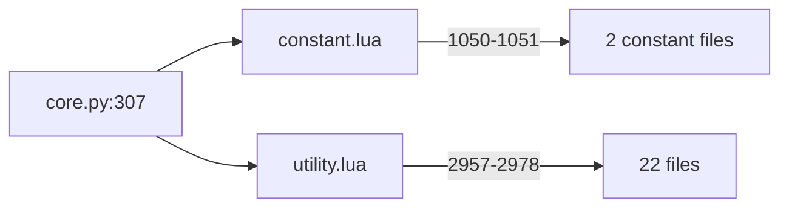

# The script library layer

| Status | Author | Date | Tracking | Related |
|---|---|---|---|---|
| Reference note — enumeration complete and cross-checked; representation recommended | Andrew Jones | 2026-09-14 | — | `processor-loop.md`, `tools/oracle/README.md` |

ocgcore is a C++ core plus Lua, and the Lua is not only per-card files: a
shared library is loaded into **every** duel. It registers global effects
that apply without any card being played, and it **replaces core API
functions** with its own versions — so a card script does not mean what
`processor.cpp` alone suggests. Neither of this project's two instruments
sees the layer (the coverage audit reads the C++; the card-script tool
reads per-card functions), and an exhaustive lockstep search found four of
seven places decided in Lua, two of them here.

This note enumerates the layer for the Goat pool under this project's
configuration, and recommends how the port represents it. Per the
project's evidence convention it names functions and cites line numbers
but quotes no script source.

## 1. Method — how the completeness claim is made checkable

The dangerous claim in an enumeration is not any item but *"these are all
of them."* Each set below is constructed so that claim reduces to
something a grep can falsify:

| set | construction | residual risk |
|---|---|---|
| library files | the static load graph from `core.py:307` (§2) | a load with a computed name — there is none |
| **replacements** | (names the C++ exports via `LUA_FUNCTION`/`LUA_STATIC_FUNCTION`/`_ALIAS`/`_EXISTING`, 631 across `libcard/duel/effect/group/debug.cpp`) **∩** (names the library *defines* on `Card/Duel/Effect/Group/Debug`: `function T.X(`, `T.X = `, `rawset(T,"X"`, `T["X"] =`) | a definition through a local alias of the table (none: grep for `local X = Card` etc. is empty) |
| **globals at load** | every `Effect.GlobalEffect()` site, classified by enclosing scope (top level / bare `do` block vs inside a function) | a global registered from a function that is itself called at load — the two such functions in `chain.lua` are called only from `Debug.ReloadFieldBegin`, verified |
| **what the pool reaches** | the 50 card scripts' calls into library-defined names, closed transitively through the library's own definitions; method-call syntax `c:X()` resolved against `Card/Effect/Group` | a call assembled from a string — none in the pool |

The first construction is the important one: **a replacement is the
intersection of two enumerated sets**, which is falsifiable, rather than
a reading, which is not.

## 2. The load graph is static

Corrected from earlier in-session figures: the layer is **25 files,
14,001 lines**, not three files.

- `utility.lua:778` is the on-demand **card** loader (`Duel.LoadCardScript`), not a library load.
- `utility.lua:2977` loads `proc_unofficial.lua`, which **does not exist** at the pinned commit; a missing script makes the reader return 0, so it is a no-op. Nothing references anything it would define.
- No card script loads a library file.

## 3. Replacements of core exports

**25 definition sites replace 19 distinct C++ exports.** Where a name is
replaced more than once, load order composes them (later file wraps
earlier): `utility.lua` first, then its loads in the order of lines
2957–2978.

### 3a. The six the Goat pool reaches

| name | site | what the C++ does | what the replacement changes |
|---|---|---|---|
| `Card.IsRelateToEffect` | `proc_workaround.lua:21` | `card::is_has_relation(effect*)` — a linear scan of `relate_effect` comparing the **effect pointer alone**, ignoring the chain id half of each pair | while a chain is resolving and the effect is an activated one, answers `is_has_relation(const chain&)` instead — the **(effect, chain id) pair**, found via `Duel.GetReasonEffect()` or by scanning the current chain for the link whose triggering effect it is; falls back to the C++ otherwise |
| `Card.IsAbleToHand` | `proc_workaround.lua:59` | `card::is_capable_send_to_hand` | returns **false if the card is already in the hand**, else the C++ |
| `Card.IsAbleToRemove` | `proc_workaround.lua:63` | `card::is_removeable` | returns **false if already banished**, else the C++ |
| `Card.RegisterEffect` | `utility.lua:953` → `proc_workaround.lua:100` (`proc_rush.lua:34` is inside an `if` on `DUEL_INVERTED_QUICK_PRIORITY` and is **not** installed here) | `card::add_effect` (guarded by `temp_card` and `is_affect_by_effect`) | inner (`utility`): extra varargs register companion marker effects — the pool never passes them; outer (`workaround`): for `EFFECT_CANNOT_SUMMON` / `_SPECIAL_SUMMON` with a target function, wraps the target to run a summon-procedure "assume" hook first. **One pool effect is rewritten**: Scapegoat's `EFFECT_CANNOT_SPECIAL_SUMMON` (`c73915051.lua:23-28`) carries a target and goes through `Duel.RegisterEffect`, so its target is replaced on every activation. The rewritten target only behaves differently when a summon-procedure effect's label object is a Lua table, which only the Link machinery produces — measured in the 2026-09-08 note as 557 rewrites over 400 games with the differing branch firing 0 times. Pass-through for Goat, but not vacuously so |
| `Duel.RegisterEffect` | `chain.lua:574` → `proc_workaround.lua:144` → `:381` | `field::add_effect(effect*, player)` | `chain`: records the registering card's properties for non-global effects (read only by `Chain.*` accessors the pool does not use); `workaround:144`: the same cannot-summon assume hook — this is the wrapper that rewrites Scapegoat's target; `:381`: registers a flag effect keyed `CARD_CARD_ADVANCE` when an `EFFECT_EXTRA_SUMMON_COUNT` of value 1 is registered — **no pool card grants an extra Normal Summon**, so pass-through for Goat |
| `Duel.GetReleaseGroup` | `proc_workaround.lua:72` (reached via `Duel.SelectReleaseGroupCost`) | `field::get_release_list` | adds Extra Deck cards carrying `EFFECT_EXTRA_RELEASE_NONSUM` — the Goat pool has none, so the group is unchanged |

The only replacement that changes the *question asked* for a Goat card is
**`IsRelateToEffect`**. It is called by 20 of the 50 cards (every "if it is
still related to this effect" check in an operation), and the difference is
precisely the exhaustive lockstep's `no-semantics` finding at `card.cpp:2144` from the other
side: the C++ overload ignores the chain id, and the library routes script
callers to the overload that does not.

Whether it changes an *answer* is a separate claim, and the 2026-09-08 note
measured it: a probe computing both answers on every call over 2,130 games
found zero disagreements, and the chain-link search loop (`:33-37`) never
ran once. The two can only differ if a relation survives under an older
chain id while the current link's is gone. So for this pool it is a
semantic change with no observed effect — which is exactly the kind of
thing to implement faithfully rather than argue away, since the port
cannot know which future position makes it bite.

### 3b. The thirteen the pool does not reach

Listed so the claim is auditable, with the site: `Card.GetTributeRequirement`
(`proc_workaround:6`, honours per-card `min_tribute_req`/`max_tribute_req`
set by summon procedures), `Card.IsAbleToDeck/Extra/Grave` (`:60-62`,
same shape as the two above), `Card.IsCanBeXyzMaterial` (`:486`),
`Card.IsExactType` (`utility:125` — the C++ tests `(type & t) == t`; the
library keeps that as `Card.IsCompositeType` and makes `IsExactType`
strict equality), `Debug.ReloadFieldBegin` (three wrappers, debug only),
`Duel.GetFusionMaterial` (`proc_fusion_spell:45`), `Duel.IsMainPhase` /
`Duel.IsBattlePhase` (`proc_workaround:284/289` — add an optional
`player` argument that also requires it to be that player's turn; same
answer when omitted), `Duel.MoveToField` (`:472`, sets the reason player
first), `Duel.Overlay` (`:440`), `Duel.SwapSequence` (`:671`, adds a
return value).

## 4. Global effects registered at load

Of 24 `Effect.GlobalEffect()` sites in the library, **10 execute at load
under this configuration, registering 11 effects** (one is cloned). The
rest are inside functions that nothing calls at load (`Auxiliary.BeginPuzzle`,
`EnableCheckReincarnation`, `AddValuesReset`, the two `chain.lua`
registrars that only `Debug.ReloadFieldBegin` calls) or gated off
(`proc_rush.lua:23` is under `if Duel.IsDuelType(DUEL_INVERTED_QUICK_PRIORITY)`,
which this configuration does not set).

A correction against the first draft of this note: the two
`proc_maximum.lua` effects live inside a local function,
`register_spsummon_pos` (`:405`), which the scope classifier filed as
"inside a function" — and which is **called at top level at `:429`**.
That is the residual risk §1 named, and it was checked for `chain.lua`
but not here. The 2026-09-08 note, which *measured* registrations with a
probe rather than classifying sites, had them from the start.

| site | event | what it does | reaches a Goat duel? |
|---|---|---|---|
| `proc_workaround.lua:220` | `EVENT_CHANGE_POS` | a monster in the Monster Zone turned **face-down** from face-up with any summon-turn status loses `STATUS_SUMMON_TURN`, `FLIP_SUMMON_TURN`, `SPSUMMON_TURN` and gains `STATUS_FORM_CHANGED` | **yes** — Book of Moon, Tsukuyomi on a summoned monster; YUG-103's finding |
| `proc_workaround.lua:241` | `EVENT_MSET` | every Normal Set clears `STATUS_SUMMON_TURN` and sets `STATUS_FORM_CHANGED` | **yes — every Set** |
| `proc_workaround.lua:182` | `EVENT_DISCARD` with `REASON_ADJUST`, once | on the first hand-size-adjustment discard, arms an `EVENT_CHAIN_SOLVING` effect that in turn registers `EFFECT_CANNOT_ACTIVATE` for both players until `PHASE_END` resets it — only one chain may be built during hand-size adjustment | only if a pool card can trigger on being discarded for hand size; behaviourally dormant otherwise |
| `proc_workaround.lua:316` | `EVENT_CHAIN_SOLVING` | if the link's triggering location was the hand and the card is **still in the hand** and no operation info would move it, shuffles that hand (once per chain per player) | dormant: the pool has no effect that activates from and stays in the hand; a hand-activated Spell/Trap has left the hand by resolution (`AddChain` case 1 places it; the triggering location is captured earlier, at the gather) |
| `proc_workaround.lua:364` | `EVENT_CHAIN_END` | resets the per-chain shuffle bookkeeping | dormant |
| `proc_workaround.lua:406` (+ clone) | `EVENT_SUMMON_SUCCESS`, `EVENT_SPSUMMON_SUCCESS` | registers a flag effect (id `160214042`, label = current phase) on **every** summoned monster | runs on every summon; **no Goat reader** (`Card.GetSummonPhase` and friends are Rush-only) |
| `proc_fusion_spell.lua:16` | field effect `EFFECT_EXTRA_FUSION_MATERIAL` | targets whatever `Fusion.ExtraGroup` names | dormant: `Fusion.ExtraGroup` is nil unless the fusion-spell procedure sets it; no pool card uses it |
| `proc_skill.lua:43` | `EVENT_STARTUP` | `aux.drawlessop` — sums per-player "draw less" counts from `Auxiliary.Drawless` and calls `Debug.SetPlayerInfo` for any non-zero | runs once per duel; the table is empty, so it does nothing observable |
| `proc_maximum.lua:406`, `:414` (via `register_spsummon_pos()` at `:429`) | field effects `EFFECT_FORCE_SPSUMMON_POSITION`, `EFFECT_FORCE_MZONE` | target `Card.IsMaximumMode`, which no card outside Rush can satisfy | dormant; the 2026-09-08 note confirmed it from outside — Scapegoat's tokens arrive in face-up Defence in 180 of 180 games, which the position-forcing effect would override |

So **two globals change Goat rulings** (both summon-turn status fixes,
both on `STATUS_FORM_CHANGED` as well), one is conditionally live (hand
size adjustment), and seven run but are inert.

One trap in reading the first two, recorded by the earlier note and worth
repeating because the port inherits it: Lua's `Card.IsStatus(mask)` is
true when **any** requested bit is set, while the C++ `card::is_status`
requires **all** of them (`card.h:249`; the any-bit form is `get_status`,
`:245`). The library's filter at `:217` means "any summon-turn status".

## 5. What the pool actually reaches

**39 library-defined functions of 518**, ~200 lines. Beyond the six
replacements:

*Additions to core tables:* `Card.IsMonster/IsSpell/IsTrap/IsSpellTrap`
(thin `IsType` wrappers), `Card.IsFusionMonster` (composite
`MONSTER|FUSION`), `Effect.IsSpellEffect/IsTrapEffect` (`IsActiveType`),
`Group.Iter` (an iterator over `GetFirst/GetNext`), `Duel.CountHeads`
(counts `COIN_HEADS` among varargs — the value is `1`), `Duel.SelectEffect`
(filters `{bool, description}` pairs and returns the 1-based index of the
chosen live option via `Duel.SelectOption`), `Duel.CheckReleaseGroupCost`
/ `Duel.SelectReleaseGroupCost` (`proc_workaround:620/634` — a recursive
tribute-cost search honouring `EFFECT_EXTRA_RELEASE` and
`EFFECT_EXTRA_RELEASE_NONSUM`, with a `Group.SelectUnselect` loop),
`Effect.GetChainData` → `Chain.Data` (a per-chain-link scratch table keyed
by `CHAININFO_CHAIN_ID`).

*Auxiliary helpers:* `AddEquipProcedure` and its `EquipTarget/Filter/Limit/Operation`
(the standard Equip Spell skeleton — Snatch Steal, Premature Burial),
`AddEREquipLimit`, `CheckStealEquip` (reads
`DUEL_TRAP_MONSTERS_NOT_USE_ZONE`, which this configuration sets),
`DoubleSnareValidity`, `SpElimFilter`, `SelectUnselectGroup` /
`SelectUnselectLoop` (a generic constrained-subset selector), `Stringid`,
`TRUE`, `TargetBoolFunction`, `FilterBoolFunction`, `bdocon`, `tgoval`,
`ChkfMMZ`, `Next`, and the release-cost internals (`MakeSpecialCheck`,
`RelCheckGoal`, `RelCheckRecursive`, `ReleaseCheckSingleUse`,
`ReleaseCostFilter`).

*Two quirks in that set worth knowing before translating:*

- **`Chain.Data` is never cleared in a normal duel.** Its reset effect
  (`chain.lua:42`) is registered only inside `Debug.ReloadFieldBegin`, so
  the table keyed by chain id grows for the duel's length. Harmless
  because chain ids are unique; the port's equivalent is a per-chain
  scratch slot on the chain record, cleared with it. Only Metamorphosis
  uses it (the tributed monster's Level, written in `target`, read in
  `operation`).
- `Duel.CheckReleaseGroupCost` has a parameter-shifting form when `maxc`
  is not a number; Metamorphosis and Enemy Controller call the plain form.

## 6. The core never calls a replaced name

Checked in the C++: the only Lua names the core fetches by string are
`Debug.CardToStringWrapper` / `Debug.CardToString` (`interpreter.cpp:258`,
`libdebug.cpp:224`), `edopro_exports` (`libduel.cpp:4099`, script-loading
bookkeeping), and per-card functions by name through
`call_card_function` (`interpreter.cpp:410`). None of the 19 replaced
names is among them.

So every replacement affects **script callers only**. The C++ keeps
calling its own `is_has_relation(effect*)` internally while scripts get the
chain-aware answer. That is the fact the representation has to preserve.

## 7. Representation — recommendation

**Implemented** as `src/script_api.rs` (the API module) and `src/cards/`
(the translations, held to it by a test). Pot of Greed is the first card
through it, Dark Hole the second — the first to reach across the field,
through `field::filter_matching_card` — Torrential Tribute the third,
the first Trap: Set, then activated from the row in the window a summon
opens — and Heavy Storm the fourth, the first with a real filter
(`Card.IsSpellTrap`, the *effective* type) and an exception (itself).
Mirror Force is the fifth, the first with a **condition** and the first
to fire on an attack — and the card that turned up the `ChangePos` stale
buffer bug. Threatening Roar is the sixth and the first to **build an
effect while it resolves**, handing a field-wide prohibition to the duel
rather than acting on the board. Airknight Parshath is the seventh and the first **monster** — a forced
trigger, a continuous property, and the first card whose printed line
matters beyond its type. D.D. Warrior Lady is the eighth, the first **optional** trigger and the
first card to read the battle it is in. Trap Hole is the ninth, the
first to **target** and the first written once and cloned into a second
effect. Sakuretsu Armor is the tenth, Mirror Force's opposite number,
and the second to target without a choice. Graceful Charity is the
eleventh and the first to **suspend**: it draws, looks at how many it
got, and only then shuffles and discards. Mystical Space Typhoon is the
twelfth and the first to ask a **player** to choose. Man-Eater Bug is
the thirteenth and the first **flip** effect, and Dekoichi the
fourteenth, whose draw count is computed rather than written down. Book
of Moon is the fifteenth and the first to change a **position**, and
Morphing Jar the sixteenth, the first to act on both players at once.
Widespread Ruin is the seventeenth and the first whose answer is a
**group rather than a card**: it takes the maximum attack, keeps every
monster tied at it, and asks only when there is genuinely something to
ask about. Dust Tornado is the eighteenth and the first whose second half
is conditional on the **result** of its first — it suspends three times in
one operation, and is the first card with a branch the harness policy
cannot currently reach. Magician of Faith is the nineteenth and the first
to put something **back into a hand** — which turned up a stale-position
bug in the move path that had been shuffling hands twice. Reinforcement of
the Army is the twentieth and the first to **search a deck** — which needed
the non-targeting selection, and turned up a vanilla whose race the harness
had never stated.
Sangan is the twenty-first: a mandatory trigger, a count limit counted
against a name, and the first effect to read its own **label** — which
needed the value-function seam widened to pass an effect itself.
Mystic Tomato is the twenty-second: the first **special summon**, and the
first filter that needs context — which a closure supplies where the
reference passes extra arguments along the scan.
Nobleman of Crossout is the twenty-third, and the first to destroy a card
*to* somewhere other than a graveyard.
Delinquent Duo is the twenty-fourth and the pool's first with a **cost**,
and the first to roll the duel's generator from a card.
Trap Dustshoot is the twenty-fifth, and reveals a hand before it filters
it — one of three orderings in it that a tidier rewrite would get wrong.
Magical Merchant is the twenty-sixth and the first to **excavate** — and
it finds its card by arithmetic on deck sequences rather than by digging.
Tribe-Infecting Virus is the twenty-seventh and the pool's first
**ignition** effect — a range rather than an event, and the first answer
that comes back as a mask.
Sinister Serpent is the twenty-eighth and the first to act **from a
graveyard** — and the card that made conditions take the field mutably,
because its brake's condition was otherwise unaskable.
Ring of Destruction is the twenty-ninth, whose legal targets shrink as its
opponent's life does, and which reads a damage result back to decide
whether to deal the second one.
Creature Swap is the thirtieth and the first **exchange** — each player
gives one monster and neither chooses what they get, which needed a
`SwapControl` processor and a `swap_card` that trades two seats without
either card passing through nowhere.
Premature Burial is the thirty-first and the first **equip** — a card
that remembers, on the effect itself and on the card, what it attached to
and must destroy when it goes.
Call of the Haunted is the thirty-second, and the first to **split a
summon in two** so that it can record what it revived before anything may
react — and the first to carry an answer across an event on a second
effect's label.
Snatch Steal is the thirty-third and the first built by a **library
procedure**: `aux.AddEquipProcedure` is ported as `cards/proc_equip.rs`,
and the arguments a Lua closure would hold live on the effect as
`AuxArgs`. Its control change is an *equip* effect rather than an action,
which is why it lapses on its own.
Breaker the Magical Warrior is the thirty-fourth and the first to use
**counters** — permission and limit are effects whose code carries the
counter type, and a permitted counter lives in the half that being
disabled takes away.
Jinzo is the thirty-fifth and the pool's first **continuous negation** —
five effects, because stopping Traps takes a different prohibition at
each of five moments, and the fourth negates rather than prohibits.
Asura Priest is the thirty-sixth and the pool's first **spirit**, built
by `Spirit.AddProcedure` (ported as `cards/proc_spirit.rs`) — and the
first card to need a **flag effect**, which turned up four reset kinds
the port had been silently ignoring.
Tsukuyomi is the thirty-seventh, Asura Priest's twin — and the card whose
differential run found six missing lines in `card::reset`, without which
an "attacks all monsters" effect never worked for a monster that had just
arrived.
Dark Mimic LV1 is the thirty-eighth and the pool's first **LV monster** —
and the first card to count Monster Zone seats *without itself*, because
it is the cost being paid.
Chaos Sorcerer is the thirty-ninth and the first monster to **summon
itself** by a printed procedure — which needed the library's incremental
selection, `aux.SelectUnselectGroup`, and with it the pool's first
**unbounded loop of suspensions**: one question, a re-scan, and possibly
another question. The processor turned out to support that already (a
re-suspending continuation re-parks in the same slot), so the loop's
accumulating selection rides in the boxed closure, where a Lua
coroutine's locals would ride on its stack. It is also the first card the
play policy could not reach at all — a monster that cannot be Normal
Summoned needs a special-summon branch, which both sides of the harness
now have.
Black Luster Soldier – Envoy of the Beginning is the fortieth, and the
**second** user of the incremental selection — ported straight after
Chaos Sorcerer because a library with one caller is an unproven
abstraction. It needed no change to the loop, and its value was in the
differences: a `rescon` that reads the same and is not
(`aux.ChkfMMZ(1)` and a LIGHT-with-exactly-one-DARK test, where the
exception argument keeps a both-attributes monster from counting
itself), an `ft > -2` seat gate that is deliberately looser than the
real test inside `rescon`, and a banish effect that differs from Chaos
Sorcerer's in three places — no face-up test in its `chkc` arm, a literal
player 0 in its `SetOperationInfo`, and a single relate check at
resolution.
Enemy Controller is the forty-first and the first card with **two
effects behind one activation** — chosen between with `Duel.SelectEffect`
and remembered in the effect's label, which `chkc` and the operation both
read back. It is also the first release-as-cost, through the library's
*second* incremental selection
(`Duel.CheckReleaseGroupCost`/`SelectReleaseGroupCost`, built on the same
`Group.SelectUnselect`), and the card that found a control change which
never came home: `field::set_control` was inserting its reset-bearing
effect by hand instead of registering it, so it never reached the index
the End Phase walks.
Scapegoat is the forty-second and the pool's first **tokens** — cards
with printed lines and no script, read out of the database like any
other. It is also the first card to forbid something and then do it
anyway: its cost registers a Special Summon prohibition on its own
controller and points it at the activation that registered it, so the
four Sheep Tokens pass through the one hole in it. And it is the card
that showed `Duel.SpecialSummonStep`'s yield is load-bearing — queueing
all four steps and registering the tokens' effects afterwards summons
nothing.
Gatling Dragon is the forty-third and the pool's first **Fusion
Monster** — which needed the harness taught to deal an Extra Deck, and
turned out to need almost none of `Fusion.AddProcMix`: nothing in this
pool can perform a Fusion Summon, so the material procedure the seven
Fusion Monsters register is never once asked its question. It is also the
first card in the project to **draw from the duel's generator**, which is
the first evidence that the two engines' seeds agree. Metamorphosis is the
forty-fourth and the only way a Fusion Monster reaches the field here —
its label is a one-shot guard rather than a branch, and the level of the
monster it tributed travels to the resolution on the chain link, because
by then that monster is in the graveyard.
Fiend Skull Dragon is the forty-fifth and the first card to **negate a
resolving chain link by what the effect is acting as** rather than by
where it came from — `Effect.IsActiveType`, where Jinzo asked about the
link's triggering location. It also carries a clause the printed line does
not mention at all: a targeting Trap aimed at it is negated, which is its
Summoned Skull lineage showing through and which only reading the script
finds.
Dark Balter the Terrible is the forty-sixth and the pool's **first quick
effect** — `EFFECT_TYPE_QUICK_O` on `EVENT_CHAINING`, offered while a
chain is still being built. It is also the first card to read
`Effect.GetActiveType` as an **equality** rather than through the
`IsActiveType` mask, which is what confines it to Normal Spells: a
Quick-Play's type word carries a second bit, so `==TYPE_SPELL` is false
for six of this pool's fifteen Spells.
Ryu Senshi is the forty-seventh and uses **both** readings of the active
type in one card: `==TYPE_TRAP` in its quick effect's condition, which is
an equality and so answers Normal Traps alone, and `Effect.IsSpellEffect`
in its chain-solving half, which the library defines as a mask and so
answers any Spell at all. It is also the first card whose own effect
forecloses another of its effects — `e2` negates and destroys the pool's
only field-targeting Equip Spell before it can ever attach, which is what
`e3` and `e4` were waiting for.
Reaper on the Nightmare is the forty-eighth, the largest card in the pool
at seven registered effects, and the one that found `effect::is_available`
was never running a continuous effect's **condition** — a gap no earlier
card could expose, because every condition in the pool until now sat on an
`EFFECT_TYPE_ACTIONS` effect, which `is_available` rejects on its first
line. Its three "becomes a target" effects are also the pool's first use
of a flag effect's **label** to tell one chain link from another — and it
found a second defect beside the first: `is_activateable` had no branch
for continuous effects at all, so a card flipped face-down went on
projecting its field effects.
Thousand-Eyes Restrict is the forty-ninth and the first monster that
**equips another monster to itself**: the taken monster keeps its own
position on the way into the Spell & Trap row, stays there only while this
card carries the marker its equip limit was made against, and is
destroyed in this card's place when this card would be destroyed by
battle — six times a duel on the harness. It is also the second and third
user of the read-only condition slot Reaper on the Nightmare added.
King Dragun is the fiftieth and the last, and the one the harness cannot
reach: level 7, in a pool whose tribute levels are 1, 4, 5, 6 and 8. It
is ported to the same standard regardless, and three shapes that carry it
in the Extra Deck summon it zero times while staying identical to
ocgcore. Its `aux.tgoval` — Dragons cannot be targeted by the
*opponent's* effects — is asked of the protection as an effect object,
which is the second export after `get_label_object` to take one.
All fifty are identical to ocgcore on the differential harness; see `processor-loop.md`, "The seam a translated card is written
against", "Dark Hole, and the matching filter", "Torrential Tribute: the
first Trap", "Heavy Storm: the filter takes the field mutably", "A stale
selection buffer in `ChangePos`", "Mirror Force: a condition, and a
one-sided scan", "Threatening Roar: an effect made at resolution" and
"Airknight Parshath: the first monster, and a tribute answer in the
wrong shape" and "D.D. Warrior Lady: an optional trigger, and an identity
test", "The target's third question: `chkc`" and "Trap Hole: targeting
without a choice" "Sakuretsu Armor: one target, three tests",
"Operations can suspend now", "Graceful Charity: the first card that
waits", "Targets suspend too", "Mystical Space Typhoon: asking a
player", "The play policy Sets monsters now" "Man-Eater Bug: the
first flip" "Dekoichi: a count nothing can observe" and "Book of
Moon: asked one question, answering another" and "Morphing Jar: the
other scan" and "Widespread Ruin: the maximum is a group" and "Dust Tornado:
three results read back, and a branch the policy cannot reach" and
"Magician of Faith, and a stale position that shuffled a hand twice" and
"Reinforcement of the Army: the first search, and what `nil` means" and
"Sangan: a mandatory trigger, a count limit, and an effect that reads its
own label" and "Mystic Tomato: the first special summon, and a filter
with arguments" and "Nobleman of Crossout: destroyed *to* somewhere, and
a redundant shuffle" and "Delinquent Duo: the first cost, and a roll that
must not be wasted" and "Trap Dustshoot: reveal first, filter second" and
"Magical Merchant: digging by arithmetic" and
"Tribe-Infecting Virus: the first ignition effect" and
"Sinister Serpent, and widening the condition seam" and
"Ring of Destruction: a bound that moves, and a result read twice" and
"Creature Swap: an exchange, and two seats asked for separately" and
"Premature Burial: the first equip, and a card that remembers" and
"Call of the Haunted: a split summon, and a label carried across an event" and
"Snatch Steal: the first library procedure, and control that lapses" and
"Breaker the Magical Warrior: the first counters" and
"Jinzo: four prohibitions and a negation" and
"Asura Priest: the first spirit, and the first flag effect" and
"Tsukuyomi, and six missing lines in `card::reset`" and
"Dark Mimic LV1: a seat count that leaves out the card paying for it".

**Not a layer. A split.** The question "how do we represent
monkey-patching in Rust" dissolves once §6 is in view: in the reference
there are two callers with two semantics, and the port already has both
callers as Rust. What the port needs is to keep them **distinct** — the
core's internal method and the card-facing function must be two functions
where the reference has one C++ function plus a Lua shadow.

Concretely:

1. **A card-facing API module** (say `script_api`) that card translations
   call, mirroring the Lua surface a script sees: `is_relate_to_effect`,
   `is_able_to_hand`, `is_able_to_remove`, `register_effect`,
   `get_release_group`, plus the reached additions and helpers of §5.
   Each function is *the replaced semantics*, implemented directly — e.g.
   `script_api::is_relate_to_effect` checks `core.current_chain` and
   `is_activated` and routes to the `(EffectId, chain_id)` pair lookup,
   which the port's `Card.relate_effect: HashSet<(EffectId, u16)>` already
   stores. No wrapping, no dynamic dispatch, no "old function" capture.
2. **The core's own methods stay as they are** (`is_capable_send_to_hand`,
   `is_removeable`, `add_effect`, and an `is_has_relation(effect)` that
   ignores the chain id) and are what the processor units call.
   Translated cards **never call these directly**; they go through the
   API module. That rule is the whole of the discipline, and it is
   enforceable by a grep in CI the way the no-engine-dependency rule is.
3. **The two live globals become core behaviour**, because that is what
   they are: the port's `ChangePos` and `MonsterSet` paths clear the
   summon-turn statuses and set `STATUS_FORM_CHANGED` exactly where the
   library's continuous effects would fire. Implementing them as
   registered global effects instead would be faithful to the *mechanism*
   at the cost of a Lua-shaped runtime the port has no other use for. The
   departure is recorded in `processor-loop.md` with the event and the
   condition, and pinned by tests that turn a summoned monster face-down
   and Set a monster.

   **With one caveat that the fold bakes in.** The substitution of
   `STATUS_FORM_CHANGED` for the summon-turn statuses is behaviour-preserving
   only because `DUEL_CAN_REPOS_IF_NON_SUMPLAYER` is **off** in this
   configuration: the summon-turn clause in `is_can_be_flip_summoned` and
   `is_capable_change_position` (`card.cpp:3271`, `:3772`) carves out a
   monster whose controller is not its summoner under that flag, and
   `FORM_CHANGED` has no such carve-out. The 2026-09-08 note identified
   this; the positions that would expose it are exactly Snatch Steal /
   Creature Swap / Enemy Controller followed by Book of Moon. The port
   implements the library's reading, as it must — the reference under this
   configuration *is* ocgcore plus this library — and the note records that
   turning the flag on would need the fold revisited.
4. **The hand-size-adjustment global** (`proc_workaround:182`) is
   implemented the same way if any pool card can trigger on
   `EVENT_DISCARD`; that is a per-card question answered as cards are
   translated, and the note flags it rather than guessing.
5. **The five inert globals are skipped, each with a pin** — a test that
   asserts the port has *no reader* of what they produce (no
   `160214042` flag lookups, no `Fusion.ExtraGroup`, no `Drawless`
   table). If a later pool adds a reader, the pin fails and the global is
   ported then.

Why this rather than a wrapping layer: every replacement in §3a is either
a **pure predicate** on state the port already holds, or a pass-through
for this pool. There is nothing dynamic to preserve, and the *composition*
of the three `RegisterEffect` wrappers is pass-through for every effect
the Goat pool registers — so representing it as composition would be
building machinery to reproduce identity.

The cost of this choice is that a future pool that *does* register a
cannot-summon effect with a target function, or an extra-Normal-Summon
grant, or an Extra Deck `EXTRA_RELEASE_NONSUM` card, needs the relevant
wrapper's behaviour added to the API function at that point. The pins in
(5) are the mechanism for noticing; the note is the mechanism for knowing
what to add.

## 8. A defect in the port this cross-check found

The port has a single `Card::is_status(mask)`, defined as `status & mask
!= 0` — **any-bit** semantics — under the reference's **all-bit** name.
Of its 17 multi-bit call sites, 16 mirror reference sites that use the
any-bit `get_status` or three OR'd single-bit checks, and are correct.
One does not: `disable.rs:246`, `adjust_disable_check_list`'s loop guard,
mirrors `field.cpp:2101`'s `is_status(STATUS_TO_ENABLE | STATUS_TO_DISABLE)`,
which requires **both** bits. The port skips a card's disable re-check
when *either* is set; the reference only when both are.

Fixed in its own PR: the port gains `get_status` (any) alongside an
`is_status` (all) that matches the reference's name, so the next
translation cannot pick the wrong one by reading the name. Every existing
multi-bit call is re-pointed at the function the reference uses at that
site.

## 9. What is not established

- **Whether any pool card triggers on `EVENT_DISCARD`** (decides whether
  the hand-size-adjustment global is live). Per-card; answered during
  translation.
- **Behaviour under formats other than this configuration.** `proc_rush`
  installs a further `Card.RegisterEffect` wrapper and a global under
  `DUEL_INVERTED_QUICK_PRIORITY`; `Duel.ActivateFieldSpell` branches on
  `DUEL_1_FIELD` (`ONE_FACEUP_FIELD`, part of MR1/MR2, not MR5).
  Out of scope, listed so nobody assumes the enumeration transfers.
- **The 284 additions the pool does not reach** are enumerated (they are
  in the intersection data) but not described; describing them is work
  for whichever pool first needs one.

## 10. Cross-check against the 2026-09-08 note

An earlier note enumerated this layer six days before, for a different
engine, by a different method: a probe appended
to `constant.lua` that *logged* every registration, and the same
C++-exports-intersected-with-Lua-assignments construction for
replacements. This note was written without having read it, which was a
miss — and makes the comparison the independent second reading the
project's rule asks for.

**Agree:** the 19 replaced exports at the same 25 sites; the 284
additions; `chain.lua`'s two registrars being reachable only from
`Debug.ReloadFieldBegin`; `proc_rush`'s wrapper and global being gated off;
the composition order of the `RegisterEffect` wrappers; `IsRelateToEffect`
as the busiest replacement and `IsExactType` as the one unreached
replacement whose *answer* differs; the two `IsAbleTo*` the pool reaches;
`GetReleaseGroup` reached through Metamorphosis and Enemy Controller.

**Disagreed, both resolved in the earlier note's favour:** the
`proc_maximum.lua` pair (§4), and Scapegoat's rewritten target (§3a).

**Imported from it:** the measured numbers (2,130 games with zero
`IsRelateToEffect` disagreements; 557 target rewrites with zero firings;
`ShuffleHand` never called from the library in 120 games); the
`DUEL_CAN_REPOS_IF_NON_SUMPLAYER` contingency (§7); the any-bit /
all-bit status trap, which turned out to be live in the port (§8); and its
four card-intake checks, which transfer unchanged to the port's card
translation: does the new card's script read a summon-turn status, call
`Card.IsExactType`, trigger on a discard, or grant an extra-release,
extra-fusion-material or custom Normal Summon procedure.

**Not in the earlier note, added here:** the pool's transitive reach into
the library (39 of 518 functions, by call path), the `Chain.Data`
never-cleared quirk, `proc_unofficial.lua`'s absence, the load graph, and
the representation decision — which is the port's question, not engine
one's.

## 11. The pool, card by card

Which replaced core functions each card reaches (`Card.RegisterEffect` is
omitted — every card reaches it and it is pass-through), and how many
library helpers it pulls in transitively.

| card | code | replacements reached | helpers |
|---|---|---|---|
| Airknight Parshath | `18036057` | — | 1 |
| Asura Priest | `2134346` | — | 0 |
| Black Luster Soldier - Envoy of the Beginning | `72989439` | `Card.IsAbleToRemove`, `Card.IsRelateToEffect` | 4 |
| Book of Moon | `14087893` | `Card.IsRelateToEffect` | 2 |
| Breaker the Magical Warrior | `71413901` | `Card.IsRelateToEffect` | 3 |
| Call of the Haunted | `97077563` | `Card.IsRelateToEffect` | 1 |
| Chaos Sorcerer | `9596126` | `Card.IsAbleToRemove`, `Card.IsRelateToEffect` | 4 |
| Creature Swap | `31036355` | — | 0 |
| D.D. Warrior Lady | `7572887` | `Card.IsAbleToRemove` | 1 |
| Dark Balter the Terrible | `80071763` | — | 1 |
| Dark Hole | `53129443` | — | 1 |
| Dark Mimic LV1 | `74713516` | — | 1 |
| Dekoichi the Battlechanted Locomotive | `87621407` | — | 1 |
| Delinquent Duo | `44763025` | — | 0 |
| Dust Tornado | `60082869` | `Card.IsRelateToEffect` | 3 |
| Enemy Controller | `98045062` | `Card.IsRelateToEffect`, `Duel.GetReleaseGroup` | 11 |
| Fiend Skull Dragon | `66235877` | — | 3 |
| Gatling Dragon | `87751584` | — | 1 |
| Graceful Charity | `79571449` | — | 0 |
| Heavy Storm | `19613556` | — | 2 |
| Jinzo | `77585513` | — | 5 |
| King Dragun | `13756293` | — | 2 |
| Magical Merchant | `32362575` | `Card.IsAbleToHand` | 5 |
| Magician of Faith | `31560081` | `Card.IsAbleToHand`, `Card.IsRelateToEffect` | 3 |
| Man-Eater Bug | `54652250` | `Card.IsRelateToEffect` | 2 |
| Metamorphosis | `46411259` | `Duel.GetReleaseGroup` | 16 |
| Mirror Force | `44095762` | — | 0 |
| Morphing Jar | `33508719` | — | 0 |
| Mystic Tomato | `83011278` | — | 1 |
| Mystical Space Typhoon | `5318639` | `Card.IsRelateToEffect` | 3 |
| Nobleman of Crossout | `71044499` | `Card.IsAbleToRemove`, `Card.IsRelateToEffect` | 0 |
| Pot of Greed | `55144522` | — | 1 |
| Premature Burial | `70828912` | `Card.IsRelateToEffect` | 0 |
| Reaper on the Nightmare | `85684223` | — | 1 |
| Reinforcement of the Army | `32807846` | `Card.IsAbleToHand` | 0 |
| Ring of Destruction | `83555666` | `Card.IsRelateToEffect` | 0 |
| Ryu Senshi | `49868263` | `Card.IsRelateToEffect` | 5 |
| Sakuretsu Armor | `56120475` | `Card.IsRelateToEffect` | 0 |
| Sangan | `26202165` | `Card.IsAbleToHand`, `Duel.RegisterEffect` | 3 |
| Scapegoat | `73915051` | `Duel.RegisterEffect` | 1 |
| Sinister Serpent | `8131171` | `Card.IsAbleToHand`, `Card.IsAbleToRemove`, `Card.IsRelateToEffect`, `Duel.RegisterEffect` | 4 |
| Snatch Steal | `45986603` | `Card.IsRelateToEffect` | 7 |
| Thousand-Eyes Restrict | `63519819` | `Card.IsRelateToEffect` | 4 |
| Threatening Roar | `36361633` | `Duel.RegisterEffect` | 0 |
| Torrential Tribute | `53582587` | — | 1 |
| Trap Dustshoot | `64697231` | — | 2 |
| Trap Hole | `4206964` | `Card.IsRelateToEffect` | 0 |
| Tribe-Infecting Virus | `33184167` | — | 2 |
| Tsukuyomi | `34853266` | `Card.IsRelateToEffect` | 1 |
| Widespread Ruin | `77754944` | — | 0 |
